# Web 开发第 8 天(里程碑 2:响应性 Web 布局)

> 原文：<https://medium.com/nerd-for-tech/web-dev-streaks-day-8-6c65036f318a?source=collection_archive---------25----------------------->

> 模块 7:更多 CSS、图标、CSS3 动画

# 1.可见性隐藏与显示无

> **{显示:无；}** 意味着有问题的标签根本不会出现在页面上(尽管您仍然可以通过 dom 与之交互)。在其他标签之间将没有为其分配的**空间。**

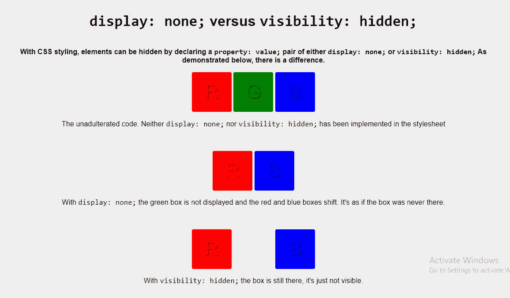

不显示与隐藏可见性

> **{可见度:隐藏；}** 表示不像**{ display:none；}** 标签是不可见的，但是页面上为它分配了空间。标签被呈现，只是在页面上看不到。

# 2.CSS 溢出可见，隐藏，滚动，文本溢出，省略号

> **CSS 溢出属性**控制对于太大而不适合一个区域的内容会发生什么。它指定是剪辑内容还是添加滚动条 ty 有以下值: **1。可见，2。隐藏，3。滚动，4。自动**
> 
> 还有像 **overflow-x** 和 **overflow-y** 这样的属性，可以设置为 **hidden** 或 **scroll** 等你觉得合适的属性。
> 
> **省略号**显示在内容区域内，减少显示的文本数量。如果没有足够的空间来显示**省略号**，它将被裁剪。

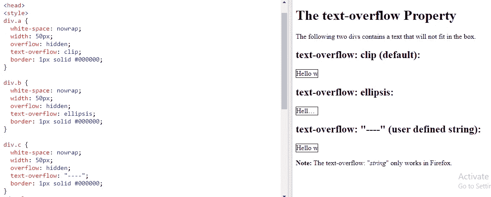

泛滥

## 工具提示

> **工具提示**通常用于在用户将鼠标指针移动到某个元素上时指定关于某件事情的额外信息:

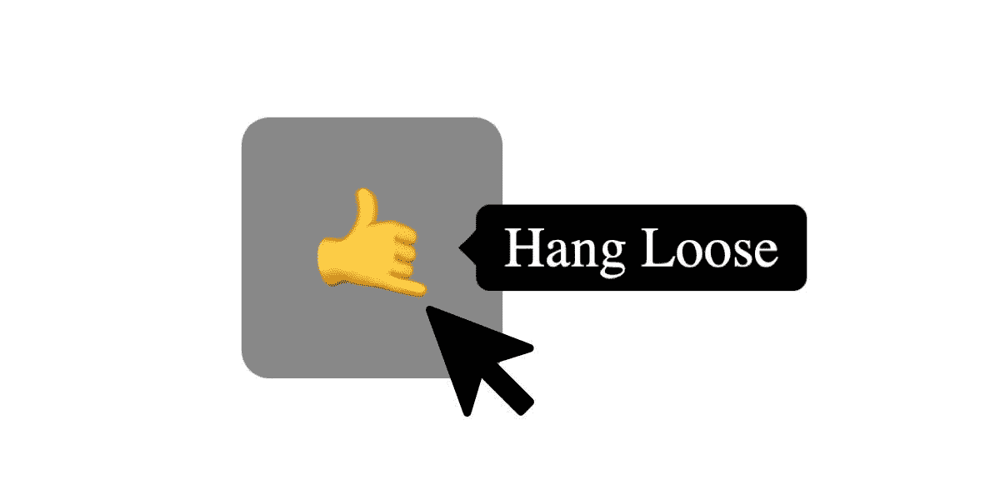

工具提示

# 3.优化图像，图像类型，svg，png，jpg，Sprite

> 如果你试图在网页中使用你的高分辨率图像，它将占用大量的带宽，这对每个人来说都不是一个好例子。而是尝试使用任何在线工具，如 photophea.com、tryitpng.com 或任何图像压缩器来缩小图像。如今，svg 因其可伸缩性和可变性而作为图标甚至图像非常受欢迎。
> 
> **图像子画面**是放入单个**图像**中的图像集合。包含许多图像的网页可能需要很长时间来加载，并且会生成多个服务器请求。使用**图像精灵**将减少服务器请求的数量并**节省带宽。**

# **4。使用字体 Awesome 添加图标&创建**社交链接

> 如果你想使用**图标**然后从这里去**字体-牛逼**的网站，

 [## 字体真棒

### 世界上最受欢迎和最容易使用的图标集刚刚得到了升级。更多图标。更多款式。更多选择。

fontawesome.com](https://fontawesome.com/) 

> 然后选择你想要的图标。然后**从那里复制套件**并将其包含在你的网页的**头部**中，再从那里复制**字体样式标签**并将其插入你想要的位置。

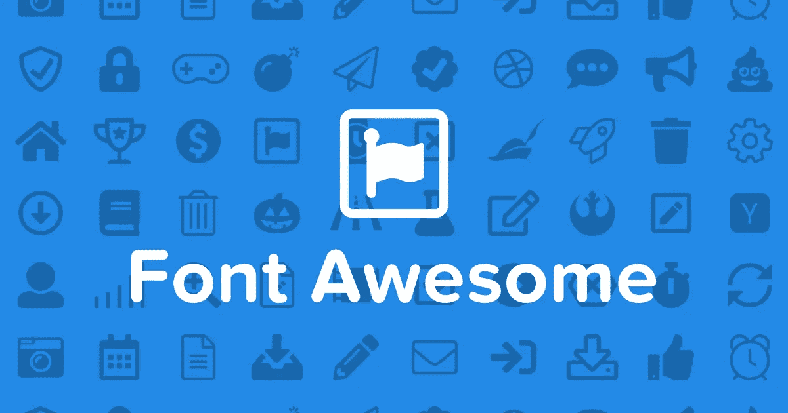

> 你也可以很容易地调整这些图标，比如改变尺寸。} 或者试着换个颜色**{ color:red；}** 使用 CSS。通过将这些图标包含在锚标记中，它们也可以用作链接。

# 5.使用旋转缩放平移变换元素

> **变换属性**将 **2D 或 3D 变换**应用于一个元素。该属性允许您**旋转、缩放、移动、倾斜、**等。，元素。

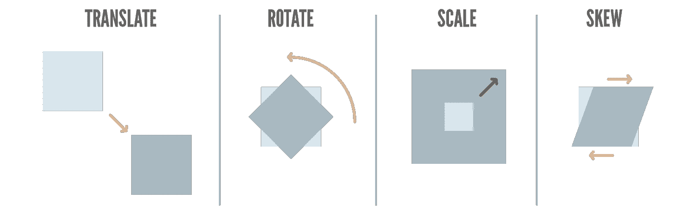

不同类型的转换

> 如果你必须一次使用两个或更多变换，你可以很容易地做到这一点，只需在它们之间保留一个空间。

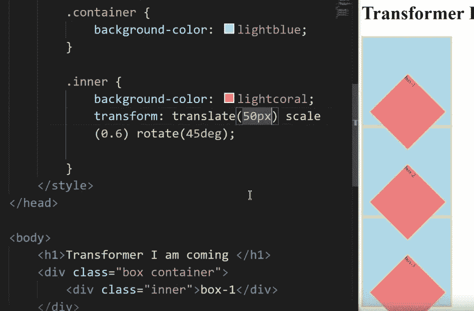

旋转、缩放和平移盒子

# 6.CSS 动画过渡介绍

> CSS 转换允许你在给定的时间内平滑地改变属性值。要创建过渡效果，您必须指定两件事:
> 
> 1.要添加效果的 CSS 属性
> 
> 2.效果的持续时间
> 
> 去这里看看这个使用纯 CSS 过渡的很酷的 5 指动画

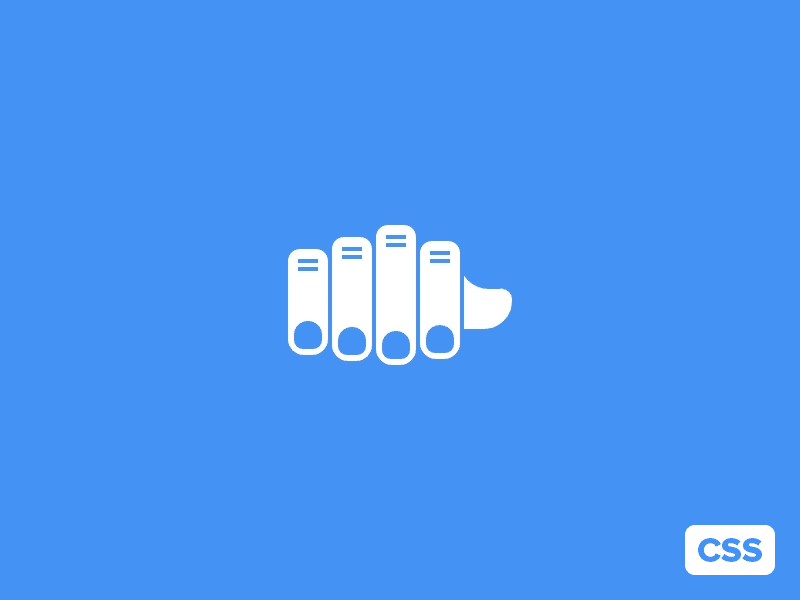

5 指动画

# 7.使用过渡和变换的板球比赛动画

> **下载**一个“bat.png 的侧视图”然后放在一个 div 里变换**“旋转(-60 度)”。**现在在字段**上添加一个**伪悬停类**。场:悬停。bat { transition:transform 0.3s ease-in }】。**你会注意到球棒基于它的中点旋转**，但是它应该基于顶部旋转。为此，只需将原点转换为右上方的**，问题就解决了。现在再次**创建另一个 div** ，在高度、宽度和边界半径的帮助下，将其塑造成一个球的形状。现在的任务是当球击中球时**平移**球。****

**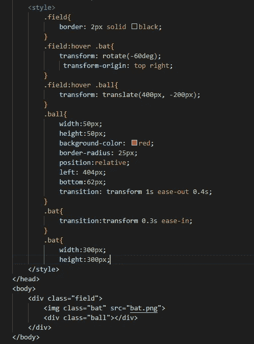**

**板球击球动画**

> **给场一个悬停类，效果应该在球类上。因为做了那件事。场:悬停。球{transform: translate(400px，-200px)}] 这样写规则。稍后在球类中添加一个转场**[{ transition:transform 1s ease-out 0.4s }]**，这样球就可以流畅的移动了。看，球转移有一个**延迟**，这样球棒就有足够的时间向前移动击球，然后球转移开始。**

# **8.(高级)CSS 动画和球的弹跳效果**

> **CSS 允许不使用 JavaScript 或 Flash 的 HTML 元素的动画！您可以根据需要多次更改 CSS 属性。**
> 
> **要使用 CSS 动画，必须先为动画指定一些**关键帧**。**关键帧**决定了元素在特定时间的风格。要让动画工作，必须将动画绑定到元素。**
> 
> **为了创建动画，在 CSS 文件中添加一个 **@keyframe** 并给它一个名字，之后在这个 keyframe 中你必须为阶段编写规则，比如**“从”、“到”**，或者你可以借助百分比来编写阶段名称。在这种情况下，您可以添加许多不同的阶段，范围从 **1 到 100。**写完规则后，现在你必须使用**[{ animation:sliding 1s ease-in-out 0.5s infinite alternate }]在该元素中添加动画。**现在你必须**添加播放状态**，它将定义你的动画的开始状态。**
> 
> **您可以根据需要添加任意多个阶段。对于弹跳球效果动画，您可以遵循下面的代码:**

**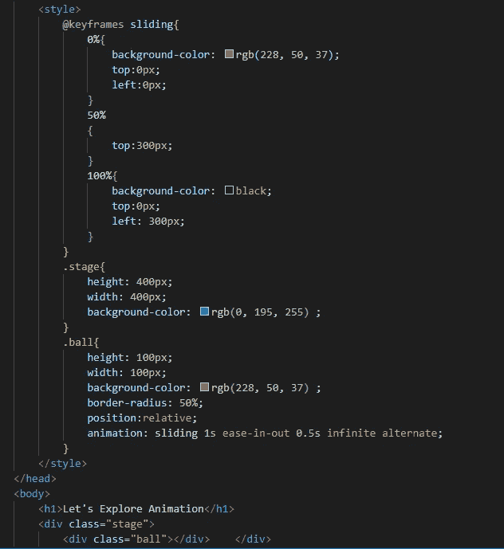**

**弹跳球效应模拟**

> ****现在，玩动漫，享受。****

# **9.向左浮动，向右浮动，最小高度，最大高度，光标**

> ****float** 属性【用在 **{display: flex}** 的 leu 中】指定一个元素是应该向左、向右浮动，还是根本不浮动。**
> 
> ****注意:**绝对定位元素忽略**浮动**属性！**
> 
> ****最小高度**属性定义一个元素的最小高度，而**最大高度**定义最大高度。**
> 
> ****光标 CSS 属性**设置鼠标光标的类型，如果有的话，当鼠标指针在一个元素上时显示。**

**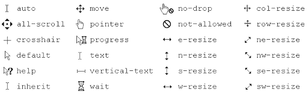**

**不同类型的 CSS 光标**

# **10.模块摘要**

> **如果您觉得今天的模块很难，请不要担心！在设计网页时，你不会用到今天的大部分主题，而只是在你的大脑中有效地保留**图像优化、** **字体超棒的**主题。但是至少浏览一下所有这些话题，做一些练习，如果遇到这些话题的话，这对你将来肯定会有帮助。**

**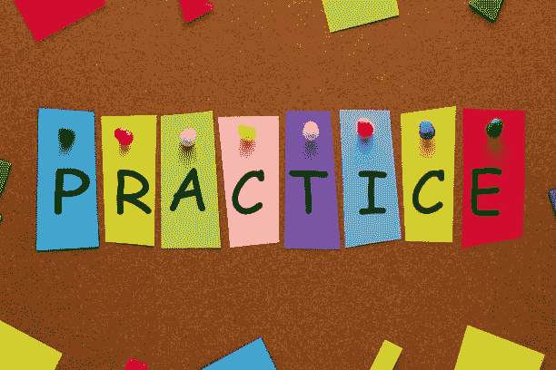**

# **下次见。😀😀😀**

## **&虚拟的👏👏👏拍手不会让手掌疼😏😏**