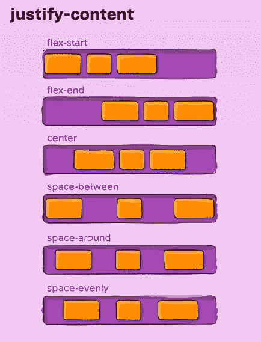
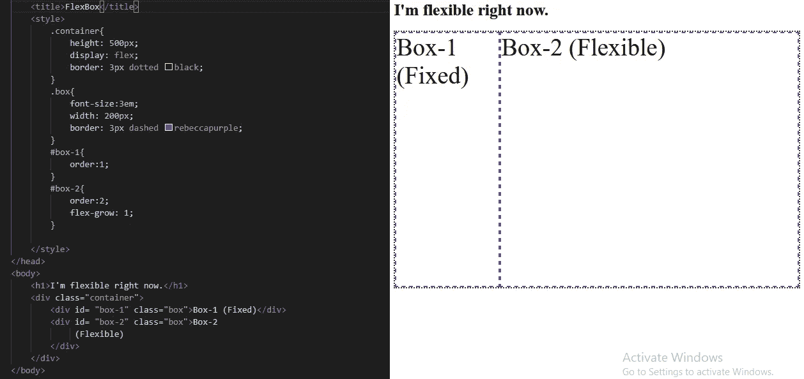
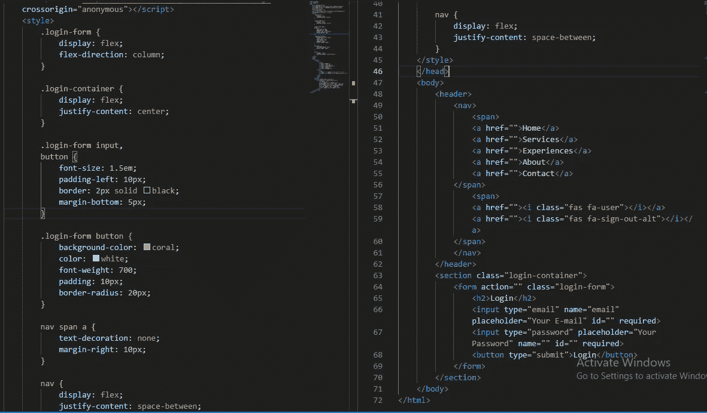
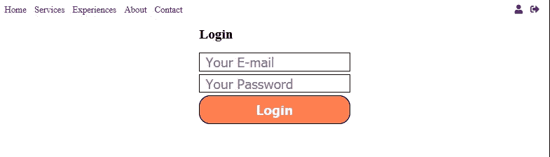
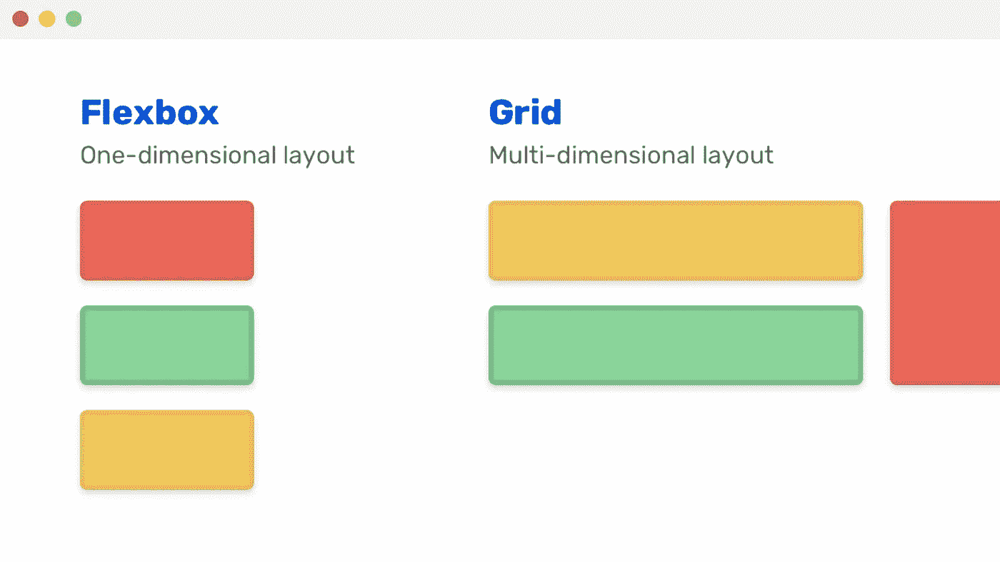
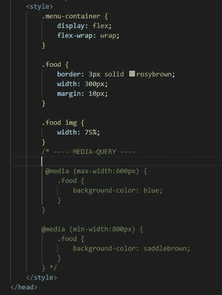
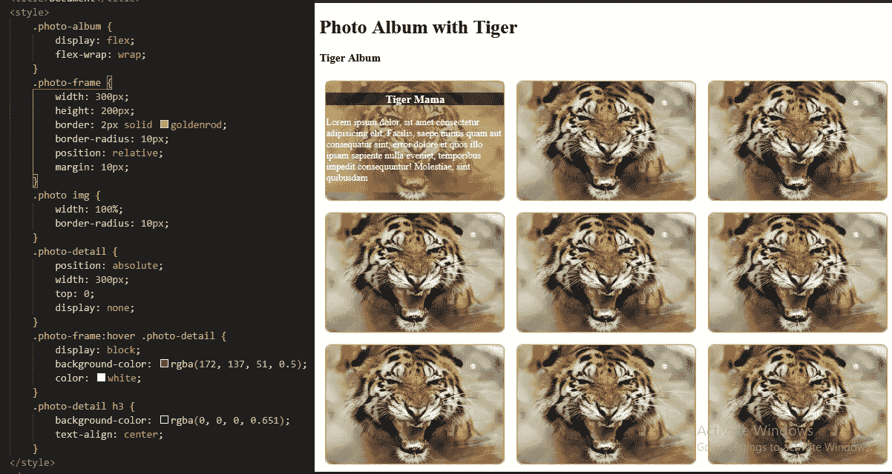
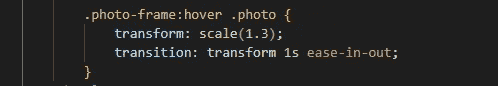

# Web 开发第 9 天(里程碑 2:响应性 Web 布局)

> 原文：<https://medium.com/nerd-for-tech/web-dev-streaks-day-9-70204fc78f98?source=collection_archive---------11----------------------->

> **模块 8:响应式 CSS 布局**

# 1.模块介绍和网站布局

> 一个**网站布局**是定义一个**网站的**结构的模式(或框架)。它的作用是为**网站的所有者和用户构建**网站**上的信息。它为网页导航提供了清晰的路径，并将一个网站最重要的元素放在最前面和中心**
> 
> 现在在谷歌上搜索**“网站布局”**，看看网站的不同**布局**，比如**单列、分屏、不对称、卡片网格、杂志、盒子、固定侧边栏、特色图片、F 形布局、Z 形布局、策划视觉效果、**等。就从这里开始吧。你不需要深入了解它，因为有专门的网页设计师/用户界面 UX 设计师。

 [## 永不过时的顶级网站布局| Adobe XD 创意

### 为什么人们真的会访问网站？在大多数情况下，每次访问背后的主要原因是内容。内容属于…

xd.adobe.com](https://xd.adobe.com/ideas/principles/web-design/11-website-layouts-that-made-content-shine-in-2019/) 

# 2.Flexbox，伸缩方向对齐内容对齐项目

> 在 **Flexbox** 布局模块之前，有四种布局模式:1 .**区块**，用于网页中的版块，2。**内联**，为文本，3。**表格**，对于二维表格数据，4。**定位**，为一个元素的明确位置
> 
> **柔性盒布局**模块使得在不使用浮动或定位的情况下设计柔性响应布局结构更加容易。
> 
> 要开始使用 **Flexbox 模型**，您需要首先定义一个 **flex** 容器。通过将**显示**属性设置为 **flex** ，flex 容器变得灵活。flex 容器属性有:flex-direction、flex-wrap、flex-flow、justify-content、align-items、align-content。
> 
> 当项目没有使用主轴**(水平)上的所有可用空间时， **justify-content** 属性对齐灵活容器的项目。**
> 
> **justify-content**:flex-start | flex-end | center | space-between | space-around | space-equally | initial | inherit；

调整内容的不同值

> **align-items** 属性指定灵活容器内项目的默认对齐方式。(垂直)
> 
> **align-items**:stretch | center | flex-start | flex-end | baseline | initial | inherit；
> 
> 所以，假设你有一个**用例**，菜单的一边是固定的，另一边包含一个灵活的框(根据窗口的不同可以调整大小)。

用例的解决方案

> 在这方面，容器应该设置为**{ display:flex；}** ，之后第二个盒子应该有 **{flex-grow: 1}** 。如果您愿意，您可以使用 **{order: 1 或 order: 2}** 更改框的顺序。

# 3.使用 Flexbox 创建登录表单和灵活的“导航”

> 在一个表单中创建两个**输入**字段和一个**按钮**，并将它们包含在一个**部分**中。将**部分**和**表单显示设置为 flex** 并赋予输入和按钮一些样式。此外，通过设置表单的' **flex-direction to column** 和节容器的'**justify-content to center**，将它们推到屏幕的中央。现在，在**体**的 **<头>** 内添加一个 **<导航>** 段。现在添加创建两个 **<跨度>** 并在第一个中添加一些**导航链接**使用**<>**和两个图标(表格**字体-牛逼**)在第二个中。

登录表单的 HTML 和 CSS

输出

> 将
> 
> **显示屏更改为 flex** ，因为现在您要将这两个部分分开，并将它们推向屏幕一侧。所以，对于设置了**{ justify-content:spaced-begin }**
> 
> 嘣！！你完了。

# 4.CSS 网格布局模板列网格间距

> CSS 网格布局模块提供了一个基于**网格的**布局系统，具有行和列，使得设计网页更加容易，而不必使用浮动和定位。一个**网格布局**由一个父元素和一个或多个子元素组成。当 HTML 元素的 **display 属性设置为 grid 或 inline-grid 时，它就变成了一个**网格容器**。**

FlexBox 与网格

> grid-template-columns 属性定义网格布局中的列数，并且可以定义每列的宽度。它还可以用来指定列的大小(宽度)。
> 
> 现在搜索**《CSS 网格入门》** &掌握一些知识。

# 5.使用 CSS 网格和 FlexBox 创建日历

> 创建一个**日历容器**，其中包含一个名为**日历**的**有序列表**，其中**日名**和**日期**存在于 **<李>** 标签中。后来**样式**将**压延机容器**改为**{最大宽度:200px 字体:100%系统用户界面；}** 然后将日历**显示改为网格**和**{网格-模板-列:重复(7，1fr)；}** 使用 **{ grid-column-start: 3，从**第三个**列开始一天；}**
> 
> 这里有一个**码笔**供你随意摆弄:

> 此外，对标题和有序列表进行样式化。将**对准**垂直和水平居中。给 **<李>** 一些**填充**使他们彼此分开。

# 6.使用媒体查询和 FlexBox 探索响应能力

> 使用这个 Emet 快捷方式**创建一个框架。菜单容器>。food * 8>img[src = " images/healthy . jpg "]+H2 { Price:$ @ 100 }+p>lorem 50+br+button { Order Now } "**
> 
> 现在，**弯曲**菜单容器**并在食物栏上创建一个 3px 的实心边框。此外，改变图像宽度为 75%。**
> 
> 现在，如果你改变边界窗口的大小，你会注意到 div 的响应，但在一个突然的点，如果窗口太小，那么一些 div 不适合窗口，看不见。所以，为了解决这个问题，你必须知道你正在设计网站的设备的**断点**(在谷歌上搜索**“CSS 断点”**)，并使用**媒体查询**。您可以使用 **@media (screen** )编写**特定规则**，其中屏幕大小(最小宽度:700px|最大宽度:900px)可以设置。现在，如果你调整你的窗口大小，你会注意到变化，并根据窗口大小的规则得到应用。

使用媒体查询和 Flex-Wrap

> 但是你可以用**{ flex-wrap:wrap；}** 一个柔性特征。现在，您的内容将根据窗口大小自动被**换行**。

# 7.使用相对位置& FlexBox 创建相册

> 使用这个 emmet 快捷键**创建一个框架。相册>。相框*15 >(。图片> img[src="Tiger.jpg"])+(。照片细节>H3 {虎妈}+p>lorem 30)**

带输出的 CSS 代码

> 现在，开始设计它们。目标是显示照片，直到鼠标悬停在照片上，并且相册中的所有照片都应该是灵活的，在窗口内。要做到这一点，风格的相框，并改变其位置为相对，也改变照片的位置为绝对，因为它应该在照片上，改变顶部为 0，最后改变照片显示为无。现在，为相框创建一个**伪悬停类**，为照片细节编写规则，如 **{display: block}** ，并添加任何你想要的样式。现在让**相册伸缩**并设置**伸缩包装:wrap。**
> 
> 你现在都准备好了！！😀😀😀

# 8.在相册中应用过渡变换

> 要在悬停时在照片上应用漂亮的**效果**，您可以添加一个**变换-过渡对**，使**图像-细节**看起来更有利可图。
> 
> 只需在你的相框上添加一个**悬停类**，并为照片编写规则，如**{ transform:scale(1.4)；转场:变换 2s 淡入淡出；}** 你还需要设置**溢出到**的隐藏**。相框类**。还有一些更多的变形效果，如**旋转**、**倾斜**等。

转换-过渡

> 将鼠标悬停在相框上，享受非常美妙的效果

## 🤪🤪🤪

# 9.所有的 CSS 属性，你需要知道的关于 CSS 的一切

> 到目前为止，60-70%的 CSS 属性已经包含在内，这些属性在设计网页时会经常用到。其余的 CSS 属性在设计特定的东西时会偶尔遇到。
> 
> 所以，从这里开始，看看所有的 CSS 属性。

 [## CSS3 属性

### 下一节包含 CSS3 属性列表和简短描述。以下部分包含…

www.tutorialrepublic.com](https://www.tutorialrepublic.com/css-reference/css3-properties.php) 

> 因为至少你需要知道所有的 CSS 属性，不管你是否会用到它们。至少要有个概念。那就够了。这些你都会慢慢学会的。

# 10.包装东西

> 请记住，**不要在几分钟内阅读完这篇博客**，然后关闭标签或应用程序。边读边做**练习**。

> 学习的时候也不要担心太多，不要在你的头脑中制造交通堵塞。

# 🤓🤓🤓🤓……快乐学习……🤓🤓🤓🤓

## &虚拟的👏👏👏拍手不会让手掌疼😏😏