# 硒美汤刮痧

> 原文：<https://medium.com/nerd-for-tech/web-scraping-beautiful-soup-and-selenium-468ed6e0dbef?source=collection_archive---------4----------------------->

—网页抓取 greatschools.org

摘要:这篇文章深入探讨了我第一次浏览 greatschools.org 这个动态网站的细节。我深入研究了所使用的库和使用 Selenium 和 Beautiful Soup 所需的包。作为一个新兴的数据科学家，网络抓取在数据科学领域是非常重要的。我希望这篇文章能激起你的好奇心。

Jisha Obukwelu 摄

# 介绍

8 周(兼职)，在一个远程跨学科团队做数据科学家和机器学习工程师。我们的任务是构建 CitySpire 2.0，这是一个为用户提供一站式资源以获得最准确的城市信息的应用程序。

数据科学团队采用完全分析的方法在城市中寻找公寓。这个应用程序本质上是说明性的，帮助用户找到合适的地方。我做过的一个功能是整合关于学区及其评级的信息。

当人们/家庭决定搬到一个新的城市时，学校信息是一个非常重要的因素。为了找到相关的学校信息，我去了 greatschools.org 的。

# 什么是网页抓取？

由于优秀的学校没有可访问的 API，我不得不在我们的 CitySpire 数据库中搜集这些城市的学校数据。

**什么是网页抓取？为什么这么做？**

网络抓取是从网站中提取数据。收集这些信息，然后导出为用户友好的格式。我创建了一个学校列表端点，它根据年级(幼儿园前、小学、初中或高中)提供学校信息。

# 优秀的学校

Great schools 有一个基于 1-10 分制的总结评分表，其中 10 分最高，1 分最低。1-4 分表示学校“低于平均水平”，5-6 分表示“一般”，7-10 分表示“高于平均水平”或“表现优异”。

汇总评级计算基于四个评级，旨在显示学校成功的不同方面:学生进步评级或学术进步评级、大学准备度评级、权益评级和考试分数评级。每个学校的评级因数据可用性或与学校级别的相关性而异(例如，高中有大学就绪评级，但小学没有)。如果缺乏足够的数据，就不会对学校进行汇总评级。

# 过程

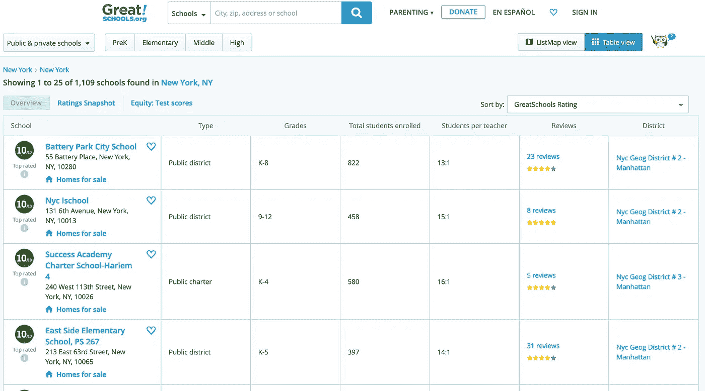

greatschools.org

我没有太多的经验与网页抓取工作，所以我的第一次尝试是与美丽的汤。

# **美汤**

Beautiful Soup 是一个 Python 库，用于从 HTML、XML 和其他标记语言中获取数据。Beautiful Soup 帮助您从网页中提取特定内容，删除 HTML 标记，并保存信息。它是一个网络抓取工具，可以帮助你清理和解析从网上下载的文档。您可以查找特定的 HTML 标签。

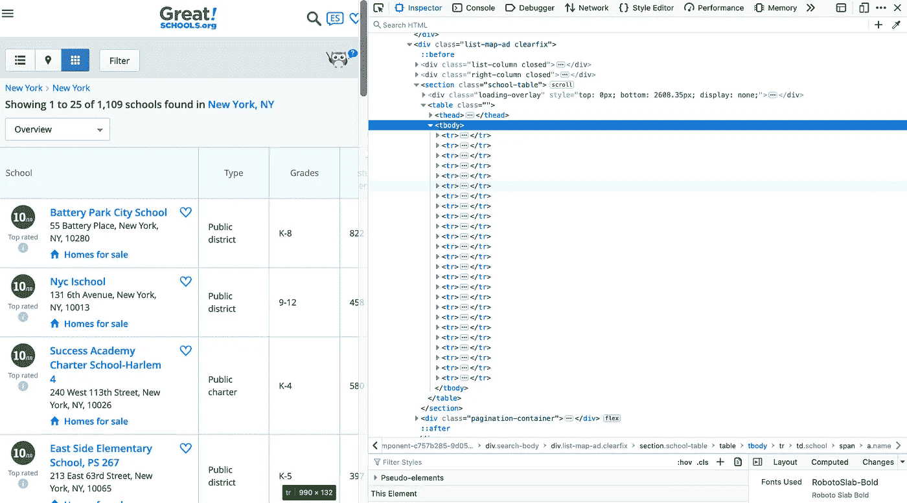

当我实现这段代码时，它产生了一个空数组。

# **硒**

经过进一步研究，我发现这是一个动态网页，其中的表格是用 JavaScript 生成的。在对其他基于 Python 的 web 抓取包进行了一些研究之后，我遇到了 Selenium。Selenium 包用于自动化来自 Python 的 web 浏览器交互。有了 Selenium，编写 Python 脚本来自动化 web 浏览器成为可能。使用 Selenium，我能够轻松地解析 JavaScript。

Selenium 启动一个浏览器会话。为了让 Selenium 工作，它必须访问浏览器驱动程序。默认情况下，它将在 Python 脚本所在的目录中查找。Chrome、Firefox、Edge 和 Safari 驱动程序的链接[可以在这里](https://pypi.python.org/pypi/selenium)找到。在我的项目中，我使用了 Chrome。

用硒刮 greatschools.org

这无疑是一个更有希望的开始。我可以返回下表。下面是这段代码的结果。

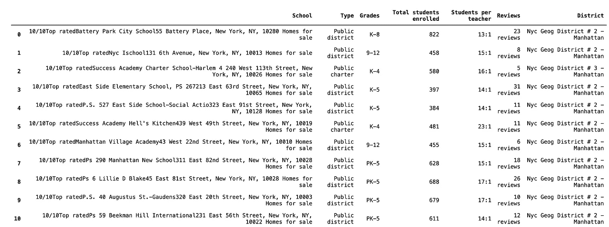

用硒刮 greatschools.org 的结果

# **有些事情在一起会更好**

上面的表格表明我的思路是正确的。进一步看一下`School`列，有几条信息都在一起，使用 regex 不容易分开(相信我，我试过)。

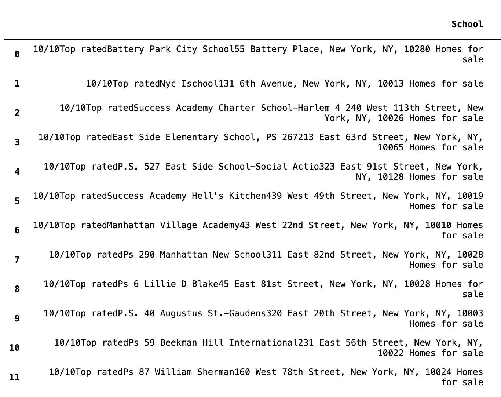

学校专栏在一个专栏中包含了几件事

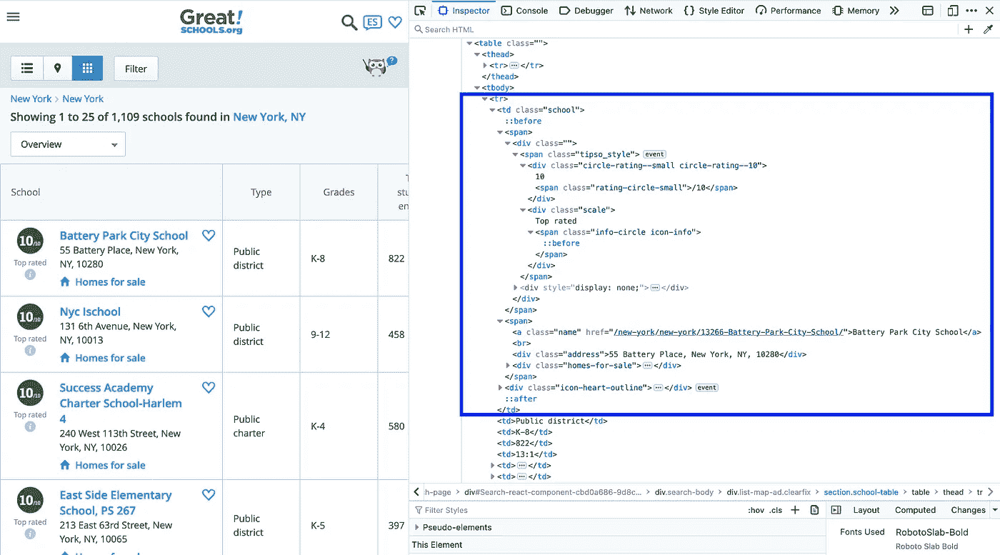

row school 包含—学校分数和评级、名称、地址。

经过几次尝试和错误之后，我能够创建使用 Selenium 访问网页的循环和使用 Beautiful Soup 解析`School`列中的信息。

# 数据提取和清理

**先决条件:**

要运行 Selenium 和 Beautiful Soup，需要安装几个软件包。

**硒:**

1.`pipenv install selenium`

2.Selenium 需要一个 web 驱动程序(它自动化的浏览器)。我选择了 Chrome。

想了解更多，可以去 [Selenium 的文档](https://selenium-python.readthedocs.io/installation.html)。

**提取数据的美汤:**

1.  `pipenv install bs4`
2.  `pipenv install requests`

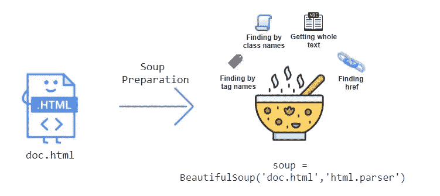

[https://stackabuse . com/语法分析指南-html-with-美化-python-up/](https://stackabuse.com/guide-to-parsing-html-with-beautifulsoup-in-python/)

使用美丽的汤让我能够解析`School`列，提取 greatschools.org 校园里的不同元素。

**HTML 描述:**

这些是我在《美丽的汤》中寻找的常见 HTML 元素。

1.  `<table>`标签用于以表格的形式呈现数据。`<td>`为列，`<tr>`为行。
2.  `
`是作为一个容器来代表屏幕上的一个区域。
3.  `<a>`定义超链接。

4.获取特定的行、列、容器等。然后，您将指定`class`，解析出您试图检索的数据。

**示例:** `soup.find(‘div’, {‘class’: ‘circle-rating — small’})`

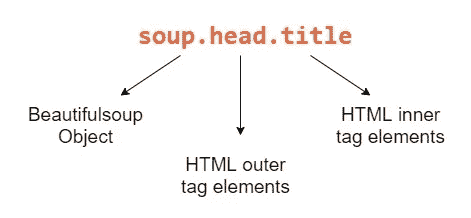

[https://stackabuse . com/语法分析指南-html-with-美化-python-up/](https://stackabuse.com/guide-to-parsing-html-with-beautifulsoup-in-python/)

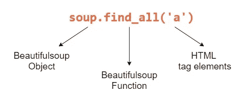

[https://stackabuse . com/语法分析指南-html-with-美化-python-up/](https://stackabuse.com/guide-to-parsing-html-with-beautifulsoup-in-python/)

# 那么，代码在哪里？

如果你像我一样，你可能会想“这一切都很好，但是代码在哪里？”所以不要失望，这是我用来刮 greatschools.org 的代码(他们最近创建了一个免费的公共应用编程接口)来与他们的网站交互，并检索数据用于你自己的个人项目。).

1.  当前的 CitySpire 应用程序有 374 个城市的数据。我创建了一个 csv 格式的城市，我需要提取学校信息。

使用城市列表电子表格和州缩略语词典来生成这个新格式的城市列表

2.下面是我用来获取各个城市的学校信息的代码。

我将分解这一大块代码。

— `driver = webdriver.Chrome()`这打开了 Chrome 浏览器，该浏览器用来解析 greatschool 的动态网站。

——因为每个城市有不同数量的学校，我无法设置具体的页码，所以我使用了`pagination-summary`。

而循环继续递增地刮擦伟大的学校

如果未达到学校总数，此`while loop`继续增加页码。

分页摘要如下所示:

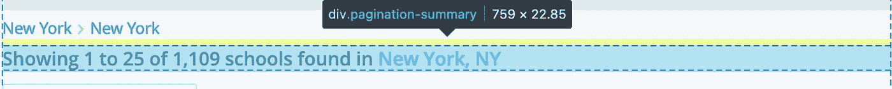

分页摘要文本

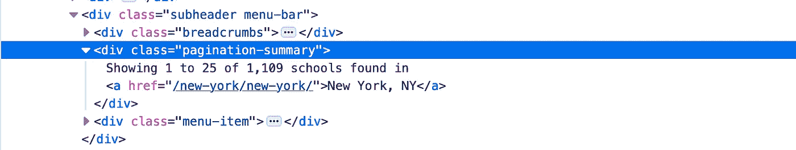

分页摘要 HTML

使用 regex，我将分页摘要分离为一个列表，然后检索列表的第三项(结束数)和第五项(总数)，并比较这两个数字。如果结束数等于或大于总数，这将中断循环。

—代码的最后一部分，利用漂亮的 Soup 来解析表的元素。

这段代码解析表，然后将信息附加到自己的记录中。

# 结论

我希望你喜欢这篇文章！对我来说，这实际上是一次我从未体验过的深度潜水。Selenium 通常是使用大量 JavaScript 从网站提取数据所必需的，使用漂亮的 Soup，您可以使用 HTML 标签轻松解析信息。我从硒和美丽的汤的工作中获得了很多乐趣，并深入到文档中。

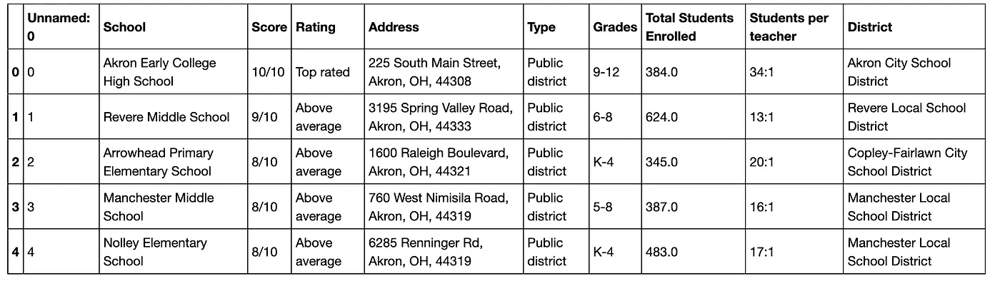

从网页抓取得到的数据帧

我还有很多东西要学。我知道我上面的代码并不完美，我确信我的 while 循环可以做得更好。我还了解到，我可以只用硒或美味的汤来做到这一点，但这种二重奏让我第一次更容易浏览页面。

# 更进一步

为了创建最终的 schools.csv 和服务于学校相关数据的两个端点，我必须做更多的清理和特性工程工作。

[**Schools.csv**](https://github.com/jiobu1/labspt15-cityspire-g-ds/blob/main/notebooks/datasets/data/schools/csv/final_school.csv)

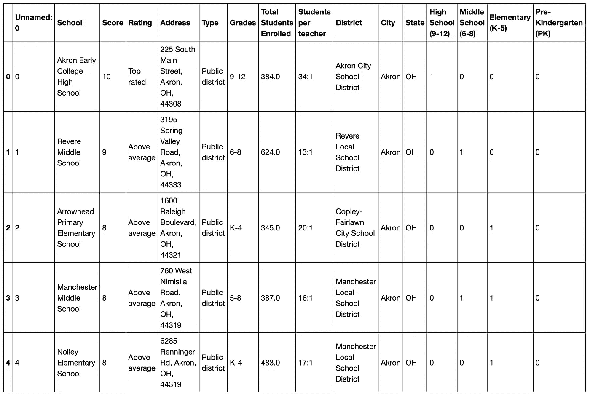

最终确定 school.csv ->清理地址栏，将学校从幼儿园到高中进行分类

[**学校清单端点:**](https://github.com/jiobu1/labspt15-cityspire-g-ds/blob/main/app/external.py)

学校端点根据用户期望的城市和学校类别返回学校列表

[**学校汇总端点:**](https://github.com/jiobu1/labspt15-cityspire-g-ds/blob/main/app/ml.py)

返回学校总数、私立学校、公立学校、特许学校的数量以及高水平学校的百分比

# **链接**

要了解更多信息，您可以点击以下链接:

—要了解更多关于网页抓取的信息，您可以点击[这里](https://github.com/jiobu1/labspt15-cityspire-g-ds/blob/main/notebooks/datasets/data/schools/schools.ipynb)。

—要看我是怎么擦桌子的，你可以去[这里](https://github.com/jiobu1/labspt15-cityspire-g-ds/blob/main/notebooks/datasets/data/schools/school_cleaned.ipynb)。

—要查看 schools.csv，您可以在这里找到它。

—要看我是如何创建分类泡菜词典的，你可以去[这里](https://github.com/jiobu1/labspt15-cityspire-g-ds/blob/main/notebooks/model/schools/pickle_schools.ipynb)。(这是为了更快地查找。csv 有> 65K 行。)

—要看我是如何总结学校信息的，你可以去[这里](https://github.com/jiobu1/labspt15-cityspire-g-ds/blob/main/notebooks/datasets/datasets_to_merge/labs2/add_school.ipynb)。

—您可以在这里找到 schools_listing 端点[，在这里](https://github.com/jiobu1/labspt15-cityspire-g-ds/blob/main/app/external.py)找到 school summary，endpoint [。](https://github.com/jiobu1/labspt15-cityspire-g-ds/blob/main/app/ml.py)