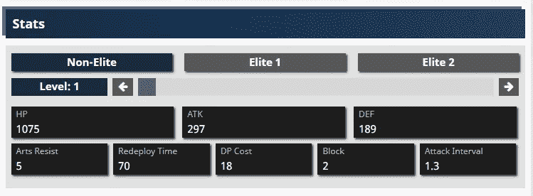
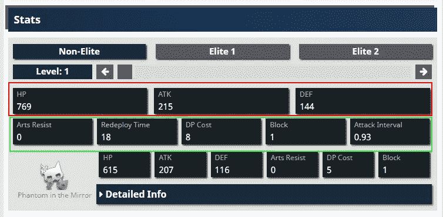
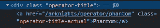

# 使用 Python 和 Selenium 从 Arknights wiki 抓取角色统计数据

> 原文：<https://medium.com/nerd-for-tech/web-scraping-character-stats-from-the-arknights-wiki-using-python-and-selenium-61e33a968092?source=collection_archive---------6----------------------->

Arknights 是一款塔防手游，我玩了一年多了。粉丝们已经创建了多种工具和门户来帮助彼此进步。受到他们的启发，我决定开始为这个游戏做一个数据科学的个人项目。

我今天分享的结果是 Python 脚本对角色统计数据进行网络搜集。这不是一个教程，相反，这将是一个展示和讲述的种类，在那里我解释我的思维过程和我的代码的进展，以达到最终的解决方案。

如果你只是想要代码，请访问我的 GitHub 库[这里](https://github.com/Ze1598/medium-articles/blob/master/Web%20scraping%20character%20stats%20from%20the%20Arknights%20wiki%20using%20Python%20and%C2%A0Selenium/scrape_arknights_gamepress.py)。



此脚本的目标

# 要解决的目标和挑战

在决定了我的项目目标后，我必须找到一个数据集。在我的例子中，我在寻找角色的数据，例如，他们的攻击，防御，抵抗等等。当它们上升时。我没有在网上找到这个数据集，但是我知道有一个地方记录了这些数据:GamePress 上的 [Arknights wiki](https://gamepress.gg/arknights/tools/interactive-operator-list#tags=null##stats) 。因此，我用 Python 编写了一个脚本，它遍历各个角色页面，读取它们的统计数据，并将所有内容合并到一个 CSV 文件中。

抓取数据集的技巧在于**与页面**的交互。在加载一个角色页面时(让我们以[幻影的](https://gamepress.gg/arknights/operator/phantom)为例)，你会看到默认情况下他的统计显示为非精英晋升等级的 1 级。但是我希望得到所有等级的所有数据。换句话说，我需要脚本以编程方式与角色等级旁边的箭头进行交互，以升级它们，每次读取统计数据，然后对每个升级等级(非精英、精英 1 和精英 2)重复这个过程。

## 选择图书馆

编程语言已经选好了:Python。这是我在编写网络抓取代码时最熟悉的语言，也是我将在这个项目的剩余部分使用的语言。问题是使用哪个图书馆。我以前用过[美汤](https://beautiful-soup-4.readthedocs.io/en/latest/)，但是我知道它不能与网页互动。无论它最初从页面上读到什么，都是你所能得到的。不要误会我的意思，美丽的汤是非常有用的，但缺乏交互性是一个交易破坏者。

于是我(重新)转向[硒](https://selenium-python.readthedocs.io/)。我过去也用过它，虽然不如漂亮的汤，但我很好地掌握了它的功能以及它如何能够实现我想要的。与读取页面的 HTML、CSS 和 JavaScript 的 Beautiful Soup 不同，Selenium 可以打开一个新的浏览器窗口，并让一个机器人运行您的命令，即与页面进行交互。当然，它仍然可以读取 Beautiful Soup 可以读取的内容，但是您可以指向一个文本框，输入您的凭据以验证网站，或者像手动操作一样单击按钮。

这正是我要找的。现在我已经选择了编程语言和库，我可以开始写代码了。

# 代码:循序渐进

现在，我将带您了解为了完成剧本，我必须在剧本中解决的每个挑战。我假设你熟悉基本的 web 抓取技术，比如使用浏览器检查器来定位 HTML 元素，但是只要你理解 HTML 和 Python，你就应该能够理解代码中发生了什么。

我们将从最基本的部分开始:读取默认角色等级(非精英等级 1)的统计数据，并从那里开始构建，直到我们找到一个找到所有现有角色页面并提取每个角色页面中所有数据的脚本。

哦，请考虑到 Selenium 将以默认的窗口大小运行，大约是我屏幕大小的一半。

## 关闭粘性广告

虽然如果我最大化浏览器窗口或者甚至在无头模式下运行 Selenium(不打开浏览器窗口)，这可能不是一个问题，但我认为分享我如何解决这个问题是一个好主意。

当 Selenium 向下滚动页面时，右下角弹出了一个粘性广告。问题是广告和升级按钮重叠了。当 Selenium 试图点击这些按钮时，它会抛出一个错误，因为粘性广告“会收到点击”。你可以把它想象成层，广告在向上按钮上面的一层，Selenium 会点击上面的任何一层…

你可能会想“他只是告诉 Selenium 关闭粘性广告”，这是绝对正确的。神奇之处在于获得了这样做的代码。

为了达到这个效果，我需要完成代码中的三个步骤:

*   找到要向下滚动到的 HTML 元素
*   向下滚动到该元素以显示粘性广告
*   单击关闭粘性广告按钮

下面是执行此操作的代码片段:

关闭粘性广告

## 读取单个级别的数据

随着粘性广告的消失，我可以完成这个过程中最基本的任务:读取默认角色等级的统计数据。由于我自己对收集哪些数据的要求以及对 Selenium 语法的玩弄，这有相当多的反复，但在最终版本中，我将抓取以下内容:

*   名称:角色名称
*   稀有度:角色稀有度(1-6 星)
*   职业:角色职业(守卫，狙击手，防御者等。)
*   晋升级别:非精英、精英 1 或精英 2
*   水平
*   大功率(High Power)ˌ高压(High Pressure)ˌ高性能(High Performance)ˌ高聚物(High Polymer)
*   攻击
*   防卫
*   抵抗
*   重新部署时间
*   DP 成本
*   块数
*   攻击间隔
*   CN 发布日期:角色在中文服务器的发布日期
*   全球发布日期:角色在全球服务器的发布日期
*   是有限的:这个角色只能在有限的事件中出现吗？

(没有解释的是游戏中的数据)

这些数据大部分都很容易读懂。除了 HTML 元素缺少 id(这意味着我必须通过元素的 HTML 类来定位元素)之外，主要是“用类 X 选择元素并读取其文本”。还有一些更棘手的问题，如涉及计数稀有星(img 元素)数量的稀有性，以及涉及在文本框中查找单词“Limited”的 Is Limited 字段…还必须将多个统计数据作为单个字符串，然后拆分文本，但我将在代码片段中讨论这一点。

再一次，把交互性放在一边，这是一个简单的网络抓取工作。如果更多的 HTML 元素有 id，事情可能会变得更容易，但是谢天谢地，编写这些页面的人把类名写得好像它们是 id 一样，因为它们在每个页面中不会重复太多。事后看来，这对硒的实践也有好处。

这是这部分的代码片段。请注意，它不包括角色名称，因为它不是从最终解决方案的页面中读取的，而是从运行抓取的循环中读取的:

读取单个级别的统计数据

这段代码看起来很长，但实际上它只是重复多次的相同核心操作:通过类名(或 id，如果可能的话)定位元素并读取其文本。

但是有些部分我想大声说出来。在第 11 到 16 行，为了找到操作符稀有度，我唯一的方法是找到稀有度存在的所有 img 元素( [this image](https://gamepress.gg/sites/arknights/files/2019-10/star.png) )并对它们进行计数。角色稀有度从 1 到 6 不等，所以角色会有那么多稀有的星星图像。

角色可用性和发布日期分别出现在两个具有相同 HTML 类的表格中，第 18 行到第 21 行。


角色可用性和发布日期表

我首先阅读了发布日期，这些日期在第二个表中，每个版本占一行(分别是中国和全球服务器)。每个值的代码都是相同的，但是数据是从不同的行中读取的，因此索引也不同。中国发行日期在第 23-27 行，全球发行日期在第 28-32 行。为了查明字符是否受到限制，我必须转到第一个 HTML 表并读取猎头文本信息(第 33 到 37 行)。如果它包括单词“limited ”,那么 Is Limited 被记录为 1，否则为 0。这个条件用一个三进制运算符写成了一行代码。

其他的角色属性(HP，攻击，格挡，等等。)所需的字符串操作。这六个统计数据也拆分到两个表中，但是数据嵌套很深。



游戏中角色统计的表格

(请忽略第二组统计，那些是针对幻影的能力，其他角色没有这第二组)

我的解决方案是一次读取每个表的文本，这将为第一个表返回以下内容。

```
HP
769
ATK
215
DEF
144
```

每行包含 stat 名称，下一行是其值。我在这个字符串上调用了`splitlines`方法，以便在新的行字符处自动分割每个值。所以上面的字符串会生成列表

```
["HP", "769", "ATK", "215", "DEF", "144"] 
```

这在两个统计表中重复(从第 50 行开始)。

## 获取单个角色所有等级的统计数据

既然我能够读取单个级别的统计数据，我必须:

*   读取当前促销级别的所有级别的统计数据
*   对剩余的促销级别重复该过程

这其实很简单。我们的想法是阅读统计数据，点击升级按钮，阅读统计数据，点击升级按钮，…，然后对每个升级级别重复这一步骤。这是编写实现这一功能的自定义函数的完美目标。

升级需要点击一个右箭头按钮，但是改变升级级别需要点击三个按钮中的一个。所以我做的是:

1.  找到三个促销级别按钮
2.  读取该推广级别的每个级别的统计数据(读取统计数据，级别上升重复)
3.  通过点击下一个提升等级按钮来提升角色
4.  重复步骤 2。
5.  重复步骤 3。(如果需要，有些角色有三个晋升级别，有些有两个，有些只有一个)

此外，因为晋升级别中的级别数根据晋升级别和角色稀有度而变化，所以这个自定义函数需要一个参数:级别数，或者读取统计数据并单击“升级”按钮的次数。这是该部分的代码片段。

读取每个等级的统计数据

大部分代码已经显示在前面的代码片段中。这里相关的部分是读取统计数据、升级和必要时提升角色的逻辑。注意，我还从第 16 行开始为不同的促销级别实现了一些逻辑。它会检查角色页面中有多少个晋升级别。

`rank_buttons`变量是一个按钮列表。每个按钮都是一个提升级别，因此我可以访问列表中的一个元素并调用`click`方法。然后`get_stats_per_level`函数根据可用等级的数量，重复读取统计等级的循环 X 次。

如果你是一个 Arknights 玩家，你可能会注意到我为精英 2 升级的角色刮了太多的等级(从 31 行开始)，因为这包括 4 星或更稀有的等级。例如，一个 4 星的角色只有 45 级精英/非精英，而我却想得到 50 级(第 32 行)。这导致 45 级的统计数据被记录为那些额外的等级(重复的值)。

考虑到不同晋升级别和稀有程度的级别上限的多样性，以及代码中的性能缺陷，我做出了这个选择。使用的等级上限基于 6 个星形字符(等级上限最高的字符)。然后，在写入输出 CSV 文件(不包括在这个代码片段中)之前，我删除了脚本末尾的重复行。

最后，请注意数据根本没有被存储。稍后我会解释我是如何处理熊猫数据帧的。提示:`get_stats_per_level`函数需要修改。

## 获取所有可用的字符

至此，数据抓取逻辑完成。但是缺少两个组件:知道哪些页面被抓取，即字符页面列表，以及将数据存储在运行中的 pandas DataFrame 中，以便最终输出。

这部分对我来说很容易，因为这不是我第一次刮这个 Arknights wiki。上次我也不得不收集了一个可用角色的列表，但是我没有统计，而是查看了角色艺术的 URL 来创建一个带有 Streamlit 的[壁纸生成器应用程序！自我宣传到此为止，下面是获取可用字符列表和作为字典的页面 URL 的代码。](https://share.streamlit.io/ze1598/arknights-wallpaper-generator/main)

获取角色列表

而且看，我实际上已经为这部分使用了美丽的汤(和请求)。老实说，我应该重写代码来使用 Selenium，但是我已经有了这个代码，我知道它可以工作，所以我重用了它。不需要交互，只需加载页面并从字符表中抓取信息。

在第 15 行和第 16 行，你可以看到我实际上没有抓取 URL。角色的名字实际上是到他们页面的超链接(使用相对路径)。再次使用幻像作为例子，



带有字符页相对 URL 的操作符定位标记

这意味着 href 属性的值被附加到基本的“https://game press . gg”URL。这些信息存储为一个字典，将每个字符映射到其页面的 URL。

第 21 行显示了一个硬编码值。稍微钻研一下游戏，Amiya 是主角，最近她收到了一个不同职业的替代形式。其他的候补角色都是自己单独的角色，但是阿米娅的两个变种是游戏内的同一个角色。所以我认为这就是为什么维基甚至没有在字符表中显示这个阿米亚(守卫)候补。然而，Amiya 和 Amiya(守卫)有不同的页面，因此我对后者的页面进行了硬编码。为了避免写更多代码的麻烦，我决定让这个硬编码是没问题的，因为另一个 Amiya 在很长一段时间内不应该被添加到游戏中，其他角色的替代品作为新角色被添加。

最后，字典被输出为一个[泡菜文件](https://docs.python.org/3/library/pickle.html)。我在之前的项目中这样做了，我在这里再次这样做，因为它是一个很好的检查点，以防在抓取角色页面时出现问题。dictionary 变量用于脚本的其余部分，但是如果以后出现问题，最好使用这个检查点。

下面是代码重构的代码片段。和以前一样，我省略了自上次显示以来没有变化的代码。

重构代码来抓取所有可用的字符页

## 将数据记录在 CSV 输出的数据图表中

其他一切就绪后，最后一个难题是将数据保存到某个地方，因为脚本会遍历页面并在最后输出一个 CSV。

我们需要重新访问`get_stats_per_level`函数。现在我必须将抓取的数据保存在一个数据帧中，该函数需要访问该数据帧。数据帧最初是作为函数外部的空数据帧创建的。但是，它是作为参数传递给函数的，因此在逐级提升字符的循环的每次迭代中，都会向其中写入一行新数据。具有最新数据的数据帧在函数结束时返回。看一下下面的代码片段，以便更好地理解这个新代码。

将抓取的数据保存在数据帧中并以 CSV 格式输出的逻辑

我认为代码中的注释是不言自明的，但是本质上，为了向数据帧添加新的一行，我创建了一个新的字典，其中包含最新的统计数据，并将其附加到数据帧中。

如果你想看完整的脚本，你可以在我的 GitHub 上找到它。如果你想要结果数据集，你可以在这里找到它。

# 结束语

这是一个非常有趣的个人项目的开始。我不仅有机会处理我花了很多时间玩的游戏中的数据，而且我还在游戏中研究了数据科学…嗯，在这个阶段是数据工程。在几年前使用 Selenium 之后重新访问它并学习更多关于 web 抓取的知识是很酷的。

但是，鉴于这项工作的性质，这是一个不可靠的脚本。它今天仍然有效，但是如果 GamePress 决定改变这些页面，他们可以很容易地破解这个脚本。API 永远是一个更好的选择，也就是说，当它们是一个选择的时候…当 API 不是一个选项的时候，如果你的需求足够灵活和/或你有可能有人长期支持代码，web 抓取仍然可以完成工作。

最后但同样重要的是，非常欢迎反馈，不仅是对代码，对文章本身也是如此。我通常写一些教程，但是这次我决定更多的讨论我做了什么以及为什么做。请让我知道你是否喜欢阅读它，还有哪些可以改进的地方。我是不是太啰嗦了？我是否在讲述代码和实际展示代码之间取得了良好的平衡？我应该更详细地解释代码吗？无论如何，感谢您阅读这篇文章，我希望这段代码将来能对您有所帮助:)

附言:如果你试图在今天或接下来的几天运行这个脚本，它会崩溃，因为维基已经在添加新宣布的角色，他们的页面仍在进行中。因此，如果您尝试运行该脚本，请确保忽略这些字符的 URL。代码在[的最终脚本](https://github.com/Ze1598/medium-articles/blob/master/Web%20scraping%20character%20stats%20from%20the%20Arknights%20wiki%20using%20Python%20and%C2%A0Selenium/scrape_arknights_gamepress.py)(第 132-135 行)中。如果需要，取消这些行的注释。