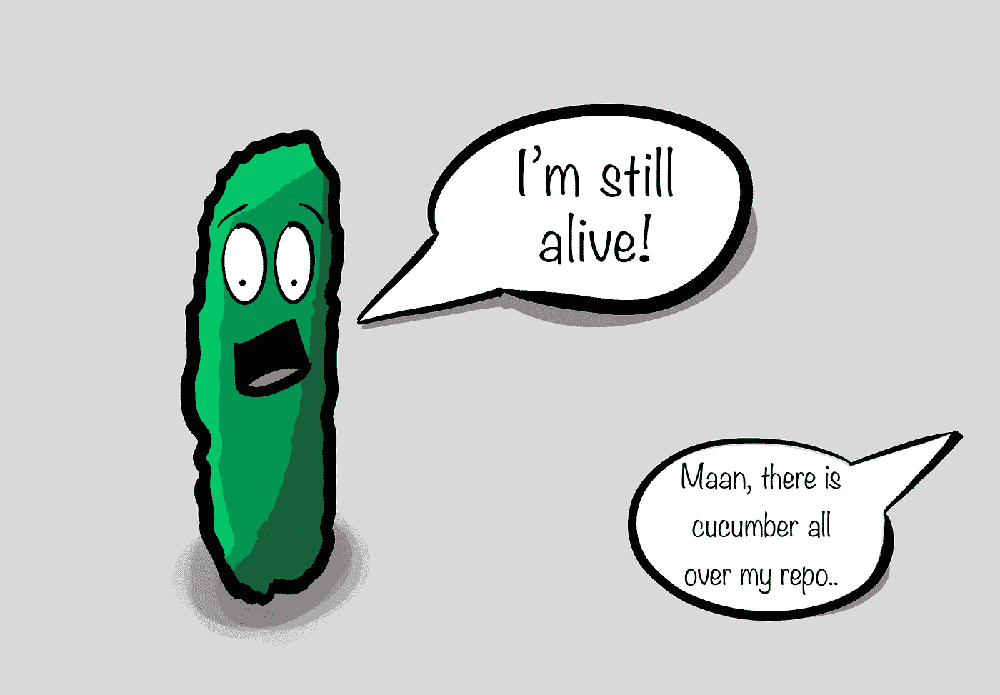
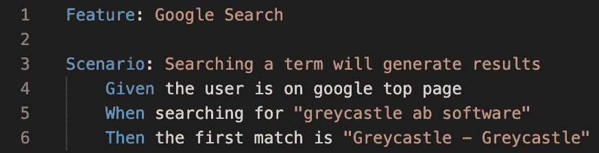
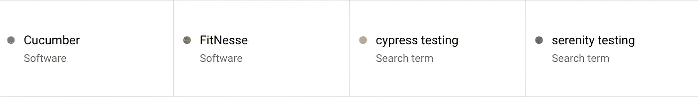
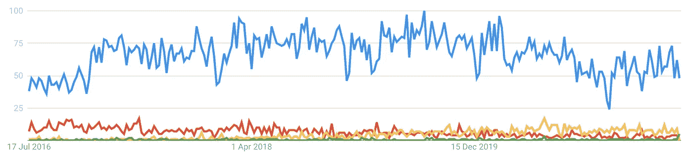
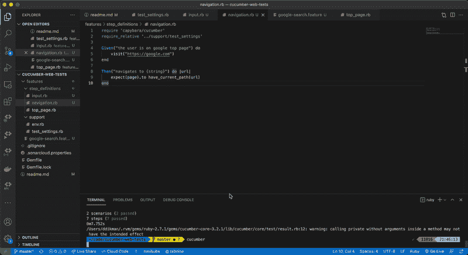
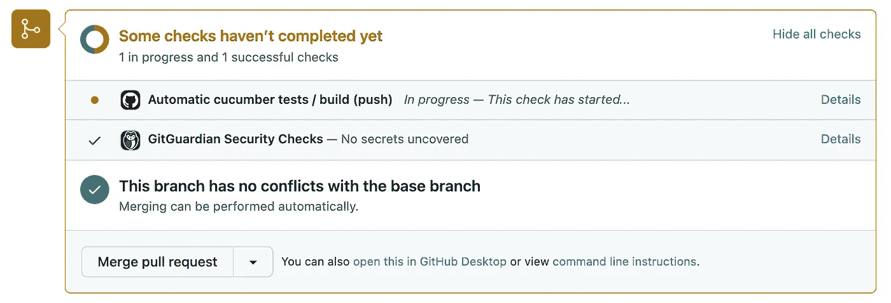

# 使用 Cucumber、Ruby 和 Selenium 的 Web 测试快速入门

> 原文：<https://medium.com/nerd-for-tech/web-testing-quickstart-with-cucumber-ruby-and-selenium-e4933d961e8c?source=collection_archive---------1----------------------->



有没有试过在谷歌上搜索“黄瓜”,希望能找到教程？再试一次。

还记得那次你坐下来想“在我发布之前，我会在我们的应用程序中浏览 50 页左右，以确保一切运行正常”吗？

没有吗？我也不知道。

手工测试是乏味的，我宁愿不做。但是它确实有它的优点。事情总是在我们最意想不到的时候发生。

我们不能也不应该避免手工测试。我甚至不认为核心的手工测试*是无聊的*，是测试的*重复*才是无聊的。

如果我们可以通过使用自动化来消除测试中的重复，我们可以获得相同(如果不是更高)程度的信心，而没有厌倦或时间损失。

自动化测试，甚至是用户界面的自动化测试，已经存在很长时间了。Selenium 创建于 2004 年，并成为 web 测试的黄金标准。

今天我想展示一个我们如何使用 Selenium 来自动化测试的实际例子。

我还会展示一个 [DSL(领域特定语言)](https://martinfowler.com/books/dsl.html)叫做[黄瓜](https://cucumber.io/)。这是一种 [BDD](https://www.katalon.com/sa/behavior-driven-testing/) 测试语言，可以包装 Selenium 以使 web 测试更容易阅读和维护。

## 黄瓜有什么帮助？

如果有人问我，为什么要用黄瓜？

> 使用 Cucumber 迫使你编写 [BDD(行为驱动设计)](/@TechMagic/get-started-with-behavior-driven-development-ecdca40e827b)测试。这意味着你的测试不是测试代码，而是测试用户交互。它迫使你以用户的方式测试事物。另外，他们读起来很容易。

我打开 [cucumber.io](https://cucumber.io/) 期待类似的描述，我认为第一段以正确的方式开始:

> 很简单。
> - [cucumber.io](https://cucumber.io/)

我会说这太简单了，但他们确实说到点子上了。我相信，通过首先编写一个测试，就像你用简单的术语向别人解释一样，你可以得到高质量的测试。此外，您甚至可以先手动运行它们，以确保它们在实践中有效。

BDD 风格的测试甚至可以作为系统如何工作的文档。我认为他们阅读的方式解释了价值。



黄瓜特征的例子

我认为 cucumber.io 的解释过于简化了，写一个 cucumber 规范很容易，但是*实现*测试仍然很难。

黄瓜测试实际上没有任何作用。它只是一个文本文件。然后，该文本文件被解释并与这些文本行的实现相匹配，以运行可重用的代码片段。

你必须实现每一段代码。然而，以这种方式组织代码确实有助于提高可重用性、可读性和可维护性。

## 黄瓜还活着吗？

如果你们中的任何人已经生活了一段时间，你知道黄瓜也是如此。第一次承诺是在 2008 年 4 月，也就是 13 年前(从今天算起)。那是我整个职业编码生涯。

但年龄并不是一件坏事，看看 Git，它比以前老了三岁，比以前更有活力。

但是，并不是所有的产品都是 Git。那么黄瓜怎么样，还值得依赖吗？

我会回答:当然。Cucumber 是一种 DSL(领域特定语言),帮助编写(或者说，阅读)测试变得更容易。因此，它在我心中是永恒的。它有很多实现的支持，你可以在[大多数流行的语言](https://cucumber.io/docs/installation/)中使用它，你如何实际执行你的测试，这也取决于你。

你没有*有*来使用硒。对于 UI 自动化，我认为我们会看到一些更新的工具最终取代 Selenium，这可能会使它变得更容易。

但是使用黄瓜仍然是值得的，你甚至可以这样看。用 Cucumber 编写您的测试，忠实的 Selenium 将让位于一个新的自动化框架，您可以重新实现您的步骤定义，并且一切都将正常工作！

最后，Cucumber 被测试自动化软件的世界领导者之一 Smartbear 2019 收购。他们自己称之为 BDD 框架的领导者。

> 行为驱动开发(BDD)社区中最广泛采用的领导者和开源测试自动化框架的创建者
> 
> [-智能熊](https://smartbear.com/blog/smartbear-acquires-cucumber/)

所以黄瓜远没有死。事实上，谷歌趋势没有显示出大的衰落迹象，尽管它变得不那么繁忙了。



黄瓜、FitNesse、柏树和宁静之间的谷歌趋势比较



黄瓜仍然是明确无疑的领导者

你也可以看看他们的 [Ruby github repo](https://github.com/cucumber/cucumber-ruby) ，虽然非常稳定，但仍然有每周提交！

## 我如何用黄瓜建立一个测试？

我创建了一个非常简单的示例存储库来展示如何设置黄瓜测试。

[](https://github.com/ddikman/cucumber-web-tests) [## GitHub-ddikman/cucumber-web-tests:这个项目是使用水豚的一个超级微小的开始

### 这个项目是使用 Capybara & Cucumber 和 Ruby 编写易于维护的测试的一个非常小的开始。- GitHub…

github.com](https://github.com/ddikman/cucumber-web-tests) 

确保首先安装了 Ruby 和 RVM，然后运行以下命令开始:

```
git clone [git@github.com](mailto:git@github.com):ddikman/cucumber-web-tests.git
rvm install 2.6.0
bundle install
cucumber features
```

`cucumber features`命令将在`features`文件夹中运行 cucumber。

在`features`文件夹中，你会发现`google-search.feature`，它定义了在谷歌搜索引擎上运行的两个测试。它们的内容应该相当容易阅读和理解:

这个文件的神奇之处在于步骤定义。您可以在`features/step_definitions`中找到这些，cucumber 在那里找到了如何执行测试的实现。在这些文件中，每个`given|when|then`都使用正则表达式进行匹配，比如这里:

最后要提到的是，Selenium 环境和 Capybara 包装器在启动时运行的`env.rb`中配置。

使用[水豚](https://github.com/teamcapybara/capybara)减少了大量的 Selenium 设置代码，但是使用没有水豚的纯 Selenium 也可以很好地工作。

## 如何开始

分叉我的[示例 repo](https://github.com/ddikman/cucumber-web-tests) 并开始运行。在 Cucumber 语法中添加另一个测试，然后运行`cucumber -d`来生成缺失的定义。

添加新的步骤定义并运行测试。完成了。



从存储库中运行示例 cucumber 测试

## 总是通过运行测试来获取值

为了从测试中获得真正的价值，他们需要经常运行。每次你改变什么都更好。

手动完成这项工作很容易忘记，既繁琐又费时。相反，使用 [Github Actions](https://github.com/features/actions) 、 [Gitlab CI](https://docs.gitlab.com/ee/ci/) 、 [CodeMagic](https://codemagic.io/start/) 、 [CircleCI](https://circleci.com/) 或任何其他优秀的构建系统在您提交更改时自动触发测试。

我已经使用了所有这些，他们都将做这项工作。它们都有优点和缺点，但是我建议选择那些对你正在尝试做的事情有最大支持的，可以免费获得的，并且离你托管代码的地方很近的。

最困难的事情实际上不是触发测试，而是在正确的设备上运行它们。也有很多服务可以处理这个问题。我过去用过[酱油实验室](https://saucelabs.com/)，但这里有一些其他更现代的:

*   [https://www.browserstack.com/guide](https://www.browserstack.com/guide)
*   [https://www.lambdatest.com/selenium-automation](https://www.lambdatest.com/selenium-automation)
*   [https://applitools.com/](https://applitools.com/)
*   [https://www.perfecto.io/](https://www.perfecto.io/)

## 如何在 Github 操作中运行 Cucumber

示例存储库也被设置为展示提交时的自动化测试运行。查看 [github ci 文件](https://github.com/ddikman/cucumber-web-tests/blob/master/.github/workflows/main.yml)以了解这是如何工作的。为了确保我们可以轻松地运行测试来进行本地故障排除，我在`env.rb`文件中使用这一行来确定我们是在 CI 中运行还是在本地运行，并切换无头模式:

```
driver = :chrome_driver
  if ENV['HEADLESS'] = 'true'
  driver = :chrome_headless
  print("Running with headless driver")
end
```



当在提交时运行测试时，您会获得额外的信心，相信您的代码已经过测试并且工作正常

(如果您是 Gitlab 的粉丝，请查看如何在 Gitlab 中获得关于合并请求的[测试覆盖率，以便进行比较](https://www.greycastle.se/how-to-show-flutter-test-coverage-in-gitlab-ci/))

## 一次测试总比没有测试好

我想说这很容易开始，你应该这样做。但是，我只能说你应该，不是说容易。

我对这篇文章的希望是至少从未知的一步，测试的编写和运行中走出来。我强烈建议您使用我的回购协议，为您自己的应用程序修改它并运行它。这样你会发现编写第一个测试很容易。

很难设置的是为您的测试找到一个 runner(如果您需要一个特定的浏览器等),并将其添加到您的 CI 中，可能是在您的部署完成之后。

尽管如此，即使只有一个测试也会给你增加信心，至少你没有破坏首页或结账流程或你可能选择的任何东西。一个或几个简单的冒烟测试确实有助于加快您的工作流程，并消除每次部署后的不确定感。

然后从那里开始，你可以扩展。用户界面测试应该只是测试冰山的一角，所以不要太专注于测试所有的东西，而是试着做一些事情，这样你会睡得更好。

我希望你尝试一下，如果你有其他的经验、技巧或者诀窍来在你的 CI 流程中运行 UI 测试，请在评论中告诉我！

感谢您的阅读。