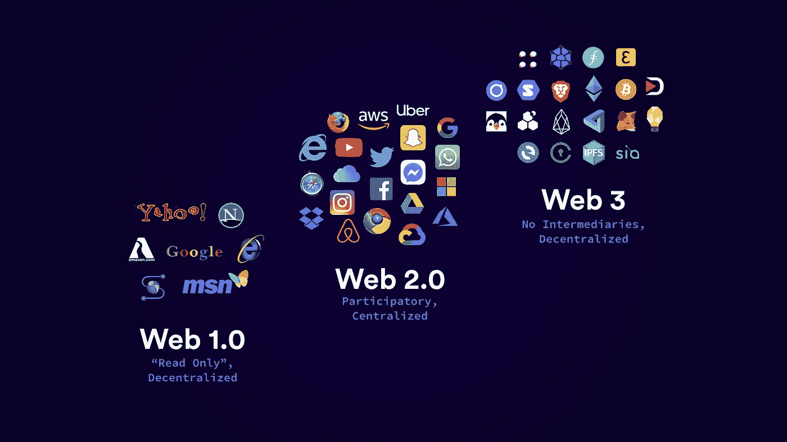

# 作为科学互联网的 Web3

> 原文：<https://medium.com/nerd-for-tech/web3-as-the-internet-of-science-c575b3d40d3c?source=collection_archive---------2----------------------->

## Web3 应该是一个科学的互联网，而不是一个中断营销的互联网

数学给予有抱负的人和专家从一个领域到另一个领域双向导航的能力。对我来说，从金融世界研究跳到社会世界研究是一个自然的过渡，因为构建这两个领域的基础理论几乎是相同的，就好像有一个数学基本定律支配着每一种科学，甚至每一种生物和自然生态系统。但是我看到的是不同的尺度，确切地说是两个尺度，家庭尺度和社区或国家尺度，这种行为在人口统计学上没有意义，它只受经济利益的驱动，而忽略了所有其他的社会因素。

这种不好的行为是，我们通过忽视更多的公民、员工或家庭成员来削减多余的“脂肪”，而在这之后，我们作为一个社会、公司或家庭，使用机器让我们用更少的资源做更多的事情，从而丰富了我们自己。对国家来说，首先是试图消除移民，然后是不太合格的公民；对家庭来说，首先是不考虑不太富裕的家庭成员的声音和意见。作为一名来自欧洲发达国家的移民，我自己就经历过这种乡村效应，现在我正经历着第二种效应，在自己的家庭中，我的分量越来越轻。但我确实相信，对于那些通过为他人生产有用的东西来寻求对我们广阔而多样化的社会有用的人来说，权力从来不会减少，就我而言，就是利用我的技术知识和商业思维。

我们的社会正在发生变化，但我们正在做出越来越多的错误决定，这些决定只应得到强大的实体，因为像你我这样的科学家和真正的宗教人士的声音和研究已经被机会主义的政客和营销人员破坏了，他们从互联网革命带来的开放的媒体化世界中获利，并因社交媒体技术而加剧。

当然，互联网革命和社交媒体平台的诞生帮助像我这样的人与其他伟大的人和任何种类的知识联系起来，但对于社会最重要的一部分来说，这场革命已经成为进入科学的障碍和分散注意力、中断和非生产性和非视觉性辩论的真正工具，以及“错误概念”的趋势，称为嗡嗡声。我们不再看到人们对 buzz 感兴趣，甚至对扩散科学和流行病学一无所知。

如果我进入了人口科学，并把我的兴趣集中在人口数学上，我就不是在一个未知的空间，因为我很长时间都是独自一人，我实际上真的很愿意与他人联系，并感受到属于比我更大的东西的感觉。当我说比我大的东西时，我不是在谈论宗教，因为如果是关于宗教，我已经感觉属于比我大的东西。但是宗教是给信徒的，我愿意对每个人都有用，不仅仅是信徒。

科学互联网有机会远离娱乐互联网、广告和社交平台，这些平台是由没有目标和意图的人和越来越没有教育价值的内容连接起来驱动的。维基百科是这个科学和区块链互联网的一个很好的起点，分散自治组织(DAO)技术可以让每个互联网用户更有收获。我真的在寻求使用这个科学网络，因为我是一个正在寻找正确方向的人，到目前为止，科学已经被证明是最有洞察力的指南针，可以告诉我最好的方向。如果你能建立这个科学的互联网，请去做吧。对我来说，我在努力，但是我们在一起有更多的机会。

我为科学互联网运动。你知道吗？