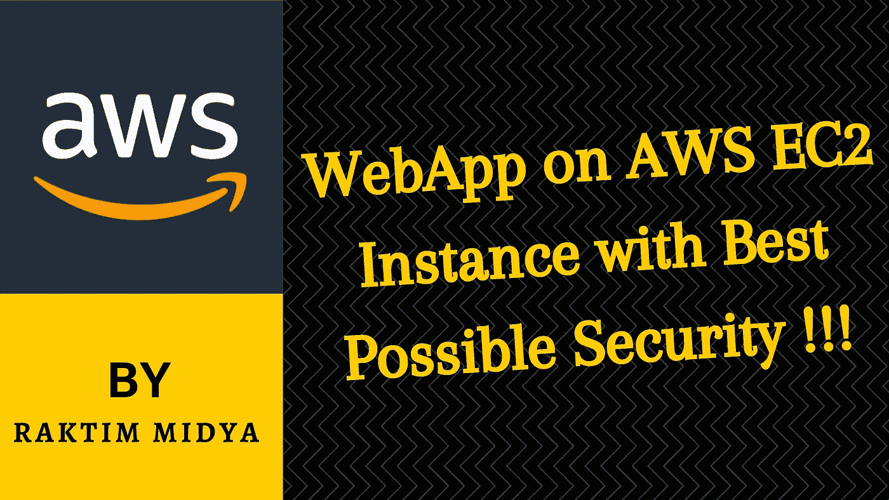
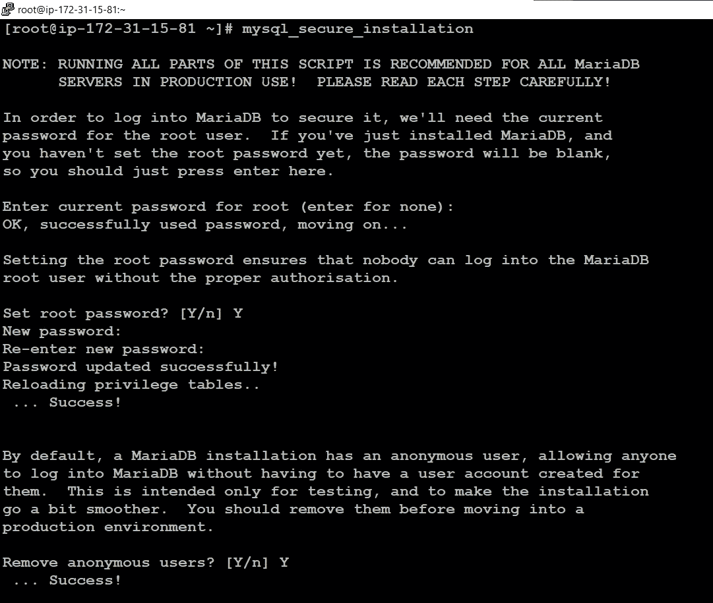
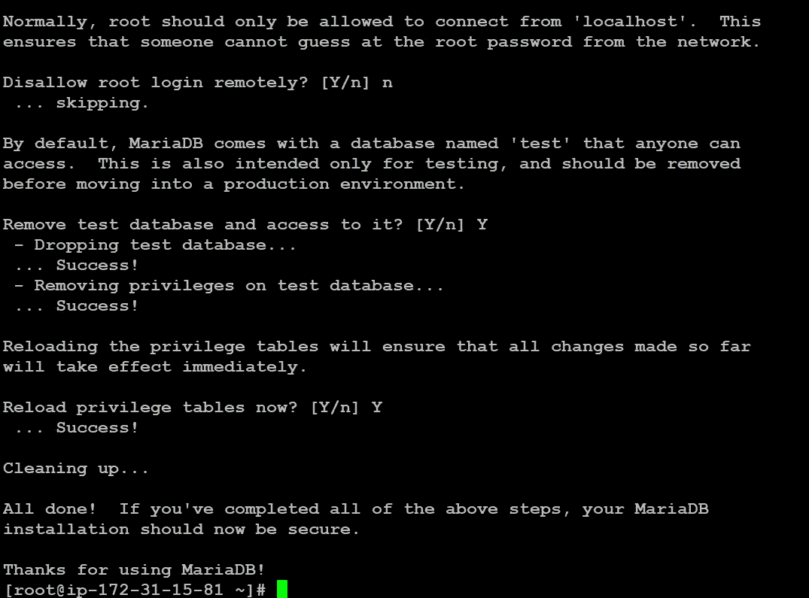
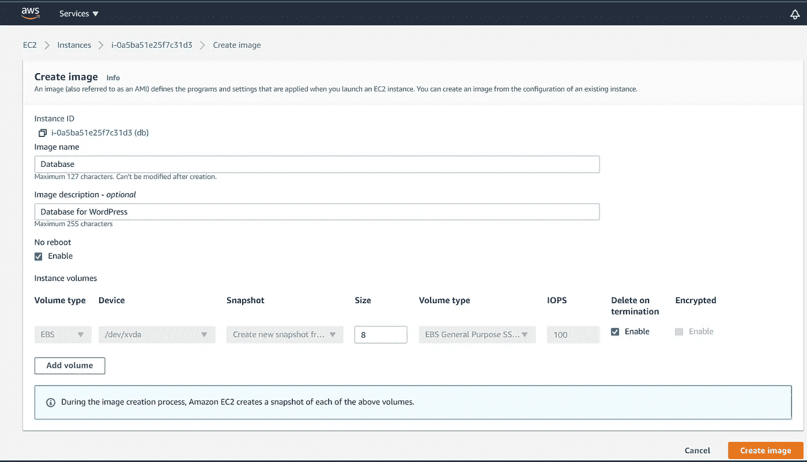
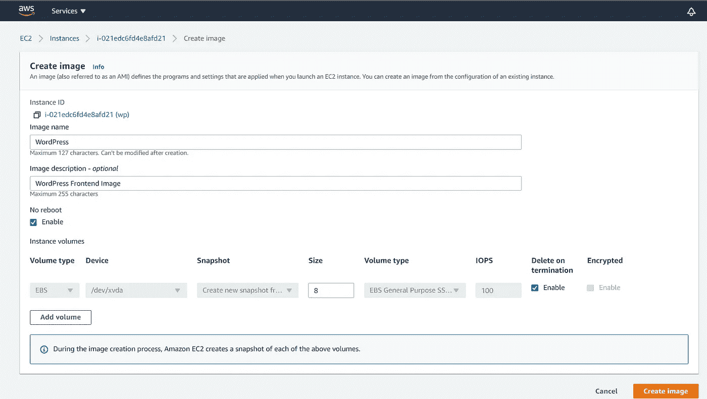
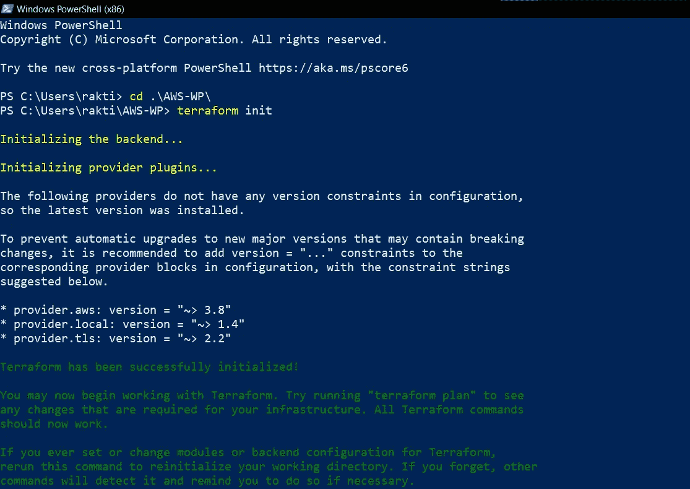
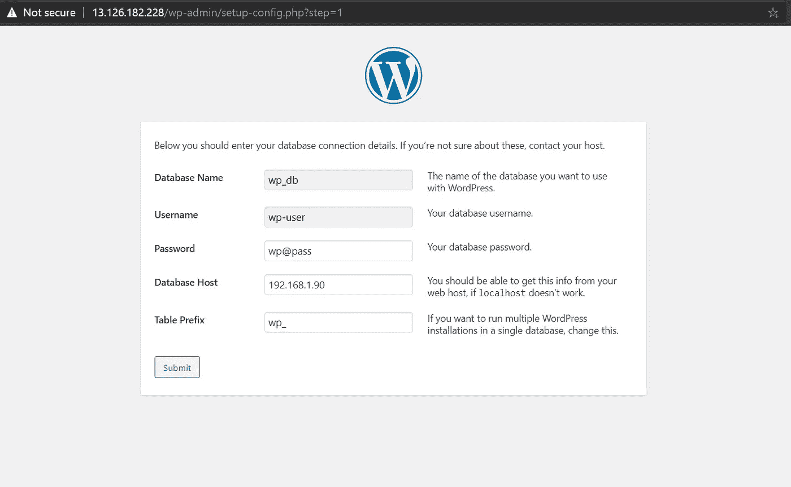
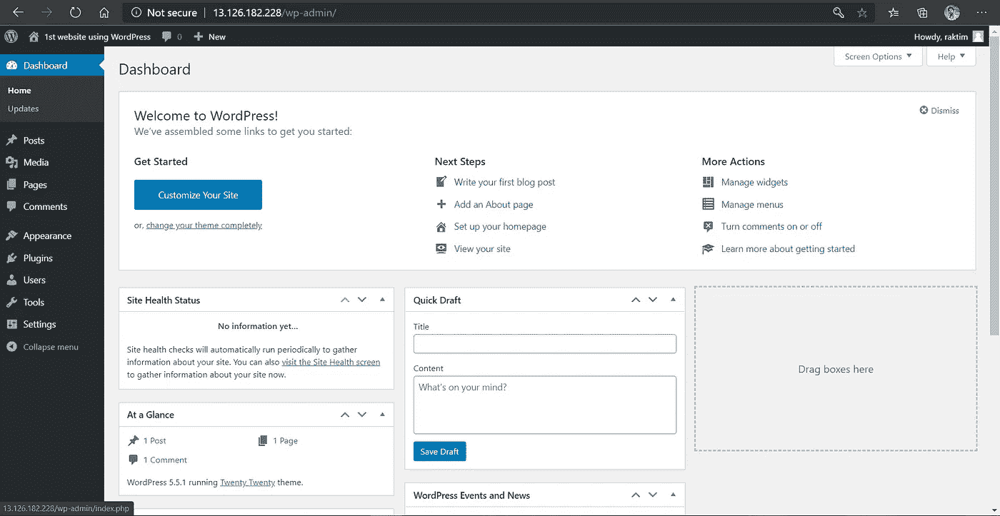

# AWS EC2 实例上的 WebApp 具有最佳的安全性！！！

> 原文：<https://medium.com/nerd-for-tech/webapp-on-aws-ec2-instance-with-best-possible-security-9184d5d44981?source=collection_archive---------2----------------------->



由 Raktim 创建

这篇文章将帮助你理解我们如何保护运行在两个完全不同的子网上的两个不同的 AWS EC2 实例上的前端 Web 应用程序(例如:WordPress)和后端数据库服务器(例如:MariaDB)。

> 注意:在本文**中，我演示了如何构建 Amazon 机器映像(AMI ),还展示了如何使用 Terraform Automation 脚本在 AWS 上实现 VPC、子网、互联网网关、路由表、安全组、EC2 实例、密钥对等等。**
> 
> 不久我也将发表同样实用但更先进的文章，所以如果你学习了这篇文章，你也会喜欢我的下一篇博客。让我们跳进来…

# 云安全和服务模式:

**据我所知，云的最大特点是安全和快速。**

但是在云中，我们主要有 3 种服务模式，基于此，安全性也会发生变化。让我们了解这些模型，它们将帮助我们了解“**虽然云是安全的，但我们为什么需要构建自己的安全规划**”。


来源:谷歌

*   **IAAS 或基础设施即服务**模式允许我们在云上提供任何我们想要的资源。**在这种模式中，我们对我们的资源拥有完全的控制权**，在这里，云提供商只负责我们的资源。
    现在我们正在 AWS 不关心的那些资源上做什么。因此，**这里我们需要在那些资源上实现我们自己的安全性。**
    **例如:EC2、VPC 等。**
*   **PAAS 或平台即服务**为我们提供由云提供商管理的资源。在这里，我们不能完全控制我们的资源，因为这些是托管服务。
    这里我们的职责是在这些预先配置好的服务之上部署我们的应用程序。因此，**这里的安全性主要由 AWS 控制，**但我们也需要注意一些事情，如安全登录、密钥或密码、API 端点等。
    **例如:EKS、RDS 等。**
*   **SAAS 或软件即服务**为我们提供直接使用的软件。**这里云提供商不给我们直接资源**。他们提供给我们的不是资源，而是运行在这些资源之上的软件。
    因此，**这里的完全安全性由云提供商管理。你唯一的职责就是登录使用这个软件。
    **例如:MS365，Google Docs 等。****

由于我在这里使用 IAAS 来运行我们的应用程序，我们必须自己为我们的应用程序实现安全性。

# 让我们看看问题陈述:

陈述:我们必须为我们的公司创建一个尽可能安全的门户网站。因此，我们使用带有专用数据库服务器的 WordPress 软件。
出于安全考虑，外部世界不应访问该数据库。
我们只需要向客户公开 WordPress。
以下是正确理解的步骤！

步骤:
1)使用 Terraform 编写一个基础设施代码，它会自动创建一个 VPC。在 VPC 中，我们必须创建 2 个子网:
3) a)公共子网【公共世界可以访问！]
4) b)私有子网【仅限公共世界！]
3)创建一个面向公众的互联网网关，将我们的 VPC/网络连接到互联网世界，并将此网关连接到我们的 VPC。
4)为 Internet gateway 创建一个路由表，以便实例可以连接到外部世界，更新并将其与公共子网相关联。5)启动一个 ec2 实例，它的 WordPress 设置已经有了允许端口 80 的安全组，这样我们的客户端就可以连接到我们的 WordPress 站点。
6)还将密钥附加到实例，以便进一步登录。
6)启动一个 ec2 实例，该实例已经设置了 MySQL，安全组允许私有子网中的端口 3306，这样我们的 WordPress VM 就可以连接到相同的端口。
7)同样附上钥匙。
注意:WordPress 实例必须是公共子网的一部分，这样我们的客户才能连接我们的站点。
MySQL 实例必须是私有子网的一部分，这样外界就无法连接到它。
不要忘记添加要启用的自动 IP 分配和自动 DNS 名称分配选项。

# 不要担心…

**我知道问题陈述看起来有点大，但一旦我们一步一步地开始，实施和理解就会变得非常容易。**此外，执行此任务的**先决条件**很少。

*   首先，你需要**一个活跃的 AWS 账户**，并且在你的本地系统**中应该安装 Terraform 软件**。理解这项任务需要 AWS 和 Terraform 的基本知识。
*   但是不要担心，如果你对这些事情没有想法，因为几天前我写了一篇博客介绍这些基础知识，如果你想你可以从那里学习，查看下面的参考资料。

[](/faun/getting-started-with-aws-terraform-293e9125dff) [## AWS & Terraform 入门。

### 如何入门使用 Terraform 在 AWS 中构建基础设施？

medium.com](/faun/getting-started-with-aws-terraform-293e9125dff) 

# 让我们开始吧…

我希望你知道地形的基本知识。通常，**我会一个接一个地挑选每个资源，并展示如何使用 Terraform** 来实现它，最后我们会合并整个代码，通过运行一个 CMD，我们的完整基础设施就创建好了。

## AWS 密钥对:

*   在上面提到的代码中，我使用了一个**资源“tls_private_key ”,它将创建一个私钥**,并使用它在本地磁盘上创建一个文件以供将来参考。
*   另外，我创建了一个名为“WP key”的 **AWS 密钥对。**我们将把这个密钥对附加到我们的实例上，以便将来登录。****

## VPC 和子网:

*   接下来使用这个脚本，我首先创建了一个 VPC，您可以注意到**我分配的 IP 范围是“192 . 168 . 0 . 0/16”**。同样有问题的是，它被要求启用 DNS 名称分配选项。这就是为什么 VPC 代码中的这两个 DNS 选项是正确的。
*   接下来，我将创建一个公共子网，这里的 **IP 范围是“192.168.0.0/24”。**如果你注意到这里的一件事**，我正在创建的公共子网位于“AP-south-1a”AZ，因为该子网与 AZ** 相关联，而 **VPC 与一个地区**相关联。
    现在，正如在开始时我已经告诉我的地区是“ap-south-1 ”,所以这个 VPC 将在那里创建。因此，如果您想在其他地区提供资源，就必须提到那个特定的 AZ。
*   最后，我创建了一个私有子网和**，因为这是一个私有子网，所以“map_public_ip_on_launch”选项为假。**还有一件事，在文章的开始，我说过 WordPress 和 MariaDB 将在不同的子网中运行，这就是为什么 AZ 在公共和私有子网中是不同的。

## 互联网网关和路由表:

*   在这里，我创建了一个 I**internet Gateway，它将帮助互联网流量进入我的 EC2 实例，我的 WordPress Web 应用程序正在该实例中运行。**将来，如果我需要对我的实例使用 SSH，这个互联网网关将帮助我使用 SSH。在互联网网关这里，我们需要提到它将在哪个 VPC 工作。
*   接下来，我创建了一个非常简单的路由表，它允许所有流量进出。同样**在路由表中，我们需要提及我们希望使用哪个互联网网关来执行这些路由规则**。
*   最后，我将我的公共子网与该路由表相关联，这样我的公共子网就可以拥有外部连接。

## 安全组:

*   在这里，我创建了两个安全组。第一个**是 WordPress 实例，我允许在 80 号端口上的入站流量，因为 WordPress 工作在 httpd webserver 之上，而 httpd server 工作在 80 号端口**。在出口，我允许一切，因为有时我们需要通过互联网从官方网站安装更新。
*   这里最有趣的事情是，如果你注意到在我的 WordPress 实例中，没有一个可以进行 SSH 登录，因为 ingress 只允许 Http 端口 80。这意味着没有人可以进行远程访问。在这里，你可能会问，如果你不登录，你将如何设置 WordPress。**正如我之前所说，这是最安全的架构，所以不用登录我们也可以实现很多事情。**
*   接下来，**我为 MySQL 数据库创建了一个安全组(MariaDB ),其中我只允许从我的 WordPress 流出，并且只允许在端口 3306 上，因为 MySQL 服务器在这个端口上工作。**需要记住一件小事，**安全组与 vpc** 相关联，因此如果您忘记提到 vpc，它将选择 AWS 提供的默认 vpc。
*   这里还要看一下安全架构。首先，因为数据库位于私有子网中，所以数据库实例没有任何公共 IP。接下来**在 VPC 内部只有 WordPress 实例可以联系到数据库**作为防火墙只允许那些属于 WordPress 安全组的实例。最后，**只有在 3306 端口上，才允许进入**。最后**数据库没有出口连接**，因为我不想让它到达外界。

# MySQL 的 AMI:

我在 AWS 上手动做这件事。如果您再次阅读该问题，您会注意到它要求启动一个实例，而我的服务器已经设置好了。现在有很多方法来创建 AMI，但是我使用最简单和更手动的方法。那么，让我们走一遍程序…

## 启动一个实例:

首先启动一个 Amazon Linux 2 实例，并在其中进行 SSH 登录来设置服务器。我正在显示登录到实例后您需要执行的事情。
只需注意一点，8 GB 存储的 t2.micro 实例足以完成这项工作。

## 软件安装:

接下来，依次运行下面提到的命令，这将帮助您安装和启动服务器。

```
sudo su - root
yum update -y
amazon-linux-extras install -y lamp-mariadb10.2-php7.2 php7.2
yum install -y mariadb-server
systemctl start mariadb
systemctl enable mariadb
```

## 设置 MySQL:

接下来，**我们需要在 MySQL** 中设置 root 密码。为此，MySQL 为我们提供了一个非常有趣的命令。运行该命令，只需回答 MySQL 会问的那些基本问题。命令是

```
mysql_secure_installation
```

作为参考，我提供下面的截图…



## 在 MySQL 上为 WordPress 创建用户:

接下来，我们需要**运行几个命令在 MySQL 数据库**上创建一个用户，我们将把它传递给 WordPress，这样 WordPress 就可以开始在数据库中存储数据。这些命令如下所述…

```
mysql -u root -pCREATE USER ‘wp-user’@’%’ IDENTIFIED BY ‘wp@pass’;
CREATE DATABASE wp_db;
GRANT ALL PRIVILEGES ON wp_db.* TO ‘wp-user’@’%’;
FLUSH PRIVILEGES;exit
```

所以，我们已经成功地在 MySQL 数据库上为 WordPress 创建了一个用户。
如果你注意到了，你会发现**我们创建的用户名叫做“wp-user ”,我们设置的密码是“wp@pass”。我们为 WordPress 创建的数据库叫做“wp_db”。**

## AMI 的创建:

最后，我们完成了整个设置。现在我们只需要从这个实例中**创建 AMI。
进入你的 AWS 账户的 Web 控制台，**选择实例并点击“操作”按钮**，你会发现一个名为**“图像”的选项，点击它并创建一个图像**。请参考下面的截图…**



这将需要近 5 分钟来创建，同时让我们去 WordPress。

# WordPress 的 AMI:

与 MySQL 类似，这里也启动一个实例，进行 SSH 登录，然后按照下面提到的步骤操作。

## 软件安装:

运行下面提到的命令，这将有助于**安装运行 WordPress** 所需的软件。这也将启动 WordPress 的服务。

```
sudo su - root
yum update -y
amazon-linux-extras install -y lamp-mariadb10.2-php7.2 php7.2
yum install -y httpd php-gd
wget [https://wordpress.org/latest.tar.gz](https://wordpress.org/latest.tar.gz)
tar -xzf latest.tar.gz
cp -r wordpress/* /var/www/html/
chown -R apache /var/www
chgrp -R apache /var/www
systemctl start httpd
systemctl enable httpd
```

## AMI 的创建:

与 MySQL 类似，这里也从这个实例中创建 AMI，我们在其中配置了 WordPress。请参考下面提到的截图…



这意味着我们终于有了这两个 AMI，现在我们可以在我们的公共和私有子网上启动这两个实例，以获得可能的最佳安全性。

# 启动实例的最终地形代码:

最后，到目前为止，我们已经成功创建了 VPC、子网、互联网网关、路由表、安全组和两个 AMI。接下来，我们必须启动实例，为此，我使用下面提到的脚本。

*   如果您已经阅读了我提供的关于先决条件的文章，我想您已经知道如何使用 Terraform 在 AWS 上启动实例。
*   现在请注意一件有趣的事情:**我使用我自己的 AMI** 启动了这两个实例，并且我还在我创建的公共和私有子网上启动了这两个实例。
*   虽然在问题中它被要求附加密钥，只是为了将来参考，但是**如果我们想要更多的安全，我们可以删除这些密钥**。**但是总是建议使用 key 来启动实例。**

# 让我们部署:

最后，它完成了，我们准备在 AWS 云上部署完整的基础设施。**正如我们在 Terraform 上一直做的那样，只需在你有完整代码的文件夹上依次运行下面提到的两个命令**…

```
terraform initterraform apply --auto-approve
```

这里是 GitHub 的链接，你可以在这里找到完整的脚本。

[](https://github.com/raktim00/AWS-Secure-WordPress) [## raktim00/AWS-Secure-WordPress

### 在 GitHub 上创建一个帐户，为 raktim00/AWS-Secure-WordPress 的开发做出贡献。

github.com](https://github.com/raktim00/AWS-Secure-WordPress) 

**让我们看看运行这两个命令后的控制台输出…**



万岁…我们已经成功地在 AWS 上部署了我们的 Web 应用程序。现在是时候检查我们是否能访问 WordPress 了。

# 让我们来设置 WordPress:

*   进入 AWS 的 **Web 控制台，**收集 WordPress 实例**的公共 IP。另外，**收集数据库实例**的私有 IP。接下来，进入浏览器，输入 WordPress 实例的公共 IP。你会看到它运行完全正常。**
*   **选择语言然后点击**继续。在下一页，它会询问数据库的详细信息。我希望你已经知道这些细节。**这与我们在创建 AMI** 时设置的细节相同。**在数据库主机中提供数据库实例的私有 IP。**查看下面提到的截图以供参考…



*   **点击提交，然后点击“运行安装”。**然后只需设置用户名&密码和网站名称等基本信息。并点击“**安装 WordPress** ”。最后，使用您设置的相同凭证登录。

最后，您将看到下面提到的屏幕。**祝贺您…我们已经成功地在 AWS Cloud 上设置了最安全的 Web 应用程序。**



WordPress WebUI

# 最后的话:

*   这种实践未来有很多可能性，比如**我们可以使用 EFS 服务将我们的数据库数据存储在一个集中式系统中**，然后可以使用多个 EC2 实例来获得更好的性能。参考 EFS 检查我下面提到的文章…

[](/@raktim00/unlimited-shared-storage-between-aws-ec2-instances-using-aws-efs-2cc659351cfe) [## 使用 AWS EFS 在 AWS EC2 实例之间无限共享存储。

### 在本文中，您将了解如何使用 EC2 实例设置 Amazon 弹性文件存储并在其中存储数据…

medium.com](/@raktim00/unlimited-shared-storage-between-aws-ec2-instances-using-aws-efs-2cc659351cfe) 

*   此外，我们可以在许多 WordPress 实例之上启动一个负载平衡器，并将它们与同一个集中式数据库连接起来。我们能做的还有很多。最初，我说过我会以更先进的方式发表同样实用的文章。你可以在下面提到的文章中找到…

[](/@raktim00/secure-architecture-on-aws-hosting-wordpress-on-public-and-database-on-private-subnet-8d21ade6ab75) [## AWS 上的安全架构(在公共网上托管 WordPress，在私有网上托管数据库)

### 在这篇文章中，我将演示如何在公共网上部署 WordPress，在私有网上部署 MariaDB 来创建一个安全的…

medium.com](/@raktim00/secure-architecture-on-aws-hosting-wordpress-on-public-and-database-on-private-subnet-8d21ade6ab75) 

*   我试图让它尽可能简单。希望你从这里学到了一些东西。请随意查看我的 LinkedIn 个人资料，当然也可以随意发表评论。

[](https://www.linkedin.com/in/raktim00/) [## 微软学习学生大使(Alpha) -微软学习学生大使 CEE |…

### ★我是一名技术爱好者，致力于更好地理解不同热门技术领域背后的核心概念…

www.linkedin.com](https://www.linkedin.com/in/raktim00/) 

*   我写 DevOps，云计算，机器学习等等。博客，所以请随时关注我的媒体。最后，同样重要的是，如果你有任何疑问，可以在 LinkedIn 上联系我。

**感谢大家阅读。就这样…结束…😊**

