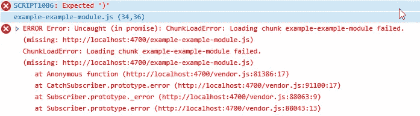
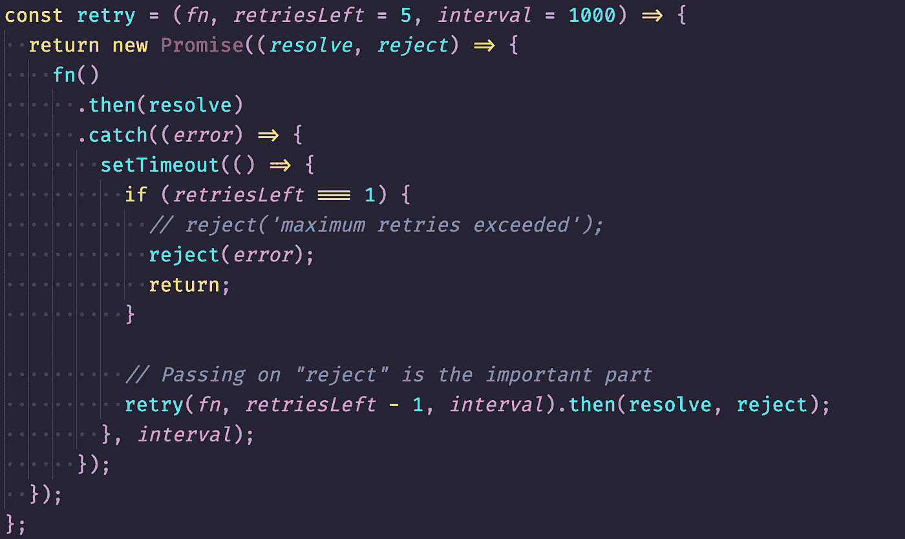

# Webpack + React 优化修复 ChunkLoadError

> 原文：<https://medium.com/nerd-for-tech/webpack-react-fix-optimised-chunkloaderror-2e411f298b4?source=collection_archive---------12----------------------->


马库斯·温克勒在 [Unsplash](https://unsplash.com?utm_source=medium&utm_medium=referral) 上的照片

如果您使用 react 进行延迟加载，很可能会遇到块加载问题，这通常是由网络中断引起的，会中断用户体验。

> 查看本系列的前一篇文章。
> [Webpack + React 从头优化](https://premeena.medium.com/webpack-react-optimised-from-scratch-da8f75024ba4?source=your_stories_page-------------------------------------)
> [Webpack + React 优化差分服务](https://premeena.medium.com/webpack-react-optimised-differential-serving-b53d4cf2a3da?source=your_stories_page-------------------------------------)



这个问题不容易重现，但会间歇性地出现。

我们能解决这个问题吗？

是的，我们可以解决这个问题。

为了解决这个问题，我们将尝试重新下载模块，如果我们在一段时间内再次遇到相同的问题，我们将重复这个过程一段时间。

让我们一步一步地解决这个问题:

1.  **我们将用 react-lazy 导入我们的组件。**

```
const Component = React.lazy(()=> import('./to/component'));
```

你已经这么做了，也遇到了同样的问题。为了解决这个问题，我们需要在这里做些改变。让我们继续前进。

**2。创建一个函数来重新下载我们失败的模块**

```
const retry = (fn, *retriesLeft = 5, interval=1000*) => {...}
```

在上面，我们写了一个函数，将重试下载失败的模块。

在上面的函数中，你可以看到三个参数

**fn:** 这是我们的导入回调函数 **()= > import('。/to/component’)**同 1 中所述。点。

**retriesLeft:** 它告诉我们可以尝试重新下载模块的调用次数。

**interval:** 过了多少时间我们要重新触发我们的调用重新下载包。

**3。现在我们将看到内部工作。**

```
const retry = (fn, *retriesLeft = 5, interval=1000*) => {
return new Promise((*resolve*, *reject*) => {fn() .then(resolve) .catch((*error*) => { setTimeout(() => { if (*retriesLeft* === 1) { *// reject('maximum retries exceeded');* reject(*error*); return; } *// Passing on "reject" is the important part* retry(*fn*, *retriesLeft* - 1, *interval*)
           .then(resolve, reject); }, *interval*); }); });
}
```



**4。让我们创建最后一个 lazyLoad 函数**

```
const lazyLoad = (*fn*) => React.lazy(() => retry(*fn, 4, 1500*));// or defaultconst lazyLoad = (*fn*) => React.lazy(() => retry(*fn*));export default lazyLoad;
```

我们将导出这个 lazyLoad，我们可以用它来代替 React.lazy，我们曾经在组件中导入过它。

**5。现在我们将在我们的项目**中使用这个函数

```
const Component = lazyLoad(()=> import('./to/component'));
```

**结论**

我们已经创建了一个函数，它将在给定的时间间隔内，按照我们想要的重试次数，尝试重新下载失败的模块。通过这种方式，我们可以提供更好的用户体验，而不用担心网络中断，并利用分块优势。

谢谢，快乐阅读❤️