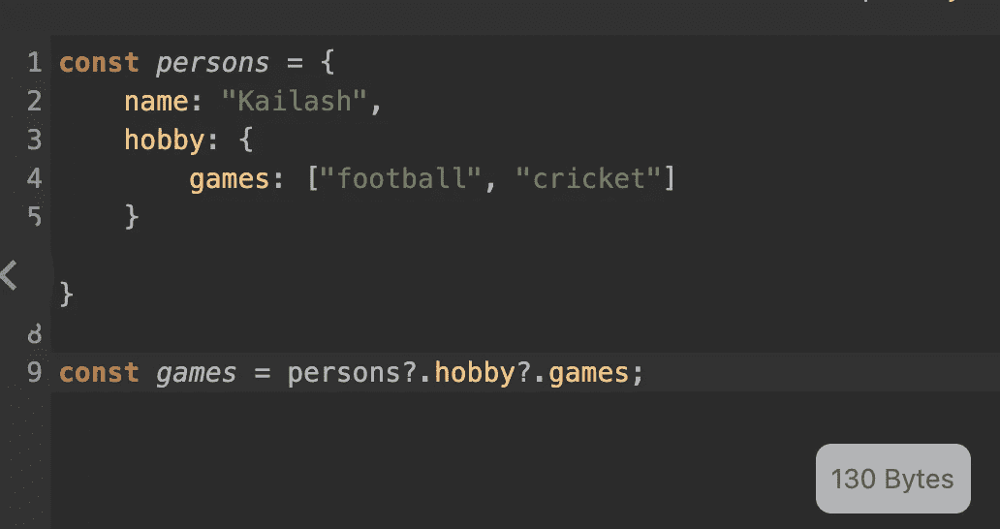
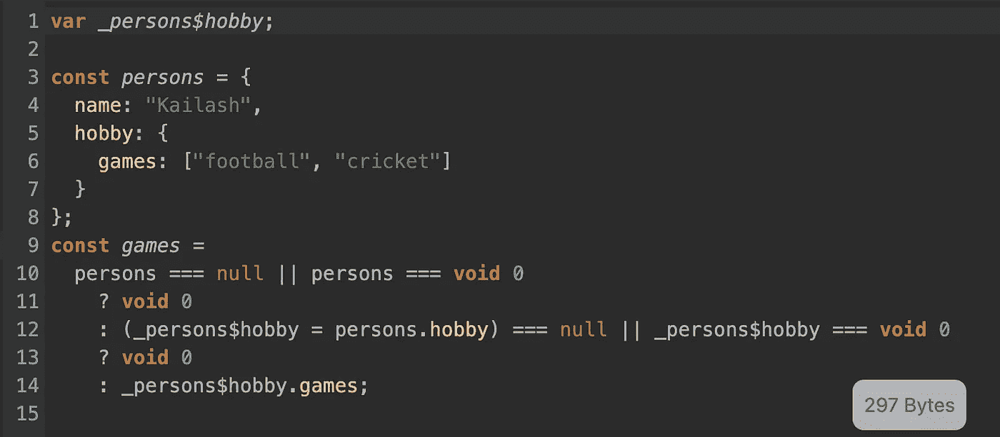

# Webpack + React 优化的差异化服务

> 原文：<https://medium.com/nerd-for-tech/webpack-react-optimised-differential-serving-b53d4cf2a3da?source=collection_archive---------8----------------------->


[乌尔维野生动物园](https://unsplash.com/@ulvisafar?utm_source=medium&utm_medium=referral)在 [Unsplash](https://unsplash.com?utm_source=medium&utm_medium=referral) 拍摄的照片

我们通常会创建一个可以支持各种浏览器的项目版本(当我说“种类”时，我指的是现代和传统的浏览器)。为了支持所有的浏览器，webpack 将我们的现代代码转换成遗留代码，相对来说，更多的代码意味着一个大的包，用户下载时间的增加，交互的延迟，糟糕的用户交互。

> 跟随 [Webpack + React 从头优化](https://premeena.medium.com/webpack-react-optimised-from-scratch-da8f75024ba4?source=your_stories_page-------------------------------------)更好地理解这个主题。

在这里，我们可以看到现代捆绑包和传统捆绑包大小的差异。



现代 javascript 代码 ES6+



传统编译的 JS

在这里，您可以非常清楚地看到非常小的代码行的大小差异。

正如我们所知，所有现代浏览器都支持现代 js，那么为什么我们仍然坚持传统的浏览器呢？

让我们利用现代浏览器提供的优势，创建一个比传统浏览器更小的版本。

你可能会问，遗留浏览器怎么办，因为它们不支持现代 JS 语法。

为了让它在任何地方都能工作，我们将使用一种叫做**差分加载**的技术。

**这是什么意思？**

这意味着我们将只为现代浏览器提供现代捆绑包，为传统浏览器提供传统捆绑包。

是的，你的想法非常正确，我们必须创建两个版本，一个用于现代浏览器，一个用于传统浏览器。

**这有什么帮助，浏览器如何知道使用哪个包？**

```
<!-- ES5 and below JS -->
  <script nomodule src="/bundle.legacy.js"></script>
<!-- ES6 and above JS -->
  <script type="module" src="/bundle.modern.js"></script>
```

`<script nomodule>`被旧的浏览器用来解析和执行您将提供的遗留包

`<script type="module">`被较新的浏览器用来解析和执行您将提供的遗留包

所以我们将让浏览器决定他们想使用哪个包。

**我觉得一切都很好，但是我如何用 webpack 实现它呢？**

正如我们已经讨论过的，我们必须创建两个包，这意味着我们还必须维护两个构建。为了创建不同的版本，我们需要不同的 webpack 配置。让我们创造它们。

通用 Webpack 配置

*webpack.common.js*

在上面的配置中，您已经看到我创建了两个不同的规则来支持两个不同的包。我们已经导出了设置 withes 和 legacy，我们将在我们的主***web pack . config . js***中使用此配置

你可能也看到了浏览器的介绍。**web pack+Babel**bundler 根据我们提供的浏览器列表创建我们的包，这些浏览器列表由 [Browserslist API](https://bit.ly/2Yjs58M) 管理

**让我们创建生产配置，以提供额外的设置。**

*webpack.prod.js*

在上面，您已经看到我们为不同的包创建了不同的输出配置。我们还使用了一个插件"[**web pack-module-no module-plugin**](https://www.npmjs.com/package/webpack-module-nomodule-plugin)"，因为[**html-web pack-plugin**](https://www.npmjs.com/package/html-webpack-plugin)**不支持多个构建，所以这让我们可以设置**

**`<script nomodule
<script type="module"`**

**动态地在我们**index.html**的意思是，我们什么都不用想。**

**这里我们已经做得差不多了，让我们来介绍一下主要的 webpack 配置，它将为我们的构建做准备。**

> **如果你对输出配置或任何东西感到困惑，那么你应该看看[**web pack+React optimized from scratch**](https://premeena.medium.com/webpack-react-optimised-from-scratch-da8f75024ba4?source=your_stories_page-------------------------------------)**文章。****

*****webpack.config.js*****

****我们已经完成了配置，让我们在 package.json 脚本标签中添加一个 build 标签。****

*****package.json*****

```
 **"scripts": { "build": "webpack --env production"
}**
```

****让我们运行我们的构建脚本****

```
**> npm run build**
```

****运行之后，你会看到有两个不同的版本，名字分别是*.modern.js 和*.legacy.js，你也可以检查 index.html，你会发现[**web pack-module-no module-plugin**](https://www.npmjs.com/package/webpack-module-nomodule-plugin)**填充了不同版本的用法。******

******用 **http-server 服务你的构建，看看在不同的浏览器上，你会发现浏览器提供的捆绑包是不同的。********

****如果你对捆绑大小如何受到影响感到好奇，你可以使用**[**web pack-bundle-analyzer**](https://www.npmjs.com/package/webpack-bundle-analyzer)**插件。********

******将此插件添加到 webpack.prod.js 的不同配置插件中，如******

```
****new BundleAnalyzerPlugin({analyzerPort: 8000,reportTitle: "Modern Bundle Analyzer"})----new BundleAnalyzerPlugin({analyzerPort: 8001,reportTitle: "Legacy Bundle Analyzer"})****
```

> ******注:如果您有更好的方法，请提出建议，或者指出您是否发现了任何漏洞。******

******谢了。快乐阅读。******