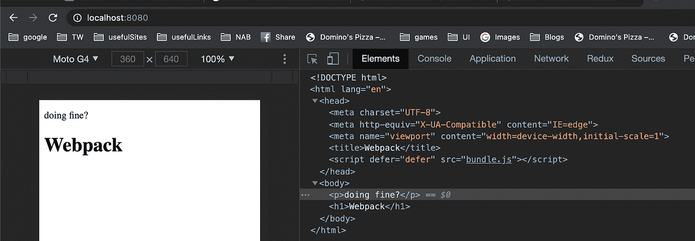
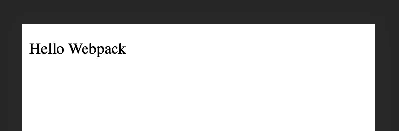
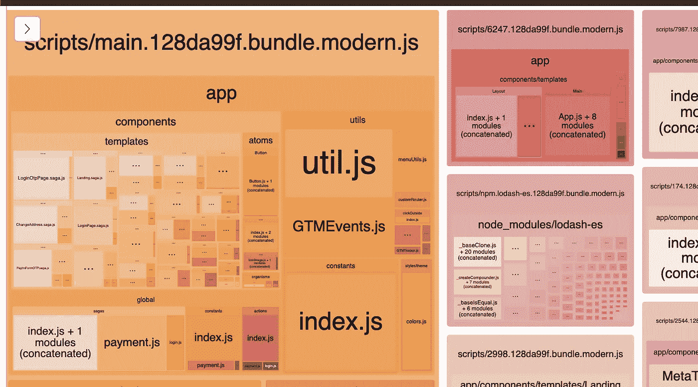

# Webpack + React 从头开始优化

> 原文：<https://medium.com/nerd-for-tech/webpack-react-optimised-from-scratch-da8f75024ba4?source=collection_archive---------4----------------------->


在 [Unsplash](https://unsplash.com?utm_source=medium&utm_medium=referral) 上[给](https://unsplash.com/@laurentmedia?utm_source=medium&utm_medium=referral)拍照

我们都爱 [Webpack](https://webpack.js.org/) 如果你没有，那意味着你还没有尝试过，或者你生活在一个不同的世界。另一方面，[反应过来](https://reactjs.org/)都是喜欢的。

在这篇文章中，我会非常精确地谈论这个话题，不会解释每一个细节。

当我们创建第一个基础项目或成熟的项目时，我们大多数人都经历过 **Create React App** (CRA)。但随着时间的推移，你会看到复杂性增加，我们希望我们的代码得到优化和健壮。虽然 CRA 在引擎盖下使用 Webpack，我们可以很容易地弹出它，并做一些自定义增强。

在本文中，我们将尝试涵盖这一部分。

> [Webpack + React 优化差分服务](https://premeena.medium.com/webpack-react-optimised-differential-serving-b53d4cf2a3da?source=your_stories_page-------------------------------------)

# 设置基本配置

首先，我们要用 npm 初始化我们的设置

【这里我们用的是**节点 v 14。** *和 **NPM 6。** * ]

让我们开始我们的项目设置

```
# here we are using npm feel free to use yarn 
# with -y we are getting all default value > npm init -y
```

**让我们安装设置应用程序所需的软件包**

```
# installing as dev depencies as we only require them for development mode > npm install webpack webpack-cli --save-dev
```

这就是我们的开发依赖树的样子

```
{
 "devDependencies": {
     "webpack": "^5.23.0",
     "webpack-cli": "^4.5.0"
 }
}
```

让我们向 package.json 添加一个脚本

```
"scripts": {
    "dev": "webpack --mode development"
  }
```

现在我们已经准备好了基本的设置，我迫不及待地想看它运行。

```
> npm run dev
```

**未找到主模块中的错误:错误:无法解决’。/src'**

## 发生了什么事？

我们看到这个错误是因为 webpack 正在根目录下的 src 文件夹中查找 JS 文件。但是我们还没有创造出任何东西。

让我们创建基本的文件夹结构。

```
> mkdir src
> echo 'console.log("Hey Webpack!")' > src/index.js
```

现在让我们再运行一次

```
> npm run dev
```

你会看到一个名为 **dist** 的🗂文件夹和一个名为 **main.js** 的文件被创建，

它基本上是你的应用程序的捆绑包。(src/index.js)

# 让我们调整我们的网络包

虽然我们已经创建了自己的包，但这还不够。我们希望从 webpack 得到更多，而 webpack 有能力做更多更好的事情。

让我们创建一个配置文件，它将告诉 webpack 精确地做事情。

```
> touch webpack.config.js
```

Webpack 是用 JavaScript 编写的，运行在 Node.js 这样的无头 JavaScript 环境之上。exports，这是 Node.js 的常见 JS 导出:

```
module.exports = {}
```

**添加入口点**

配置文件中的入口点让选择一个特定的文件作为入口点，而不是默认的。

```
module.exports = {
 entry: { index: path.resolve(__dirname, "src", "index.js") }
 // or
 entry: path.resolve(__dirname, "src", "index.js")

.
.
.
// other entities
}
```

**增加输出**

与入口点相同，我们可以指定 webpack 应该在哪里创建包，而不是选择默认

```
module.exports = {
// other entities
.
.
output : {
 path: path.resolve(__dirname, "dist"),
 filename: "bundle.js"}
.
.}
```

**添加现代 javascript 特性加载器**

**添加现代 javascript 特性加载器**

我们对自己的包很满意，但是如果我们想在现代 Js (ES6+)上工作，但不是所有的浏览器，甚至 node.js 环境都不支持所有的现代 Js，该怎么办呢？

如果我们可以在我们的项目中使用现代 Js，并创建一个可以在所有平台上运行的支持 Js 的包会怎么样？

**听起来不错！**

让我们为此添加一个加载程序。

```
> npm i @babel/core babel-loader @babel/preset-env --save-dev
```

[](https://www.valentinog.com/blog/preset-env/) [## babel preset-env、core-js 和 browserslistrc 如何协同工作

### 我们心爱的前端工具的配置是热熔岩。如今，CLI 工具如 create-react-app 或 Vue CLI 抽象出…

www.valentinog.com](https://www.valentinog.com/blog/preset-env/) 

让我们创建 **babel.config.json**

```
> touch babel.config.json
```

并为其添加一些配置

```
{
  "presets": [
    "[@babel/preset-env](http://twitter.com/babel/preset-env)"
  ]
}
```

让我们添加 babel-loader babel.config.json

```
module.exports = {
// other entities
.
.
.
module : {
 rules: [
   {
    test: /\.js$/,
    exclude: /node_modules/,
    use: ["babel-loader"]
   }
  ] 
}
.
.
.}
```

有了上面的设置，我们可以很好地进行任何现代 JS 项目，但这还不是很有用，因为我们渴望更多，让我们更深入地探索一下 webpack。

# 用 HTML 设置 webpack

默认情况下，Webpack 不知道如何处理 HTML，所以我们需要从其他来源获得一些帮助。

Webpack 支持插件，我们将使用[**html-web pack-plugin**](https://www.npmjs.com/package/html-webpack-plugin)

```
> npm i html-webpack-plugin --save-dev
```

让我们将这个插件包含在我们的网络包中

```
const HtmlWebpackPlugin = require('html-webpack-plugin');module.exports = {
.
.
  plugins: [
    new HtmlWebpackPlugin({
      template: path.resolve(__dirname, "public", "index.html")
    })
  ]
.
.
};
```

让我们用根目录下公共文件夹中的一些样板文件创建一个 index.html

```
<!-- public/index.html --><!DOCTYPE html>
<html lang="en">
<head>
  <meta charset="UTF-8">
  <meta http-equiv="X-UA-Compatible" content="IE=edge">
  <meta name="viewport" content="width=device-width, initial-scale=1.0">
  <title>Webpack</title>
</head>
<body>
  <p>doing fine?</p>
</body>
</html>
```

让我们改变 index.js

```
// src/index.jsconst h1 = document.createElement('h1');
h1.innerText = "Webpack";document.body.appendChild(h1);
```

现在如果我们跑

```
> npm run dev
```

您将看到一个捆绑包将被添加到我们的**index.html**

# 安装开发服务器

为了方便开发，我们需要一个开发服务器，可以直接提供我们的脚本文件

让我们安装开发服务器包

```
> npm i webpack-dev-server --save-dev
```

我们还需要对我们的 package.json 进行一些修改

```
// package.json"scripts": {
    "dev": "webpack --mode development",
    "start": "webpack serve --open 'chrome'",
  }
```

让我们看看它的工作

```
> npm start
```



哇，我们已经取得了这么多，但还没有作出反应。我们很快就会做，但首先，我们将为开发人员在他们的项目中设置一些基本要求。

# 设置 CSS

喜欢 HTML webpack 也不懂 CSS。为了让 webpack 理解并编译成 HTML，我们需要一些 CSS 加载器

```
> npm i css-loader style-loader --save-dev
```

css-loader::用于通过导入加载 css

style-loader::用于在 DOM 中加载样式表

```
//module.exports = {
  module: {
    rules: [
      {
        test: /\.css$/,
        use: ["style-loader", "css-loader"]
      }
    ]
  },
  //
};
```

这里加载程序的顺序很重要，否则构建将是无效的::[从右到左]

在上面的 css-loader 示例中，首先将导入编译成 css 样式，然后样式-loader 将所有样式部署到 HTML。

**添加 SASS 支持**

```
> npm i sass-loader sass --save-dev
```

安装后，我们需要更新我们的加载数组

```
//module.exports = {
  module: {
    rules: [
      {
        test: /\.css$/,
        use: ["style-loader", "css-loader", "sass-loader"]
      }
    ]
  },
  //
};
```

# 设置反应

为了从基础开始设置 react，我们还需要一个支持 jsx。为此，我们需要引入支持反应的巴别塔预设。

```
> npm i @babel/preset-react --save-dev
```

现在我们需要更新我们的 **babel.config.json**

```
// babel.config.json{
  "presets": ["[@babel/preset-env](http://twitter.com/babel/preset-env)", "[@babel/preset-react](http://twitter.com/babel/preset-react)"]
}
```

让我们安装必要的反应包

```
npm i react react-dom
```

对于 jsx，webpack 是不知道的，让我们改变我们的 webpack 来支持 jsx

```
module.exports = {module: {
    rules: [
      {
        test: /\.jsx?$/,
        use: ['babel-loader'],
        exclude: /node_modules/
      }
  .
  .]
 }
}
```

让我们更改 src 文件夹中的 index.js

```
// src/index.jsimport React from 'react';import ReactDOM from 'react-dom';ReactDOM.render(<p>Hello Webpack </p>,document.getElementById('root'));
```

添加一个 id 为 **root** [ *可以使用任何名称*的 div 元素

```
// public/index.html<!DOCTYPE *html*><html *lang*="en"><head><meta *charset*="UTF-8"><meta *http-equiv*="X-UA-Compatible" *content*="IE=edge"><meta *name*="viewport" *content*="width=device-width, initial-scale=1.0"><title>Webpack</title></head><body><div *id*="root"></div></body></html>
```

现在让我们运行我们的应用程序

```
> npm start
```



在浏览器上运行的 React 应用程序向 Webpack 问好

耶，我们完成了我们的反应设置。现在我们可以开始优化 react 项目了。

**谢谢，你花了这么多时间做了一件了不起的工作。👏🏼👏🏼**

**等等！什么？**

**就是这个？**

不，我只是在开玩笑，以上只是对 webpack 和 react 的基本设置，让我们开始调整我们的应用程序，以获得最佳结果。

(这里最好的不是最好的，我们总是有改进的余地。我是根据我目前的知识写这篇文章的。请随时纠正我，因为总有改进的机会。)

# 调整 Webpack


照片由[丹尼斯·莱昂](https://unsplash.com/@denisseleon?utm_source=medium&utm_medium=referral)在 [Unsplash](https://unsplash.com?utm_source=medium&utm_medium=referral) 上拍摄

## **添加环境变量**

对于浏览器来说，捆绑包不能访问任何环境变量，所以为了解决这个问题，我们添加了特定环境变量，通过这些变量我们可以控制外部构建及其性质

```
// wepack.config.jsonconst webpack = require('webpack').
.
.
plugins: [
 new webpack.EnvironmentPlugin(["ENV1", "ENV2"])
 // it will look for these environment variable in the working environment
]
.
.// or
.
.
.
plugins: [
 new webpack.DefinePlugin({
   PRODUCTION: JSON.stringify(true),
   VERSION: JSON.stringify('5fa3b9'),
   'typeof window': JSON.stringify('object'),
   'process.env.NODE_ENV': JSON.stringify(process.env.NODE_ENV),
});
]
```

## 仅解析某些文件

仅解析某些文件可以提高可读性，并且用 webpack 组织起来花费的时间也更少

```
// wepack.config.json.
.
resolve: {
    extensions: ['.js', '.jsx']
}
.
.
```

## 支持延迟加载/代码分割

如果我们只提供所需的文件，延迟加载和代码分割可以极大地减少包的大小，延迟加载和代码分割在提高性能方面帮了我们很多

```
// lazy load your react component with lazy// webpack.config.jsconst path = require('path');output: {
    chunkFilename: 'scripts/[name].[fullhash:8].bundle.js',
    filename: 'scripts/[name].[fullhash:8].bundle.js',
    path: path.resolve(__dirname, './dist'),
    publicPath: '/',
  }
```

**为什么选择 fullhash？**

浏览器倾向于缓存这些包，以防如果你提供一个新的包，它将使用旧的缓存文件，由于相同的名称，这可能会导致错误，为了保存，我们添加哈希，如果我们更新我们的代码库，它会改变，所以我们的最终用户将获得最新的功能，而不用担心任何事情。

## 优化构建

我不打算详细说明，但这里我们将我们的包分成多个包，这样我们可以单独下载它们，使我们的包变小，并按需需要包。更多详情请点击以下链接

[](https://webpack.js.org/configuration/optimization/) [## 优化| webpack

### 由于版本 4 webpack 根据所选的为您运行优化，所有优化仍然适用于…

webpack.js.org](https://webpack.js.org/configuration/optimization/) 

```
// webpack.config.jsoptimization: {
    runtimeChunk: 'single',
    splitChunks: {
      chunks: 'all',
      maxInitialRequests: Infinity,
      minSize: 0,
      cacheGroups: {
        vendor: {
          test: /[\\/]node_modules[\\/](!lodash)/, 
          // Here I don't want lodash to be included, you can remove                 (!lodash) to inclue it name(module) {

// get the name. E.g. node_modules/packageName/not/this/part.js
// or node_modules/packageName const packageName = module.context.match(/[\\/]node_modules[\\/](.*?)([\\/]|$)/)[1];// npm package names are URL-safe, but some servers don't like @ symbols
        return `npm.${packageName.replace('@', '')}`;
        },
      },
    },
  },
  }
```

## 一些重要的领导人

```
> npm i file-loader url-loader --save-dev
```

现在我们需要更新我们的规则

```
module: {
 rules: [
  {
        test: /\.(png|svg|jpg|jpeg|gif|ico)$/i,
        loader: 'file-loader',
          options: {
            name: '[name].[ext]',
            outputPath:"images/", // create images folder and push all images.
            publicPath: "../images/",
            esModule: false
          }
      },
      {
        test: /\.(woff)$/i,
        loader: 'file-loader',
          options: {
            name: '[name].[ext]',
            outputPath:"fonts/",
            publicPath: "fonts/",
            esModule: false 
// take non import files into consideration
          }
      }
 ]
}
```

## 一些额外的有用插件

[**压缩你所有的构建**](https://www.npmjs.com/package/compression-webpack-plugin)

```
> npm i compression-webpack-plugin --save-dev
```

[**Utf-8 支持**](https://www.npmjs.com/package/webpack-utf8-bom)

有时你会发现一些意想不到的错误，比如不能识别一些模式或测试

```
> npm i webpack-utf8-bom --save-dev
```

[**显示错误如同创建 React App**](https://www.npmjs.com/package/error-overlay-webpack-plugin)

```
npm i error-overlay-webpack-plugin --save-dev# add devtool
# devtool = 'cheap-module-source-map';
```

[**集束分析仪**](https://www.npmjs.com/package/webpack-bundle-analyzer)

当您想要减少捆包尺寸时，捆包处理非常方便，这将有助于您以最小的捆包占地面积高效地为您的申请人服务。

```
> npm i webpack-bundle-analyzer --save-dev
```



**用途:**

```
const CompressionPlugin = require('compression-webpack-plugin');
const BomPlugin = require('webpack-utf8-bom');
const ErrorOverlayPlugin = require('error-overlay-webpack-plugin');
const BundleAnalyzerPlugin = require('webpack-bundle-analyzer').BundleAnalyzerPlugin;// in plugins array addplugins: [ 
new CompressionPlugin(), 
new BomPlugin(true), 
new ErrorOverlayPlugin(),
new BundleAnalyzerPlugin({
    analyzerPort: 8001,
    reportTitle: "Bundle Analyzer"
  })
]
```

**自定义插件**

有时你需要配置或限制某些东西，但你找不到任何解决方案。在这种情况下，您可以创建自己的插件。

```
// this plugin will throw errow if environment variables are not present.
// and stop creating bad build// --[use]----- in webpack.config.js -----------plugins: [new EnvCheckerPlugin()]
```

唷！！这么大的文章。不是吗？

在这里，我们给它一个句号，但在下一篇文章中，我们将涵盖更多的主题，我们帮助我们的应用程序更加优化和性能。

敬请关注。

**注意:请建议更先进的技术，或者如果你认为我留下了一些漏洞，请指出这些问题。要了解更多细节，请访问他们的文档或将他们添加到评论中。**

> 查看本系列的另一篇文章 [Webpack + React 优化差分服务](https://premeena.medium.com/webpack-react-optimised-differential-serving-b53d4cf2a3da?source=your_stories_page-------------------------------------)

谢谢你的时间。