# 使用 Html 创建简单的网站

> 原文：<https://medium.com/nerd-for-tech/week-2-603471b21fe5?source=collection_archive---------18----------------------->

第一天，2021 年 2 月 15 日星期一

> **HTML-要点**

**HTML** 代表用于构建网页及其内容的超文本标记语言。内容可以是段落、项目列表、图像或一组数据表的形式。 **HTML** 元素由< >标签表示。这些标签指定文档元素，如标题、段落和表格。

— ***创建一个简单的 HTML 页面:***

1.  创建一个新文件。

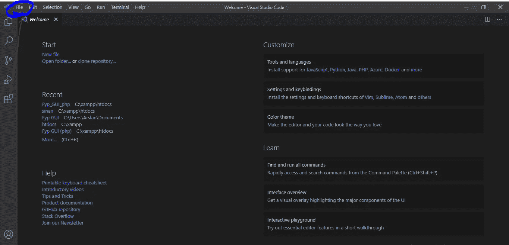

2.保存新文件(用。html 扩展)在任何你想要的地方。

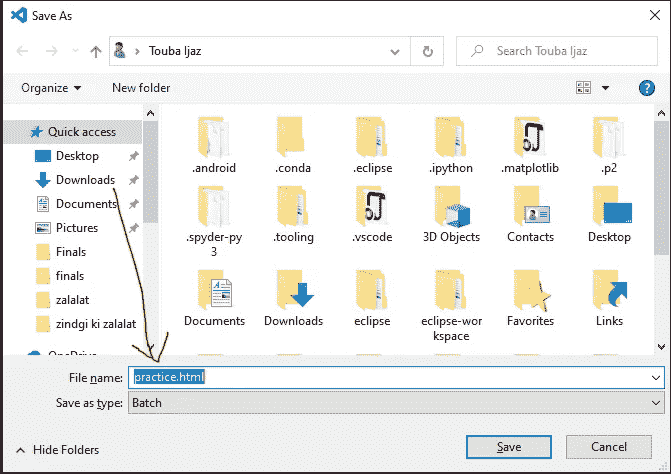

— ***创建标题、段落、列表项、锚点、图像、评论:***

1.  创建标题:HTML 中总共有 6 个标题。标题号越大，尺寸越大。用于创建标题的标签有、到。

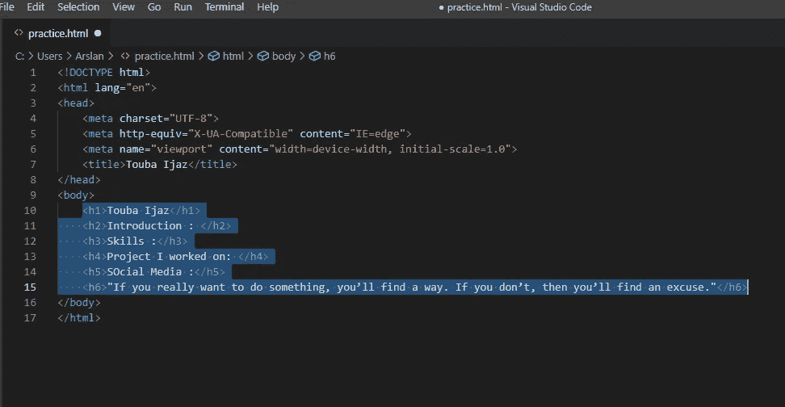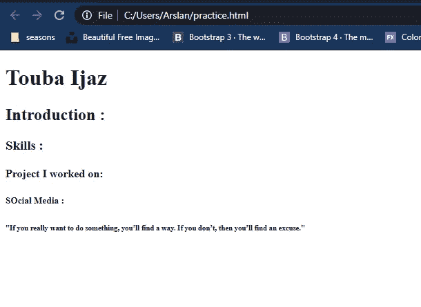

2.创建段落:用于段落的标签是

。它包含特定标题的内容。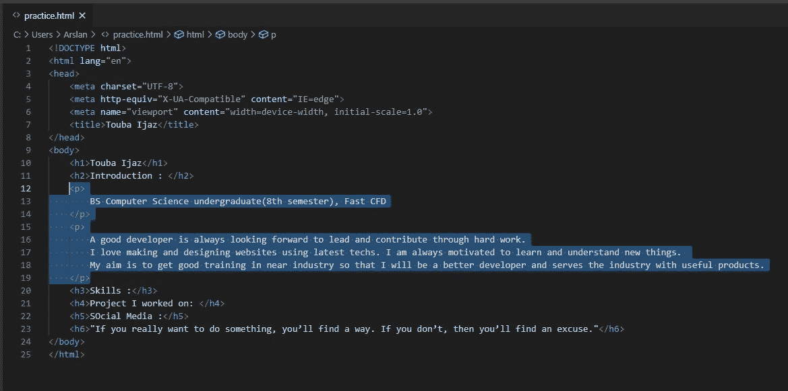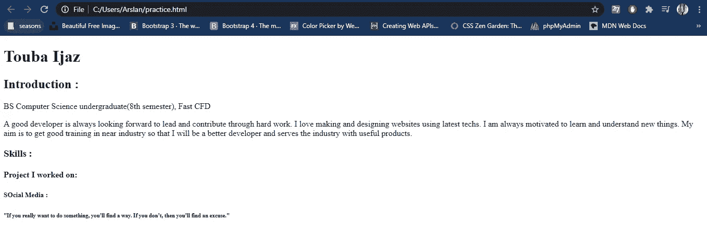

3.创建项目列表:有两种类型；有序列表和无序列表。用于有序列表的标签是

，而用于无序列表的标签是。在 ol 和 ul 标签中，有一个新标签代表列表项。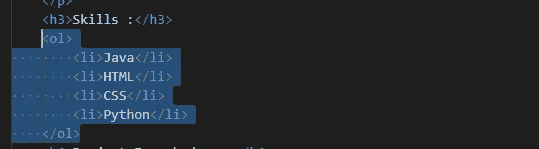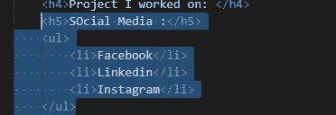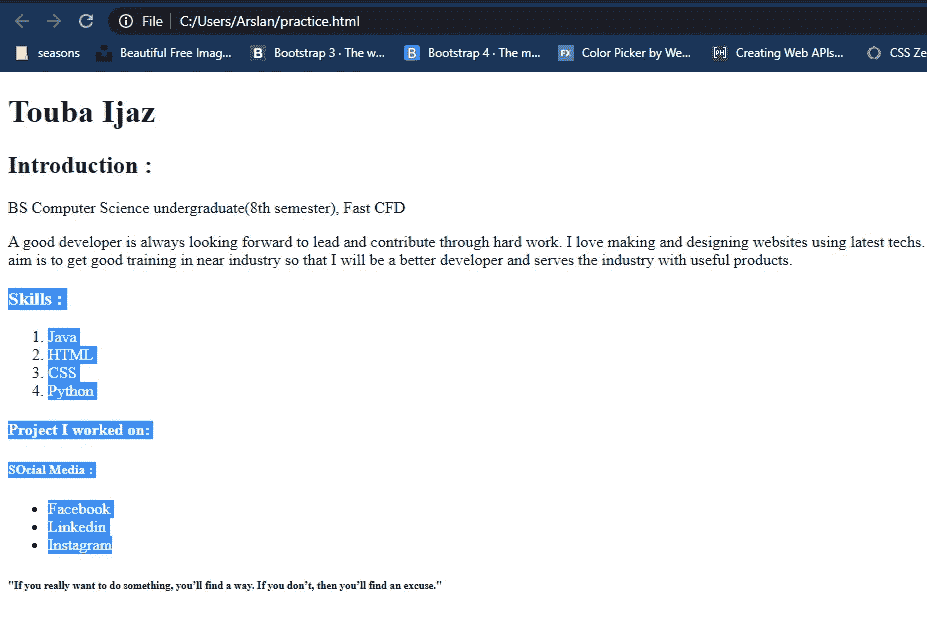

4.创建锚定标签:定义一个超链接，用于从一个页面链接到另一个页面。使用的标签是  。重要的属性是一个包含另一个页面地址的 href。

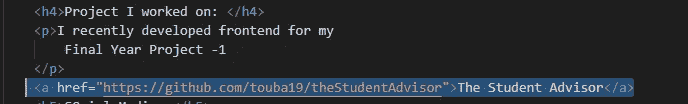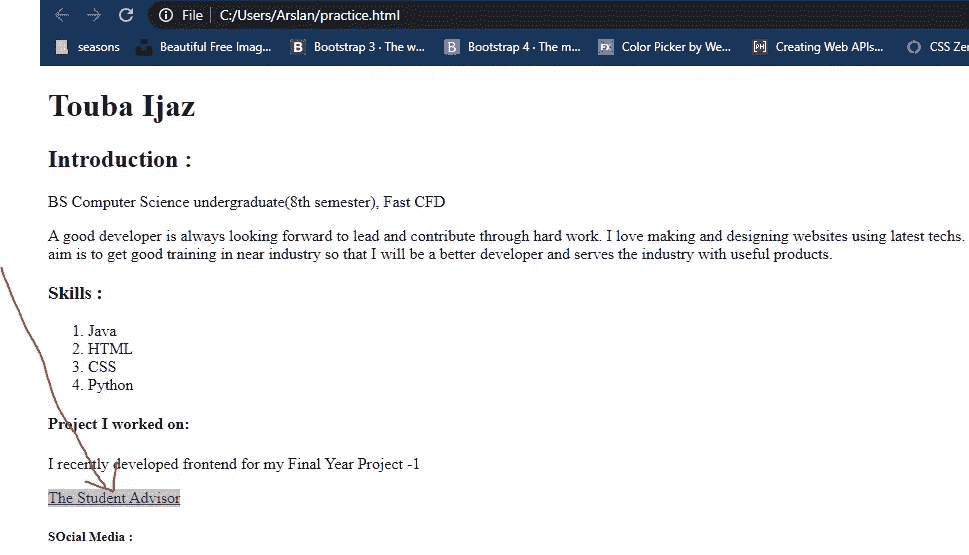

5.添加图像:没有任何结束标签。重要的属性是 **src** ，它包含图片在桌面上的 URL 或位置。

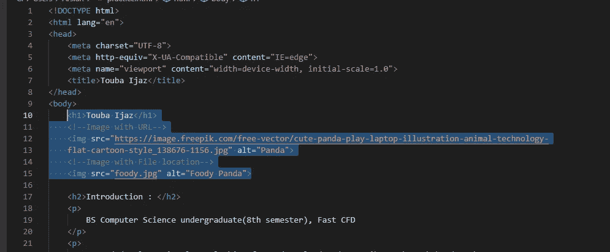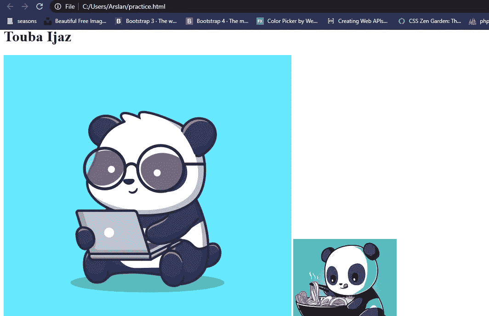

您可以使用

**Alter message** 对任何行进行注释: **alt** 属性显示了我们的图像没有加载时的 alter name，然后它显示了一条消息或其他内容。

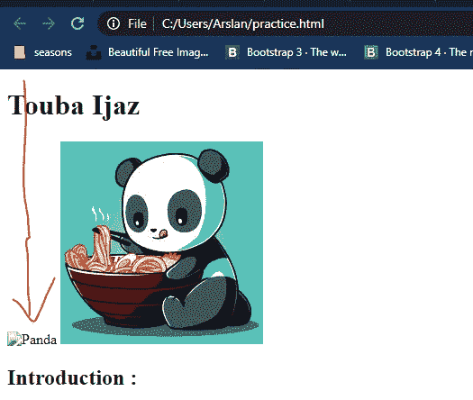

第二天，2021 年 2 月 16 日星期二

> **个人品牌**

亚马逊创始人杰夫·贝索斯有一句名言，“你的品牌就是当你不在房间里时人们对你的评价。”

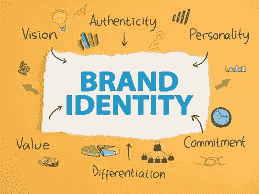

一个**个人品牌**是让你成为你自己的技能和经验的独特组合。这是你向世界展示自己的方式。有效的个人品牌会让你在竞争中脱颖而出，让你与潜在客户和雇主建立信任。

简而言之，如果你用谷歌搜索你的名字，会出现什么？

**为什么它很重要？**

无论你是雇员还是商人，发展你的个人品牌变得比以往任何时候都重要。一个原因是，招募专家在面试中使用社交媒体更为规范。

公司应该鼓励员工建立强大的个人品牌，因为这是好生意。当员工被允许代表公司参加会议或活动时，他们不仅发展了自己，也为公司提供了更多的曝光率。

**创建个人品牌的理由:**

1.  它帮助你脱颖而出。
2.  它会带来工作面试、实习、演讲、晋升等机会。
3.  激发观众的信任。
4.  总有人会在网上屏蔽你。

**发展个人品牌:**

发展个人品牌需要努力，而且不会一蹴而就。但是一旦做了，好处是无穷的。

1.  一个好的开始是清理你的社交媒体账户。你可以控制你的网上声誉，所以你不希望任何类型的负面影响你的存在。
2.  也可以创建个人网站；确保你提供的信息(技能、经验等)是经过认证的。人们需要具有良好品质的真理。你需要对你的观众诚实。
3.  接下来，定义谁是你的受众，并为他们设计一个内容策略。

第三天，2021 年 2 月 19 日星期五

> **HTML —中间**

*   Divs:div 是一个块级元素。它用于**将**或**部分**其他 HTML 标签分成有意义的组。它被用作其他 HTML 元素的容器。

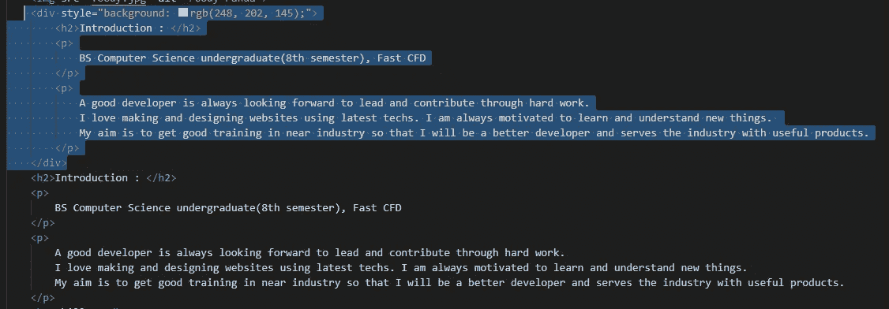

div 用作

## 和

标签的容器，用于创建基于 CSS 的布局

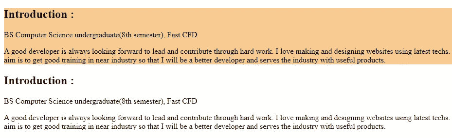

*   **Spans:**span 是一个行内元素。它用于包装文本、图像等的小部分。一般来说，您可以使用 span 来挂钩想要改变样式的文本或一组标签。

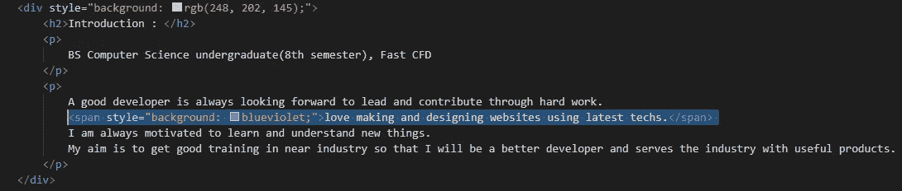

< **span** >元素用于样式化< p >标签内的特定文本。

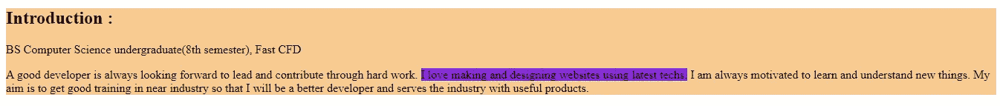

*   **Buttons:****HTML**<**button**>元素表示一个可点击的按钮，用于提交表单或文档中的任意位置，以获得可访问的标准按钮功能。我们可以使用 CSS 来设计按钮的样式。

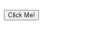

*   输入字段:`<input>`标签指定了一个用户可以输入数据的输入字段。输入标签的主要属性是输入使用的**类型**想要输入的内容。例如，文本类型、电子邮件类型、年龄类型、密码类型、搜索类型等等。输入标记没有结束标记。

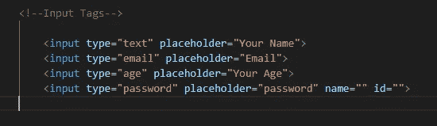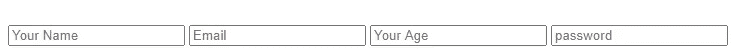

*   单选按钮:定义单选按钮。这是一个输入字段，其中这些按钮显示为组按钮。使用**名称**属性一次只能选择一个单选按钮。**用于**和 **id** 属性，用于将输入标签与其特定标签链接起来。

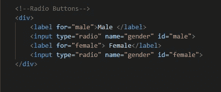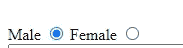

*   表单验证:现在我们将使用 HTML 的基础知识创建一个简单的验证(注册)页面。你可以通过以下链接观看视频。

 [## SimpleSignup.mp4

### 编辑描述

drive.google.com](https://drive.google.com/file/d/1DwUkf_V9Qr7lsx4xRE7mo3J5ufZTxidT/view?usp=sharing) 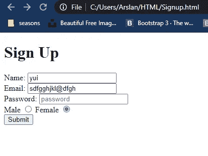

您可以从下面的链接下载代码，并自己尝试一下。

 [## touba 19/简单注册

### 在 GitHub 上创建一个帐户，为 touba19/SimpleSignup 开发做出贡献。

github.com](https://github.com/touba19/SimpleSignup) 

如果你有任何疑问，请告诉我。谢谢:)