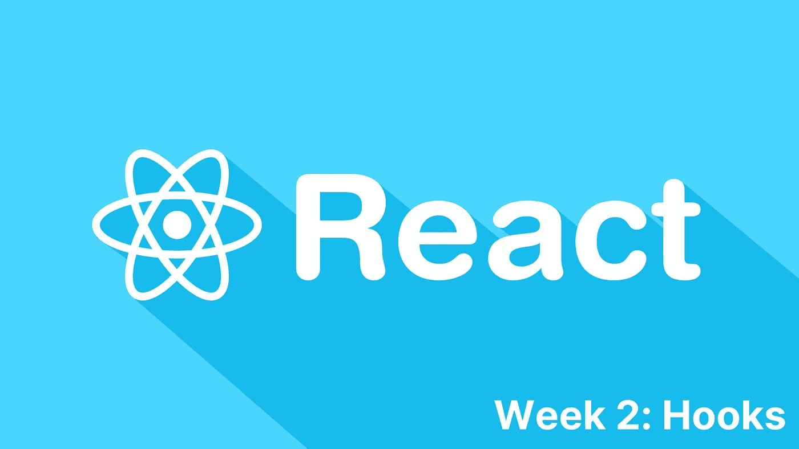

# 第二周:反应钩

> 原文：<https://medium.com/nerd-for-tech/week-two-react-hooks-b72068e0cf6c?source=collection_archive---------20----------------------->



这是我的 [react 学习系列](https://dhash.medium.com/my-weekly-react-learning-series-c94d129a6c21)的第三部分，在这里，我每周发布一篇关于 react 学习进展的文章，并分享有用的资源和材料，帮助我更好地理解概念并提高我的 javascript 技能。

按照我为自己制定的学习路线，钩子是下一个目标，我在本周介绍了基本的和必须知道的钩子，并将在接下来的几周介绍高级钩子和定制钩子。本文中涉及的挂钩是，

1.  使用状态
2.  使用效果
3.  使用上下文
4.  用户教育

为了理解 React 钩子，我们首先需要理解为什么在 React **V16.8.0** 中引入了偶数钩子，它们到底在解决什么问题？为了首先找到这些问题的答案，我们需要理解什么是 ***函数式编程*** 以及在过去几个月中它超越 OOP 的原因

# 函数式编程


信用:makememe.org

## 什么是函数式编程？

根据 FreeCodeCamp 的说法，函数式编程是一种编程风格，其中解决方案是简单的*隔离函数*，在函数范围之外没有任何副作用*。*

*   **独立函数:**这意味着不依赖于程序的状态，包括易受变化影响的全局变量，因此函数独立工作，只做程序员分配给它们的工作。
*   **简单纯函数:**相同的输入总是给出相同的输出。
*   **函数无副作用或副作用有限:**函数之外的整个程序状态的任何变化都受到控制，不会影响函数或其工作。
*   函数式编程有一个无状态的编程模型。

除了上面提到的(*是 react 钩子和函数组件*的主要构建模块)函数式编程的特性和好处之外，函数式编程范例还有很多优点，比如，代码更少，更少的错误，并发性，容易递归等等。

# 回到钩子上来…


图片来源:Pinterest

# 什么是钩子？

根据 react 官方文件，

挂钩是 React 16.8 版本中的新增功能，它允许你使用状态和其他 React 特性，比如生命周期方法，而无需编写类

React 中的功能组件只不过是一种将功能相互隔离的功能编程范例，以便它们可以执行自己的操作，而不受外界的任何干扰。

# 4 个最常用的挂钩。

## 1.使用状态()

*   **什么是 useState()钩子？**这是一个钩子，它允许你在功能组件中有状态变量，你把初始状态传递给这个函数，它返回一个带有当前状态值的变量，当屏幕重新呈现时，另一个函数更新这个值。
*   **我们传递什么给 useState()？【useState()的参数是一个初始状态，如果你需要的话，它可以是一个数字或者一个字符串。**
*   【useState 返回()什么？它返回两个值，当前状态和一个更新当前状态的函数，请看下面的例子。

```
const [foo, setFoo] = useState('bar') 
```

在上面提到的例子中，foo 最初被设置为字符串‘bar’，我们调用 set Foo(‘something’)函数，它将 Foo 的值从‘bar’设置为‘something’。

从钩子开始的时候，还有一点需要注意，钩子会导致组件的状态改变，从而重新呈现组件。

## 2.useEffect()

根据官方纪录片，效果挂钩让你在功能组件中执行副作用。简而言之，发生在正常组件评估和渲染循环之外的任务。

我们分别处理这些效果，以便这些副作用不会中断 react 组件的正常 UI 呈现。

```
useEffecct( () => {...}, []
```

useEffect 有两个参数，

1.  一个应该在每个组件评估之后执行的函数，是你的副作用代码所在的地方。
2.  第二个参数是一个数组，这就是所谓的依赖关系数组，第一个参数，即函数将只运行，如果提到的依赖关系被改变。

关于 useEffect 钩子需要注意的另一件重要事情是**清理函数，**无论你在 useEffect 中返回什么都是你的清理函数。

```
useEffect(() => {
    effect
    return () => {
        cleanup
    }
}, []) 
```

这个函数将在组件解除关联时执行，重要的是删除不必要的行为并防止内存泄漏。

## 3.useContext()

上下文提供了一种通过组件树传递数据的方式，而不必在每一层手动向下传递属性。是的，就是这个。

创建 useContext()挂钩的三个步骤，

*   **创建上下文:**const creating context = react . Create context(null)；
*   **用 provider** 包装并传递上下文值，即要向下传递的值。
*   **导出:**导出默认创建上下文

接下来，我们希望子组件访问数据，并将其作为“props”数据传递。添加的上下文数据可由子组件通过使用“useContext”关键字来访问。

## 4.useReducer()

哦天啊！这一部分花了我几天时间来完成，我可以自己实现它，但是，我会尽我所能，至少让理论部分对你来说更容易。

*   useReducer 是一个用于状态管理的钩子。
*   它是 useState 的替代方案，实际上，useState hook 是使用 useReducer 构建的。
*   它的工作与 javascript 的 reducer 数组函数密切相关。

为了更好地理解，我们来看一个例子。

```
const [count, dispatch] = useReducer(reducer, initialState)
```

1.  **计数，**为当前状态。
2.  **分派，**用来分派一个新的动作。这是一个一旦通过 reducer 函数调度动作就自动触发的函数，接收最新的状态快照，并返回新的和更新的状态。

很复杂，我同意！把它分解成简单的步骤，

*   useReducer 定义了一个初始状态。
*   提供一个包含更新状态的操作的函数。
*   触发调度相对于初始状态计算的更新状态。

useReducer 挂钩的理论部分的最后一点是，在这种情况下，当两者都用于状态管理和服务器完全相同的目的时，一个人应该使用 useState 和 useReducer。

根据 [css-tricks](https://css-tricks.com/getting-to-know-the-usereducer-react-hook/) ，“如果你的状态的一个元素依赖于你的状态的另一个元素的值，那么几乎总是使用 useReducer”

经验法则是使用 useReducerto 来处理复杂状态，尤其是初始状态基于其他元素状态的情况。

我希望这篇文章给了你 react 钩子的基础知识，并且从这里你可以查找一些沙盒例子并且有一个更好的理解。下面我附上一些我提到的所有钩子的文章的详细参考，在那里你可以看到更复杂的例子和对特定钩子的更深入的理解。

[1][https://blog . log rocket . com/a-guide-to-use state-in-react-ECB 9952 e 406 c/](https://blog.logrocket.com/a-guide-to-usestate-in-react-ecb9952e406c/)

[2][https://medium . com/swlh/react-hook-a-guide-to-learning-use effect-11687 e 777 aeb](/swlh/react-hook-a-guide-to-learning-useeffect-11687e777aeb)

[https://www.robinwieruch.de/react-usecontext-hook](https://www.robinwieruch.de/react-usecontext-hook)

[4][https://CSS-tricks . com/getting-to-know-the-user educer-react-hook/](https://css-tricks.com/getting-to-know-the-usereducer-react-hook/)