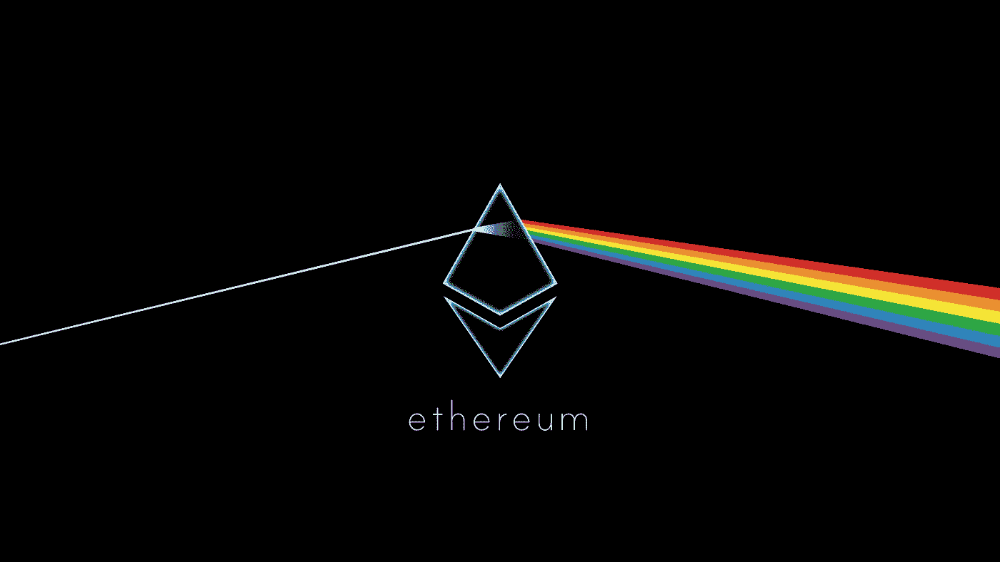
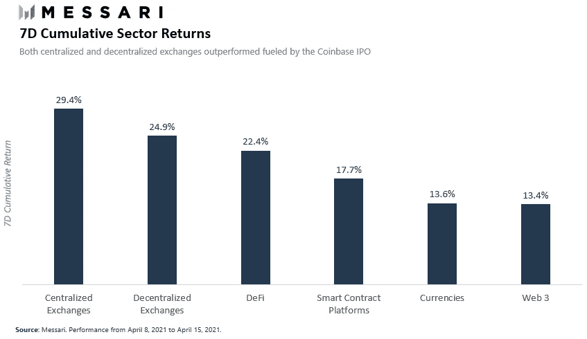
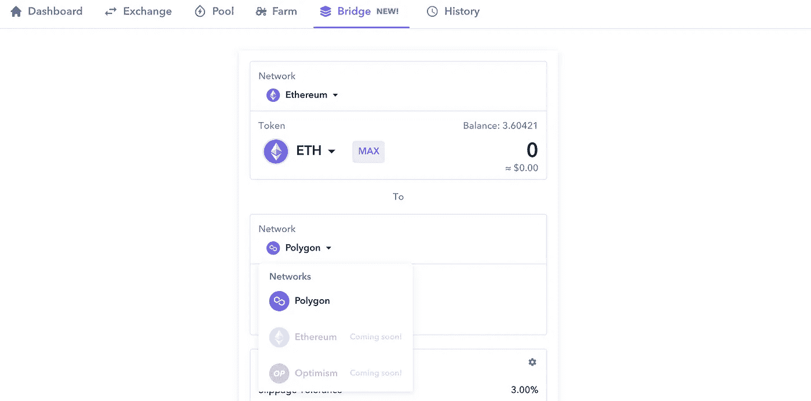
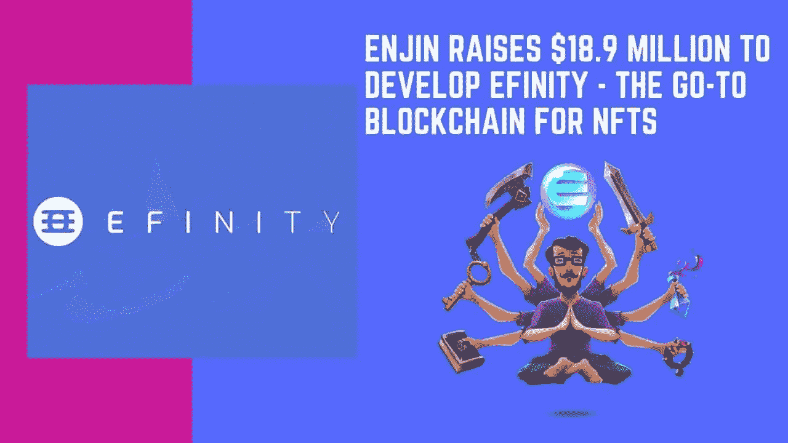
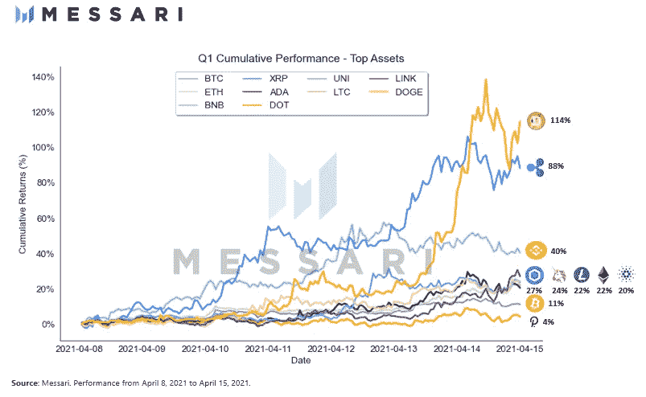

# 每周加密更新:4 月 12 日这一周

> 原文：<https://medium.com/nerd-for-tech/weekly-crypto-update-week-of-april-12th-f6356bb55e8e?source=collection_archive---------9----------------------->

## 本周最佳和最差项目

来源: [Reddit](https://www.reddit.com/r/ethereum/comments/67sds9/ethereum_background_wallpaper_image_in_hd/)

*免责声明:本文出于教育目的。希望人们发现这些更新有助于跟上这些天来 crypto 飞速发展的步伐。*

*这不是财务建议；你总是对硬币进行尽职调查吗:)*

过去的一周将永远被称为比特币基地周，在这一周，加密市场在比特币基地公开上市的预期中彻底破裂——无论是从主流媒体对该事件的报道，还是从普遍采用加密的积极情绪，还是从比特币基地新晋百万富翁将从他们的股权中套现并在加密货币中进一步重新定位的希望。

比特币和以太分别扯到新 ATHs，65K 和 25k 美元。我们还看到 Dogecoin 在 14 天的时间里从 6 美分飙升到近 40 美分——在加密社区引发了围绕硬币价值的大量争议。

当全城的话题都围绕着比特币基地和市场价格时，项目却在悄悄地建设——不受投机者和投资者的干扰。这些是我最感兴趣的项目。

进一步告别，这是本周的更新。

# 本周最佳项目

## 以太坊

以太坊平台有太多值得期待的地方。真的很喜欢。

是的，以太正以相对可持续的速度创下历史新高(与其他一些替代硬币相比)，但这应该是未来几个月内即将推出的高质量路线图的功能。

仅在本周，以太坊就设法:

*   即使在 ATH 价格上涨和交易量增加的情况下，也保持相对较低的天然气费用(见下图)——部分原因是 Flashbots 计划在构成以太坊网络 58% 的矿池中实施
*   运送柏林以太坊硬叉子，它在汽油费用上有许多改进。这是自 2020 年 1 月穆尔冰川以来最大的更新
*   宣布第 2 层解决方案 zkSync 将能够实现 20K TPS(每秒事务数)的网络吞吐量，与 Visa 等集中式网络的吞吐量相媲美
*   以太坊智能合约在 TVL 突破了 600 亿美元的门槛(总价值锁定)

由于在比特币基地上市，交易活动增加。资料来源:梅萨里研究

而这仅仅是这个星期。

以太坊的前景非常广阔——随着 ETH2 步入正轨，第 2 层解决方案将在 2021 年夏天投入生产，以及 EIP 1559 使以太成为通缩资产——仅这些方面的深入研究就足以证明一篇独立的、更长的文章是有道理的:)

## 多边形/自动

随着以太坊第二层地盘之争的升温，我对 Polygon / Matic 作为领先解决方案的印象越来越深刻。

就上下文而言，以太坊的主要抱怨是高昂的燃气费(与导致高昂费用的低网络吞吐量相呼应)。

像 Polygon(以前称为 Matic)这样的第二层解决方案试图通过在以太坊“之上”构建平台和网络来解决这个问题(因此出现了第二层这个短语，而以太坊被称为第一层)。

为什么我特别爱多边形？

第 2 层将部分成为用户采用的 GTM(走向市场)之战。目前这意味着:最流行的 dapps 的第 2 层解决方案将最终吸引最多的用户。

由于第 2 层解决方案在技术上是一个与以太坊网络通信的独立区块链，用户必须将他们的资产从以太坊“桥接”(即传输)到第 2 层，根据解决方案的不同，这可能非常耗时，并且对用户来说是一个巨大的摩擦点。

Aave 是 TVL 最大的 dapps 之一，目前只在 Polygon 上直播，为所有用户带来。本周，Polygon [宣布了一项 4000 万美元的流动性挖掘计划](https://cryptobriefing.com/polygon-launches-40m-liquidity-mining-program-with-aave/)，以吸引更多的流动性和用户进入他们的网络。

此外，Polygon 还集成了 Zapper——一个全面的 DeFi 仪表板，最近推出了它的 Bridge 产品，可以轻松装载到 Layer 2s 上。目前，Polygon 是第一个也是唯一一个在 Zapper 的 Bridge 产品上运行的第二层。

Zapper 仪表板

## 丝带金融

太平洋时间周一，Ribbon Finance 推出了其 Theta Vault 产品，这是一种自动化的期权策略，运行一种[备兑买入策略](https://www.investopedia.com/terms/c/coveredcall.asp)——该协议持有基础资产，同时还出售期权，以便为 DeFi 用户创造收益。

该项目得到了 Crypto Twitter 和 DeFi degens 的大力支持——在推出后短短几小时内就达到了 1000 ETH 存款上限。

我喜欢带状金融，因为他们对为投资者创造可预测的、可持续的收益感兴趣——相比之下，疯狂的 100%+ APY 的现状占据了头条。可预测的收益率将导致下一波投资者以风险较低的方式参与 DeFi。

"A *t Ribbon，我们专注于建立一个协议，支持通过金融工程创造可持续收益的金融产品，而不是独角兽雄鹿。使用智能合约，任何人都可以将天底下的任何衍生合约组合成结构化产品，供其他任何人消费。”*

## 金恩

对金恩来说，这有点姗姗来迟——尤其是在硬币在过去几周连续上涨后，在峰值时从 2 美元上涨近一倍至 3.90 美元(现在交易价为 2.67 美元)。

两周前，金恩宣布其[将在未来几个月推出](https://cointelegraph.com/news/enjin-secures-18-9m-funding-for-polkadot-based-nft-blockchain)两款旗舰产品:Efinity 和 JumpNet。

Efinity 是一个由 Polkadot 运营的区块链网络，针对 NFTs 进行了优化，专注于性能，以便可以嵌入到游戏中，这是金恩的核心战略。

在这个世界上，以太坊的汽油费虽然较低，但铸造和交易 NFT 仍需数百美元，另一个能大幅降低成本的区块链非常受欢迎。

这可以将 NFTs 从一项业余爱好者技术发展成为游戏、社交媒体和其他内容的成熟基础技术。

JumpNet 是金恩的“第二层”扩展解决方案，允许游戏玩家使用金恩进行更快、更便宜的交易

来源: [eGamers](https://egamers.io/enjin-raises-18-9-million-to-develop-efinity-the-go-to-blockchain-for-nfts/)

# 本周最差项目

## Dogecoin

如果我只通过财务表现来衡量顶级和底层项目，Dogecoin 将是绝对的顶级——上周以 114%的回报率击败了所有主要的加密货币。

资料来源:梅萨里研究

也就是说，我很难容忍这枚硬币的技术价值。它的财务表现在 Twitter 上引发了很多争议——主要是围绕 Doge 为什么表现如此好的困惑，对 Elon 引诱散户投资者投资一枚没有内在价值的硬币的指控，以及坦率地说，没有投资 Doge 的 crypto native 乡亲的咸味。

以下是我听到的持有 Doge 的唯一令人信服的理由:

1.  不要否认迷因的力量(然后他们引用 GameStop，但 GME 在电子商务领域有合法的角色，有瑞安·科恩和他传奇的、可证明的记录作为支持者)
2.  因为迷因和社区，持有 Doge 很有趣——而持有其他硬币就不好玩了

老实说，把我当成一个“咸鱼人”吧，因为我无法——在头脑清醒的情况下——断定迷因能量足以让我购买任何金融工具。

我可能需要一个专门的帖子来解释我为什么不喜欢 Doge。

在那之前:)

如果你认为这篇博文值得你花 5 分钟来阅读，请在下面鼓掌(最多 50 次)或者与一个会从这篇内容中受益的朋友分享。非常感谢！