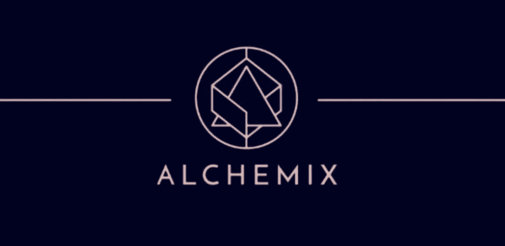
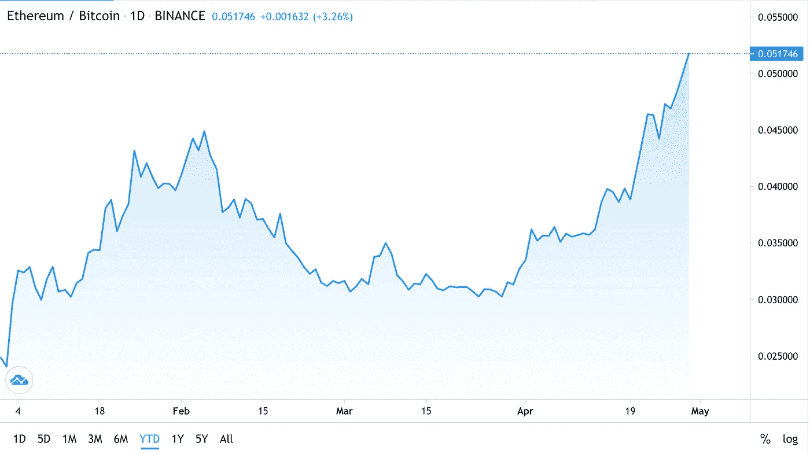
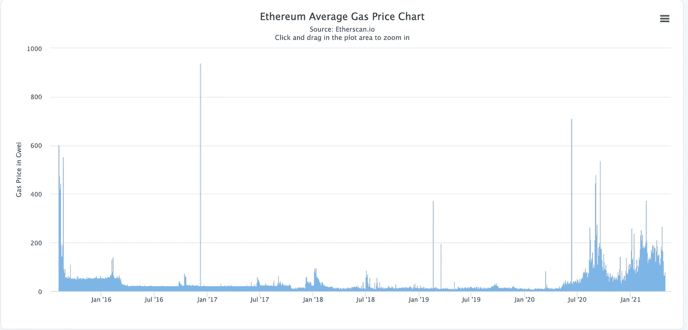
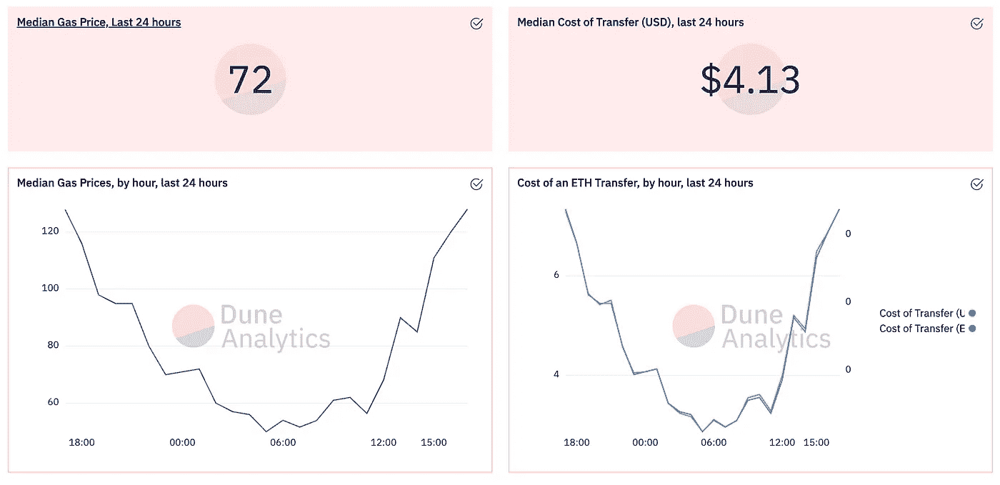
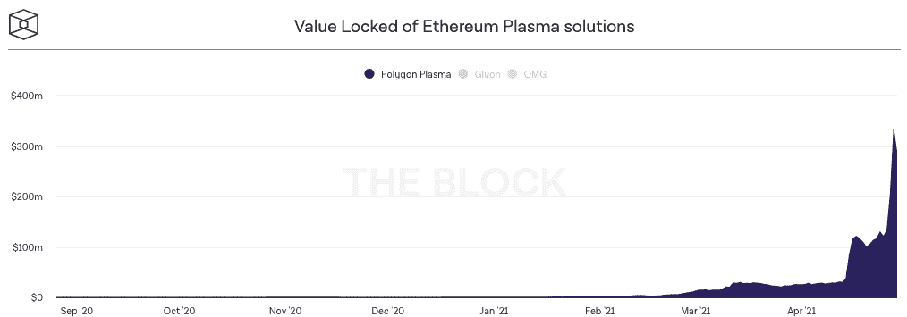
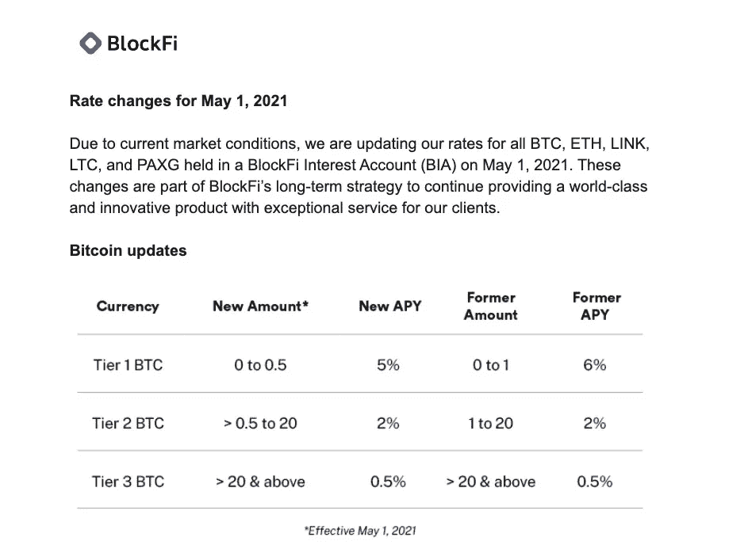

# 每周加密更新:4 月 26 日这一周

> 原文：<https://medium.com/nerd-for-tech/weekly-crypto-update-week-of-april-26th-5cd8d174dfdc?source=collection_archive---------10----------------------->

## crypto 本周最佳和最差项目

*免责声明:本文出于教育目的。希望人们发现这些更新有助于跟上这些天来 crypto 飞速发展的步伐。*

*这不是财务建议；你总是对硬币进行尽职调查吗:)*

# 本周的反思

本周是成为 ETH maxi 的好时机。

今天早些时候，ETH 以 2780 美元(再次)打破了 ATH。它对 BTC 的吸引力也在增加，ETH/BTC 自 2018 年以来首次超过 0.05。

这部分是由于欧洲投资银行(EIB)，欧盟的公有贷款机构，出售了在以太坊注册的 1 亿欧元 2 年期数字债券。

来源:TradingView

在以太坊平台方面，网络正在继续打破[唯一地址、活跃地址、数量](https://etherscan.io/charts)等记录。

天然气价格一直保持在可控范围内——非高峰时段的价格在合理的 40-50 gwei 范围内(这是我种植大部分产量的时候)。

来源:乙醚扫描

作为参考，转账大约需要 4 美元——相信我，与今年早些时候的牛市高峰相比，这已经非常便宜了。

来源:沙丘分析

类似地，Polygon 的原生硬币 MATIC 自上周以来上涨了 3 倍，从最低点的 0.30 升至最高点的 0.93。

多边形的以太坊桥以太坊锁定的总价值(TVL)已飙升至$2B，在 3 天内从$1B 翻了一番🤯

这部分是由于团队对卓越用户体验的不懈关注，以及行业内对以太坊之上的第 2 层扩展解决方案的发展趋势——寻求更便宜的天然气费用。

正如我在本周早些时候的[第二层战争深潜](/coinmonks/the-layer-2-wars-heat-up-b8d02d3dd332)中所说:

> L2 战争的胜利者必须满足两个条件:
> 
> 1.他们利用的技术(例如，子链、乐观总结、零知识总结)将解决当前在以太坊 L1 普遍存在的必要的用户问题
> 
> 2.平台上的 dapps 和用户会产生网络效应
> 
> 第二个条件意味着他们投入走向市场(GTM)的努力来获得用户:从产品增长的角度，以及合作伙伴关系和营销的角度。
> 
> 大量的 dapps 意味着大量的用户。伟大的流动性挖掘计划意味着大量的用户。考虑到目前将资金转移到 L2 的摩擦，用户将与他们的 L2 解决方案保持粘性关系(至少目前如此)。

偷看时间戳。我在哈苏之前说过这个！

我一直被创新的新 DeFi 项目所吸引，这些项目在一个又一个的基础上构建了一个全新的开放式金融层。

本周许多顶级项目的共同主题是一波新的金融产品，这是我以前从未想到过的——因为可组合性的力量。

# 本周最佳项目

## 液化([https://www.liquity.org/](https://www.liquity.org/))

Liquity 在以太坊主网上发布，并从加密 Twitter 社区获得了大量支持和兴趣。

来自他们的[博客帖子](/liquity/liquity-goes-live-on-ethereum-mainnet-203d295d2fc6):

> Liquity 是一个分散的借款协议，允许你以 ETH 作为抵押提取 0%利息贷款。贷款以 LUSD 支付——一种与美元挂钩的稳定货币，并且只需要维持 110%的最低抵押比率。

这个项目中有两件非常有趣的事情让我印象深刻:

1.  无息贷款

Liquity 允许你抵押你的 ETH，并以美元获得无息贷款(技术上，LUSD 是流动性的美元挂钩稳定币)。我想它是无息的，因为该协议从你的 ETH 上的其他协议中产生收益，实质上补贴了利率。

2.110%抵押率

目前的行业标准通常是 150-200%的抵押贷款。这意味着你需要投入 1.5 到 2 倍于你希望借出的金额:例如，1000 美元的联邦储蓄银行贷款用于 500 美元的贷款。

流动性有一个“高效的清算机制”(来自他们的网站)，允许 110%的抵押。

我认为该行业需要更努力地思考资本效率和抵押不足的贷款。我们将在下周晚些时候发布一个专门的帖子！

## 炼金术士(【https://alchemix.fi/】T4)

本周早些时候，我谈到了 Alchemix，我对这个项目印象非常深刻。

下面是简介:

> Alchemix 建立在渴望之上。它将资金投入到渴望获得收益，当资本获得收益时，Alchemix 允许人们以分配的资本作为抵押贷款，而不是偿还贷款，Alchemix 使用渴望的收益来偿还本金+利息。

本质上，你可以在 Alchemix 上获得贷款，而*永远不必偿还*——因为协议是用你抵押品的收益来偿还你的贷款。

## 闪电桩([https://flashstake.io/](https://flashstake.io/))

Flashstake 与 Alchemix 和 Liquity 类似，这是一个只有通过 DeFi 才有可能实现的疯狂的可怕产品。

当您使用 Flashstake 下注时，您可以选择提前获取您的收益。

是的，你可以在贷款开始时获得收益，而不是在贷款结束时或周期性爆发时获得收益！

这样做的时候，你必须明确你想把抵押品锁定多长时间。

还有一个很好的用例，你可以向不同的钱包炫耀你的收益，这基本上成为一种无转移支付机制。

## bancor([https://bancor . network/](https://bancor.network/))

我是 Bancor 的忠实粉丝——尤其是当他们在 AMM 资金池上发布了两个非常棒的功能:通过将股份与 BNT 国债匹配的单边流动性池赌注，以及[非永久性损失](https://academy.binance.com/en/articles/impermanent-loss-explained)保险。

现在，Bancor 的团队带着 xBNT 回来了——大大简化了 Bancor 的用户体验。

现在，BNT 使用 BNT 自动重新下注，所以没有不必要的汽油费需要支付索赔和重新下注 BNT。

此外，还有一个“设置它，忘记它”的选项，最简单的赌注。

## 第二层财务(【https://layer2.finance/】T4)

本周早些时候，Layer2 Finance 在以太坊主网上发布了 v0.1 版本，该版本基于另一个第 2 层以太坊扩展解决方案 Celer Network。

Layer2 Finance 有一个非常新颖的扩展方法——他们在 ELI5 的一篇博客文章中称自己为“地铁对优步黑对以太坊网络的 DeFi city”。

它们批量处理交易——类似于 subway——并将其发送到指定的 DeFi 协议进行交易。同时通过 Celer 将第 1 层资产连接到第 2 层。

# 本周最差项目

本周没有底层项目——只有以太坊社区的许多好消息。

但是，我要说，TradFi 和 CeFi 选项越来越没有吸引力了。

疯狂的低利率——如今一个“高”收益储蓄账户每年只能给你带来 10 个基点的净收益。再加上美联储今年设定的 2%的通胀目标，你把钱存入这些 TradFi 账户实际上是在损失实际货币/购买力。

甚至像 BlockFi 这样的 CeFi 期权也在降低利率。更不用说从用户体验的角度来看，它们使用起来非常糟糕…

无论如何，谢谢你收听我的每周演讲。直到下周:)

如果你认为这篇博文值得你花上 5 分钟来阅读，请在下面鼓掌(最多 50 次)或者与一个会从这篇内容中受益的朋友分享。非常感谢！