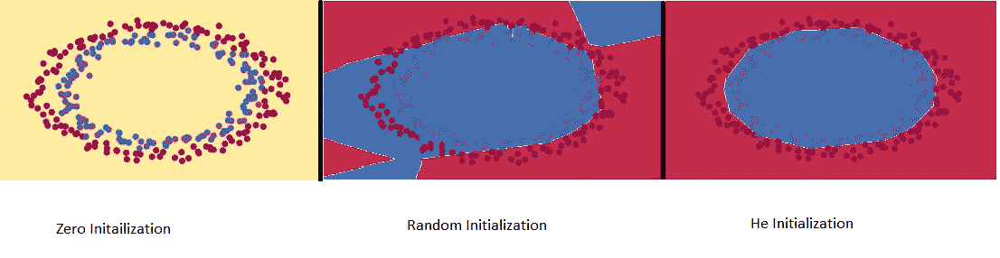

# 神经网络中的权重初始化

> 原文：<https://medium.com/nerd-for-tech/weight-initializations-in-neural-networks-b66555a29e50?source=collection_archive---------11----------------------->


在 [Unsplash](https://unsplash.com/s/photos/random-matrix?utm_source=unsplash&utm_medium=referral&utm_content=creditCopyText) 上由 [Rodion Kutsaev](https://unsplash.com/@frostroomhead?utm_source=unsplash&utm_medium=referral&utm_content=creditCopyText) 拍照

像随机梯度下降(SGD)这样的优化算法依赖于参数的初始值。初始值，当明智地选择时，有助于避免缓慢收敛，也确保我们不会一直振荡在最小值之外。简单地说，权重初始化防止激活输出在神经网络的正向传递期间爆炸或消失。在这篇博客中，我们将看看一些初始化技术:



**零初始化** —权重初始化为零。当我们用 0 初始化时，它相对于损失函数的导数将是相同的，因此所有权重在随后的迭代中具有相同的值。它将表现得像一个线性模型，神经元将学习相同的特征。

> 太小的初始化会导致渐变消失&学习缓慢，而太大的初始化会导致渐变爆炸。

```
x = torch.randn(64)
for i in range(100):
  a = torch.randn(64,64)
  x = a @ x
  if torch.isnan(x.std()):
    break
print(i)
```

在上面的代码块中，我们大量的初始化导致了渐变的爆发。系统无法表示 40 次迭代后的值，因为值的连续乘法使其变大。

```
x = torch.randn(64)
for i in range(100):
  a = torch.randn(64,64)*0.01
  x = a @ x
  if i<10:
    print(x.mean(), x.std())
```

在上面的示例代码中，如果我们使用小的初始化，梯度将在几次迭代中变得非常小。在上面的代码中，在最初的几次迭代之后，平均值和标准偏差变为零。

**随机初始化** —权重被随机初始化为接近零(非零)。在进行随机初始化时，我们确保平均值应该为零&方差在各层之间应该相同。

**Xavier 初始化** —最常用于 sigmoid & tanh 激活功能。所有权重都是从均值为 0、方差为 1/(前一层神经元数)的正态分布中随机选取的。

```
x = torch.randn(64)
for i in range(100):
  a = torch.Tensor(torch.randn(64,64)).uniform_(-1, 1)*math.sqrt(6/(64+64))
  x = torch.sigmoid(a @ x)x.mean(), x.std()
```

但是相同的初始化不能很好地与 ReLU 一起工作。

```
x = torch.randn(64)
for i in range(100):
  a = torch.Tensor(torch.randn(64,64)).uniform_(-1, 1)*math.sqrt(6/(64+64))
  x = torch.relu(a @ x)x.mean(), x.std()
```

**初始化** —权重随机初始化，但其范围不同，且基于神经元的前一层。此外，这种初始化是激活感知的。它最常用于 ReLU 激活。

```
x = torch.randn(64)
for i in range(100):
  a = torch.randn(64,64)*math.sqrt(2/64)
  x = torch.relu(a @ x)
x.mean(), x.std()
```

希望有帮助！！