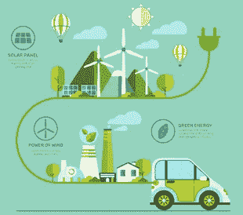
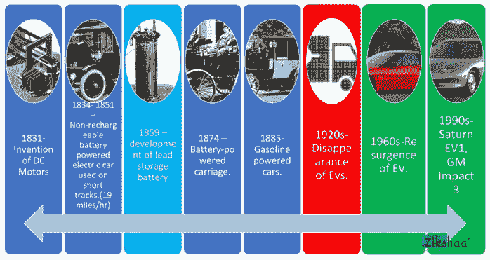
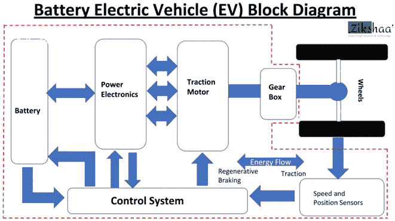
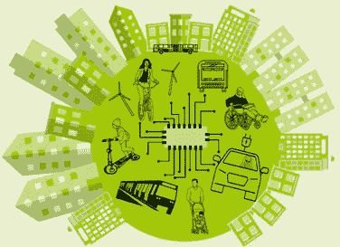

# 欢迎来到电动汽车的绿色未来

> 原文：<https://medium.com/nerd-for-tech/welcome-to-the-greener-future-with-electric-vehicles-7741a2c82e3b?source=collection_archive---------2----------------------->

我们的生活围绕着基于内燃机的汽车，这曾经被认为是唯一的交通方式。但是科学家和环保主义者一直在关注全世界的污染。电动汽车开始越来越受欢迎，因为它是一种更清洁、更环保的交通工具，有助于建设无污染的地球。

[电动汽车](https://en.wikipedia.org/wiki/Electric_vehicle)的发展导致在传动系统中大量使用电动机，取代传统的内燃机。电动机的使用可以追溯到 18 世纪早期，当时 Anyos Jedlik 开发了一种电动汽车模型，可以使用小型电动机自行移动。后来，大型电动机被制造出来，电动汽车被小规模使用。今天，电动汽车正在大规模开发和使用，电动机及其驱动装置在其中发挥着重要作用。

今天[电动汽车](https://www.energy.gov/eere/electricvehicles/electric-vehicle-basics) s 从锂离子电池中获取能量，并使用马达驱动车轮。现在你一定想知道我们是否需要一直更换电池。嗯，这是一个伟大的需要时间来发展。更简单的方法是，我们可以像给手机充电一样给电动车充电。但是充电时间取决于我们使用的充电器类型。有些充电器充电需要 8-10 小时(1 级充电)，而更快的充电器可能只需要 30 分钟。因此，发展电动汽车的充电基础设施是一个非常重要的因素。

## **印度将走向电动化**

下一个十年将是电动的。我为什么这样说呢？电动汽车价格昂贵是因为它的电池。随着技术的进步，电池已经变得更加便宜和发达。此外，新冠肺炎的情况导致印度转向只使用印度制造的产品。如果电池在这里生产，进口成本就省了，电动汽车也会更便宜。

印度公布了国家电动汽车任务计划**'******(**[**NEMP**](https://dhi.nic.in/writereaddata/Content/NEMMP2020.pdf)**)2020’**向电动汽车进行重大转变，以解决国家能源安全、车辆污染和国内制造能力增长等问题。财政部长 Arun Jaitley 宣布了一项计划，旨在为清洁燃料技术汽车提供激励措施，到 2020 年将汽车销量提高到 700 万辆，并为电动汽车建立必要的充电基础设施。印度政府打算在 2030 年前将 30%的比例转向电动汽车。**

**目前，印度的主要城市如德里、加尔各答、班加罗尔等都已经采用了电动人力车和电动公交车。奥拉、[优步](https://www.uber.com/in/en/)、[鲁豫](https://www.yulu.bike/)等出租车公司也推出了电动自行车、电动人力车和电动车。目前，印度只有 150 个充电站，预计到这种需求，印度政府制定了一个雄心勃勃的目标，即在城市中每三公里建立一个充电站，在高速公路两侧每 25 公里建立一个充电站。像 ABB、Acme Industries、Fortum India 和一些荷兰公司都在积极考虑建立汽车充电站。**

## ****电动车部件****

**电动车辆有 3 个主要部件:-**

**[**电池**](https://en.wikipedia.org/wiki/Electric_vehicle_battery) : —电池是由一个或多个电化学电池组成的装置，通过外部连接为电气设备供电。电池是电动汽车的能量来源。电池储存电能并向电动车辆提供电能。**

**了解电动车 BMS—[*这里*](https://zikshaa.com/course/battery-management-system-course/)**

**[**电动机**](https://en.wikipedia.org/wiki/Electric_motor) : —电动机可以定义为将电能转化为机械能的电机。马达驱动帮助它行驶的车轮。**

**[**电力电子**](https://www.sciencedirect.com/topics/materials-science/power-electronics) : —由电池管理系统、电机控制器、充电电路等组成。电机控制器是一种充当车辆微控制器、电池和电机之间中介的设备。电机控制器是必要的，因为微控制器通常只能提供大约 0.1 安培的电流，而大多数致动器需要几安培。电池管理系统(BMS)是一种电子系统，它通过保护电池不在其安全工作区域之外工作、监控其状态、计算二次数据、报告该数据、控制其环境、认证其和/或平衡其来管理电池(可充电电池——电池或电池组)。**

**详细了解电动车— [*这里*](https://zikshaa.com/course/electric-vehicle-course/)**

****

**除了主要部件，电动汽车还有许多其他部件，如再生制动、电力驱动系统、驾驶员辅助系统等等。电动汽车技术日益发展。新兴技术之一是电池交换技术。随着充电站数量的减少和充电时间的增加，电池交换技术越来越受欢迎。**

## ****电动汽车行业的职业生涯****

**电动汽车产业规模庞大，涉及多个领域。这个行业需要每一种职业来为一个更加绿色的世界做出贡献。需要改善电动车辆的性能，特别是通过改善电池、充电技术、材料和连接的车辆。**

> ****电子与通信工程****
> 
> **开发电池管理系统的固件、开发信息娱乐系统、制造和安装车辆传感器、电力电子设备**
> 
> ****电气工程****
> 
> **从事电机、质量控制、电池组测试，为电动汽车充电解决方案的多种功能开发线束**
> 
> ****机电一体化工程****
> 
> **汽车设计，零件装配机器人，[动力总成部件](https://evreporter.com/ev-powertrain-components/)开发**
> 
> ****化学工程****
> 
> **锂离子电池制造、电池组制造/组装、电池回收**
> 
> ****计算机科学****
> 
> **开发电池管理系统(BMS)的算法，制作用于共享电动汽车产生的实时数据的物联网模块，使用人工智能提高 BMS 的效率，开发充电基础设施和应用，数据科学。**
> 
> ****机械工程****
> 
> **热力系统、车辆和零件设计与制造**
> 
> ****材料工程****
> 
> **设计电动汽车和电池的环保材料。**
> 
> **今天的电动汽车和明天的电动汽车不一样。世界正在电动汽车上发展。在未来的十年里，我们将期待一个电子世界。**

**查看您在本行业的职业经历: [NOW](https://zikshaa.com/courses/)**

## ****印度顶级电动汽车制造商****

**[**马欣德拉电动汽车**](https://www.mahindraelectric.com/)**:**——第一辆革命性的电动汽车由马欣德拉电动汽车公司推出，现在它还推出了电动 3 轮车 Treo 和更多的电动 4 轮车。**

**[**塔塔汽车**](https://www.tatamotors.com/) : —塔塔汽车正在将尼克森(Nexon)和泰格(Tigor)等四轮驱动汽车转换为电动汽车，目标里程将达 300 公里，以解决国内通常与电动汽车相关的里程焦虑问题**

**[**父亲能源**](https://www.atherenergy.com/)**:**——该公司声称这两款电动代步车都是为了解决电动二轮车中的各种问题而设计的，比如充电慢、电机功率低以及电池寿命短。父亲能源还提供父亲一号计划，包括免费获取公共和家庭收费，故障援助，以及无限制的数据服务等。**

**[**Hero Electric**](https://heroelectric.in/)**:**——Hero Electric 推出了一系列电动两轮车和电动三轮车，如 Optima、倪克斯、Flash 和光子电动滑板车**

**[**现代 Kona 电动**](https://www.hyundai.com/in/en/find-a-car/kona-electric/highlights.html?utm_source=Search&utm_medium=CPC&utm_campaign=KONA-AlwaysOn-2020)**:**-为印度电动汽车生态系统充电，现代在印度推出其 Kona EV，经 ARAI 认证的续航里程为 452 km。Kona 配备了锂离子聚合物电池，与传统的镍金属混合电池相比，具有出色的充电和放电效率。**

**[**Ashok Leyland**](https://www.ashokleyland.com/en/web/ashokleyland/home)**:**—制造专为印度条件设计的电动公交车，并与 Sun Mobility 合作，以增强其在电动汽车领域的专业知识，并在电动公交车中引入电池交换，以满足该国的电动汽车需求。**

## **电动汽车的优势**

**运行和维护成本更低**

**它消除了燃料成本和燃料的使用**

**对环境更好**

**污染更少**

**环保材料**

**电池运行大约 8 年，之后需要更换**

**快速便捷的家庭充电**

**更好的性能**

****