# 多么狡猾的敌人！-游戏开发系列 44

> 原文：<https://medium.com/nerd-for-tech/what-a-tricky-enemy-game-dev-series-44-502c7e361010?source=collection_archive---------20----------------------->

目标:用独特的移动和攻击方式创造一个新的敌人。

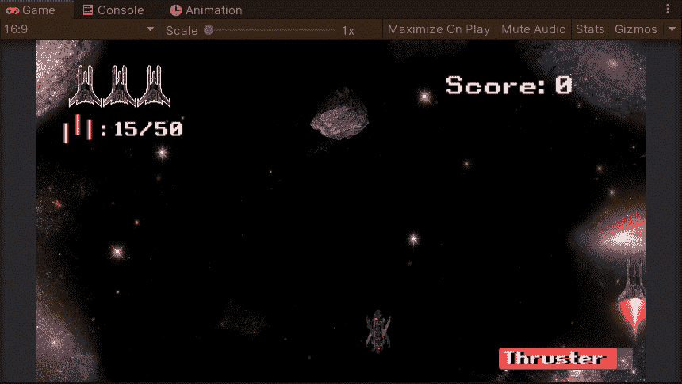

到目前为止，我们有 3 个不同的运动和快速激光攻击的敌人波。如果我们不能做出一些改变，这些对玩家来说都将变得无趣。在现有规则之外创造一些特别的东西(比如一种新的敌人)可能是个好方法。

在我看来，一个不可预测的敌人会很狡猾，充满挑战。当玩家在射程内时，我想制造一个自杀式炸弹攻击的敌人。更重要的是，它会在 5 个不同的地点随机传送，然后离开场景，如果它发现没有玩家，就摧毁它。听起来很艰难？那就太好了。

## 创建检测炸弹脚本

因为它的移动不同于以前的任何敌人，它可能不会使用和他们一样的脚本。我们应该创建一个新的脚本，我会把它命名为**探测炸弹**。

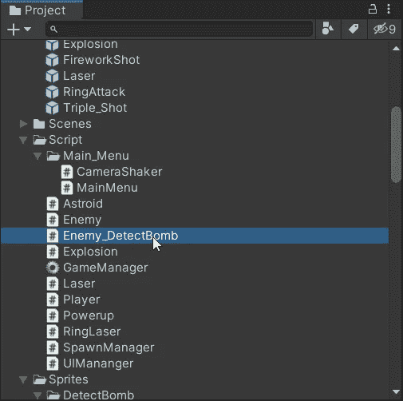

在我们开始编码之前，我们应该弄清楚它应该移动(或攻击)什么。

*   从顶部随机移动 x 轴，当到达一个特定的 y 轴点，开始传送。
*   用自定义半径值在球体中随机选择一个点。然后传送到那个位置，停留 3 秒钟，重复这个步骤，寻找一个新的地点。
*   如果玩家在探测范围内，停止传送并向玩家移动，或者如果它已经移动了 5 个点，则下去直到离开场景并自我毁灭。

作为开始，在**中创造一种新方法探测炸弹**。由于该运动将重复整个部分 5 次，因此最好用协程循环运行。

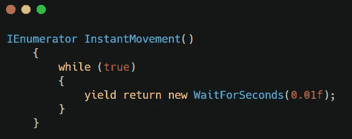

在 while 循环中，我们将为它设置一些语句。我们可以加上一个整数来计算传送的次数。

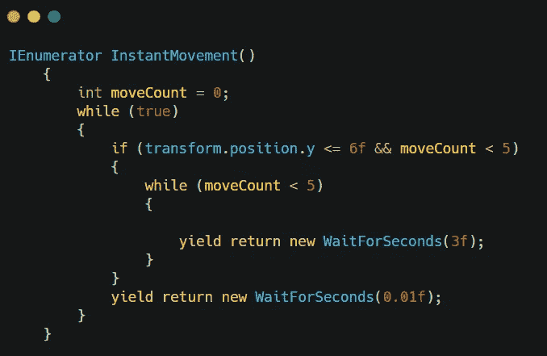

在这个循环中，我们希望它在一个球体中定位一个点，我们将使用[**inside unit circle**](https://docs.unity3d.com/ScriptReference/Random-insideUnitCircle.html)**来定位它。**

**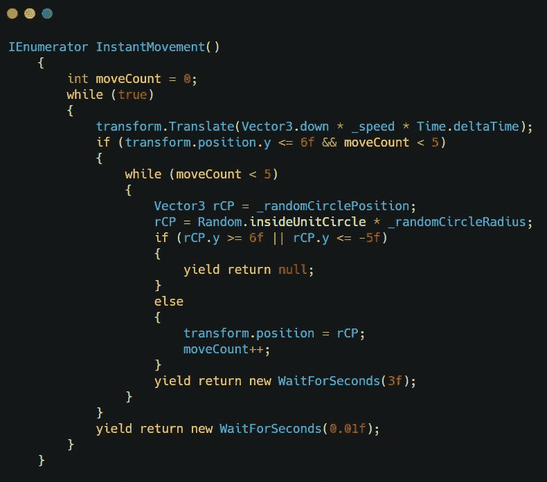**

**虽然炸弹已经传送了 5 次，但它应该会直接坠落并摧毁。**

**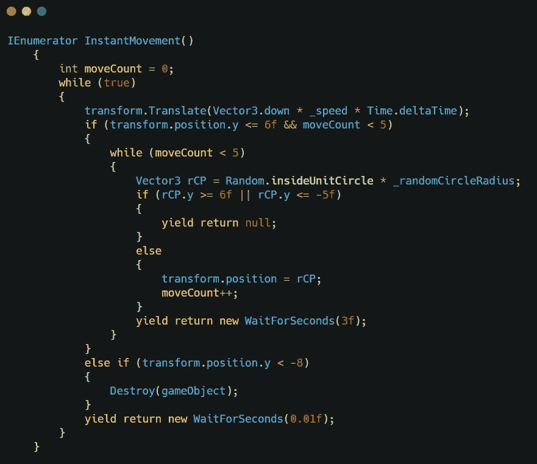**

**接下来我们可以设置它追逐玩家。**

**在 **Update()** 中，设置一个半径范围(应该先创建一个变量)并使用 [**距离**](https://docs.unity3d.com/ScriptReference/Vector3.Distance.html) & [**移动朝向**](https://docs.unity3d.com/ScriptReference/Vector3.MoveTowards.html) 进行追踪。**

**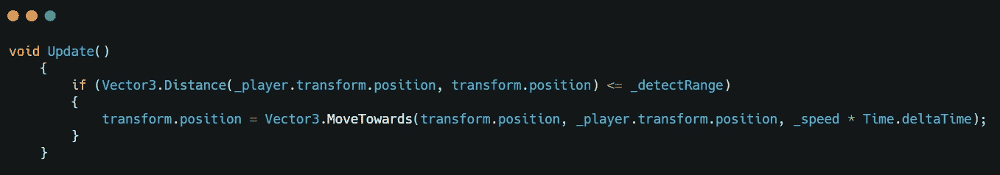**

**但是，追逐运动和瞬移运动是冲突的。我们可以用一个布尔来处理这个问题。
创建一个布尔变量，并将其添加到路由移动中。**

**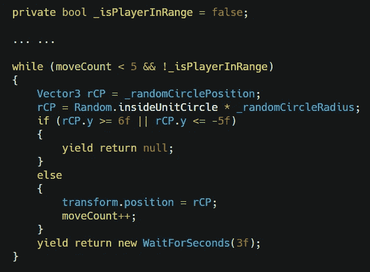**

**然后当玩家在追逐范围内时启用它。**

**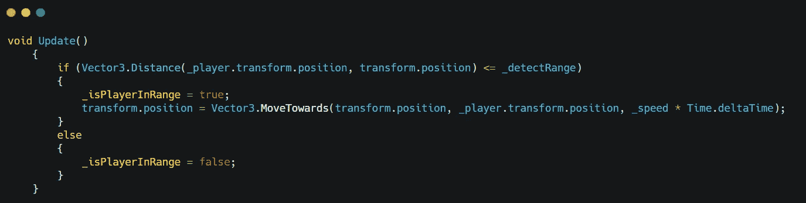**

**那它应该会如你所愿的移动。接下来，我们应该让它在与玩家或激光碰撞时爆炸。我们可以简单地使用敌人脚本中的相同方法。**

## **从敌方剧本中提取好的部分**

**在这个脚本中，我们将使用激光碰撞检测和播放器碰撞检测的代码。我们可以将这些代码输入到我们的**探测炸弹**脚本中。**

**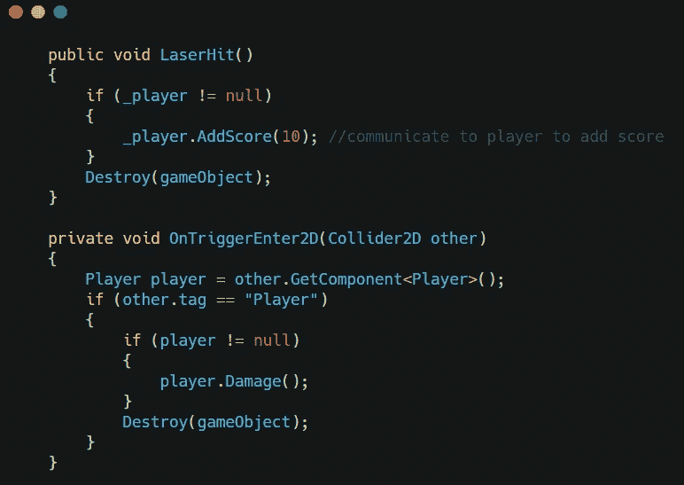**

**虽然我们没有炸弹爆炸的具体动画，但我们可以简单地使用我们用于小行星和玩家爆炸的爆炸预设。**

**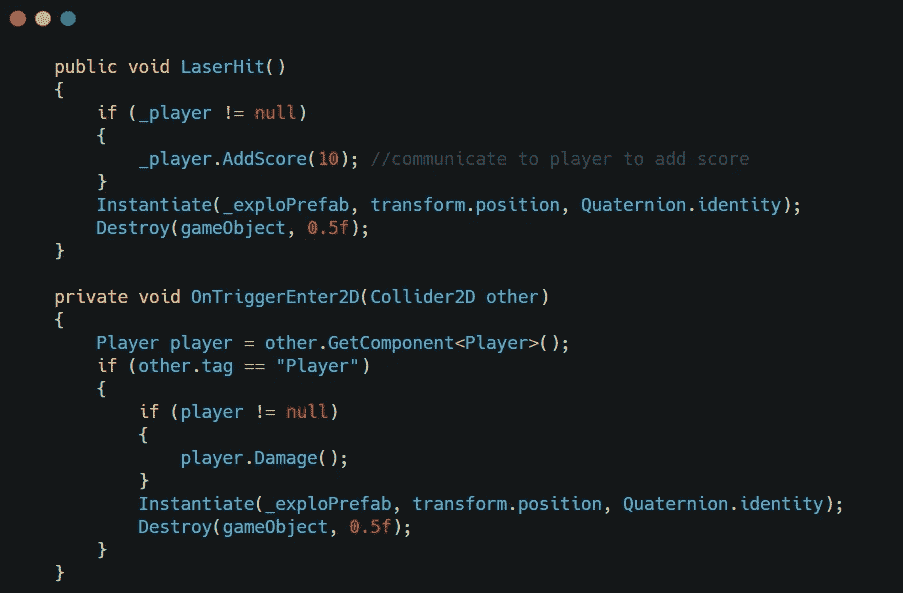**

**一旦我们完成了对撞机，我们可以把它放入**的种子管理器**。**

## **开始产卵吧**

**在例行程序中生成它之前，我们应该设置频率。它不应该以高频率出现，否则对我们的玩家来说太难了。在 4 次产卵后产卵一次可能是合理的。**

**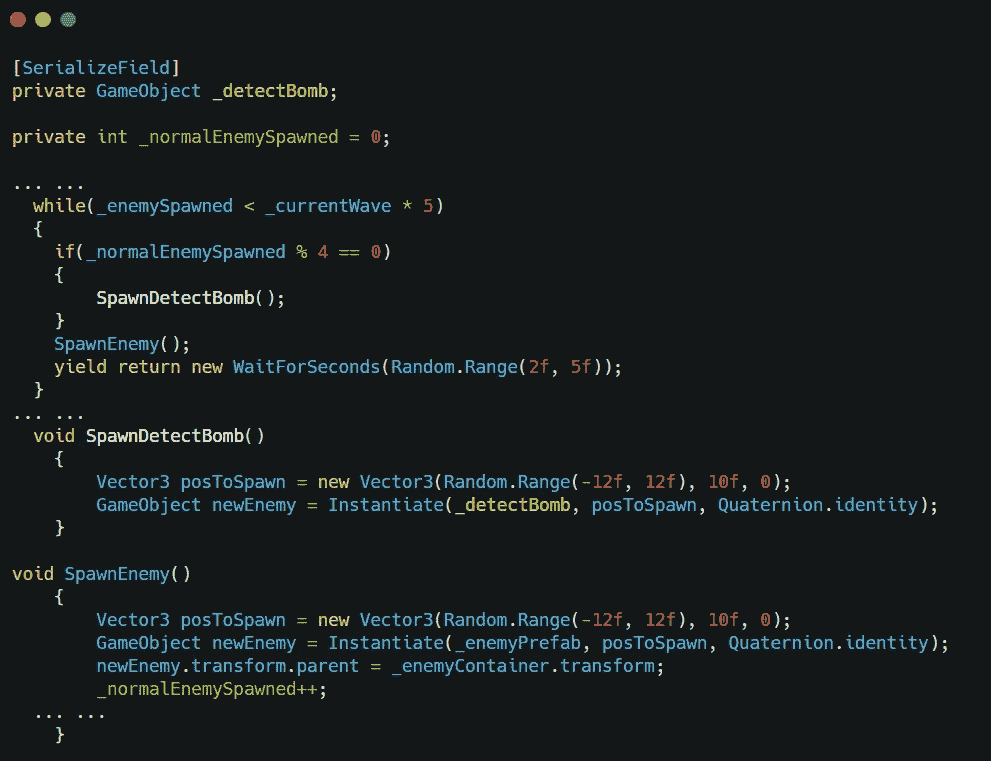**

**不要忘记将预设拖到编辑器的 SpawnManager 中**

## **整理一些细节**

**在 **DetectBomb** 脚本中，我们使用 2 float 来计算半径，这很难调整实际范围。我们可以使用 **OnDrawGizmo** 在预览窗口中将其可视化。**

**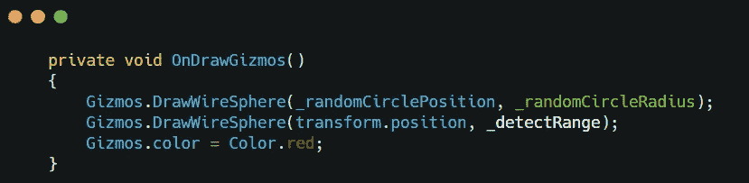**

**有了这些代码和**serialize field**float 变量，在编辑器中调整它们应该很容易。**

**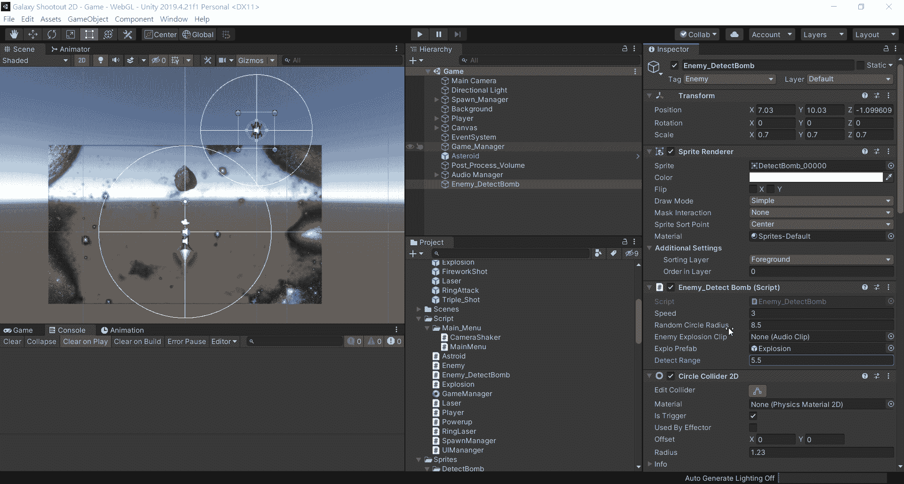**

**这就是这个独一无二的敌人的全部背景。我们现在就可以试试！**

**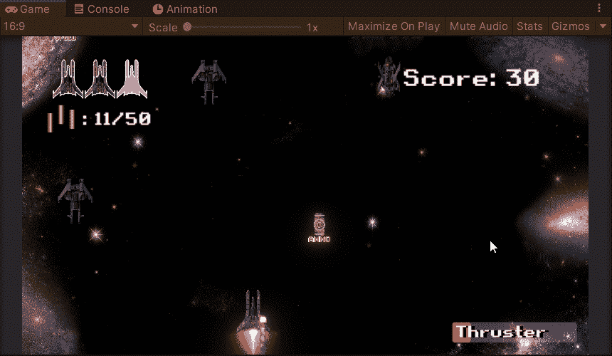**

**接下来:[合理的产卵规则](https://sj-jason-liu.medium.com/reasonable-spawning-rule-game-dev-series-45-c409db60fd9b)**