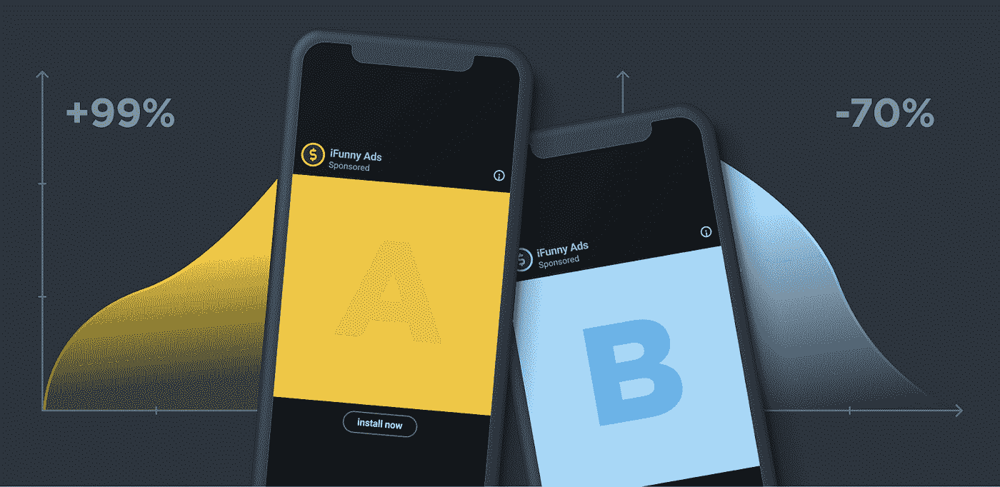
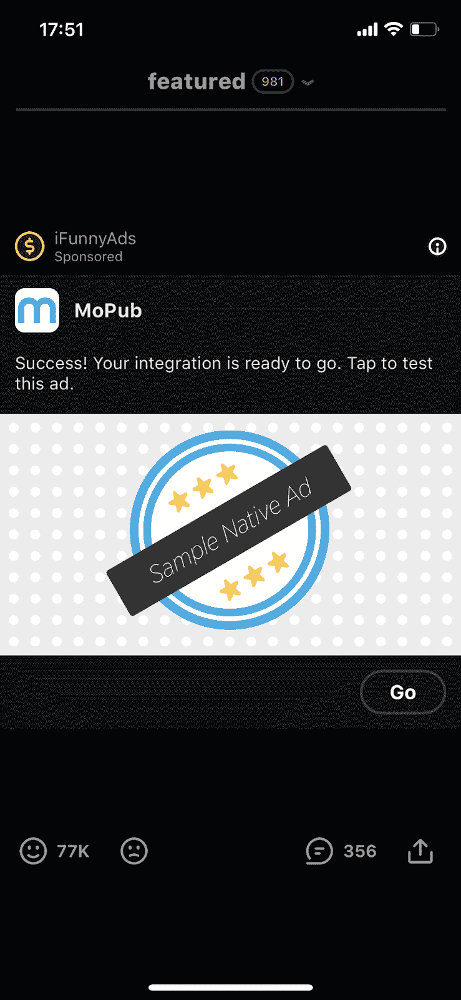
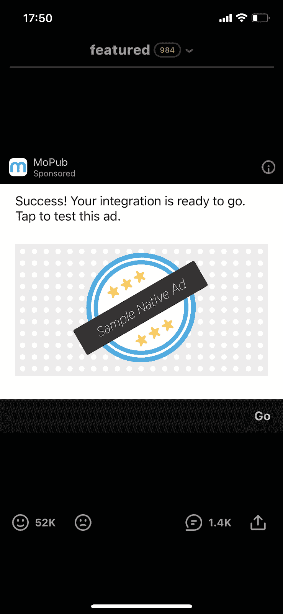
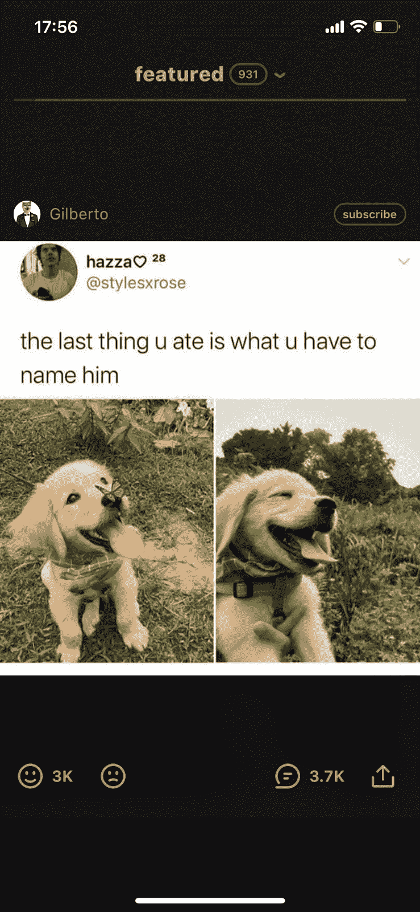
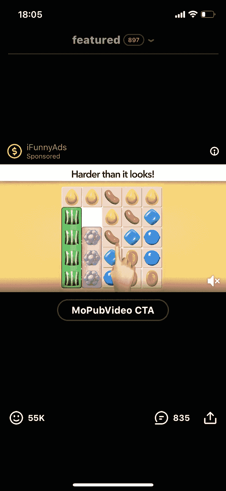

# 什么是广告中的 A/B 测试？

> 原文：<https://medium.com/nerd-for-tech/what-are-a-b-tests-in-advertising-4bf4dff2f29b?source=collection_archive---------8----------------------->

# 我们如何用它来测试我们的目标战略

任何开发移动应用程序的公司都会不时地遇到改变其应用程序功能的必要性，并在做出改变后，评估已完成工作的结果。这种评估的工具之一是 A/B 测试。

在我们的 [iFunny](https://ifunny.co/) 移动应用中，A/B 测试通常用于引入新功能或对界面设计进行更改。由于广告是我们应用不可或缺的一部分，我们对广告清单进行 A/B 测试。

# iFunny 中的 A/B 测试

我们的任何 A/B 测试都是从假设开始的。假设是由我们的产品团队根据分析和数字提出的。在 iFunny 中，A/B 测试是一个将 app 的受众分为两组的过程。第一组被称为“控制”组。对于这个群体，产品保持不变。第二组用户看到的是新版本的应用功能或设计。

接下来，我们在文档中描述 A/B 测试。基于此，我们进行测试。

在 A/B 测试投入生产后，我们监控产品指标。如果测试在一组用户中显示了有希望的结果，那么我们在另一组用户中运行它，检查度量标准是否会保持不变，并观察它们在一定时期内的动态。如果动力保持积极，我们向所有用户推出实验。

如果测试在给定的时间内显示阴性结果，我们要么寻找假设中的错误，如果发现，我们改变测试的条件并再次进行，或者删除测试。

# 广告中的 A/B 测试

由于广告是我们应用程序不可或缺的一部分，任何变化都可能导致产品指标的变化。

我们已经运行了几个 A/B 测试来检查关于广告收入指标变化的假设。例如，我们已经运行了一个 A/B 测试，其中我们为其他用户组设置了不同的广告参数，例如:

*   广告展示的频率
*   特定广告合作伙伴显示的广告
*   网络广告请求的超时值

由于这项测试，我们在技术性能方面有所改进，例如通过减少网络广告请求的数量来降低功耗和 RAM 消耗，以及广告展示的收入略有增加。

# 使用新的原生广告设计进行 A/B 测试

在 iFunny 上，原生广告是插入到内容提要中的广告。

iFunny 中的原生广告

原生广告可以包括以下 UI 组件:

*   广告标题
*   投放广告的合作伙伴的图标或徽标
*   广告文本
*   图片或视频
*   附加按钮:行动号召、音频和视频按钮(如果广告包含这些按钮)。

我们可以改变字体的颜色和大小，背景颜色，广告中元素的位置，并按照我们想要的方式设置一切。但是和其他 UI 组件一样，原生广告也有自己的指导方针和最佳实践。以下是主要的几个:

*   原生广告应该被视为应用程序内容。
*   一个广告的所有 UI 组件都应该在它的容器视图中，有机地、美观地放置，并且高度可见。

内容和原生广告容器都放在我们应用的单元格中。这些细胞构成了饲料。由于广告直接嵌入到内容提要中，它们会影响产品指标。例如，如果用户看到一个不合适的广告，他们可能会永远离开应用程序。由于元素的笨拙排列，用户可能会意外点击广告，打开应用商店或广告所指向的网站，之后他可能永远不会返回该应用。

我们决定检查原生广告单元设计的改变是否能提高我们应用的产品指标，我们提出了这个假设:

*   如果原生广告看起来更像一个内容单元，它们对用户来说就不会那么令人讨厌，并且景深会增加。

查看量的增加(即每次会话查看的内容量)可以增加内容提要中的广告数量。

在本实验中，我们将用户分为两组:

*   A —“控制”(原生广告的设计，不做改动)
*   B —新设计

以前

在...之后

我们改变了图标的位置，使其看起来像用户头像，将背景色改为白色，增加了字体，并为按钮添加了新的样式。作为比较，下面是 iFunny 提要中内容单元格的示例。

iFunny 提要中的内容单元格

在实验过程中，我们一直在监控以下产品指标:

*   视野深度
*   原生广告视图
*   横幅广告视图
*   保留

我们已经启动了实验，并开始监控指标。结果，我们的假设没有被证实:观察到的度量没有改变。

因此，在我们的假设中，我们还没有看到指标的预期变化。我们认为这很奇怪，然后我们检查了其他指标，发现了它们之间的差异:

*   原生广告的点击量增加了(点击量增加了 77%)。
*   保存率(用户保存的内容量)下降了 2%。
*   微笑率(内容的“赞”数)下降了 1.5%。
*   会话的平均长度减少了。

结论是，随着用户通过点击商店或网站的链接离开应用程序，广告点击量的增加导致了会话时间的减少。减小会话的大小可以减少用户操作。

基于此，我们决定停止实验，回到以前的设计。

# 原生广告中带声音的 A/B 测试

iFunny 中的原生广告主要有两种类型:

*   静态
*   视频广告

iFunny 中的视频广告

一般来说，视频广告比静态广告更贵，但也更难获得。填充率(相对于所有请求的成功请求数)取决于广告商愿意向我们发送视频广告的程度。

如果出现以下情况，广告商将会更频繁地发送视频广告:

*   这款应用的点击率很高，这意味着用户在观看视频广告时会经常点击它。
*   用户观看视频广告的时间更长。

为了改进这些指标，我们决定进行 A/B 测试，我们改变了在视频广告中按下静音按钮的逻辑，使其与 iFunny feed 中视频内容单元格中的静音按钮相同。

在 iFunny 中，您可以通过按下静音按钮来静音或取消静音视频内容。用户通过按下此按钮确定的音频状态对提要中的所有视频内容保持通用。但是这个规则对视频广告不起作用。里面的声音默认是关闭的。

我们提出了一个假设，如果视频广告和声音一起播放，用户会更加关注它们:视频广告的点击率和观看深度会增加。

我们已经进行并启动了 A/B 测试，并开始监控产品指标，但实验的第一批结果已经以来自 AppStore 和 PlayMarket 的反馈的形式来到了我们面前。用户开始写负面评论，抱怨广告中的声音。正如我们所怀疑的，他们确实开始更加关注视频广告，但问题是声音变得令人讨厌，分散了他们观看内容的注意力。

我们已经决定停止实验，而不是等待产品指标恶化。

# 摘要

尽管在广告业进行的两项实验没有证实这些假设，但它们表明，广告的变化可能会直接影响产品指标和用户体验。我们确信所学到的经验将帮助我们在将来将广告整合到产品中时少犯错误。