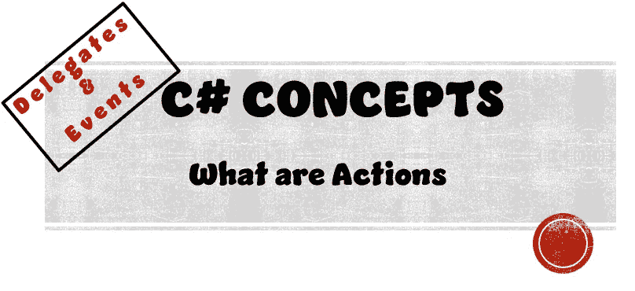
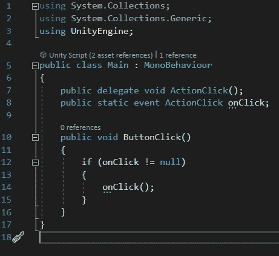
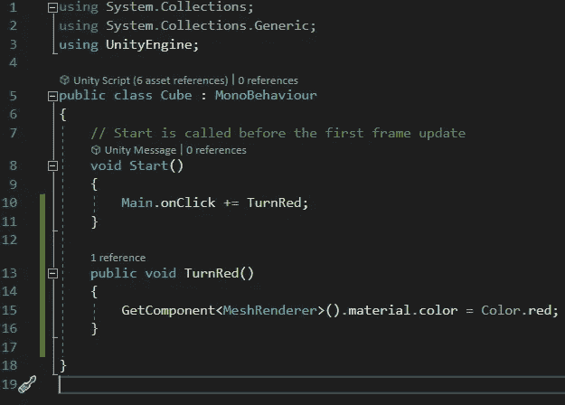
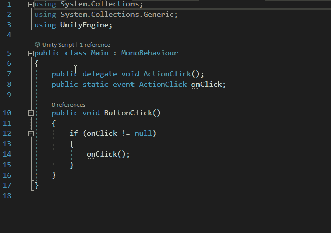
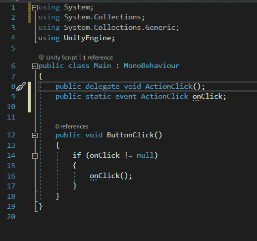

# 什么是行动

> 原文：<https://medium.com/nerd-for-tech/what-are-actions-646e00f86de3?source=collection_archive---------2----------------------->

## C#概念|委托和事件

> 目标:
> 通过优化我们在了解事件时创建的程序来了解行动

下面是我们在了解事件时创建的程序。要了解事件，并了解我们如何创建这个程序 **|** [**点击这里**](/@jordantkay21/what-are-events-559632b2ddc9) **|**

为了优化这个程序，让我们使用动作。

动作委托可以在一行代码中创建委托变量和事件。

为此，我们需要使用系统名称空间。

接下来，让我们注释第 8 和第 9 行，然后在它下面创建一个动作委托。

> 我们的代表/事件不需要参数。如果他们这样做了，我们的动作委托仍然可以工作，但是我们需要在关键字 action 的末尾包含<>。在这些括号中，我们可以包含任意多的参数。

# 试验

现在让我们测试一下，看看是否有什么变化…

嘣！什么都没有改变，我们的程序仍然有效。

最终，这两个项目都成功了。但是编程的关键是优化，优化你的代码最好的方法就是代码行少一些。这是因为行数越少，意味着需要读取和调试的内容就越少。