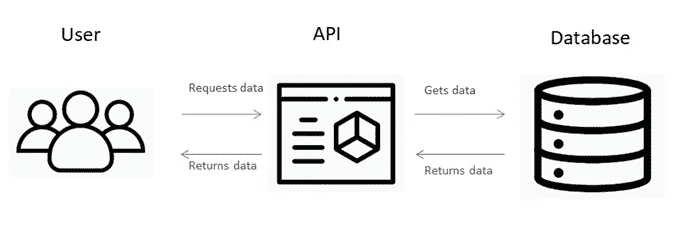
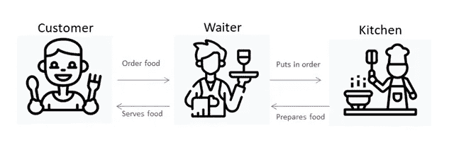

# API 到底是什么？

> 原文：<https://medium.com/nerd-for-tech/what-are-apis-anyway-13d88bf97565?source=collection_archive---------2----------------------->

在我们与互联网的日常互动中，我们会遇到许多收集信息的方式，例如通过网站和应用程序。通常，你会听到人们说“嘿，我为这个功能集成了 XYZ API”或“通过 ABC API，我能够……”，你可能想知道 API 到底是什么。如果不是到处都贴满了，这肯定是一个我们随处可见的术语。

这又回到了一个问题:当我从互联网上获取数据时，这些网站和应用从哪里获取数据呢？**答案是通过应用编程接口，通常简称为 API。**

API 是两个软件相互通信的一种方式，由一组协议和功能定义，用户必须遵循这些协议和功能才能正确获取数据。API 很有用，因为它是应用程序从数据库访问数据的一种安全方式。除了我们调用的函数之外，我们无法实际看到 API，但我们确实看到了网站或应用程序的前端，它使我们能够轻松使用或请求我们想要的信息。

**API 是如何工作的？**

用户可以从 API 请求信息，作为回报，一旦他们从数据库中获得所需的信息，API 就会作出响应。不是所有的数据都可以从数据库中访问，API 被告知哪些数据是允许访问的。

图 1.1

想象一下这个场景(图 1.2):你是一家餐馆的顾客，给了你一份菜单，你可以点菜。当你准备点菜时，你要求服务员把你想要的东西放进去。服务员然后告诉厨房工作人员，他们为你准备食物。当食物准备好了，服务员会把它拿回来给你。

图 1.2

在这种情况下，你是**用户**，服务员是 **API** ，菜单是**可访问数据**，食物是**数据**，厨房是**数据库**。您是通过 API 请求和接收数据的用户。

我们遇到了许多我们不知道的不同类型的 API，例如特定于编程语言的本地语言 API 和使用 HTTP 协议和 CRUD 操作的 REST APIs，它们不是特定于语言的。

**原料药的常见例子有哪些？**

一些使用 API 的网站或应用程序包括:

旅游和航班预订网站(expedia、klook、tripadvisor 等。)

天气小工具

金融应用程序(雅虎金融，贸易站等。)

所有这些网站或应用程序都使用 API 作为数据中间人。例如，旅游预订网站使用多个 API 来收集数据，以便用户可以比较他们想要预订的航班和酒店。

现在你对 API 有了更多的了解，**这里有 5 个 web APIs，你可以集成到你的项目中开始使用**(特别是如果你正在考虑为黑客马拉松做些什么的话！):

*   [Radar.io](https://radar.io/) :地理定位、地理编码、地理围栏
*   [NASA 开放 API](https://api.nasa.gov/):太空图像，火星天气报告
*   狗狗 API :狗狗图片…还需要我多说吗？
*   [电影数据库应用编程接口](https://developers.themoviedb.org/3/getting-started/introduction):电影、电视节目、演员
*   [坎耶歇](https://kanye.rest/):坎耶西语录

**资源**

[我宁愿是汤姆·约翰逊写的](https://idratherbewriting.com/)

[什么是 API？由基础学校](https://www.youtube.com/watch?v=C_rkJRSlJS8)