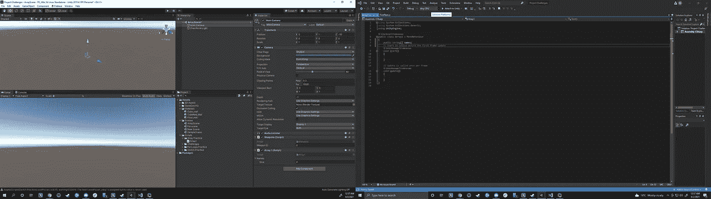
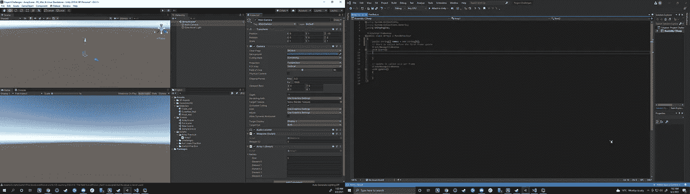
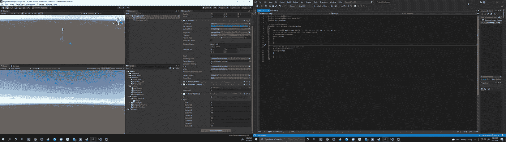
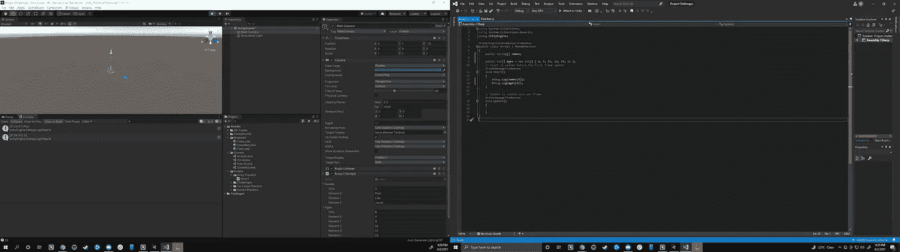
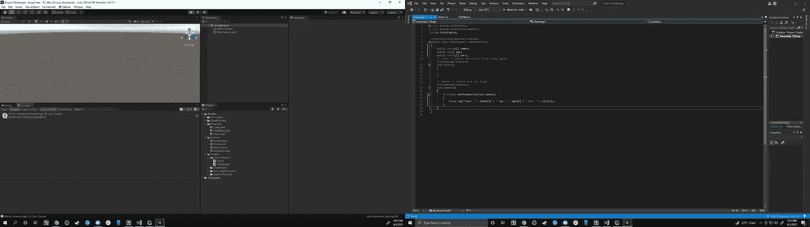
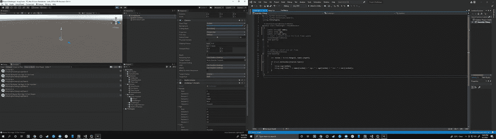

# 什么是数组

> 原文：<https://medium.com/nerd-for-tech/what-are-arrays-40a540792f60?source=collection_archive---------24----------------------->

数组是保存多种相同类型信息的变量。使用数组的好处是我们可以存储多个相似类型的值。它允许我们减少必须在脚本中输入的代码量，只需在编辑器中插入少量代码。我们有 3 种不同的方法来定义一个数组。第一种方法是最常用的方法，即不在脚本中定义任何内容，并在 Unity 中完成所有额外的工作:

使用这种方法，我们可以在编辑器中选择想要的数组大小，并输入所有的值。使用这种方法，您需要记住的关键点是，在向数组中添加信息时，您需要经常保存。如果你有一个包含 100 个东西的数组，你得到了大约 72 个，而 Unity 在你没有保存的情况下崩溃了，你将会失去填充这 72 个东西的所有时间。

第二种方法是定义您希望从脚本中得到多少个不同的值，然后将空格的填充留给编辑器:

使用这种方法，如果发生了更改，我们仍然可以更改数组中的总数，但是如果我们不保存我们的文件，它将恢复到原始值。

第三种方法是通过我们的脚本输入我们想要的数组中的所有内容:

这种方法通常更安全，因为您在脚本中定义了所有内容，但是如果您选择在事后更改数组中的值而不保存它，那么您将丢失所有更改的信息。

归根结底，您选择使用的阵列完全是个人选择，应该始终记住的一个关键点是要经常保存。

现在，关于我们如何从数组中提取信息，我们必须记住数组总是从元素 0 开始。因此，如果我们设置了数组，以“6，4，3，61，12，32”作为我们的各种值，并且想要获取 61 的值，我们必须告诉 Unity 我们想要从元素 3 获取。至于我们希望如何编写代码，我们会这样做:

如您所见，我们请求从列表中取出第 4 个数值，这恰好是实际数组中的第 5 项。
如果我们想通过调试一次从几个不同的阵列中提取数据。日志，我们可以简单地做如下操作:

最后，让我们快速地看一下如何产生一个随机值供我们的数组选择。为此，我们需要创建一个新的变量，并对其进行编码，以便它可以从随机值中进行选择。至于我们将选择的值，我们可以通过将数组放入代码中来指定它的长度。之后的长度。从那里，我们将新变量输入到[]括号中，我们得到随机值:

为了看看随机值是多少，我们可以进行快速调试。在那里登录，让我们知道该值，以便我们可以将它与所有其他值的结果进行比较，以确保它是正确的。

我们找到了。我们快速了解了什么是数组以及如何从数组中提取信息。将来我们会研究如何让我们的数组与我们在[这里](/nerd-for-tech/what-are-for-loops-b7215db28e83)学到的一些 for 循环交互。