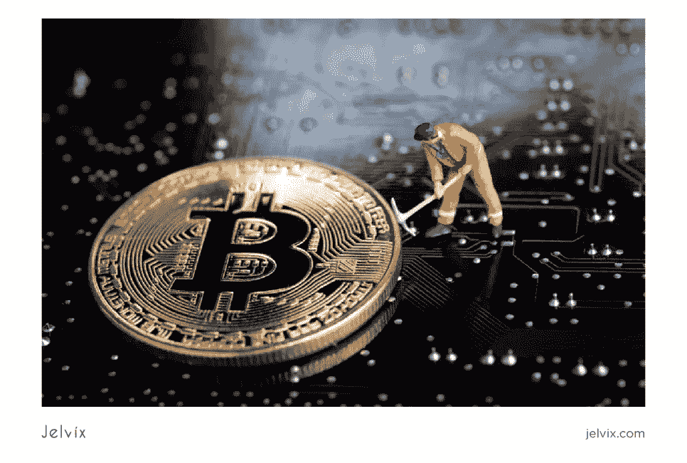

# 比特币替代品有哪些？

> 原文：<https://medium.com/nerd-for-tech/what-are-bitcoin-alternatives-4d45188bc28b?source=collection_archive---------11----------------------->

## 比特币和替代加密货币的未来。

## 让我们对最好的比特币替代品做一个简短的概述。

比特币被认为是一种易变的加密货币。最稳定的是 2011 年，当时它的价格是 1 美元。2017 年 12 月初，差不多 18000 美元，过几天，13800 美元。2018 年 12 月降至 3.300 美元，而 2021 年 4 月为 6 万美元。2021 年 7 月底，降至 3 万美元以下。正如你已经看到的，很难预测投资比特币的最佳时机。同时，还有很多其他加密货币可以考虑投资。

观看此视频，了解更多关于比特币价格历史以及投资需要考虑哪些比特币替代品的信息。