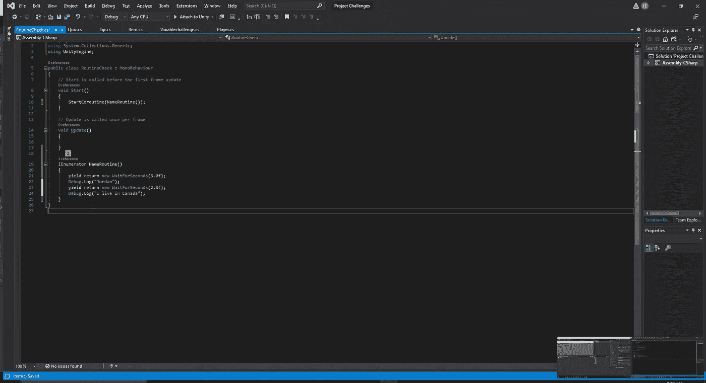
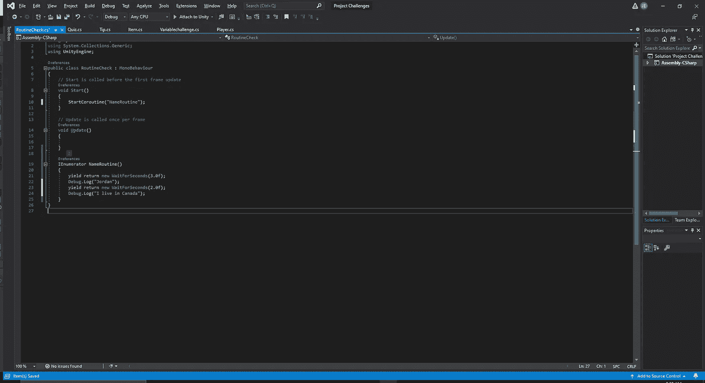
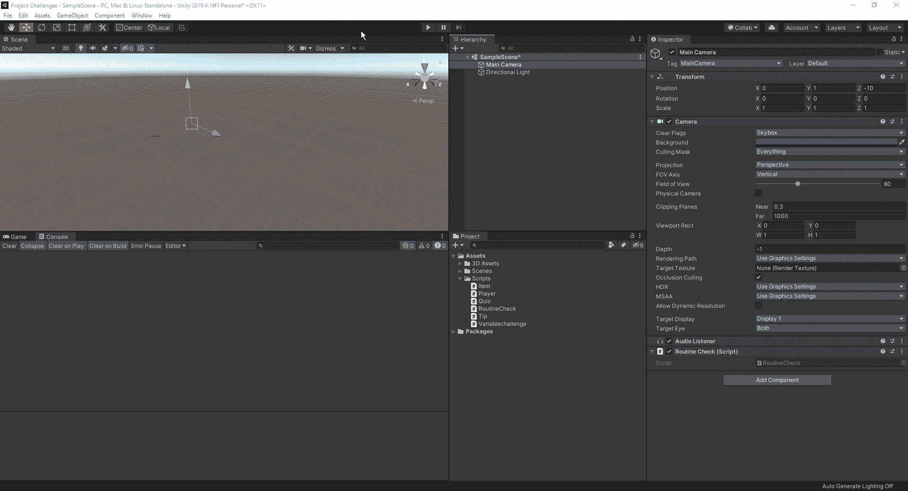
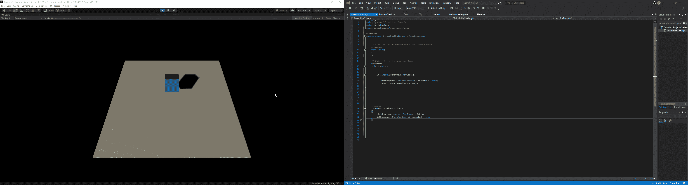

# 什么是协程

> 原文：<https://medium.com/nerd-for-tech/what-are-coroutines-c63b225c3da5?source=collection_archive---------18----------------------->

协程使我们能够让出我们的应用程序，它告诉我们的程序在继续之前等待一段特定的时间。当我们查阅 Unity 手册时，我们可以看到对协程的如下描述:

为了启动我们的协同程序，我们从一个 IEnumerator 开始。这允许我们使用我们的关键字 yield。一旦我们设置了协程，我们就必须设置一行 start 协程代码，以便实现它。有两种不同的方法可以初始化我们的协程，要么是通过字符串，要么是 IEnumerator 类型。这两种方法都有利弊。使用字符串，实现起来有点慢，因为我们必须打出完整的部分，但是你只能用字符串来停止协程。如果我们没有需要我们停止协程的场景，我们可以从类型中调用它。

由类型调用的协程

字符串调用的协程

既然我们已经设置了基本的协程，我们可以在 Unity 编辑器中测试它。

我们可以看到，第一行文本在我们开始游戏 3 秒后出现，下一组文本在 2 秒后出现。

# 魔方示例

现在，让我们利用我们所学的协程程序，让一个立方体消失，3 秒钟后，我们通过按键让它重新出现。首先，我们将创建一个基本的地板和立方体，这样我们就可以在游戏屏幕上看到一些东西。从这里，我们将创建一个新的脚本，并开始放入我们的代码。为了让立方体出现和消失，我们可以简单地访问立方体的网格渲染器，并将其设置为 false，使其从我们的游戏屏幕中消失。事后，我们可以设置定时器，让它在 3 秒后像“魔术”一样重新出现。

现在我们已经对协程的工作原理有了一点了解，我们可以回到我们的游戏，看看这种编码方法是如何使用的。