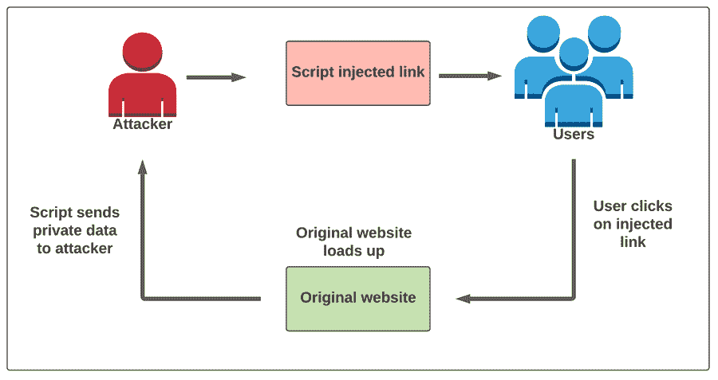

# 什么是跨站点脚本攻击以及如何防止它们

> 原文：<https://medium.com/nerd-for-tech/what-are-cross-site-scripting-attacks-and-how-to-prevent-them-bf5f49cd2dcd?source=collection_archive---------21----------------------->

考虑这样一个场景，您正在网站上登录您的帐户。你输入你的用户名，然后输入你的密码。但是当你点击“回车”时，页面就会加载并再次弹出同样的登录界面。

你认为你可能输入了错误的密码。所以你再次输入你的用户名和密码。只有这一次你能够登录到你的帐户。完成工作后，关闭选项卡。

但是第二天早上你会大吃一惊。您的帐户已被暂停，您已无法访问您的大多数社交媒体帐户。你尝试不同的密码，但它不起作用。您还尝试刷新页面并输入您的登录凭证，但仍然不起作用。这正是你意识到自己被黑了的时候。

当你不知道你什么时候被黑的时候，你在互联网上寻找答案。这时，您意识到您昨天访问的网站遭到了脚本攻击。

在本帖中，我们将探讨一种叫做跨站脚本的脚本攻击。

**目录**

1.  什么是跨站脚本？
2.  脚本攻击是如何进行的？
3.  跨脚本攻击有哪些类型？
4.  防止跨脚本攻击的不同方法有哪些？
5.  裁决

# 什么是跨站脚本攻击？

跨站点脚本是黑客用来在不同用户的浏览器中执行 Javascript 代码的一种技术。全世界的攻击者都非常常用它来窃取个人数据。

然而，跨站脚本并不只是针对你或网站上任何特定的访问者。它被设计成一种针对网站所有访问者的大规模攻击机制。换句话说，它旨在窃取所有登录网站的访问者的数据。攻击代码成为网站的一部分，随请求一起提交给用户的电脑。在某种程度上，你可以说你的网站在帮助攻击者获取你的数据方面也发挥了巨大的作用。

# 跨站脚本攻击是如何进行的？

简而言之，跨站点脚本攻击包括在网站中添加一些恶意代码脚本。

此代码可以添加到需要用户输入来执行操作的页面上。例如，网站访问者可以对博客文章和新闻文章发表评论。但是，他们需要登录才能对这些帖子发表评论。因此，这些地方是黑客将他/她的恶意代码插入网站的高机会。

攻击者真正需要做的只是以注释的形式插入代码。一旦评论被发布并直播，每个登录博客的访问者的数据都会被盗。

攻击是这样发生的:

1.  黑客以注释的形式输入攻击代码
2.  恶意代码现在成为网站的一部分
3.  访问者点击网络链接并在他们的计算机上打开页面
4.  代码也随页面数据一起下载
5.  用户点击“登录”按钮进行评论
6.  他/她被重定向到黑客创建的重复登录页面
7.  访问者输入他们的数据并点击“输入”
8.  当用户保存他们的登录数据时，他们被重定向到原始登录页面
9.  他们感到困惑，并重新输入登录凭证
10.  现在，他们已经登录到自己的帐户
11.  用户对窃取其用户数据的脚本攻击一无所知
12.  他们发表评论，然后继续他们的生活
13.  另一方面，黑客利用他们的宝贵数据留下令人讨厌的评论，甚至窃取他们的社交媒体账户

所有这一切都发生在访问者不知道他们珍贵的数据被未知黑客窃取的情况下。

# 跨脚本攻击有哪些类型？

## 存储的 XXS

常见的交叉脚本攻击有三种类型

当攻击的有效负载存储在本地数据库中时，就会发生这种攻击。当访问者试图从特定存储中检索数据时，攻击就会开始。

## 反映了 XSS

这在负载是请求的一部分的情况下很常见。搜索结果是反射 XSS 攻击可能发生的地方的一个很好的例子。要求用户输入数据的网站也是 XSS 反射攻击的常见区域。

## 基于 DOM 的 XSS

当通过修改网站的 HTML DOM 触发有效负载时，就会发生这种攻击。

# 防止跨脚本攻击的不同方法有哪些？

防止跨脚本攻击没有固定的方法。黑客想出了各种方法来利用网站中的漏洞。然而，通过以适当的方式净化用户输入，可以防止跨脚本攻击。这里有一些措施来确保用户的输入不会从你的网站上被窃取。

## 添加 Allowlist 值的概念

您可以做的第一步是将用户数据限制为特定的 allowlist 值。添加下拉列表是这个概念的一个很好的例子。但是，这只适用于预先确定的值，而不适用于自定义值，如用户名。

## 尽量避免和限制 HTML 输入

虽然丰富的内容可能需要 HTML，但它应该仅限于可信用户。如果您允许对输入进行样式化和格式化，那么您应该考虑使用其他方法来生成内容，比如 Markdown。

最后，如果您确实使用 HTML，请确保使用强大的杀毒工具(比如 DOMPurify)来清除所有不安全的代码。

HTML 代码只在网站内容丰富时需要。更重要的是，它应该只限于在你的网站上被信任的用户使用。但是，如果您允许用户对他们的条目进行样式和格式设置，这可能会给您带来问题。在这种情况下，您需要找到其他方法来生成降价。

## 永远净化你的价值观

当您在页面中使用用户生成的内容时，请通过将不安全的字符替换为它们各自的实体来确保它不会产生 HTML 内容。实体具有与常规字符相同的外观，但不能用于生成 HTML。

当你在你的页面上使用 UGC(用户生成内容)时，一定要净化你的价值观。确保您的内容不会导致 HTML 内容被不安全的字符替换。确保实体的外观与网站上的常规字符相同。这种方式不能用于生成 HTML 代码。

# 裁决

当您采取正确的措施来防止跨站点脚本攻击时，它们是可以预防的。始终遵循安全程序，并不断更新您的网站，以确保它不会受到外部实体的攻击。

*原载于*[*https://www . partech . nl*](https://www.partech.nl/nl/publicaties/2021/05/what-are-cross-site-scripting-attacks-and-how-to-prevent-them)*。*