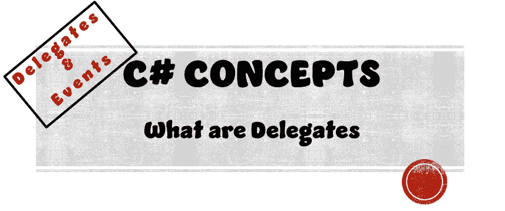

# 什么是代表

> 原文：<https://medium.com/nerd-for-tech/what-are-delegates-91cfdb2537fd?source=collection_archive---------1----------------------->

## C#概念|委托和事件

> **目的:**
> 了解 C#概念代表



首先，让我们用简单的英语看看代表是什么意思。

***代表****——被派遣或授权代表他人的人，特别是被派遣参加会议的民选代表*

现在让我们将这个定义转换成软件开发的定义。

***Delegate****—被授权代表脚本中其他方法的对象。*

# 什么是委托变量？

我们需要了解代表的两个方面。
**1。**类型
类型 **2。**实例

## 类型

委托类型定义委托实例可以调用的方法种类。它包含我们的实例必须匹配的方法签名。

**什么是方法签名？** 方法签名是方法需要匹配的模板。

> **方法签名模板**
> 
> -返回类型
> -方法名(名称不需要匹配，每个方法只需要一个)
> -参数(如果有)

例如，假设我们声明了以下方法…

私有空健康检查(int health)

上面声明的方法的方法签名是…

*   **返回类型** — *作废*
*   **方法名** — *健康检查*
*   **参数** — *一个整数值*

要声明一个委托类型，我们需要像创建任何其他变量一样创建它，但是使用关键字 *DELEGATE* 。

```
public delegate void CheckScore(int points);
```

## 情况

委托实例是我们正确使用委托所需要的下一个东西。委托实例有两个部分。
**1。**委托
类型的变量 **2。**将我们的新变量实例化为与我们的方法签名相匹配的方法

**第一步——Delegate** 类型的变量上面，当我们经历了什么是方法签名时，我们创建了 Delegate**public Delegate void check score(int points)**。

为了创建 delegate 类型的变量，我们将变量声明为 public/private，并使用 Delegate 的关键字(在本例中，该关键字是 HealthCheck)，然后最后给这个变量一个惟一的名称。

```
public CheckScore onCheckScore;
```

**第二步——将我们的新变量实例化为与我们的方法签名相匹配的方法**

所以为了实例化委托变量的方法，我们需要创建一个方法。

```
public void AddScore(int points)
{
  _score += points;
  Debug.Log("You have " + _score " points!");
}
```

创建了上面的方法后，我们现在可以实例化我们的委托了。我们可以使用这个方法，因为它符合我们的方法特征。

*   返回类型都是 void
*   他们都有名字
*   两者都需要整数值的参数

为了实例化我们的方法的委托，我们需要将下面的代码放到我们的 Start()或 OnEnable()方法中。

```
OnScoreCheck = AddScore;
OnScoreCheck(5);
```