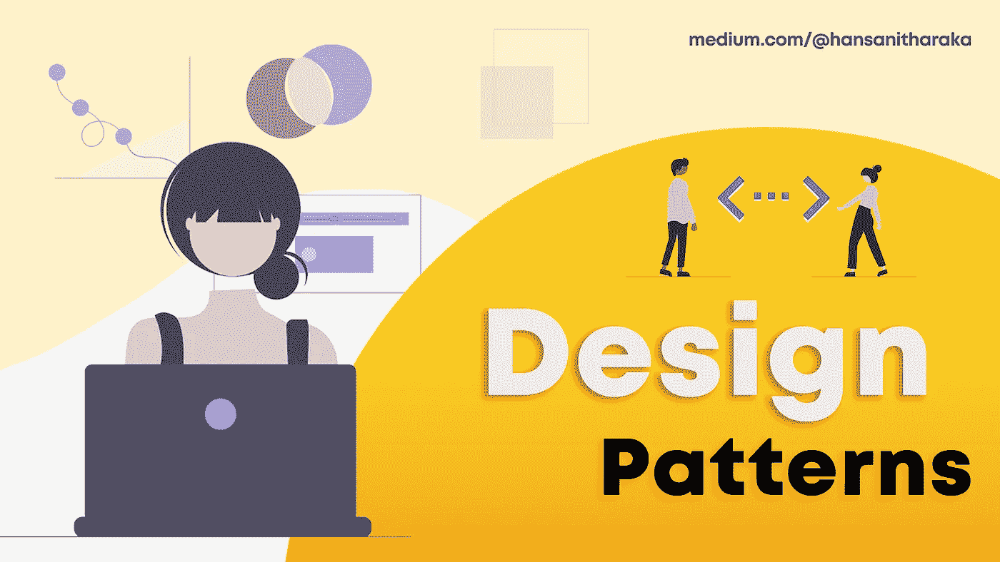

# 什么是设计模式？

> 原文：<https://medium.com/nerd-for-tech/what-are-design-patterns-81e249604da9?source=collection_archive---------20----------------------->

在进行项目时，您可能会遇到类似“我如何才能停止重复相同的代码..”这样的问题或者“耦合得太紧了..”，想知道有没有解决的办法。

您可能已经在不知不觉中使用了一种设计模式。或者你可能已经实现了一个新的模式。所以，为什么不学呢…？😀

首先，让我们从一个恰当的定义开始。

> 根据维基百科，
> 
> 在软件工程中，**软件设计模式**是一种通用的、可重用的解决方案，用于解决软件设计中给定上下文中经常出现的问题。

简而言之，有人已经走过那条路并幸存下来了。😅

这些都是经过测试和验证的概念，代表了有经验的面向对象开发人员使用的最佳实践。

这并不意味着必须使用设计模式。当然，没有这些，你仍然可以写出更好的代码。更复杂的代码并不意味着它是最好的。😶

但是也可能有这样的情况，你只是想让它变得更简单。为此，您不仅需要了解这些模式，还需要了解何时以及如何使用它们。你不想让你的代码有更多的错误，对吗？🙄

# #为什么它如此重要？

*   无论你是在开发一个网站，一个游戏，一个移动应用程序，无论是什么，这些模式都适用于它们。
*   尽管它不依赖于特定的语言或环境，但它最适合面向对象的语言。但这并不意味着它对其他语言不起作用。
*   设计模式不是一段代码。它是一种概念或想法，告诉你在特定的情况下应该如何做特定的事情。

## -是算法吗？🤔

它们经常被误认为是算法。然而，算法仍然有一套明确的行动。但是设计模式更多的是一个描述性的解决方案，你可以根据你的问题来定制。

# **#什么时候以及为什么要学？**

*   **如果你是编程新手，**刚开始也许这不适合你。在进入设计模式之前，您仍然需要对 OOP 概念有一个基本的了解。
*   另一方面，如果你已经编码有一段时间了，并且对 OOP 概念有一些经验，那么现在是你的最佳时机。
*   如果没有这些，你可能会成为一名开发人员，但是如果你想成为一名专家，从学习设计模式开始。
*   此外，它是一种开发人员可以使用的通用语言，可以让您更有效地交流。“就你这个独生子来说..”，就这么简单。😄

# #设计模式从何而来？

好问题。

模式的概念最早是由 Christopher Alexander 在一本名为“模式语言”(1977 年)的书中介绍的，他在书中谈到了一种新的语言，这种语言基于从架构的角度称为模式的单元。

这个想法后来被四个作者继承:E **rich Gamma，John Vlissides，Ralph Johnson 和 Richard Helm，被称为四人组(GOF)** 。他们出版了**[**设计模式:可复用的面向对象软件**](https://www.amazon.com/gp/product/0201633612/)**，总共描述了 **23 种设计模式**。****

****根据 GoF 设计模式，这 23 种模式被分为三大类。****

*   ******创建:**提供不同的方法来创建对象。****
*   ******结构性:**解释对象之间的关系。****
*   ******行为:**解释物体之间的交流/互动。****

# ******#结论******

****我希望这个简短的介绍能帮助你理解设计模式。从现在开始，让我们使用一些用 Java 编写的例子来学习一些重要的设计模式。****

****查看这些参考资料，了解更多的编码示例。😊****

*   ****[https://refactoring.guru/design-patterns/examples](https://refactoring.guru/design-patterns/examples)****
*   ****[https://www . journal dev . com/1827/Java-design-patterns-example-tutorial](https://www.journaldev.com/1827/java-design-patterns-example-tutorial)****

****直到下次，继续探索！！！🤓💪****