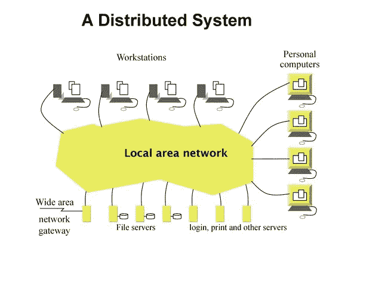

# 什么是分布式系统？

> 原文：<https://medium.com/nerd-for-tech/what-are-distributed-systems-75b93208aae0?source=collection_archive---------6----------------------->

# 定义

分布式系统是具有位于不同节点(机器)上的多个组件的系统，这些组件进行通信并协调动作，以便对最终用户表现为单个系统。

作为分布式系统一部分的节点可以是计算机、物理服务器、[容器](https://blog.stackpath.com/containers/)或任何其他可以连接到网络、具有本地存储器并通过传递消息进行通信的节点。

尽管分布式系统有时可能很难理解，但它们通常有三个主要特征:所有组件并发运行，没有全局时钟，所有组件的故障彼此独立。

# 分布式系统的优势

## **水平可扩展性**

横向扩展将工作负载分布在许多资源上。松散耦合的系统允许您将系统分布在不同的资源上，并提供更好的可用性。

## **可靠性**

大多数分布式系统都是容错的，因为它们可以由数百个协同工作的节点组成。如果单台机器出现故障，系统通常不会出现任何中断(避免单点故障)。

## **性能**

分布式系统非常高效，因为工作负载可以被分解并发送到多台机器上。

## **性价比**

初始成本高于传统系统，但由于其可扩展性，它们很快变得更具成本效益

## **平行度**

分布式系统可以被设计成并行的，多个处理器把一个复杂的问题分成几个部分

# 分布式系统的挑战

然而，分布式系统并非没有挑战。创建一个有效的分布式系统所需的复杂的体系结构设计、构建和调试过程可能会令人难以招架。

## **故障处理**

对于分布式系统，故障处理可能很困难，因为一些组件出现故障，而其他组件继续工作。这通常可以作为防止大规模故障的优势，但是当涉及到故障排除和调试时，这也导致了更多的复杂性。

## **等待时间**

您的系统分布得越广，通信的延迟就越大。

## **并发**

当几个客户端试图同时访问共享资源时，会出现一个常见问题。您必须确保所有资源在并发环境中是安全的。

## **较高的初始基础设施成本**

分布式系统的初始部署成本可能高于单一系统。这种定价包括基本的网络设置问题，如传输、高负载和信息丢失。

# 分布式系统的例子

# 分布式数据库

在分布式数据库系统中，属于单个逻辑数据库的数据被分布到两个或更多的物理数据库，以确保可靠性和可用性

## 我们使用分布式数据库来:

*   提高可靠性和可用性
*   更好的反应
*   模块化开发
*   减少网络上的数据移动
*   较小的数据库更容易管理
*   较小的数据库速度更快
*   数据库分片可以降低成本

# 分布式数据库的类型

## 分身术

数据库复制可用于提供具有数据库后端的容错。您只需要确保您的数据库平台支持它。您还需要确保应用程序以有利于复制的方式存储数据

## 分片

分片是将大表分割成更小的块的过程，这些块被称为分片，分布在多个服务器上。其思想是将无法在单个节点上存储的数据分布到一个数据库节点集群上。

# 微服务

微服务是构建应用程序的一种架构方法。作为一个架构框架，微服务是分布式的、松散耦合的服务，它们通过网络相互通信

# 微服务的优势

微服务近年来变得非常受欢迎。

**因为一些类似**的原因:

*   您可以使用不同的编程语言和开发工具在不同的平台上开发和部署每个微服务。这种灵活性使我们能够根据需要在单个服务上尝试新的技术堆栈。
*   隔离服务具有更好的容错能力。毕竟，维护和调试轻量级微服务比复杂的应用程序更容易。
*   更小更快的部署:团队可以独立开发、维护和部署每个微服务
*   可伸缩性:因为您的服务是独立的，所以它的可伸缩性更好，因为您可以在任何需要的时候单独伸缩它们。

# 微服务的缺点

微服务架构不是灵丹妙药，它有一些缺点，例如:

*   服务之间的通信是复杂的:由于现在一切都是独立的服务，在这样的场景中，开发人员可能被迫编写额外的代码来避免中断。
*   更多的服务意味着更多的资源:多个数据库和事务管理可能会很痛苦。
*   全局测试是困难的:测试一个基于微服务的应用可能是困难的。在整体方法中，我们只需要在应用服务器上启动我们的测试运行程序，并确保它运行良好。
*   调试问题可能更难:每个服务都有自己的一组日志要检查。日志、日志和更多日志。
*   部署挑战:产品可能需要多个服务之间的协调，这可能不像在容器中部署单个应用程序那样简单。

# 结论

在这篇文章的最后，是一些阅读和获取更多知识的资源

*   [**什么是微服务？**](https://microservices.io/)
*   [**分布式数据库系统**](https://link.springer.com/referenceworkentry/10.1007%2F978-0-387-39940-9_701)
*   [**什么是分布式系统？**](https://blog.stackpath.com/distributed-system/#:~:text=A%20distributed%20system%2C%20also%20known,system%20to%20the%20end%2Duser.)