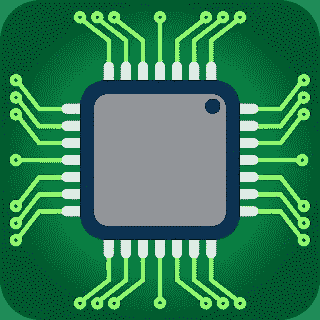

# 什么是嵌入式系统？

> 原文：<https://medium.com/nerd-for-tech/what-are-embedded-systems-726145ff5ad4?source=collection_archive---------4----------------------->

# 定义

在周围环境中稳定而强烈的物体；被包围。

例如:“嵌有九颗宝石的金戒指”

嵌入式系统:

嵌入式系统是计算机硬件和软件的混合体，是固定的或可编程的，是为一个更大的系统中的一个或多个特定功能而设计的。

示例:

1.  HVAC(供暖、通风和空调)系统
2.  ABS(防抱死制动)系统。

# 发展

阿波罗制导计算机被认为是第一个嵌入式系统。它是由麻省理工学院仪器实验室的查尔斯·斯塔克·德雷珀于 1965 年发明的。Autonetics D-17 制导计算机是 1961 年发布的主要批量生产的嵌入式系统。1966 年民兵 II 投产时，D-17 制导计算机被一台新的计算机取代。这标志着第一次大规模使用组合电路。英特尔 4004 于 1971 年发布。它是为计算器和其他小型系统设计的。这对于外部存储器和支持芯片仍然是必不可少的。

到 20 世纪 80 年代早期，存储器输入和输出系统组件已经被结合到与处理器相同的芯片中，形成了微控制器。一个相当低成本的微控制器可以实现自动化，以实现相当于当今大量不同组件的作用。它可能用控制器来代替昂贵的旋钮式模拟元件。例如组件；电位计和可变电容器，带有由微处理器读出的上下按钮或旋钮。

# 应用程序

通常，嵌入式系统源自工业、消费、家用电器以及汽车、医疗、电信、商业和军事应用。许多嵌入式系统服务于电信系统中的电话交换机和终端用户的手机网络。至于消费电子产品，它包括电视机、MP3 播放器、移动电话、视频游戏机、数码相机、全球定位系统接收器和打印机。[家电包括洗衣机、微波炉和洗碗机。](https://www.technologiesinindustry4.com/)HVAC 系统实践交互恒温器，以额外精确和胜任地控制可能随一天中的时间和季节而变化的温度。嵌入式系统正被用于从飞机到汽车的运输系统中。

它还用于医疗设备的监控和多种医学成像。医疗设备中的嵌入式系统通常由工业计算机驱动。嵌入式系统可以被设计成具有更好的能力来承受更高的温度，并继续运行以保证消防安全。这可以是独立的，并且能够在处理安全时与切断的电气和通信系统紧密结合。

# 特征

嵌入式系统不是一台多任务的通用计算机，而是为一些特定的任务做准备。类似地，出于安全性和可用性等原因，一些应用程序具有实时性能限制。其他的可能具有低性能或没有性能要求，以允许系统硬件易于降低成本。众多嵌入式系统在一个更大的设备中包含更少的部件，有助于实现更通用的目的。汽车中的嵌入式系统作为车厢本身的子系统，提供了明确的功能。为嵌入式系统编写的程序指令被称为固件。这些存储在只读存储器或闪存芯片中。它们在有限的计算机硬件资源下运行，例如小屏幕、不存在的键盘和很少的内存。

# 嵌入式系统编程组件

*   微处理器/微控制器
*   外围设备
*   传感器和输入设备
*   执行器和输出设备
*   登记
*   协议

# 微处理器:

微处理器是一种计算机处理器，它将中央处理器的功能集成在一块集成电路上。微处理器是一种多功能、基于寄存器、时钟驱动的数字集成电路。作为输入，它接收二进制数据，根据存储在其内存中的指令进行处理，并将结果作为输出。

*   就是一个只有 CPU(处理能力)的 IC。
*   他们发现任务不明确的应用程序，如开发游戏、网站、照片编辑等。
*   他们运行操作系统。

# 微控制器:

微控制器是片上系统。不像计算机有许多分立的部件，它有所有的 CPU(处理器核心)、内存和输入/输出外设。这使得用最少的部件数量构建系统成为可能。

*   它有一个 CPU 以及 RAM、ROM 和其他外设都在一个芯片上。
*   它们被设计来执行特定的任务。(即汽车、自行车、微波炉)
*   他们运行裸机

# 外围设备

外围设备是一种辅助设备，用于向计算机输入信息和从计算机中获取信息。[嵌入式系统通过外设](https://www.technologiesinindustry4.com/)与外界协商。下面是外设的例子。

*   SCI 或串行通信接口:RS-232、RS-422、RS-485 等。
*   同步串行通信接口:I2C、SPI、SSC
*   通用串行总线(USB)
*   MMC 或多媒体卡(SD 卡、闪存卡等。)
*   网络:以太网、LonWorks 等。
*   现场总线:CAN 总线、LIN 总线、PROFIBUS 等。
*   定时器:PLL、捕获/比较和时间处理单元
*   离散输入输出:又名通用输入输出(GPIO)
*   模数转换/数模转换(ADC/DAC)
*   调试，如 JTAG、ISP、BDM 端口、BITP 和 DB9 端口。

# 传感器和输入设备

传感器是精密的设备，通常用于识别和响应电信号或光信号。

示例:

*   温度传感器
*   红外(PIR)传感器
*   触摸传感器
*   压力传感器

# 执行器和输出设备

致动器是机器的组成部分，负责移动和控制机构或系统，例如通过打开阀门。

示例:

*   电动机
*   螺旋千斤顶
*   液压缸

# 登记

处理器寄存器或 CPU 寄存器是计算机处理器片上的一组数据保存位置中的一个。一个寄存器可以保存一条指令、一个存储地址或任何种类的数据，例如一个微小的序列或单独的字符。各种命令需要寄存器作为指令的一部分。例如，一条指令可以规定将两个已定义寄存器的内容相加，然后放入一个指定的寄存器中。

# 协议

协议是允许电子设备相互通信的一组典型规则。这些规则涵盖了可以传输的数据类型、用于发送和接收数据的命令以及如何确认数据传输。

示例:

*   I2C:内部集成电路
*   SPI:串行外设接口
*   USART/UART:通用同步/异步收发器。

更多详情请访问:[https://www . technologiesinindustry 4 . com/2020/11/what-are-embedded-systems . html](https://www.technologiesinindustry4.com/2020/11/what-are-embedded-systems.html)