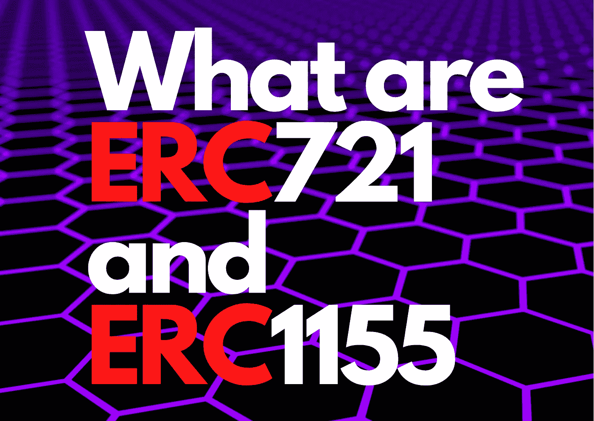
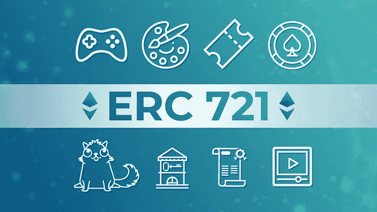

# 什么是 ERC-721 和 ERC-1155

> 原文：<https://medium.com/nerd-for-tech/what-are-erc-721-and-erc-1155-44b1eb592d87?source=collection_archive---------0----------------------->

*新一代令牌基础*

## 什么是 ERC 721 合同？

ERC 721**是一个代表不可替换令牌所有权的标准**，也就是说，每个令牌都是唯一的。ERC721 是一个比 ERC20 更复杂的标准，具有多个可选扩展，并被划分到多个合同中。

ERC-721 是**一个开放标准，描述了如何在 EVM(以太坊虚拟机)兼容的区块链**上构建不可替换的令牌；它是不可替换令牌的标准接口；它有一套规则，使得使用 NFTs 很容易。非功能性测试不仅仅是 ERC-721 型；它们也可以是 ERC-1155 代币。

## 什么是 ERC 1155？

ERC1155 是一种新颖的令牌标准**,旨在从以前的标准中吸取精华，创建一种不可知可替代性且节能的令牌契约**。ERC1155 汲取了所有 ERC20、ERC721 和 ERC777 的理念。如果你对这些标准不熟悉，在继续学习之前先去看看它们的指南。

ERC-1155 标准**允许对智能合约**中包含的令牌进行大规模本地传输。这样，例如，如果我们有一系列 NFT 令牌或可替换令牌(或两者都有)，我们可以在同一个操作中转移这些令牌中的几个，使单个操作使这种转移有效。

# 什么使得可替换令牌不同于不可替换令牌？

# 可替换令牌不是唯一的

可替代代币类似于法定货币，因为它们是可兑换的，并且可以与同类型的其他代币分割开来。例如，一美元等于另一美元，一个比特币可能以极小的部分购买，如 0.00000002 BTC。ERC-20 是以太坊区块链的代币标准，用于加密货币、游戏角色天赋和金融资产等可替代代币。此外，当在智能合约内交易可替换令牌时，实现了应用编程接口(API)。

# 不可替换的令牌是独一无二的

不可替换令牌是不能与同类型的另一个令牌交换的加密资产。例如，世界上只有一幅《蒙娜丽莎》,也只有一幅由皮普尔创作的“每天:前 5000 天”的艺术品，售价为 6930 万美元。每个 NFT 都有其唯一的标识码以及元数据，如值、属性或特征。ERC-721 是区块链标准，允许交易不可替代的代币，如数字艺术品。

# ERC 1155 令牌标准

金恩的 ERC-1155 是一种多令牌标准，允许实现可替换、不可替换或半可替换令牌的智能合约。ERC-1155 和 ERC-721 一样，允许单个令牌包含信息或其他特征。然而，ERC-1155 是下一代令牌标准，允许同时传输多种令牌。这与 ERC-721 和 ERC-20 不同，后者要求为每个不可替换或可替换令牌部署一个新合同。因此，ERC-1155 消除了单独批准令牌合同的必要性，降低了交易成本和时间。此外，ERC1155 允许代币的原子交换或托管交易，以及在单个合同中描述或混合几种代币。

# ERC 721:第一个创建和交易 NFT 的标准化接口

用 Solidity 语言编写的 ERC-721 是第一个为建立和交易 NFT 而创建的标准化接口，目前被视为黄金标准。ERC-721 是目前使用最广泛的令牌标准，它要求为单个 NFT 部署单个触点。这使得 ERC-721 缓慢和昂贵，但它也允许您调整单个 NFT 的设置，并提供更好的安全性。此外，使用 ERC-721 智能合约铸造或销售 NFT 需要作者遵循严格的交易标准。

# ERC 的好处-1155

## **>** 半可替换代币现在可以兑换和交易。

除了可替换和不可替换的令牌，ERC-1155 还允许部署半可替换令牌。半可替换令牌可以是转换成 NFT 的可替换令牌，也可以是转换成可替换令牌的 NFT。与 ERC-20 和 ERC-721 不同，ERC-1155 是下一代令牌标准，因为它可以同时将数字或现实世界的资产转换为令牌。

## **>** 单个智能合约中可以部署多种令牌类型！

传统令牌标准(ERC-20 和 ERC-721)要求每个不可替换或可替换令牌都有其智能合约。另一方面，ERC-1155 令牌标准允许用户在一个合同下部署无限数量的令牌种类(NFT、可替换和半)。它还允许在单个智能合约内进行大规模令牌传输。ERC-1155 通过将多个代币 id 组合成一笔交易，实现了现金和代币的快速转移。例如，由艺术家发行的包括可替换和不可替换代币的 ERC-1155 智能合约减少了对网络的影响并加快了交易时间。

## >所有交易都是加密的。

使用 ERC-1155 令牌标准的智能合约中提供了检查可接受或不可接受交易的功能。如果交易未能完成，该功能确保代币返回到发行者的钱包。此外，该功能防止令牌被发送到不正确的地址，并允许安全和无障碍的令牌传输。ERC-1155 还跟踪从令牌创建到烧毁的所有过程。

# ERC-1155 的其他优点

*   **汽油费低:**以前，ERC-721 令牌标准因汽油费高和传输时间长而臭名昭著。ERC-1155 标准可以通过为不同的令牌部署单独的合同来帮助削减 90%的天然气费用。
*   **增强的 DEX(分散式交易所)支持:**与 ERC-721 不同，ERC-1155 有利于分散式金融。这是因为 ERC-1155 带有内置代码，DEX 可以通过履行智能合约的某些方面而受益。
*   **工作量更少:**用 ERC-721 令牌标准填充 NFT 的单个细节使这个过程变得单调，并且消耗了比需要多得多的时间。幸运的是，ERC-1155 解决了这个问题，允许发卡行输入更少的细节，从而节省了时间。
*   **动态元数据:**ERC-721 令牌标准使用内置于智能合约中的静态元数据。然而，ERC-1155 令牌标准可以维护无数数量的统一资源标识符或 URI 码。

# ERC 1155 VS ERC 721:哪一个是代币的未来标准？

尽管 ERC-1155 因其降低的汽油费和交易速度而迅速受到欢迎，但 ERC 721 标准不会很快被遗忘。可以分别使用 ERC 721 和 ERC 20 协议来释放单个不可替换和可替换令牌。另一方面，ERC 1155 标准非常适合一次发行几个令牌，以及包括可替换和不可替换令牌的选项。ERC-1155 的唯一缺点是，它保存的数据不太可靠，以节省交易的时间和金钱。因此，ERC 1155 标准在将来会继续流行，用于发行一组代币，而旧的标准对于单个代币将是理想的。

# 结论

在这里，我们了解了 ERC-721 和 ERC-1155，它们的区别，用途和未来的范围，我们也看到了如何先进的城市生活正在移动，以及所有这些将如何影响我们的技术世界。

> *你可以在这里* *买一杯咖啡支持我和我的内容☕* [***。***](https://www.buymeacoffee.com/amanagarwal)
> 
> *关注我上* [***推特***](https://twitter.com/02amanag) *和*[***LinkedIn***](https://www.linkedin.com/in/02amanag/)*。*

# 了解更多信息

 [## 比特币基地与戈朗的贸易

### 如何使用 Golang 接受加密货币支付

enlear .学院](https://enlear.academy/coinbase-commerce-with-golang-cd70b7431cc8)  [## 与 Golang 的智能合同

### 通过 golang 与智能合约交互

medium.com](/nerd-for-tech/smart-contract-with-golang-d208c92848a9)  [## 什么是 ERC-20 代币？

### 在以太坊的世界里，ERC-XXX 或者 EIP-XXXX 的短语经常出现，但是对于以太坊世界的新手来说，这看起来…

enlear .学院](https://enlear.academy/what-is-erc-20-token-853aa8bc3611)