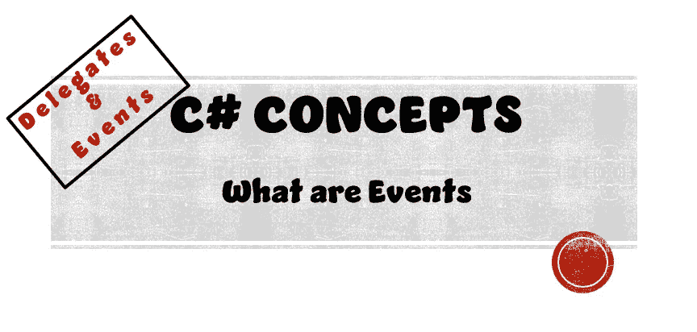
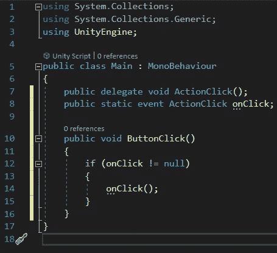
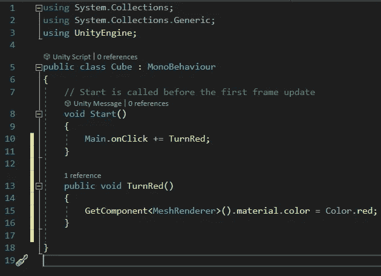
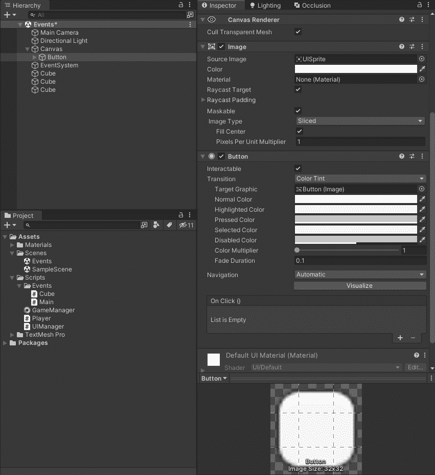
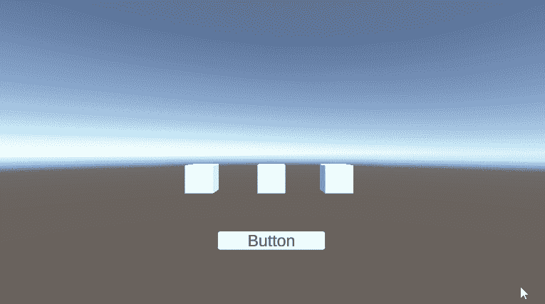

# 什么是事件

> 原文：<https://medium.com/nerd-for-tech/what-are-events-559632b2ddc9?source=collection_archive---------1----------------------->

## C#概念|委托和事件

> 目标:
> 通过编写一个简单的程序，按下屏幕上的一个按钮，将 3 个立方体的颜色变为红色，从而了解事件



# 事件的定义是什么？

根据 **O'Reilly C# 8.0** 的说法，“事件是一种构造，它仅公开广播公司/订户模型所需的代表功能的子集。事件的主要目的是*防止用户相互干扰。*

但这意味着什么呢？让我们把这个定义分解一下，谈谈事件的关键方面。在上面的定义中，在我们尝试使用事件编码之前，有三个关键术语需要理解。

1.  代表
2.  广播公司
3.  订户

## 代表

如果你不知道什么是代表，请 **|** [**点击这里**](/@jordantkay21/what-are-delegates-91cfdb2537fd) **|** 阅读我之前关于代表的文章。

## 广播公司

broadcaster 是一种包含委托字段的类型。广播员的工作是通过调用委托来决定何时广播。

## 订户

订阅者是方法目标接收者。订户通过呼叫广播公司代表的+=和-=来决定何时开始和停止收听广播公司。

一个用户不知道或干扰其他用户。

现在我们已经学习了事件的基本概念，让我们开始使用这个概念进行编码。

# 作事前的现场（或情况）描述

因此，我们已经在上面定义了我们的目标…
*创建一个简单的程序，通过按下屏幕上的按钮*将 3 个立方体的颜色变为红色

## 需要游戏对象

为了完成我们的目标，我们在场景中需要以下游戏对象…

*   三个立方体
*   UI 按钮


## 需要脚本

为了完成我们的目标，我们需要脚本来告诉我们的程序做什么。我们需要以下脚本来完成我们的目标…

*   主脚本
*   多维数据集脚本

# 主脚本

主脚本将保存我们的 onClick 事件。这意味着主脚本将保存委托变量、事件变量和实例化委托的方法。

这个脚本将被附加到我们的画布上。



让我们分析一下这个脚本，弄清楚什么是什么。

## 七号线

```
public delegate void ActionClick();
```

如我们的文章 [**中所述，什么是委托**](/@jordantkay21/what-are-delegates-91cfdb2537fd) 第 7 行用下面的签名声明了一个**委托类型**:

*   返回类型—无效
*   名称—操作单击
*   参数-无

通过创建这个委托，我们创建了一个存储 ButtonClick()方法的变量。

## 八号线

```
public static event ActionClick onClick;
```

在这一行，我们声明了一个委托类型 ActionClick 的事件。让我们逐字逐句地读一遍这一行，看看它在说什么。

*   Public —将此变量设为公共变量，这意味着其他脚本可以访问它
*   静态—使该变量属于“类”而不是“对象”。这意味着不管脚本有多少个实例，变量只有一个副本。
*   事件—将此变量声明为事件。通过这样做，我们创建了一个允许我们的多维数据集向我们的 ButtonClick()订阅的系统
*   ActionClick —将此事件声明为 ActionClick 类型
*   onClick —给我们的事件变量一个唯一的名称

## 第十行

```
public void ButtonClick()
```

这一行简单地声明了一个名为 ButtonClick()的公共方法。

## 第十二行

```
if (onClick != null)
```

这是一行重要的代码。这一行确保我们的事件变量在广播之前有订阅者。如果没有订阅者，则事件为空，没有理由进行广播。

如果有订户，则运行下一行代码…

## 第十三行

```
onClick();
```

实例化我们的事件变量来访问委托变量存储的方法。

# 多维数据集脚本

多维数据集脚本将订阅我们的 onClick 事件。单击按钮后，将运行订阅该事件的任何方法。

这个脚本将被附加到我们的三个立方体。



这个脚本实际上只有两部分需要解释。

1.  **第 10 行** —这是 onClick 事件在这个脚本中被实例化的地方，也是我们为该事件订阅 TurnRed()方法的地方。
2.  **第 13 行** —用改变立方体红色所需的代码创建 TurnRed()方法。

# 试验

在运行程序之前，首先我们需要将 ButtonClick()方法连接到按钮。



完成后，让我们运行我们的程序。



有用！现在让我们讨论它是如何工作的，以及为什么这种编程方式更可取。

使用代理和事件的替代方法是让我们的主脚本知道我们拥有的每一个立方体，运行 for each 循环，然后更改与其关联的每个立方体的颜色。

这个程序*隔离了*我们的脚本的功能，所以画布(我们的主脚本附加到其上)不知道立方体(我们的立方体脚本附加到何处)，并且我们的立方体不知道我们的画布。

这允许我们创建一个功能性的，但是模块化的程序。