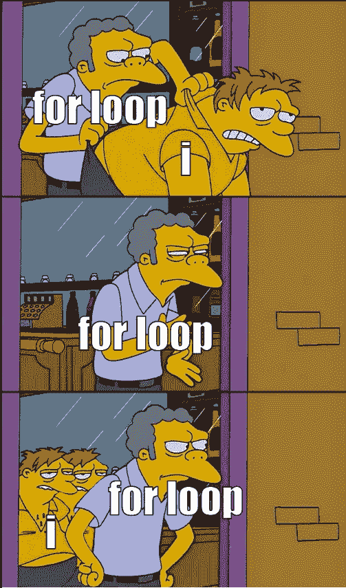
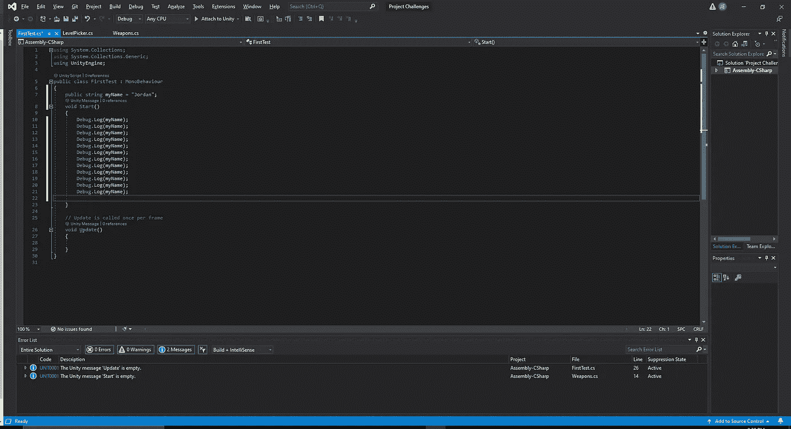
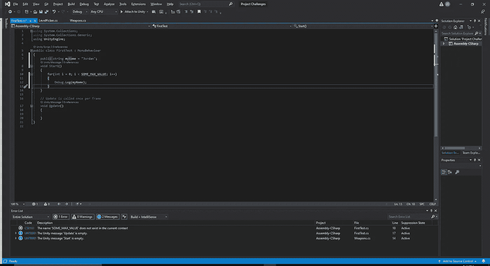
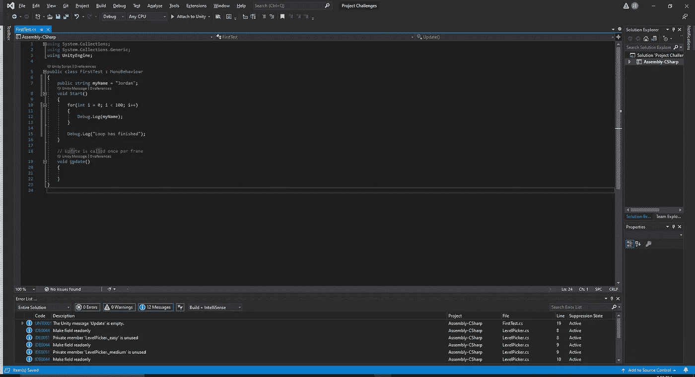
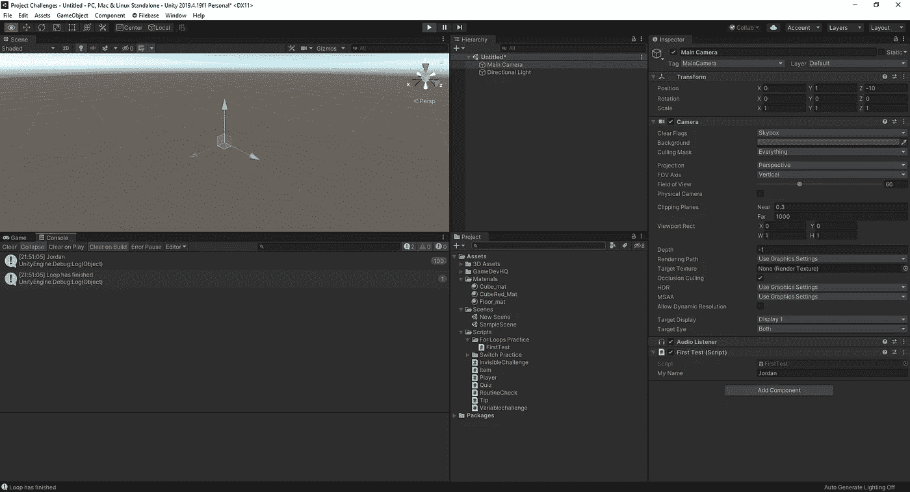
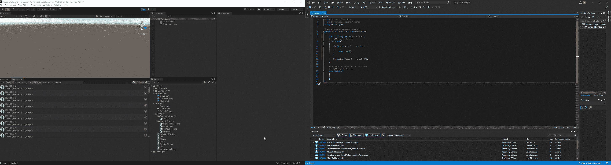
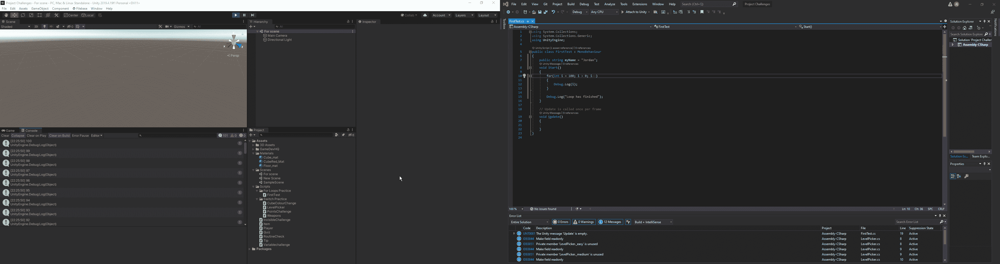
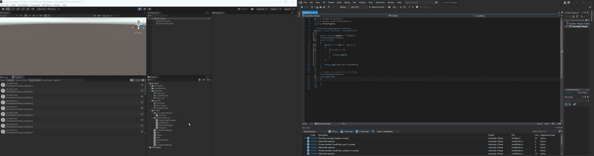
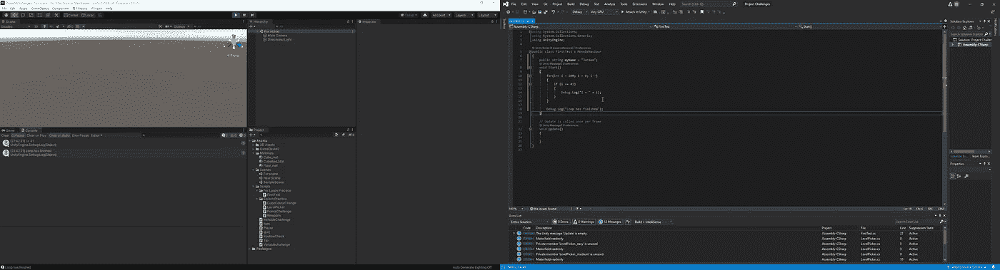
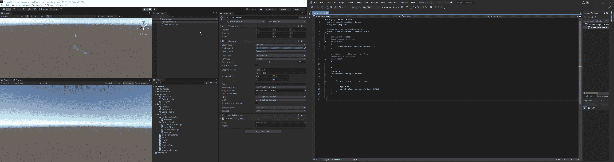

# 什么是循环

> 原文：<https://medium.com/nerd-for-tech/what-are-for-loops-b7215db28e83?source=collection_archive---------30----------------------->

“For”循环用于将特定的代码块重复已知的次数。例如，如果我们想检查班上每个学生的成绩，我们从 1 到那个数字循环。假设我们想把自己的名字打印 100 次。如果我们不使用“for 循环”,我们就必须使用:

现在，复制/粘贴 100 次并不是最有效的方法，如果我们需要数千次，也不会是最有效的方法。在这种情况下，我们可以创建一个“for 循环”。这将使我们编码的速度更快，并且不用担心记录我们粘贴代码的次数。

首先，我们必须从我们的初始代码开始:

正如我们所看到的，for 脚本中有很多不同的东西，但是它们都意味着什么呢？
“int I = 0”的初始部分只是简单地声明我们正在使用的变量，在本例中是 I，等于 0。最让人纠结的是这条语句，因为 I，这只是 C#的标准，因为它是一个 int 值，是一个索引。
下一部分“i < SOME_MAX_VALUE”说明我们希望 int 值增加到什么值。我们在这里使用的实际值是我们希望它达到的值，在这种情况下，我们将表示为 100。
“i++”的最后一部分简单来说就是如果“I”仍然低于我们的最大值，它会给我们的值加 1，直到达到我们的目标。
现在我们对 for 循环代码行的不同部分的含义有了更好的理解，让我们测试一下，在它运行完所有的循环之后，让我们告诉 unity，我们希望看到一个声明，表明它已经完成了它的循环:

当我们在编辑器中测试它时，我们可以看到它运行了 100 次，然后通知我们循环已经完成:

现在，让我们看看这个循环方法还能用于什么。首先，让我们数到 100:

如果我们想从 100 开始递减计数，我们只需将初始 I 值改为 100，将其调整为> 0，然后改为 I--:

假设我们想让它只显示偶数，我们可以在 for 循环中添加几行代码来只选择偶数:

现在你可能会问自己，在这种情况下%会做什么。在编程中,%是模数运算符。模数运算符将给出余数作为答案，而不是完整的数值。所以，如果我们说想说 i = 5，那么 5 % 2 就是 1。所以，在这种情况下，我们告诉 unity 的是，如果最终值=到 0，打印出数字。如果我们想做相反的事情，我们可以简单地告诉 unity = = 1:

现在，假设我们想要找到一个特定的数字，我们要做的是创建一个 if 语句，当找到该值时，它将打印我们想要的内容:

至于这与游戏有什么关系，你会问，如果我们有一个装满一堆物品的库存，我们想找到一个特定的，我们会将游戏的搜索功能连接到一个 for 循环，玩家的搜索查询将是显示的 1 值(或多个，如果他们有多个项目)。

另一个使用 for 循环的例子是我们在玩暗黑破坏神中的恶魔猎手。如果我们对她使用一个 AoE 技能，我们需要在这个区域的每个人之间运行一个循环来对她造成适当的伤害。

现在，如果我们想早点退出循环，我们可以使用 break 方法来退出:

至于在我们可以看到正在发生什么的场景中会是什么样子，让我们通过使用一个协程来稍微减慢倒计时，我们之前已经讨论过了 [**这里**](/nerd-for-tech/what-are-coroutines-c63b225c3da5) **:**

正如我们所看到的，我们可以看到每 0.1 秒，一个新的苹果被添加到我们的计数器中，当它达到 50 时，计数器停止。至此，我们对 for 循环的使用有了一个非常基本的了解，我们可以看看将来我们会如何在游戏中使用它。