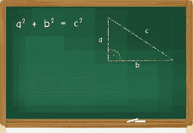

# 什么是 JavaScript 数学表达式？

> 原文：<https://medium.com/nerd-for-tech/what-are-javascript-math-expressions-9528d57e0228?source=collection_archive---------16----------------------->

# 介绍

JavaScript 是一种遵循 ECMAScript 规范的编程语言。它是一种高级的、实时编译的多范例语言。JavaScript 具有动态类型、花括号语法、基于原型的面向对象和一流的功能。它是万维网的核心技术之一。庞大的主流网站将其用于客户端页面行为。数学是生活中重要的一部分，没有它我们走不了多远。当我们学习 JavaScript 编程时，尤其如此。我们确实依赖于处理数字数据、计算新值等等，所以当我们得知 [JavaScript](https://www.technologiesinindustry4.com/) 有一套功能齐全的数学函数时，我们不会感到惊讶。

# 熟悉的操作员

我们可以在任何可能用到数字的地方使用数学表达式。例如，我们熟悉这种说法。

var popular number = 4；但是我们也可以这样写。var popular number = 2+2；我们也可以写:alert(2+2)；

这将在警告框中显示消息“4”。

当 JavaScript 看到数学表达式时，它总是进行数学运算并输出结果。下面的语句从 12 中减去 24，将-12 赋给变量。

var popular number = 12–24；

这个函数将乘积赋给变量 3 乘以 12，36。

var popularNumber = 3 * 12

在这个例子中，数字 10 被分配给一个变量。然后将变量加 1，并将和 210 赋给第二个变量。

我们可以像往常一样混合变量和数字。

1 var num = 10

2 var popular number = num+200；

我们也可以只使用变量。

1 var num = 10

2 var another num = 1；

3 var popular number = num+another num；

我们一直在使用的算术运算符，+，-，*和/，无疑是我们所熟悉的。

这个可能不是:

var whatsLeftOver = 10% 3；

%是模数运算符。它没有给出一个数除以另一个数的结果。当执行除法时，它给出余数。如果一个数被另一个数整除，则取模运算返回 0。在下面的语句中，0 被赋给变量。

var whatsLeftOver = 9% 3；

# 有用数字法

我们将在 JavaScript 中使用数字对象。[这些是代表所有标准数字的实例。上面有许多有用的方法可以让我们处理数字。一旦我们将本模块通读几遍，就值得去对象参考页了解更多可用的内容。](https://www.technologiesinindustry4.com/)

例如，使用 toFixed()方法将数字四舍五入到固定的小数位数。在浏览器的控制台中键入以下行:

设 lotsOfDecimal = 1.766584958675746364；

lotsOfDecimal

let two decimal places = lotsofdecimal . to fixed(2)；

两个十进制位；

# 不熟悉的操作员

有一些专门的数学表达式我们需要知道。这是第一个。

num++；

这是一种简短的写作方式…

num = num+1；

它将变量递增 1。我们用减号而不是加号来减量。

num-；

我们可以在作业中使用这些表达。但结果可能会让我们大吃一惊。

1 var num = 1

2 var new num = num++；

在上面的例子中，Num 的初始值被赋给 newNum，num 是

之后递增。[如果 num 最初在第一条语句](https://www.technologiesinindustry4.com/)中被赋值为 1，则第二条语句将其值提升为 2。newNum 获取 Num 的原始值，1。如果我们把加号放在变量前面，我们会得到不同的结果。

1 var num = 1

2 var new num = ++ num；

在上面的语句中，num 和 newNum 的值都是 2。如果我们在变量后面加上负号，新变量就会被赋予原来的值，第一个变量就会递减。

1 var num = 1

2 var new num = num-；

Num 递减到 0，newNum 得到 num 的原始值 1。但是如果我们在变量前面加上减号，newNum 就被赋予一个递减的值，而不是原来的值。num 和 newNum 最终的值都是 0。

1 var num = 1

2 var new num =–num；

# 复数算术表达式

我们可能还记得高中代数，复杂的算术表达式可能会造成问题。下面是总成本的价值示例。

var 总成本= 1+3 * 4；

根据我们做算术的顺序，总成本的值是不同的。如果

我们先将 1 + 3 相加，然后将总和乘以 4，totalCost 的值为 16。但是如果我们反过来，从 3 乘以 4 开始，然后在乘积上加 1，我们得到 13。

JavaScript 中的模糊性和代数中的一样，通过优先规则来消除。与代数一样，这里适用的规则是乘法运算在加法运算之前完成。因此 totalCost 的值为 13。

我们不必记住 [JavaScript 复杂的](https://www.technologiesinindustry4.com/)优先级规则。我们可能会机智

这个问题通过使用圆括号来消除歧义。括号取代了所有内置的优先规则。它们强制 JavaScript 在完成任何其他操作之前完成括号中的操作。这也使得我们的代码更容易理解，无论是对其他程序员还是对我们自己，当我们一年后试图理解我们自己的代码时，我们使用括号向 JavaScript 表明我们的意图。括号告诉 JavaScript 先将 3 乘以 4，然后加 1。结果:该语句中有 13 个。

var total cost = 1+(3 * 4)；

如果我们移动括号，运算的顺序就不同了。括号的位置告诉 JavaScript 在下一条语句中首先将 1 和 3 相加，然后乘以 4。结果是 16。

var total cost =(1+3)* 4；

这是另一个例子。

var resultOfComputation =(2 * 4)* 4+2；我们已经告诉 JavaScript 通过将第一个乘法运算放在括号内来首先执行该运算。但是然后呢？顺序可以是，

1.  将 2 乘以 4。
2.  将乘积乘以 4。
3.  如果计算结果值为 34，则加 2。或者顺序可以是…
4.  将 2 乘以 4。
5.  将该乘积乘以 4 和 2 之和。计算结果的值为 48。解决办法是多加括号。如果我们希望第二次乘法在 2 相加之前完成，就写这个…resultOfComputation =((2 * 4)* 4)+2；

但是如果我们想让 2 乘以 4 的乘积乘以 4 和 2 相加得到的数，就写这个……resultOfComputation =(2 * 4)*(4+2)；

更多详情请访问:[https://www . technologiesinindustry 4 . com/what-are-JavaScript-math-expressions/](https://www.technologiesinindustry4.com/what-are-javascript-math-expressions/)