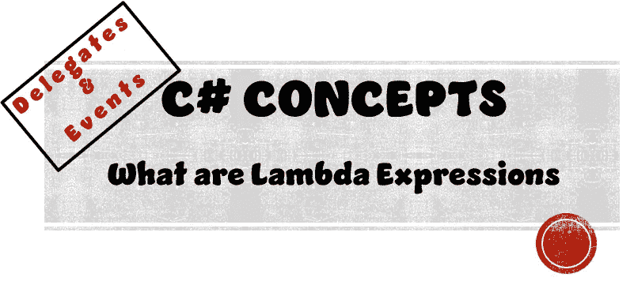
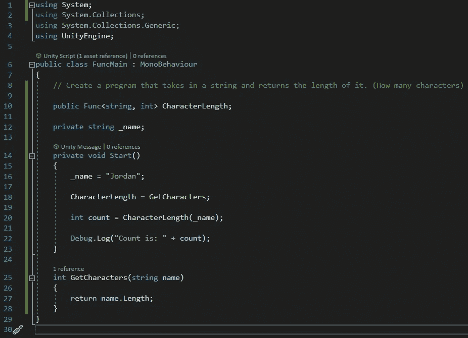
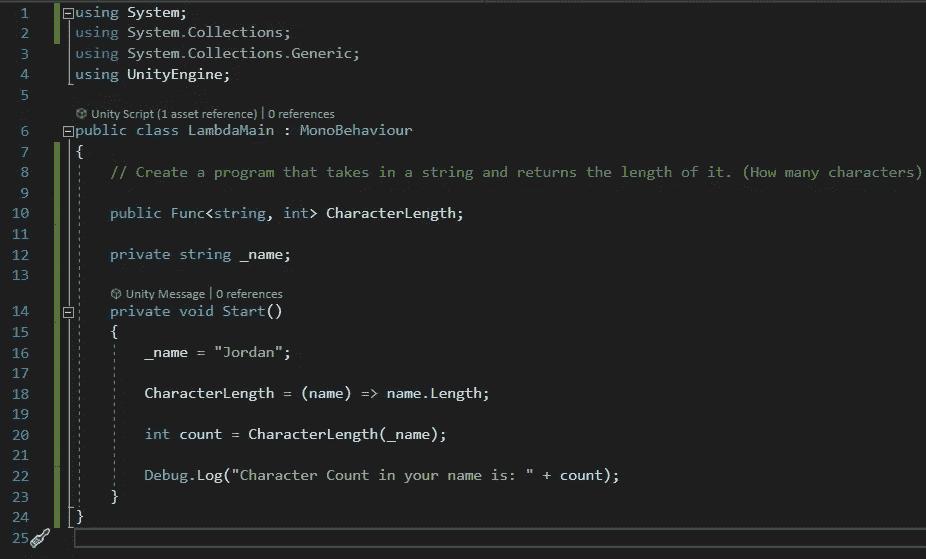

# 什么是 Lambda 表达式

> 原文：<https://medium.com/nerd-for-tech/what-are-lambda-expressions-5316aff218cf?source=collection_archive---------1----------------------->

## C#脚本|委托和事件

> **目标:**
> 使用 Lambda 表达式优化(第三次也是最后一次)我们的返回方法程序



你可能会想… *我们已经对这个简单的代码进行了两次优化，我们还能做些什么来提高效率呢？*

很高兴你问了。今天我们将学习 Lambda 表达式，它们帮助我们在一行代码中编写简单的方法。如果你看下面，你会看到我们的代码在上一篇文章中优化后的样子(**什么是 Func** )。



如果你看看我们的返回方法，你会发现它只做了一件事。返回参数字符串变量*名称*长度的整数值。

```
int GetCharacters(string name)
{
    return name.Length;
} 
```

我们真的需要 4 行代码来做一件简单的事情吗？不要！我们绝对没有。通过使用 Lambda 表达式，我们可以不再需要一个只包含一行代码的专用返回方法。请在下面查看我们更新的脚本。



在我们的旧脚本和上面显示的脚本之间，唯一改变的一行是**第 18 行**。

## 第 18 行

```
CharacterLength = (name) => name.Length;
```

这是怎么回事？让我们逐字解读这一行，看看发生了什么。

*   **CharacterLength = —** 创建委托的实例
*   **(name)** —定义我们的方法现在需要接受的参数。因为我们用我们的委托来实例化它，它自动假设这个参数将是一个字符串值，因为这是我们的方法签名模板在我们的委托中声明的。
*   **= >** —这是我们的 lambda 表达式。用外行人的话来说，它的意思是*去。*
*   **姓名。Length** —将我们的字符串变量 *name* 转换为字符数的整数值的代码。

现在我们知道了这行代码中每个单词的意思。让我们把它当作是用英语写的来读。

我们的委托 *CharacterLength* 持有一个方法，该方法接受一个字符串变量 *name* 并访问一个整数变量。

# 试验

一旦我们运行这个程序，下面的注释就会出现在我们的日志中。


我们的程序仍然像它应该的那样工作！我们的优化成功了！