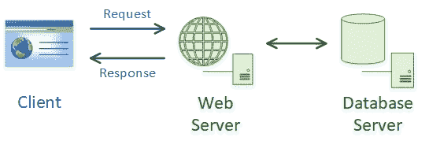
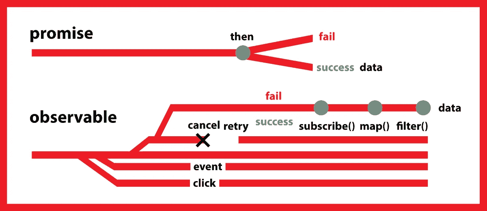
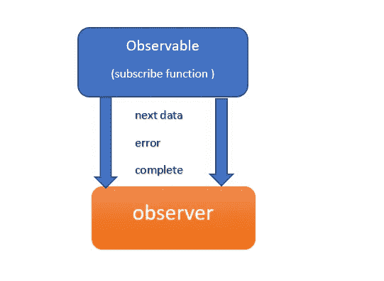
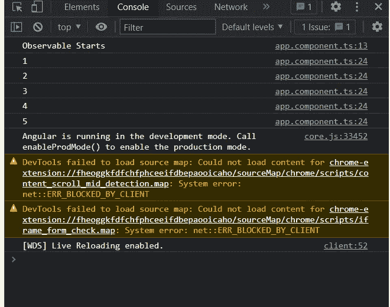

# 有哪些可观察的角度？

> 原文：<https://medium.com/nerd-for-tech/what-are-observables-in-angular-5e89d159a4e6?source=collection_archive---------0----------------------->


在本教程的中，我将解释**什么是可观测的，以及何时何地使用它**。我们使用 Observable 来执行异步操作和处理异步数据。处理异步的另一种方式是使用承诺。我们可以使用承诺或可观察值来处理异步操作。

## 什么是异步操作和异步数据？

我们已经知道 JavaScript 是一种**单线程语言**。这意味着代码被逐行执行**并且一旦一个代码的执行完成，那么只有程序的下一个代码将被执行。当我们向 HTTP 服务器发出请求时，会花费更多的时间。所以 HTTP 请求后的下一条语句必须等待执行。只有当 HTTP 请求完成时，它才会被执行。我们可以说同步的**代码在本质上是阻塞的**。这就是异步程序出现的方式。在后台执行的异步代码**不会阻塞主线程中代码**的执行。异步代码是非阻塞的。这意味着我们可以异步发出 HTTP 请求。**

使用异步程序，我们可以在不阻塞主线程的情况下执行长时间的网络请求。有两种方法可以做到这一点。

*   使用可观测量
*   利用承诺

## 承诺和可观察到的有什么区别？



假设我们从服务器请求一个用户列表。从浏览器中，我们向服务器发送一个请求，服务器将从数据库中获取数据。假设我们请求的数据非常庞大。在这种情况下，服务器需要一些时间从数据库中获取数据。一旦数据准备好，数据将从服务器发送到客户端。在这里，服务器收集所有的数据，当数据准备好了，就会发送回客户端。这就是实现承诺的方法。它承诺在一段时间内提供数据。一旦完整的数据准备就绪，Promise 就会向我们提供数据。该数据可以是我们请求的实际数据，也可以是错误数据。如果没有互联网连接。在这种情况下，还承诺返回一些数据。该数据将是错误消息或错误对象。

可观测量**不等待完整数据可用**。一个可观察的数据流。当数据部分可用时，它将发送给客户端。

**承诺**

1.  帮助您异步运行函数，并使用它们的返回值(或异常)，但在执行时只使用一次**。**
2.  **不懒。**
3.  **不可取消(有一些 Promise 库支持取消，但 ES6 Promise 目前还不支持)。两个可能的决定是**拒绝和解决**。**
4.  **不能**重试**(承诺应该能够访问返回承诺的原始函数，以具有重试能力，这是一种不好的做法)**
5.  **由 JavaScript 语言提供。**

****可观测量****

1.  **帮助您异步运行函数，并在执行时以连续的顺序使用它们的返回值(**多次**)。**
2.  **默认情况下，它是*惰性的*，因为它会随着时间的推移发出值。**
3.  **有许多操作符，这简化了编码工作。**
4.  **一个操作符 **retry** 可以在任何需要的时候用来重试，如果我们需要基于某些条件重试可观察值**retry 什么时候可以使用**。**
5.  **不是 Angular 或 JavaScript 的原生特性。由另一个名为 JavaScript 库提供。**

****

**一个**可观测的**是一个**函数**，它将普通的数据流转换成一个可观测的数据流。你可以把 Observable 想象成普通数据流的包装器。**

**Rxjs(JavaScript 的反应式扩展)是一个 JavaScript 库，它允许我们处理异步数据流。**

**从这里你可以找到所有和 Rxjs 相关的东西，**

**[](https://www.learnrxjs.io/) [## 介绍

### 编辑描述

www.learnrxjs.io](https://www.learnrxjs.io/) 

**Rxjs** 有两个主要原因。

*   可观察的—数据流
*   观察者——它将使用数据

为了让观测者利用被观测者发出的数据。因为观察者必须认同可观察事物。

让我们创建一个**可观察的**。为了创建一个可观察对象，我们需要在我们的 Angular 应用程序中从 **Rxjs** 库导入可观察对象。当我们创建一个新的 Angular 项目时，这个库会自动安装到项目中。不需要单独安装 Rxjs。

在这里，我创建了一个名为**“my-app”**的简单项目，在 **app.component.ts** 中，我们需要从 Rxjs 库导入 Obseravle。然后我使用 Observable 构造函数创建了一个新的 Observable 对象。在构造函数中，我们需要传递**回调**函数。回调函数将接收一个参数，该参数将是**观察器**。这个参数将由 Rxjs 库注入。这个观察者就是等待数据的订阅者。

在回调函数中，我将记录一条消息并发出一些数据。为了发出数据，我们可以使用 **observer.next()** 。我要发射 5 倍的数据。这是可观测物体将要发出的数据。

现在我们需要一个**订阅**。只有当有一个**用户**时，这个可观察对象才会发出数据。如果没有订户，它将不会发出数据。为可观察对象创建订阅者。在 **ngOnInit** 中，我将实现订户。订户接受 3 个可选参数。这三个参数是回调函数。

*   然后
*   错误
*   完成



这三个参数都是可选的。

```
this.myObservable.subscribe(next, error, complete);
```

这个下一个参数是一个**回调函数**，每当可观察对象中的下一个方法返回值时，这个参数就会被执行。在这个例子中，“**next”**回调函数将调用 5 次，因为我们要发出 5 次数据。基本上，下一个回调函数**将接收观察对象返回或发出的数据。**


我们转到网页，打开开发者控制台。现在你可以看到被观测者发出的数据，它已经被记录在这里。

```
import {Component, OnInit} from '@angular/core';
import {Observable} from 'rxjs';@Component({
  selector: 'app-root',
  templateUrl: './app.component.html',
  styleUrls: ['./app.component.css']
})
export class AppComponent implements OnInit {
  title = 'my-app';
  myObservable = new Observable((observer) => {
    ***console***.log('Observable Starts');
    observer.next('1');
    observer.next('2');
    observer.next('3');
    observer.next('4');
    observer.next('5');
  });
 ngOnInit(): void {
    this.myObservable.subscribe((val) =>{
      ***console***.log(val);
    });
  }
}
```



这些数据已经被一个接一个地传输了。让我们从某个时间间隔发出数据。为此我们可以使用 **setTimeout()** 函数。我加了 1 秒作为时间间隔。

```
myObservable = new Observable((observer) => {
  ***console***.log('Observable Starts');
  setTimeout(() => {
    observer.next('1');
  }, 1000);
  setTimeout(() => {
    observer.next('2');
  }, 2000);
  setTimeout(() => {
    observer.next('3');
  }, 3000);
  setTimeout(() => {
    observer.next('4');
  }, 4000);
  setTimeout(() => {
    observer.next('5');
  }, 5000);});
```

现在你可以看到数据一个接一个地在一定的时间间隔(1 秒)后被发射。

我希望你能更好地理解和了解观察到的事物和它们的过程。还有其他方法来创造可观测量，让我们找到它们，并在下一个教程中学习它们。

谢谢大家！**