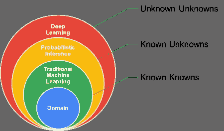

# 机器学习中的概率模型有哪些？

> 原文：<https://medium.com/nerd-for-tech/what-are-probabilistic-models-in-machine-learning-98c6ed1d35ef?source=collection_archive---------1----------------------->



## 介绍

机器学习中的概率模型是使用统计的代码来检查数据。这是机器学习的最初方法之一。它至今仍被广泛使用。这一组中最著名的算法是朴素贝叶斯算法。

概率建模为接受学习是什么提供了一个框架。概率框架定义了如何表示和部署关于模型的预订。预测在科学数据分析中起着主导作用。它们在机器学习、自动化、认知计算和人工智能中的作用也非常重要。

## 描述

概率模型是作为一种流行的习语来定义世界的。这些都是用随机变量来描述的，例如通过概率关系组合在一起的积木。

机器学习中有概率模型和非概率模型。关于概率的基本概念的信息，例如随机变量和概率分布，将有助于很好地理解概率模型。

从嘈杂或模糊的数据中描绘推理是智能系统的必要组成部分。在概率论中，尤其是贝叶斯定理有助于作为结合先验知识和经验证据的原则框架。

## 概率 ML 模型的重要性

概率模型的一个主要好处是，它们给出了与预测相关的不确定性的概念。我们可能会对机器学习模型对其预测的信心有所了解。例如，如果概率分类器为“狗”类分配的概率为 0.9，而不是 0.6，这意味着分类器非常确信图像中的动物是狗。这些与不确定性和信心相关的概念在关键的[机器学习](https://www.technologiesinindustry4.com/2021/07/machine-learning-model-development-life-cycle.html)应用中非常有价值，例如疾病诊断和自动驾驶。此外，对于许多与机器学习相关的方法，例如主动学习，概率结果是值得的。

## 贝叶斯推理

贝叶斯推理的核心是贝叶斯规则，有时也称为贝叶斯定理。它被用来定义一个具有先验知识的假设的概率。这取决于条件概率。

贝叶斯规则


牧师托马斯·贝叶斯(1702-1761)

贝叶斯定理的公式被称为:

```
P (hypothesis│data)    =     P (data│hypothesis) P (hypothesis) / P (data)
```

*   贝叶斯规则说明了如何从数据中推断出假设。
*   学习和预测可以理解为推理的形式。

具有贝叶斯规则的典型贝叶斯推理需要一种机制来直接调整目标后验分布。例如，推理过程是一个单向过程，它通过检测经验数据来规划从早期分布到后期分布。在监督学习和强化学习中，我们的最终目标是把学习任务放在后面。其应用了对性能的一些测量，例如预测误差或预期回报。

一个直立的后验分布应该有一个小的预测误差或一个大的期望回报。此外，通过建立大规模知识库和广泛接受众包平台来收集人类数据，当建立智能系统时，需要将外部信息包括到统计建模和推断中。

## 朴素贝叶斯算法

朴素贝叶斯算法是一种监督学习算法。它是根据贝叶斯定理创建的，用于解决排序问题。它主要用于包含高维训练数据集的文本分类。朴素贝叶斯算法是一种简单且操作性最好的分类算法，支持快速机器学习模型的构建，可创建快速预测。

朴素贝叶斯算法是一种概率分类器。这意味着它是根据一个物体的概率来预测的。或多或少流行的朴素贝叶斯算法的例子有:

*   垃圾邮件过滤
*   情感分析
*   物品分类

一个密切相关的模型是逻辑回归。这有时被认为是现代机器学习的“你好世界”。不要被它的名字所欺骗，因为 log reg 是一种分类算法，有点像回归算法。相当像朴素贝叶斯，直到现在，它仍然非常有用，因为 log reg 早在计算之前就已经存在很长时间了，这要归功于它适度和多用途的性质。这通常是数据科学家在数据集上尝试的第一件事，以便对手头的分类任务有所了解。

## 朴素贝叶斯模型的类型

有以下三种类型的朴素贝叶斯模型:

*   高斯:高斯模型负责监控正态分布的特征。这意味着，如果分析师采用不间断的值而不是单独的值，那么模型就认为这些值是从高斯分布中检验出来的。
*   多项式:当数据是多项式循环时使用。主要用于文档分类问题。这意味着某个特定的文档属于该类别，例如体育、教育和政治等。分类器使用单词的比率作为预测值。
*   伯努利:伯努利分类器的工作方式与多项式分类器相似。那么预测变量就是自治布尔变量。例如，文档中是否存在特定的单词。这个模型对于文档分类任务也是众所周知的。

## 朴素贝叶斯模型的使用

使用的朴素贝叶斯分类器；

*   用于信用评分。
*   在医疗数据分类中。
*   它可以用于实时预测，因为朴素贝叶斯分类器是一个敏锐的学习者。
*   文本分类，例如垃圾邮件过滤和情感分析。

## 贝叶斯分类器的利弊

赞成的意见

*   朴素贝叶斯是预测一类数据集的简单快速的机器学习算法之一。
*   它既可用于二进制分类，也可用于多级分类。
*   它在多类预测方面做得很好，例如与其他算法相比。
*   它是文本分类问题中最广泛的选择。

骗局

*   朴素贝叶斯认为所有的分类都是独立的或者完全不同的。因此它不能学习特征之间的关联。

## 目标函数

我们可以盯着它的目标函数来识别一个特定的模型是否是概率性的。我们希望增强一个模型，以便在机器学习中更好地完成一项精确的任务。拥有一个目标函数的目标是基于模型的输出传递一个值。因此，可以通过进一步利用或缩减实际值来进行优化。通常，目标是减少机器学习中的预测误差。因此，我们描述了所谓的损失函数，例如目标函数，并试图在机器学习模型的训练阶段减少损失函数。

欲了解更多详情，请访问:[https://www . technologiesinindustry 4 . com/what-are-probabilistic-models-in-machine-learning/](https://www.technologiesinindustry4.com/what-are-probabilistic-models-in-machine-learning/)