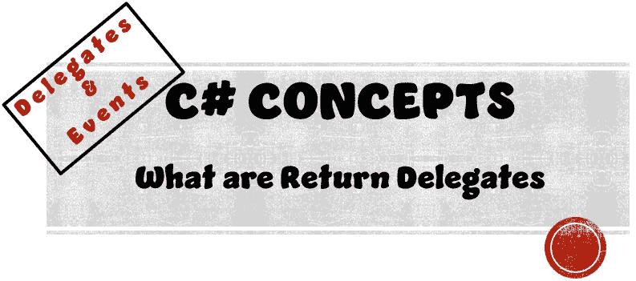
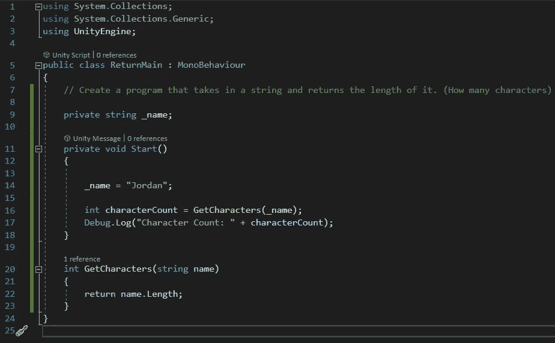
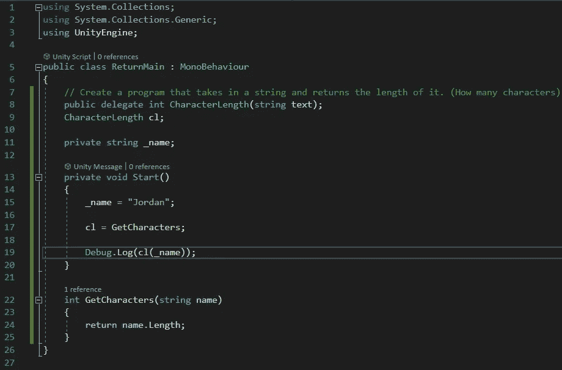

# 什么是返回委托

> 原文：<https://medium.com/nerd-for-tech/what-are-return-delegates-8f994226604e?source=collection_archive---------0----------------------->

## C#概念|委托和事件

> **目的:**
> 使用返回委托优化我们在引入返回方法时创建的简单程序



正如我们的目标所述，我们将优化之前创建的程序。



阅读手头程序的解释并熟悉返回方法。。。| [**点击这里**](/@jordantkay21/working-with-return-methods-1c00fe99b25) |

> **注意:**为了更容易理解返回类型委托，您应该理解返回方法的概念。我强烈建议在继续之前阅读上面链接的文章。

现在，我们如何优化这个已经很简单的带有返回类型委托的程序呢？

我们来看看优化后的代码，一行一行地去解码。



## 第 8 行

```
public delegate int CharacterLength(string text);
```

我们首先需要创建我们的委托，正如我们在 [**到委托**](/@jordantkay21/what-are-delegates-91cfdb2537fd) 一文中所学的，我们用关键字 *delegate* 声明一个委托变量。让我们看看我们的方法签名模板是什么样子的…

**-返回类型**-整数
**-方法名**-字符长度
**-参数**-字符串(放在一个名为*文本的变量中)*

## 第 9 行

```
CharacterLength cl;
```

这一行通过创建 CharacterLength 委托的一个名为 *cl* 的变量来开始创建委托实例的过程。

## 第 17 行

```
cl = GetCharacters;
```

这一行通过将我们的委托类型变量实例化到我们的返回方法来完成创建委托实例的过程。由于我们的方法签名模板匹配我们的 GetCharacters 方法签名，我们可以将两者连接起来。

## 第 19 行

```
Debug.Log(cl(_name));
```

这一行创建一个日志注释，显示我们的 *GetCharacters* 方法返回的整数变量。因为我们已经将我们的委托类型变量 *cl* 映射到我们的 *GetCharacters* 方法，所以我们可以像调用方法一样调用 *cl* 并向其传递参数名称。

# 试验


一旦我们运行这个程序，上面的日志注释就会显示出来。显示我们的名字“乔丹”中有 6 个字符，这是真的。