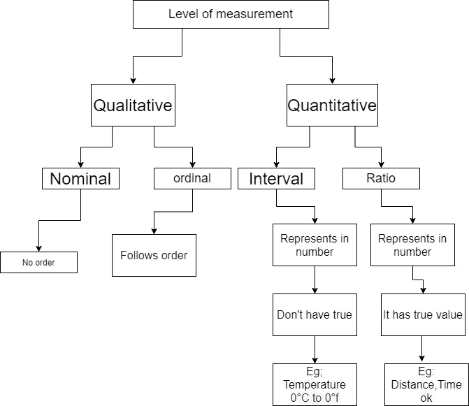
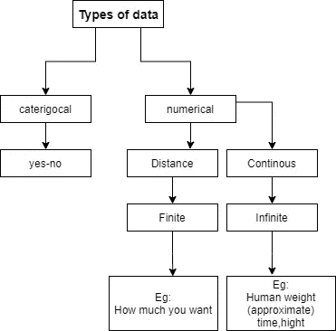

# 统计学的基础是什么？

> 原文：<https://medium.com/nerd-for-tech/what-are-the-fundamentals-of-statistics-a636dcaafc4d?source=collection_archive---------19----------------------->

## 统计学基础

嗨，如果你开始学习数据科学？那么这篇文章是为你而写的，我已经分享了我在统计学中所学的经验，以启动我的数据科学职业生涯，这是"**为数据科学学习统计学**的延续。如果你还没有阅读，我建议你去了解一下关于统计学的清晰知识😃。

[](/analytics-vidhya/learn-statistics-for-data-science-72fec5372abe) [## 学习数据科学的统计学

### 开始数据科学职业生涯需要了解的统计学基础知识

medium.com](/analytics-vidhya/learn-statistics-for-data-science-72fec5372abe) 

```
Let us see the fundamental of statistics…
```

## 变量:

*   一个变量可以取很多值，比如**年龄**就是一个变量。记住变量包含一个值。
*   ***例如*** 性别——男。所以我们知道 **G** ender 是一个**变量**保存着**值** " **m** ale "。
*   变量既可以是自变量，也可以是因变量——可以“操纵或处理”的自变量，而测量变量或限制变量是因变量

**数量变量**是用数字测量的，在这种变量中，我们可以执行加、减、乘以及除。

比如:年级，歌曲长度。

*   定量变量可以分为离散变量和连续变量。
*   **离散**变量像掷骰子一样是有限的。
*   **连续的**变量像温度或摄氏度一样是无限的。

离散和连续变量类似于概率分布的类型。你可以参考这个获得更多的想法👇

[](https://saran-23.medium.com/how-probability-distribution-related-to-data-science-2ed9474a9bb3) [## 概率分布与数据科学的关系

### 理解用于人工智能的概率分布

saran-23.medium.com](https://saran-23.medium.com/how-probability-distribution-related-to-data-science-2ed9474a9bb3) 

**定性变量**也称为分类变量，其分类基于特征。不幸的是，我们不会做加法、减法、乘法和除法。没错，就是量化变量对面的**。**

例如:性别、婚姻状况等信息。

## 测量级别:

它们有四种数据类型

1.  **名义上的**
2.  **序数**
3.  **区间**
4.  **比率**



## 名义上的

名义变量是一个定性变量，它将数据分成不同类别。名义是指不能按照升序或降序或从小到大的顺序排列的标签或类别。

**示例:-** 颜色——红色、蓝色、黄色、绿色。

## 序数

在有序数据中，数据顺序非常重要，但距离不能考虑。有序类型的数据可以按类别排序，不幸的是，数据值无法确定

**举例:**财务状况。

## 间隔

考虑数据的排序，并且距离相等，但是**没有零**出现。**例如:-** 华氏，轮班制作品。

## 比例

数据的排序也被考虑，距离是相等的，并且**零**存在。

**比如**如果你**死了，**你的血小板**计数**会为零，那么关闭车速也会变为零。



我分享了一些我学到的东西，我们将在未来的文章中看到更多，所以，继续前进，开始学习更多，并在未来成为一名数据科学家**🤠**

> `The way to get started is to quit talking and begin doing — Issac Newton`

```
Thank You :)
```

[***阅读更多文章:***](/analytics-vidhya/python-for-everyone-febb359158ee)

[](https://saran-23.medium.com/day-5-concept-of-machine-learning-in-data-science-7e58378fbf90) [## 数据科学中的机器学习概念

### 只需 3 分钟即可免费阅读机器学习

saran-23.medium.com](https://saran-23.medium.com/day-5-concept-of-machine-learning-in-data-science-7e58378fbf90) [](https://saran-23.medium.com/probability-distribution-3d34fbd58e99) [## 概率分布

### 连续分布🚙

saran-23.medium.com](https://saran-23.medium.com/probability-distribution-3d34fbd58e99)