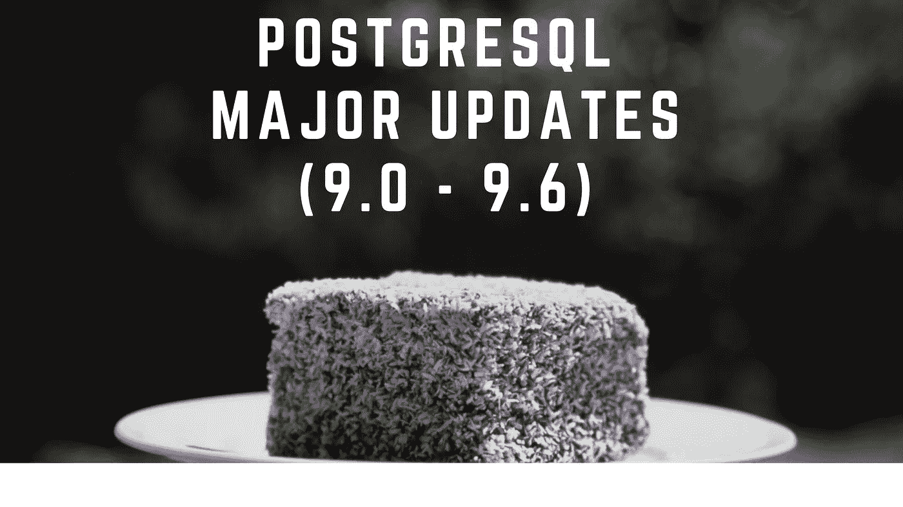

# PostgreSQL 从 9.0 版到 9.6 版的主要更新是什么

> 原文：<https://medium.com/nerd-for-tech/what-are-the-major-updates-from-version-9-0-into-9-6-in-postgresql-f94d6a720bd2?source=collection_archive---------1----------------------->

这里我们要了解一下 PostgreSQL 版本 9 的主要更新。

Postgresql 版本主要更新

**在 9.0 版本中:**

*   基于日志传送的内置复制。这一进步包括两个功能:
    —流式复制，允许连续存档(WAL)文件通过网络连接流式传输到备用服务器，以及热备用，允许连续存档备用服务器执行只读查询。
    —实际效果是支持单个主服务器和多个只读从服务器
*   可推迟的唯一约束。对唯一密钥的大规模更新现在没有欺骗是可能的。
*   真空满的新实现。这个命令现在重写整个表和索引，而不是移动单个行来压缩空间。在大多数情况下，它的速度大大加快，并且不再导致索引膨胀。
*   新的 contrib 模块 pg_upgrade 支持从 8.3 或 8.4 就地升级到 9.0。
*   解释增强功能。现在，输出可以是 JSON、XML 或 YAML 格式，并且包括以前没有的缓冲区利用率和其他数据。

**9.1 版本:**

*   允许同步复制
*   添加对外表的支持
*   添加每列排序规则支持
*   添加扩展，简化 PostgreSQL 附加内容的打包
*   使用 CREATE TABLE 中的 unlogged 选项支持未记录日志的表。
*   在 WITH 子句中允许数据修改命令(插入/更新/删除)。

**在 9.2 版本中:**

*   允许级联复制。
*   允许查询仅从索引中检索数据，避免堆访问(仅索引扫描)。
*   允许 pg_basebackup 从备用服务器进行基本备份
*   添加一个 pg _ receivexlog 工具，在编写 WAL 文件时对其进行归档
*   添加 SP-GiST(空间分区 GiST)索引访问方法
*   添加对一系列数据类型的支持
*   添加 JSON 数据类型

**在 9.3 版本中:**

*   添加实体化视图
*   使简单视图可自动更新
*   允许外部数据包装器支持外部表上的写入(插入/更新/删除)
*   添加 Postgres 外部数据包装器，以允许访问其他 Postgres 服务器
*   添加对事件触发器的支持

**在 9.4 版本中:**

*   添加 jsonb，这是一种用于存储 JSON 数据的更强大、更高效的数据类型。
*   添加用于更改 postgresql.conf 配置文件条目的新 SQL 命令 ALTER SYSTEM
*   允许刷新实体化视图，而不阻塞并发读取
*   降低某些 ALTER TABLE 命令的锁强度

**在 9.5 版本中:**

*   允许将会产生约束冲突的插入转换为更新或忽略
*   添加按分析分组功能分组集、立方和汇总
*   添加行级安全控制
*   添加块范围索引(BRIN)
*   将 pg_ctl 的默认关闭模式从智能更改为快速

**在 9.6 版本中:**

*   避免在真空冷冻操作过程中不必要地扫描页面
*   全文搜索现在可以搜索短语(多个相邻的单词)
*   Postgres_fdw 现在支持远程连接、排序、更新和删除
*   同步复制现在允许多个备用服务器以提高可靠性
*   顺序扫描、连接和聚合的并行执行
*   避免在真空冷冻操作过程中不必要地扫描页面