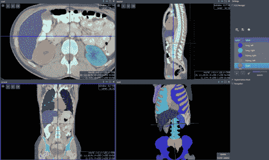
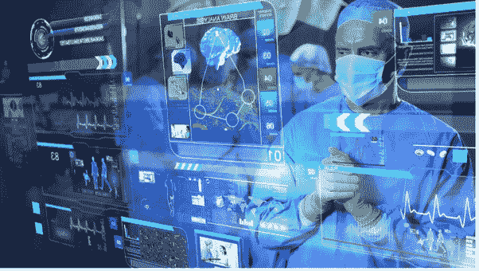

# 我可以用来训练 AI 进行医疗诊断的医疗数据集有哪些？

> 原文：<https://medium.com/nerd-for-tech/what-are-the-medical-data-sets-that-i-can-use-to-train-ai-for-medical-diagnosis-8bbf698dfe9f?source=collection_archive---------1----------------------->

医学诊断中的人工智能可以帮助医生在没有放射科医生的情况下自动检测各种类型的疾病。x 射线、CT 扫描和 MRI 是用于诊断疾病的医学成像，借助人工智能设备、应用程序或用高质量训练数据训练的系统。

有许多医疗数据集可用于训练不同类型疾病的医疗诊断。对于医疗诊断中的人工智能，主要使用带注释的数据集来训练人工智能模型，该模型可以学习如何以可接受的准确度检测各种疾病。在这里，您可以找到以下类型的医疗数据集，您可以使用这些数据集来训练用于医疗诊断的人工智能模型。

**医疗诊断中 AI 的医疗数据集类型:**

牙科人工智能中的多边形标注

检测脑瘤的训练数据

训练数据神经异常

乳腺癌诊断的训练数据

用于骨折诊断的带注释的 X 射线图像

肾结石检测的包围盒标注

前列腺癌的语义分割标注

**也可阅读:** [医学诊断中用于人工智能的诊断成像类型有哪些:用例](https://www.anolytics.ai/blog/types-of-diagnostic-imaging-used-for-ai-in-medical-diagnosis/)

用图像注释服务注释的医学成像数据可以提供训练数据集来训练 AI 模型。根据不同的图像标注技术，可以为开发或用于医疗诊断的各种人工智能模型创建不同类型的训练数据集。医疗训练数据集是为通过这种数据集训练的基于计算机视觉的机器学习模型而创建的。

**分析**提供 [**医学影像数据集**](https://www.anolytics.ai/solutions/healthcare/)

用于机器学习训练和 AI 模型开发。通过数据注释服务， **Anolytics** 提供图像注释服务，以创建用于训练医疗诊断人工智能模型的高质量训练数据。它与经验丰富的注释者合作，以高精度注释医学图像，从而做出正确的诊断。