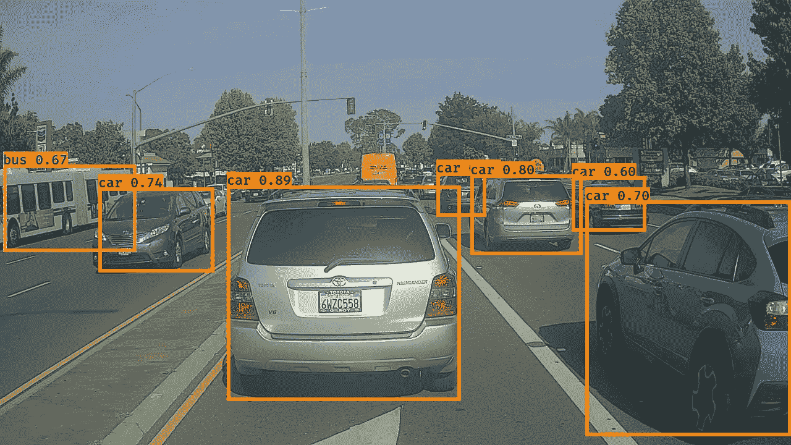
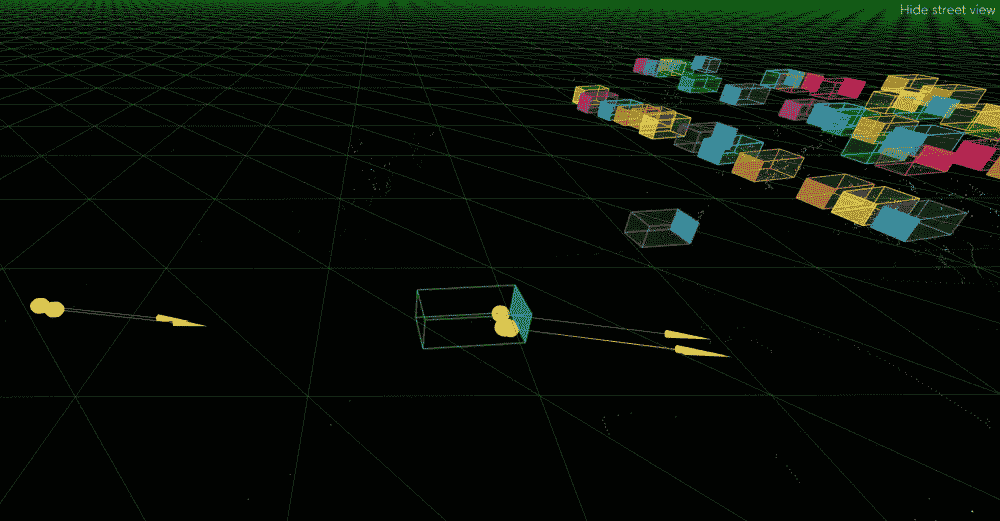
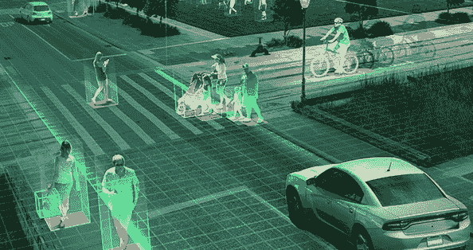

# 用于训练自动驾驶汽车的 AI 模型的训练数据集有哪些？

> 原文：<https://medium.com/nerd-for-tech/what-are-the-training-data-sets-used-to-train-the-ai-model-for-self-driving-cars-540a45bf64dc?source=collection_archive---------1----------------------->

自动驾驶汽车需要用适量的数据集进行训练，以便它可以精确地检测各种物体，并沿着正确的方向安全地移动。实际上，这样的训练数据集是通过图像创建的，其中对象被精确地注释，以便准确检测这样的对象。并且有不同类型的[图像注释](https://www.anolytics.ai/image-annotation-services/)技术来创建这样的数据集。

**自动驾驶汽车探测物体的包围盒**

边界框注释有助于检测单个帧中的对象。它主要被标注为矩形或正方形，以使每个对象都可以被机器检测和识别。基本上，它用于捕捉道路上移动的其他车辆和各种站立的物体。

**3D 长方体为无人驾驶汽车检测物体尺寸**

[3D 长方体标注](https://www.anolytics.ai/3d-cuboid-annotation/)是另一种技术，有助于检测物体的尺寸。这种图像注释技术有助于计算机视觉检测物体的真实尺寸。自动驾驶汽车需要用精确的维度来可视化物体的深度。

**语义分割对自动驾驶汽车的物体进行分类**

这是检测单个类中的对象的另一个有用且非常有帮助的技术。在**语义图像注释**技术中，用阴影来注释对象，以使其可被基于视觉感知的人工智能模型识别，如自动驾驶汽车或自主车辆。

**用于激光雷达检测的三维点云标注**

这种注释技术是用于训练自动驾驶汽车中基于人工智能的激光雷达传感器的最佳和全面的图像注释技术之一。为了区分和分类三维点云地图中道路上不同类型的车道，将这种图像标注方法用于自动驾驶汽车训练。

**多边形标注检测不规则形状物体**

在训练[自动驾驶汽车](https://www.anolytics.ai/solutions/self-driving/)算法时，粗糙或不规则形状的物体，如街道上的表面路标，需要使这些自动机器能够识别。多边形注记有助于识别街道上可见的各种其他对象，如汽车或机动车辆。

**自动驾驶汽车中车道检测的折线标注**

[折线图像标注](https://www.anolytics.ai/polygon-annotation-services/)基本上就是，为自动驾驶汽车创建训练数据集以检测道路上车道的技术。在该注释中，对道路车道(如单车道、折线车道和双车道)进行了注释，以使其对于自主车辆的视觉感知 AI 模型是可识别的。

**用分析软件获取自动驾驶汽车训练数据**

**Anolytics** 提供最优质的自动驾驶汽车训练数据。它正在以更高的精度标注包含街道上物体的大量图像。它为训练机器学习或深度学习人工智能模型提供了最佳的图像注释服务，如自动驾驶汽车帮助精确训练在道路上正确行驶。