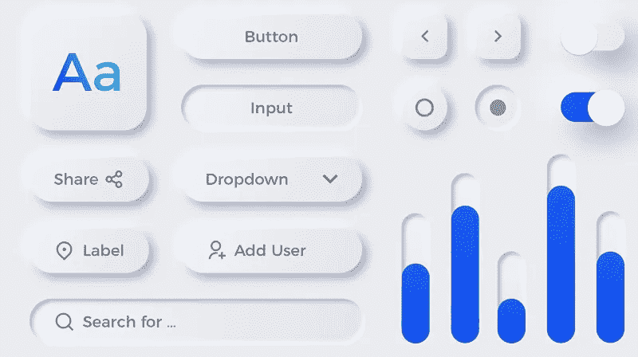
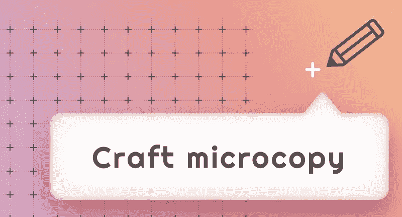
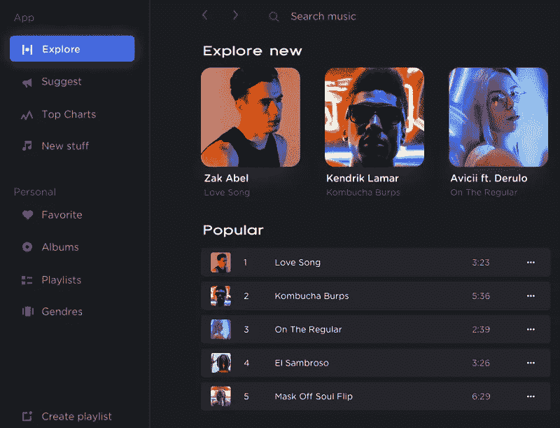
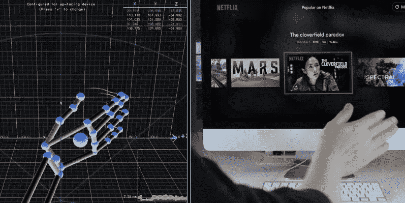
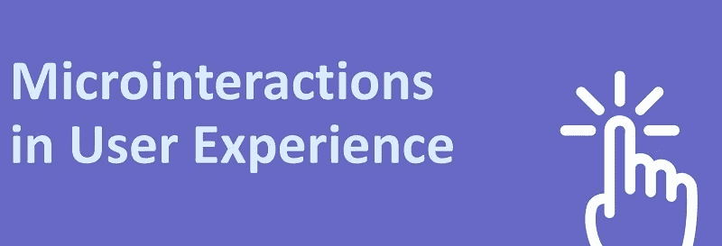
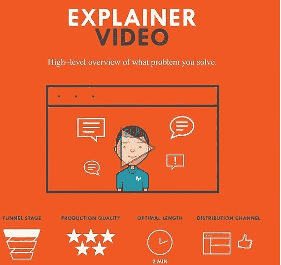
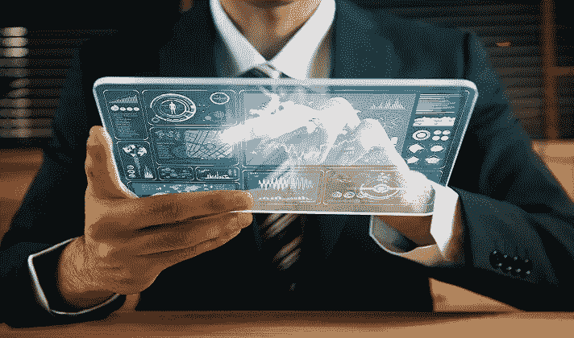
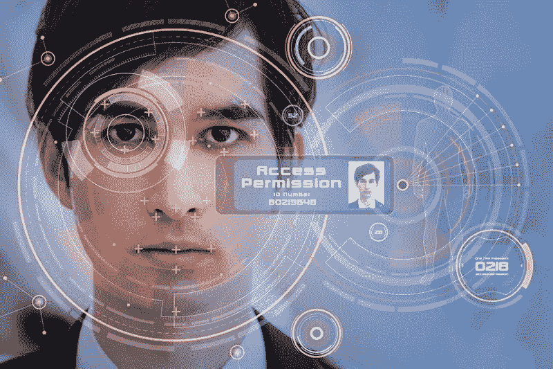

# 2021 年主导 UX 设计潮流

> 原文：<https://medium.com/nerd-for-tech/what-are-the-ux-trends-for-2021-dc86c4de7f9a?source=collection_archive---------9----------------------->

技术革命给 UX 设计领域带来了令人钦佩的变化。2021 年 UX 趋势令人兴奋，它是过去趋势的成熟版本。旧的趋势又变成了新的趋势，它随着客户的口味而变化。UX 的设计师必须适应这些变化，处理这些项目似乎是一个相当具有挑战性的问题。如今，客户选择一种非正式的设计格式来克服网页传统的正式外观。创新取决于客户的需求。基于不同的视角，UX 设计领域的创意各不相同。世界各地人们的文化和生活方式的变化对 UX 设计产生了影响。客户的期望随着其环境的变化而变化。在本文中， [Wondershare Mockitt](https://bit.ly/3ewCXuz) 将带领你了解 2021 年 UX 趋势预测。哪些 UX 设计元素及其相关数据会发生变化，从而更新您的设计技能？快速浏览以下内容，了解 UX 未来的发展趋势。

# 预测 2021 年用户体验设计趋势

现在是追踪 2021 年即将到来的 UX 趋势的时候了。在这一部分，你将见证 UX 设计趋势的变化以及对 2021 年的预测。在讨论过程中，你将了解 2020 年和 2021 年设计趋势的差异。下面讨论的创新将有助于新手和有经验的 UX 设计师。这些技术给你一个独特的视角来看待 UX 设计。它帮助设计者跳出框框思考，为他们的客户建立一个反应灵敏和信息丰富的用户界面设计。

## 新形态的演变

新形态是 UX 设计上显示模式的高级版本。它超过了 2020 年建立的玻璃态射的普及程度。在这种显示模式下，元素在后台可用，如水印设置。当用户触摸任何 UI 元素时，图标会逐渐变大，给你一种从屏幕中出来的错觉。它看起来像一部动画。新形态的概念取决于纯色、完美对比度和阴影效果的混合。你可以期待这种展示模式在未来几天的 UX 设计领域里会大放异彩。如果你在你的 UX 设计中实施这个策略，你会得到一个迷人的展示。你可以期待在这个版本中的进一步变化，在未来添加动画。

## UX 作品缩微副本

Microcopy UX 写作的格式最大限度地减少了 UX 设计中的文字内容。它鼓励设计师在网站上添加相关数据。如今，用户希望有一个关于品牌、品牌用途等的小故事。这种类型的内容会对客户产生影响。完美的缩微拷贝内容建立了一个标志性的品牌，并增加了交谈率。谷歌最近修改了它的研究口号，从“预订酒店”改为“检查可用性”，因为潜在客户非常倾向于这些关键词。这种微缩版的 UX 作品通过你的 UX 设计更容易接触到目标客户。缩微复制风格是合适的网页内容 UX 写作方法。不要用重复的内容填满网页，你可以让这种 UX 趋势毫不费力地到达目标受众。它会对您的 UX 设计产生积极影响，并增加网络流量。

## 黑暗主题中的创新

在 2020 年 UX 设计趋势中，你可能会遇到“调节亮度”这个词。这个元素作用于亮度水平，并随着环境的变化而变化。它将主题设置为白天更亮，晚上更暗。2021 年“黑暗主题”的出现与已安装的应用程序和网页配合良好。此主题根据您的活跃应用程序和网站调整亮度级别。该主题根据应用程序决定，并适当设置亮度级别。未来几天，你可以期待这个“黑暗主题”的进一步创新。大多数主题致力于可读性因素。这有助于清楚地显示元素，以便于访问。

## 手势控制

在 2021 年，你可以期待 UX 设计中关于空中手势控制的变化。这项技术可以根据你在空中的手势激活设备上的特定任务。如果你在相机前展示手掌手势，那么设备准备自拍。你可以使用正确的手势来完成你想要的动作。苹果已经在 iOS 中引入了手势控制技术。你可以在 2021 年见证手势控制的下一个版本。你可以在没有任何接触的情况下，通过手势的帮助来完成工作。谷歌推出了 Pixel 4，它使用雷达传感器来激活空中手势控制技术。

## 微观互动

在 2021 年的 UX 趋势中，你可以期待微观互动的下一个版本。这是所有关于工作的每一个细节，让事情活起来。用户和 UX 设计者相互作用以增强微交互技术。这一概念有助于用户与应用程序紧密合作。它被称为以人为中心的设计。用户扮演着至关重要的角色，设计者从他们的角度处理应用程序。例如，你可以在脸书网页上找到微互动。设计师以“喜欢”、“不喜欢”按钮的形式嵌入互动。

## 声控界面

在当前的场景中，你可以在数字市场中找到声控用户界面。在 2020 年，你已经浏览了各种语音激活的元素，如 Siri、Alexa、Bixby 和谷歌助手等。2021 年，这项技术的精度更上一层楼。专家团队致力于“单词识别准确性”，以克服对命令的错误解释。亚马逊在对语音激活用户界面进行改进后，为 Alexa 设定了一个高标准。您可以使用这项声控服务激活所需的应用程序，无需用手操作。UX 设计师必须在他们的设计过程中强调这一技术，以增加顾客的舒适度。

## 视频插入

在未来，你可以见证视频在 UX 设计模式中的崛起。众所周知，与文字相比，视频更能吸引用户。视频在短时间内表达的不仅仅是文字。这些视频对目标观众产生了影响。视频必须是现实的，引发情感，并通过故事与用户联系起来。UX 设计中的完美视频提高了转化率。用户对观看视频比对浏览内容更感兴趣。你可以通过视频传达很多东西。它对顾客产生了个人影响。目标受众通过信息丰富的视频被品牌说服。UX 设计师的下一个重点是学习如何在正确的地方插入完美的视频，以吸引观众。

## 增强现实的实现

2020 年，你会在游戏和其他娱乐应用中看到增强现实。你可以在未来的 UX 设计模式中期待这个概念。它已经在零售、旅游、汽车、教育、医疗保健和社交媒体平台等不同领域扩大了翅膀。增强现实将成为未来令人惊叹的趋势。作为一名 UX 设计师，你可以使用这种技术来构建令人兴奋的元素。这一战略每秒钟都在世界范围内发生着建设性的变化。发现这一概念，并在您的 UX 设计中实现它，以适应用户的需求。

## 使用生物识别进行认证

这项创新技术增加了 UX 设计的安全系数。蓬勃发展的生物认证技术有静脉模式识别、虹膜扫描、面部识别、语音识别等。减少使用密码和 pin 码来激活 web 应用程序。使用生物认证，您可以毫不费力地解锁所需的应用程序。这是一种安全的方法来克服不必要的未经授权的注册。请使用这一改进版的身份验证流程来提高 UX 设计的可靠性。这项技术处理安全因素，并帮助用户保护他们的数据免受未经授权的访问问题。

# 结论

因此，上面讨论的 2021 年的 UX 趋势尚未在数字市场中出现，以立即震撼商业市场。在正确的时间抓住这些创新，在竞争激烈的 UX 设计师中生存下来。通过在设计过程中运用创造性的技术，你可以成为 UX 设计的引领者。所有的创新都提供了一个舒适的空间来有效地处理任何应用程序。这一启发性的进化趋势之旅有望帮助你的设计作品。UX 设计师的首要目标是满足用户需求的期望，并不折不扣地实现创新。质量和创造力在 UX 设计师的成功中起着至关重要的作用。以上对 2021 年 UX 趋势的预测已经给了你一个如何利用 UX 设计市场即将到来的策略来推进项目的想法。联系正确的创新，在您的 UX 设计任务中获得理想的结果。

感谢您花时间阅读这篇文章。[了解更多关于 Mockitt 的信息](https://bit.ly/3ewCXuz)

我们为 UX 初学者创建了一个[终极指南](https://bit.ly/2OLPPlW)，它收集了来自多个 UXers 的知识、经验和建议。

订阅我们的 [YouTube](https://www.youtube.com/channel/UCESxamaRS8nOGpWYvP1VSqA) [脸书](https://www.facebook.com/mockitt) [Instagram](https://www.instagram.com/wondershare.mockitt/)

*原载于*[*https://mockitt.wondershare.com*](https://mockitt.wondershare.com/ui-ux-design/ux-trends-2021.html)*。*