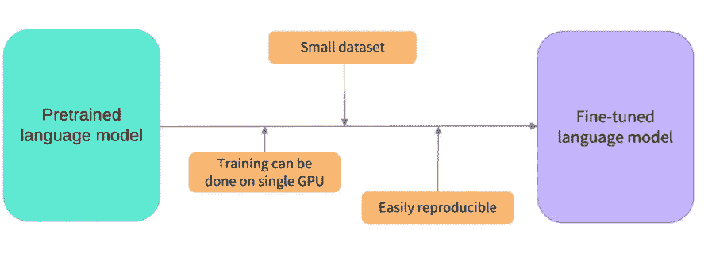
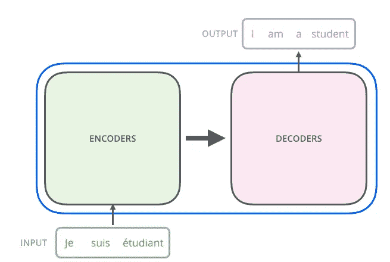

# 什么是变形金刚模型-第 1 部分

> 原文：<https://medium.com/nerd-for-tech/what-are-transformers-models-part-1-cf7ec6e8b3e8?source=collection_archive---------21----------------------->

转换器通常是语言模型，这意味着它们在大量文本数据集合上接受训练，并且它们能够执行各种 NLP 任务，例如:

1.  文本分类
2.  文本摘要
3.  情感分类
4.  文本生成和更多…

变压器也是非常大的模型，由大量的参数(以百万计)组成，从零开始对这些架构进行培训将花费数周时间和很高的成本。这就是为什么共享语言模型是至关重要的:共享已训练的权重并在已训练的权重的基础上构建降低了总体计算成本，这通常被称为迁移学习方法，一些著名的变形金刚模型是 BERT、GPT2、RoBERTa。

## 迁移学习

这种方法背后的思想是直接使用在大型数据集上训练(预训练)的模型，并根据我们的目标对其进行微调。为了进行微调，我们首先获得一个预训练的语言模型，然后使用特定于我们任务的数据集进行额外的训练。这样做有一些好处:

迁移学习概念

*   预训练模型已经在与微调数据集有一些相似之处的数据集上进行了训练。因此，微调过程能够利用初始模型在预训练期间获得的知识(例如，对于 NLP 问题，预训练的模型将对您在任务中使用的语言有某种统计理解)。
*   由于预先训练的模型已经在大量数据上进行训练，微调需要更少的数据来获得体面的结果。
*   出于同样的原因，获得好的结果所需的时间和资源要少得多。

预训练模型已经获得的知识被“转移”，因此术语*转移学习*。

## **变形金刚的架构**

变压器最初是为翻译而设计的，变压器通常包含两个模块

1.  编码器模块
2.  解码器模块

因此，在翻译的情况下，简单地说，编码器接收文本输入，并逐词生成输入的相应向量表示，编码器使用这些向量将这些词映射到首选语言以生成输出。根据我们的目标，可以使用这些模块的不同组合，例如:

*   **仅编码器模型:**适用于需要理解输入的任务，如句子分类和命名实体识别。
*   **纯解码器模式:**适用于文本生成等生成性任务。
*   **编码器-解码器模型或序列到序列模型:**适用于需要输入的生成任务，如翻译或摘要

接下来，我们将详细讨论[编码器](https://vivekmuraleedharan73.medium.com/what-are-transformers-models-part-2-83ddc20c038e)和解码器模块的架构。