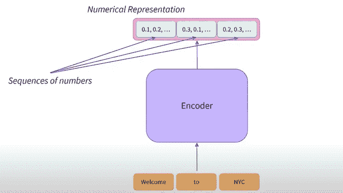
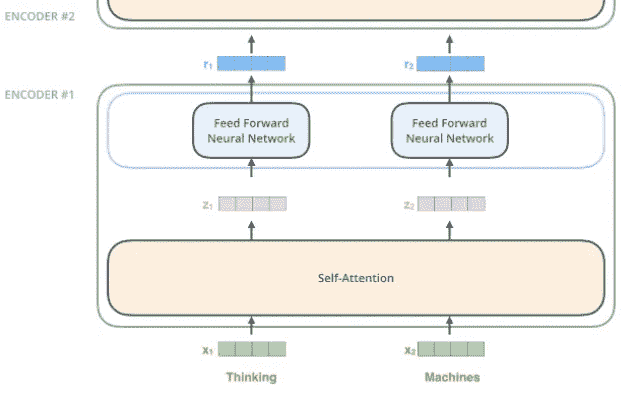
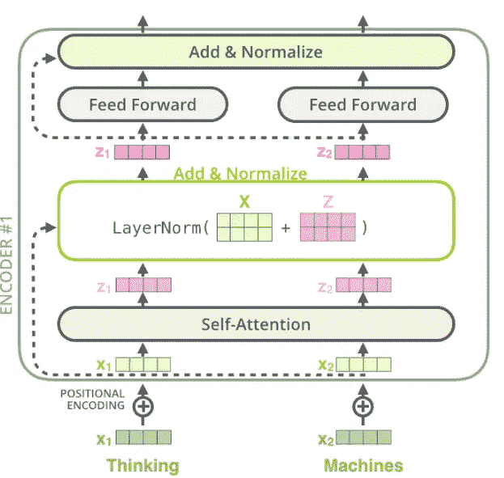

# 什么是变形金刚模型-第二部分

> 原文：<https://medium.com/nerd-for-tech/what-are-transformers-models-part-2-83ddc20c038e?source=collection_archive---------14----------------------->

在之前的[文章](/nerd-for-tech/what-are-transformers-models-part-1-cf7ec6e8b3e8)中，我们讨论了变压器模型及其在不同用例中的应用。在本文中，我们将深入探讨编码器模块的架构，它是转换器模型的主要构建模块之一。

## 编码器模块

transformer 模型中的编码组件基本上是一堆结构相同的编码器，具有两个子层一个**自关注&前馈神经网络。**编码器将句子中的每个单词转换成数字序列(每个单词的一个数字序列)，该数字序列可以称为特征向量或特征张量，并且该特征向量的维数由模型的架构来定义。BERT 模型具有 768 维，即对于每个字，编码器将具有 768 维的矢量作为输出。

编码器模型表示

每个单词的特征向量表示包含句子的上下文，我们可以说每个特征向量值将考虑序列中的前一个和下一个单词。这是通过自我关注层实现的，该层帮助编码器在编码特定单词时查看输入句子中的其他单词。自我注意层的输出被馈送到前馈神经网络，然后将输出向上发送到下一个编码器。

**每个位置的单词都经过一个自我注意的过程。然后，它们每个都通过一个前馈神经网络——每个向量分别流经的完全相同的网络。(鸣谢:** [**杰·阿拉玛的博客**](http://jalammar.github.io/illustrated-transformer/) **)**

单词嵌入只发生在最底层的编码器中。所有编码器共有的抽象是它们接收每个大小为 512 的向量列表。在我们的输入序列中嵌入单词后，它们中的每一个都流经编码器的两层中的每一层。

## 很少关注自我

自我注意的概念类似于 RNN 工作原理，在《RNN》中，隐藏状态和盖茨有助于保留句子中与预测下一个单词相关的一些单词，自我注意是一种类似于《变形金刚》中理解句子中单词相关性的方法。自我关注的计算包括从输入的单词嵌入中计算**查询(Q)、键(K)和值(V)** 矩阵，最后添加到 softmax 层以获得句子中每个单词的值。你可以在这里查看更多信息。

每个编码器中的每个子层(自关注、前馈神经网络)周围都有一个残差连接，然后是层归一化步骤。视觉效果会是这样的。

**(礼貌:** [**杰伦·阿拉玛的博客**](http://jalammar.github.io/illustrated-transformer/) **)**

## En 编码器型号

编码器模型仅使用转换器模型的编码器。在每个阶段，注意力层都可以访问初始句子中的所有单词。这些模型通常被描述为具有“双向”注意力，并且通常被称为*自动编码模型*。这些模型的预训练通常围绕着以某种方式破坏给定的句子(例如，通过屏蔽其中的随机单词)并让模型寻找或重建初始句子。

*编码器模型最适合需要理解完整句子的任务，例如句子分类、命名实体识别(以及更一般的单词分类)和提取问题回答。BERT 是仅编码器模型的典型示例，其他一些模型也是，*

*   [艾伯特](https://huggingface.co/transformers/model_doc/albert.html)
*   [蒸馏器](https://huggingface.co/transformers/model_doc/distilbert.html)
*   罗伯塔

下一篇文章我们将讨论解码器模块，这是转换器模型的下一个构建模块。