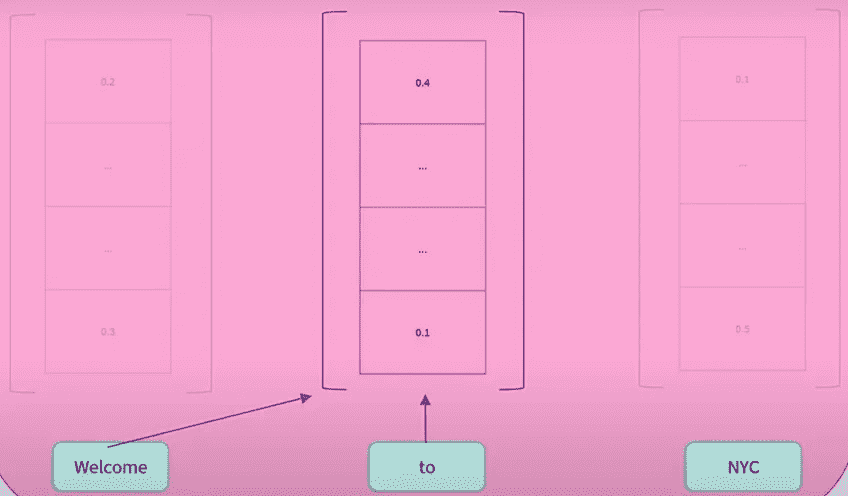
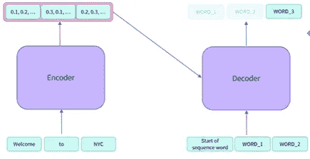
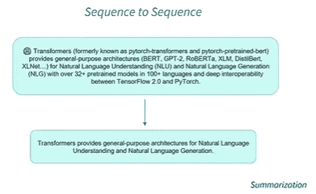

# 什么是变形金刚模型-第 3 部分

> 原文：<https://medium.com/nerd-for-tech/what-are-transformers-models-part-3-7638f41d7377?source=collection_archive---------24----------------------->

在之前的故事中，我们讨论了[变压器型号](/nerd-for-tech/what-are-transformers-models-part-1-cf7ec6e8b3e8)及其应用，并详细讨论了[编码器模块](/nerd-for-tech/what-are-transformers-models-part-2-83ddc20c038e)架构。在本文中，我们将更多地了解解码器模块，这是变压器的另一个主要构建模块。

## 解码器模块

解码器的架构类似于我们之前讨论的编码器模型。它由一堆结构相同的解码器组成。*编码器的输出将把它作为序列输入传递给解码器，这个过程将继续，直到到达一个特定的符号，表示输出完成*例如:当我们解码句子**“欢迎来到纽约市。”**使用解码器时，每个单词将有一个数字表示或特征向量作为解码器模型的输出，并且当"."符号传递到解码器，表示输出已完成。

编码器-解码器插图(提供:Jay Alammar 的[博客](http://jalammar.github.io/illustrated-transformer/)

## 解码器模块中的自我关注层

正如我们之前讨论的，编码器和解码器的架构没有区别。自我注意在解码器中的运作方式有所不同。解码器使用**屏蔽自我关注** **机制**屏蔽输入的未来位置，例如:如果我们取同一句话“欢迎来到纽约”当解码单词“to”时，解码器将根据配置只访问左边的单词:“Welcome”或右边的单词:“NYC”。它不能同时访问两个位置。

这里，解码器在解码“to”时只能访问单词“welcome”(礼貌: [huggingface](https://huggingface.co/course/chapter1/6?fw=pt) )

解码器的输出是特征向量，将这些特征向量转换成单词是由最终的线性层和随后的 softmax 层完成的。线性层(完全连接的神经网络)将特征向量转换成更大的 logits 向量(借助于训练数据的词汇),然后传递到 softmax 层，soft max 层转换成概率以识别最终的输出单词。

## 解码器型号

解码器模型仅使用变压器架构的解码器模块。解码器模型通常被称为自回归模型，因为它在预测下一个字时使用解码器的先前预测(输出)作为输入本身。解码器模型的预训练通常围绕预测句子中的下一个单词(屏蔽单词)。

> 解码器模型广泛用于文本生成、自然语言生成(NLG)

一些解码器系列型号包括

*   [CTRL](https://huggingface.co/transformers/model_doc/ctrl.html)
*   [GPT](https://huggingface.co/transformers/model_doc/gpt.html)
*   [GPT-2](https://huggingface.co/transformers/model_doc/gpt2.html)
*   [变压器 XL](https://huggingface.co/transformers/model_doc/transformerxl.html)

## 编码器-解码器模型

编码器-解码器模型是转换器架构的一部分，也称为**序列-序列模型**。

编码器-解码器模型架构(礼貌:[拥抱脸](https://huggingface.co/course/chapter1/7?fw=pt))

T 编码器模块生成输入句子的特征向量作为输出，并传递给解码器。在产生输出之前，解码器需要考虑两个输入，一个是编码器的输出，另一个是输入序列或输入序列的开始。如上图所示，在第一个输出(WORD_1)之后，解码器将使用该输出作为下一个输出的输入(上面讨论的自回归方法)。编码器和解码器块通常不互相共享权重。*例如，在翻译任务的情况下，编码器将理解一种语言的完整句子并生成特征向量，解码器负责基于编码器的理解生成目标语言的序列。*

使用序列对序列模型的总结示例:此处输入上下文和输出上下文不同，因此编码器和解码器的权重也不同，此处不需要权重共享(图片来自[拥抱脸](https://huggingface.co/course/chapter1/7?fw=pt))

> 序列到序列模型最适合于根据给定的输入生成新句子的任务，例如摘要、翻译或生成性问题回答。

属于序列到序列系列的型号有:

*   [巴特](https://huggingface.co/transformers/model_doc/bart.html)
*   [mBART](https://huggingface.co/transformers/model_doc/mbart.html)
*   [玛丽安](https://huggingface.co/transformers/model_doc/marian.html)
*   [T5](https://huggingface.co/transformers/model_doc/t5.html)

感谢你阅读这篇文章，我希望读者能从这个故事中对变形金刚有所了解。

*参考文献:*

1.  [*变形金刚模型*](https://huggingface.co/course/chapter1?fw=pt)*—hugging face 教程*
2.  [*图解变压器*](http://jalammar.github.io/illustrated-transformer/) *—杰·阿拉玛*