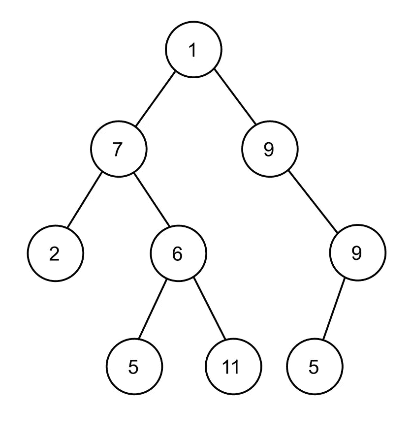

# 什么是树，为什么树在编程中如此重要？

> 原文：<https://medium.com/nerd-for-tech/what-are-trees-and-why-are-they-so-important-in-programming-18edf9530061?source=collection_archive---------0----------------------->

古伊列梅·斯特卡内拉在 [Unsplash](https://unsplash.com?utm_source=medium&utm_medium=referral) 上的照片

学习如何用 Python 编写一个！

树是一种类似于链表的数据结构。但不是每个节点都指向单个节点，而是指向多个节点。

树主要用于表示数据的层次性质。这里有一些你需要知道的关于树的基本参数。

以上面给出的树为例来理解接下来会发生什么:

# 树参数

*   **根**:树木起源的节点。根没有父母。1 是我们例子中的根节点。
*   看到上图中每个元素是如何连接到其他元素的了吗？这叫优势。更正式地说，边是子节点和父节点之间的链接。
*   **叶节点**:如果你有一个没有任何子节点的节点，它被称为叶节点。在上面的例子中，2、5 和 11 是叶节点。
*   **兄弟**:父元素相同的多个元素称为兄弟。例如，上面示例中的 5 和 11。
*   **祖先**:如果根节点和节点 *q、*之间有连接，那么如果某个节点位于根- > q 的路径之间，那么该节点将是 q 的祖先。
    例如，7 是 6、5 和 11 的祖先。
*   **Descendants** :与 ancestor 相反，其中 q 将是位于路径中的任何节点的后代。
*   **一个节点的深度**:它是从根节点到达一个特定节点所需要的链路数。在这个例子中，如果我们的根的深度为 0，那么 6 的深度为 2。
*   **级别**:类似深度。例如，树的第二层上的 6，同样适用于 2 和 9。
*   **树的高度**:树的根到最深节点的距离，即最深的节点。在我们的例子中，树的高度是 4。
*   **一个节点的大小**:它是一个节点包括自身在内所拥有的后代的数量。因此，在我们的示例中，节点 6 的大小为 3。
*   **倾斜树**:如果每个节点只有一个子节点，那么将要创建的树将被称为倾斜树。这棵树可以向左或向右倾斜。

# 二叉树

如果树中的每个节点最多有 2 个子节点，那么该树将被称为*二叉树。*

你可能已经注意到了，上图中的树是一棵二叉树。

现在，即使是二叉树也被分为三类:

*   **全二叉树:**如果每个节点恰好有 2 个节点，则该二叉树称为全二叉树。
*   **严格二叉树:**如果每个节点有 0 或 2 个节点，则该二叉树为严格二叉树。
*   **完全二叉树:**假设一棵二叉树的高度是 *h，*那么在一棵完全二叉树中，每一个叶节点都将在高度为 *h* 或 *h-1 上。*

# 二叉树属性

二叉树具有下列属性，在使用它们做任何事情时都很方便:

*   二叉树中的节点号是(pow(2，h+1) -1)，其中 pow 是内置的 python 函数， *h* 是树的高度。
*   二叉树的最小节点数是(pow(2，h))，最大节点数是(pow(2，h+1)-1)。
*   一棵**全二叉树**中的叶节点是 pow(2，h)。
*   在具有 *n* 个节点的完整二叉树中，None 链接(其中节点至少具有一个空指针)等于 *n+1。*

# 二叉树结构

# 二叉树的应用

现在有哪些实际使用树的应用程序？

*   编译器使用一种形式的树
*   数据压缩算法
*   二叉查找树可以在 O(logn)复杂度下插入、搜索和删除元素。
*   优先级队列也是用树实现的。它们是另一种重要的数据结构。

# 结论

现在，我希望在读完这篇文章后，您已经准备好了解可以应用于树的各种算法，以充分利用它们。

我将很快更新我自己解释树算法的文章的链接，但是现在，你可以参考这个 [***链接***](https://www.tutorialspoint.com/data_structures_algorithms/tree_data_structure.htm#:~:text=A%20binary%20tree%20has%20a,fast%20as%20in%20linked%20list.) ***。***

# 社交媒体:🔗

🏮嘿！很高兴你能关注我自己的[***Twitter***](https://twitter.com/Aditya_OoO_)*在那里，我分享我的学习和我有信心和 100%确定的技巧。*