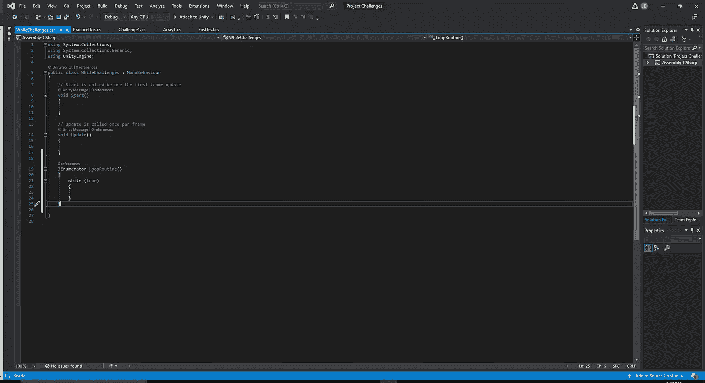
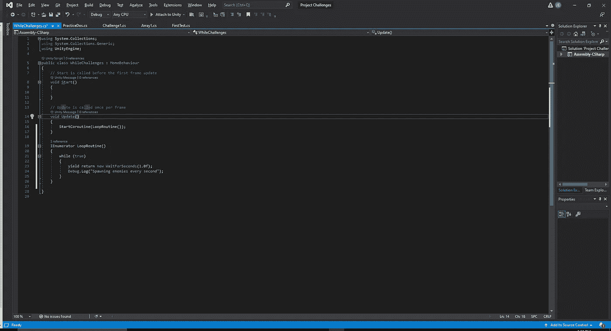
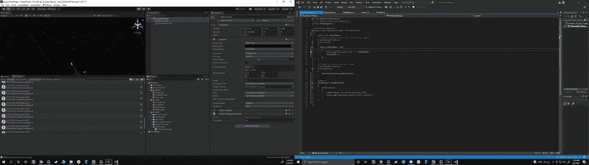
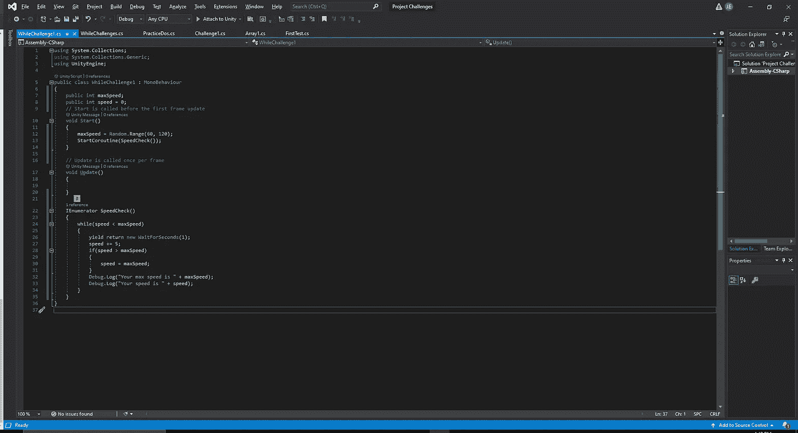
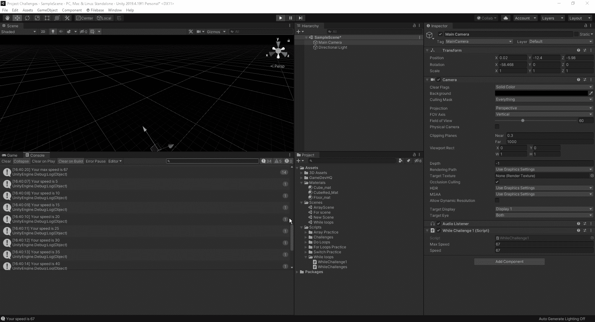

# 什么是 While 循环

> 原文：<https://medium.com/nerd-for-tech/what-are-while-loops-9b267c23f14a?source=collection_archive---------33----------------------->

只要满足指定的条件，C#中的 While 循环就允许我们重复执行一段代码。一旦代码块的要求为假，它就不会运行循环。当进行 while 循环时，通常你会在协程中看到它们。这是因为它允许我们的协程持续运行，直到我们不再满足需求。然而，运行例程时要记住的一个关键方面是不要陷入无限循环:

有了这样的 while 循环，我们的例程将永远运行，并使程序崩溃，因为它没有什么可结束的。如果我们想永远运行一个循环，我们可以这样做:

像这样的一行代码将允许我们在游戏中运行一个无限循环，因为我们在每个动作之间给它 1 秒钟的喘息时间。现在，我们不需要一直在协程中保持 while 循环，但是当我们在协程之外创建它们时，我们必须更加小心，因为我们没有 yield 方法可以使用。当在协程之外时，我们必须始终有一个 incrementor 和一个设定的 end amount，否则我们将再次陷入无限循环，不得不强制关闭我们的程序:

现在，让我们看一个使用速度和最大速度的例子。我们要做的是设置一个速度和最大速度变量，并创建一个协同程序来处理:

正如我们所看到的，我们在 while 循环中创建了一个短暂的速度增加时间延迟，如果我们的速度高于我们的最大速度，它只会达到最大速度，不会再进一步。从这里，我们可以检查我们的编辑器，看看它是否在控制台中工作:

