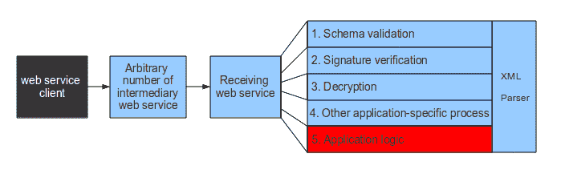
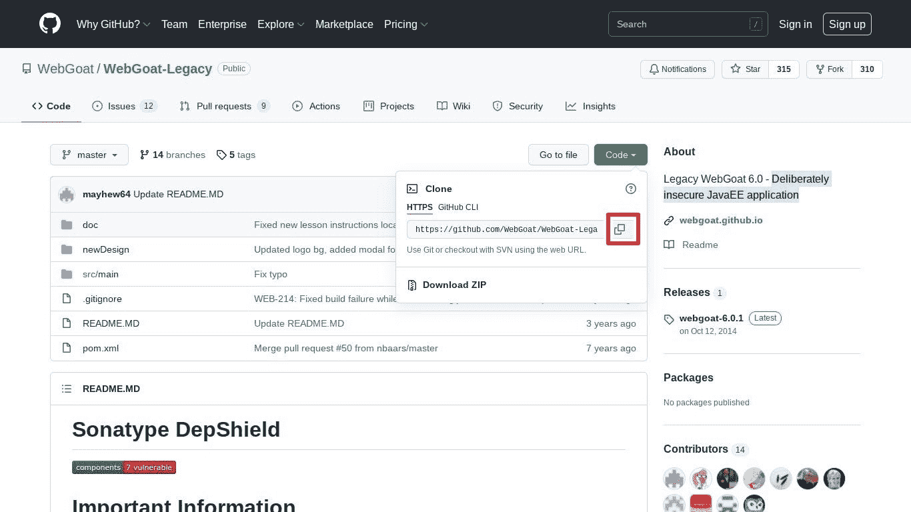
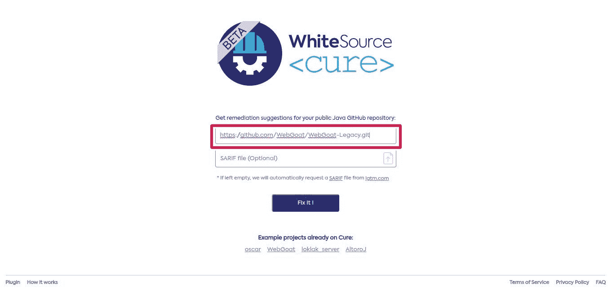
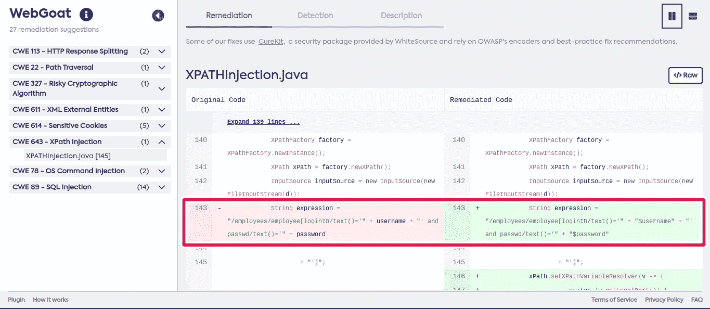

# 什么是 XPath 注入以及如何避免它们

> 原文：<https://medium.com/nerd-for-tech/what-are-xpath-injections-and-how-to-avoid-them-2d656b850293?source=collection_archive---------3----------------------->


XML 是网络服务的语言。当我们调用一个服务或从它那里得到响应时，我们发送/接收的所有信息都是 XML 格式的。服务的数据结构及其接口都是用 XML 定义的。

XPath 或 XML Path 是 Java 中包含的一个库，用于计算 XML 文档中的表达式。同时，它是定义这些表达式的语言，并且依赖于 [W3C 联盟](https://www.w3.org/)(因此与网络本身相关联，而不是任何特定的编程语言)。

# XPath:构建表达式

在 XPath 中，XML 文档被当作树型结构来计算。每个 XML 元素称为一个节点(当存在嵌套时，我们称之为子节点，但它们本身仍然是节点)，我们必须遵循的到达特定节点的路径称为路径。XPath 定义了选择器的范围(/，..、@等。)和运算符(and、or、>、≥、

```
/root/node
```

Extrapolating it to our XML document of parking spaces:

```
/parking/plaza
```

The previous expression will reach all the <plaza>元素。现在，让我们想象一下，我们想要更有选择性，只接触车牌:</plaza>

```
/parking/plaza/registration
```

但是 XPath 更加强大。使用下面的表达式，我们可以过滤所有到期日在特定日期的方块:

```
/parking/plaza [expiration = ’04 -12–2021 ‘]
```

如果我们想进一步过滤所获得的信息，我们可以指出，一旦按截止日期过滤完成，它只返回所有者的姓名:

```
/parking/space [expiration = ’04 -12–2021 ‘] /owner
```

我们还可以通过索引选择一个节点:在 XML 树中的位置(记住，这些是基于 1 的索引，不像数组和索引是基于 0 的):

`/ parking / square [1]`

# XPath 注入

让我们使用 [DOM](https://www.w3schools.com/js/js_htmldom.asp) 来重新创建 XML 树和 XPath 来计算表达式。最终结果将是一个节点列表，我们已经迭代过这些节点，以在控制台上显示每个节点的内容。

```
import java.io.IOException;import javax.xml.parsers.DocumentBuilder;import javax.xml.parsers.DocumentBuilderFactory;import javax.xml.parsers.ParserConfigurationException;import javax.xml.xpath.XPath;import javax.xml.xpath.XPathConstants;import javax.xml.xpath.XPathExpressionException;import javax.xml.xpath.XPathFactory;import org.w3c.dom.Document;import org.w3c.dom.NodeList;import org.xml.sax.SAXException;public class Evaluator {public NodeList filterNodes (String expression, String XMLDocumentpath) {NodeList nodesResult = null;try {DocumentBuilderFactory dBuilderFactory = DocumentBuilderFactory.newInstance ();DocumentBuilder dBuilder = dBuilderFactory.newDocumentBuilder ();DocumentXML document = dBuilder.parse (pathXMLDocument);XPath xpath = XPathFactory.newInstance (). NewXPath ();nodesResult = (NodeList) xpath.evaluate (expression, XML document, XPathConstants.NODESET);} catch (ParserConfigurationException ex) {ex.printStackTrace ();} catch (SAXException ex) {ex.printStackTrace ();} catch (IOException ex) {ex.printStackTrace ();} catch (XPathExpressionException ex) {ex.printStackTrace ();}return nodesResult;}public static void main (String [] args) {Evaluator evaluator = new Evaluator ();NodeList nodes = evaluator.filterNodes (“/ parking / plaza”, “parking.xml”);for (int i = 0; i <nodes.getLength (); i ++) {System.out.println (nodes.item (i) .getTextContent ());}}}
```

现在，设想下面的方法，通过车牌号获取一个座位的数据。

```
public NodeList getPlazaPlatenumber (String platenumber) {// …String expression = “/ parking / plaza [registration = ‘“ + registration + “‘“, “parking.xml”;return (NodeList) xpath.evaluate (expression, XML document, XPathConstants.NODESET);}
```

如果我们将一个现有的车牌作为参数传递，它将返回所需的信息。如果车牌不存在，它将返回一个空列表。但是如果参数板号包含恶意值呢？

```
‘or 1 = 1 or’
```

将前面的字符串作为参数值板号传递返回的结果将是所有方格的信息，这显然是信息泄露。

```
AAA-1111John111–88–8804–12–2021BBB-2222Draz111–64–6403–21–2021CCC-3333James111–22–2201–10–2021
```

发生了什么事？

非常简单:通过不验证表达式，我们并不新的方法使我们能够构建复杂的表达式。在我们的例子中，我们构造了一个条件表达式，其中有三个条件，由两个操作符“or”、“包含适当的引号以便表达式有效”和“编译器不抛出语法异常”:

```
/parking/plaza [platenumber = ‘’ or 1 = 1 or ‘’]
```



[Ws 攻击](https://www.ws-attacks.org/Xpath_Injection)

第一个和第三个条件返回 false，但第二个条件返回 true。因此，表达式的全局结果对于所有元素 *< platenumber >* 的值也是正确的。因此，机密信息被返回，这可能使开发人员损失数百万美元，并危及消费者隐私。

一种解决方案是根据适当的正则表达式验证牌照，并使程序仅在肯定验证的情况下执行调用。在数字参数的情况下，解决方案要简单得多，因为对 *Integer.parseInt()或 Float.parseFloat()* 的调用如果没有接收到这些类型之一，就会抛出异常。

使用 SQL 时，必须验证 XPath 表达式，以避免 XPath 注入攻击。使用 [WS Cure](https://www.whitesourcesoftware.com/whitesource-cure/#:~:text=WhiteSource%20Cure%20is%20the%20first,and%20speed%20when%20releasing%20software.) ，一个可以集成到您的开发环境中的免费自动修复应用程序，您可以解决这个问题和许多其他安全问题。这可以极大地提高你的团队的生产力，因为你只需要专注于发布软件。

# 使用 WhiteSource 固化

使用 WhiteSource Cure 查找 Xpath 漏洞非常简单。它包括两个步骤。

1.  将链接复制到您的 GitHub repo。在这个例子中，我将使用 [WebGoat Legacy](https://github.com/WebGoat/WebGoat-Legacy) ，这是一个故意不安全的 JavaEE 应用程序，用于测试目的。



2.在白源固化[网页](https://cure.whitesource.io/)上粘贴你要测试的回购的链接。



3.接下来，WhiteSource Cure 向您展示了回购中所有漏洞的列表。如果您想要检查任何特定的漏洞，只需点击它即可。在我们的例子中，我们对 Xpath 注入感兴趣。因此，我们将点击它。您可以通过单击“补救”选项卡查看 WhiteSource Cure 建议的修复:



# 结论

像所有的注入攻击一样，Xpath 注入会引起问题，修复起来非常困难和耗时。然而，了解您可以使用的所有工具可以使任务变得简单得多。确保尝试我今天提到的解决方案，并且不要忘记让我知道你的经历。

我希望这对你有所帮助！