# 斐波那契和黄金分割率之间是什么？

> 原文：<https://medium.com/nerd-for-tech/what-between-fibonacci-and-golden-ratio-3217572b55ee?source=collection_archive---------13----------------------->

飞溅图像

黄金比例和斐波那契数列是众所周知的“实体”。无论你是数学家还是艺术家，或者只是一个好奇的人，你都可能在某个地方见过他们。在这篇文章中，我将展示一个将它们联系在一起的众所周知的属性。

## 什么是斐波那契数列？

我猜每个人都知道什么是斐波那契数列，但因为我希望甚至来自火星的生物也能阅读我的帖子，所以我将给出一个简短的描述:

斐波那契数列是由两个实数 **a** 、 **b** 决定的数列

其中 a 是 b 的第一个元素，然后它遵循以下公式:

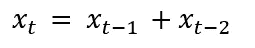

如果 **a** 和 **b** 都是 1，我们得到以下序列:

1,1,2,3,5,8,13,21,34…

这是本帖中的**基本斐波纳契数列**

## 黄金比例

[黄金](https://en.wikipedia.org/wiki/Golden_ratio)比率( **g.r.** )是以下数字

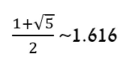

作者

在它的其他名称中，我们可以找到“**神圣比例**”和“**黄金分割**”希腊人在讨论黄金矩形(具有 a 和 a+b 边)时研究了它。一些艺术家发现它静态迷人，由于它提供的比例，它在建筑中也被研究。

## 这是一个二次方程

黄金比例是无害二次方程的解:

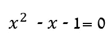

作者

你可能怀疑这个方程有另一个解…你是对的

它是

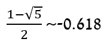

作者

这个多项式和它的根将是下面几节的关键，我们将把它标为**二次方程，**

# 商序列

我们把注意力转移到商序列上。考虑一个斐波那契数列。如果**一个**是斐波那契的第 n 个元素，我们定义如下序列

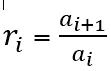

作者

我们对序列感兴趣

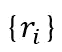

作者

**声明:**如果 r 的序列有一个极限，它就是二次方程的一个解。

**证明:**

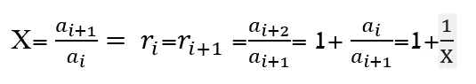

因为我们假设它是一个极限。我们可以换边得到**二次方程式。**

我们已经证明，如果商序列有一个极限，它就是二次方程的解，现在我们需要证明这个序列收敛

**声明**:如果商序列中的一个元素是正的，那么后面的整个序列都是正的

**证明**:可以看出，如果 X 比它的后继商为正

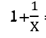

也是积极的。因此，商序列要么只由正数组成(除了开头的几个数)，要么只由负数组成

## 正商序列

在这一节中，我们只考虑正商序列。因此，**二次方程式**的唯一相关解是 **g.r.** 设 **ri** 是这个序列中的一个元素

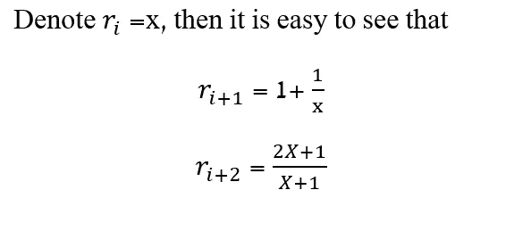

作者

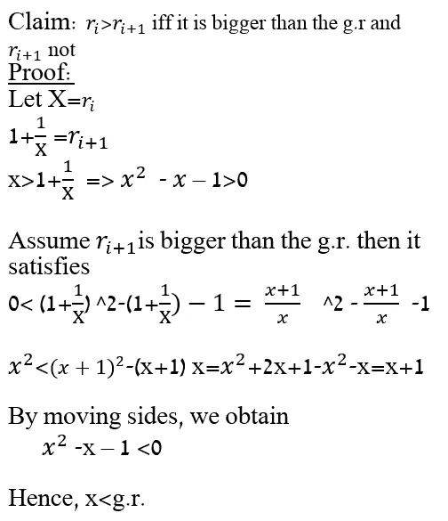

因此我们观察到，如果一个元素比 **g.r.** 大，那么它的跟随器就小，反之亦然。( **g.l** 是指 **g.r** )。)

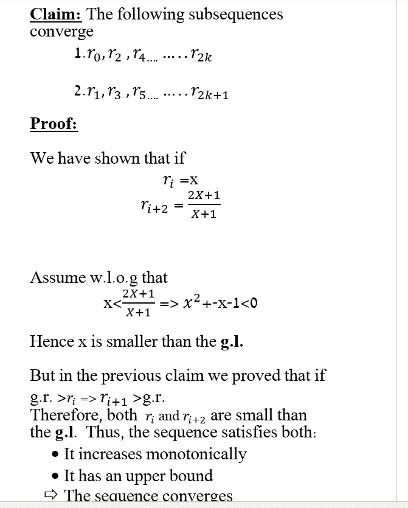

我们可以用同样的方法证明递减序列的相同性质。很容易看出，那些数列的极限是**二次方程式的一个解。**既然这些序列是阳性的，那我们就剩下 **g.l.**

如我们所愿。

# 负比率

在本节中，我们将讨论所有 **ri** 都为负的情况。我们希望回答两个问题:

*   我们有负商序列吗？
*   这样的序列需要什么条件？
*   他们的“收敛风度”呢？

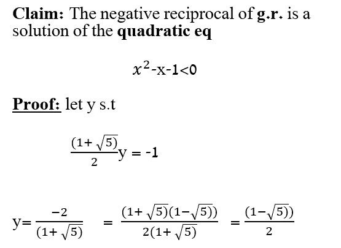

作者

现在我们将构造一个斐波那契数列，它的商总是负的。

我们定义

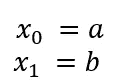

这些是斐波纳契数列的第一个元素。我们可以观察到:

*   **a** 的大小必须大于**b**的大小，否则商( **a+b** )/ **b** 为正)
*   明明**a* b**0

让我们构建序列

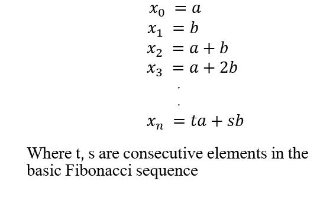

作者

现在让我们看看商序列的性质

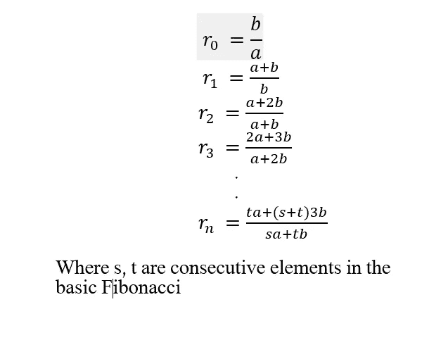

作者

因为每个元素都有不同的符号，所以我们有 w.l.o.g

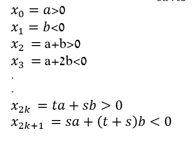

让我们写出满足指数 2，4，.2k

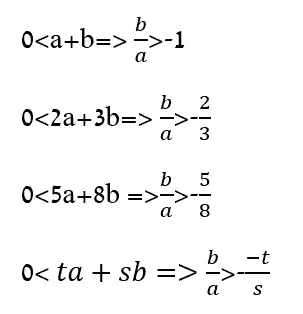

即 **b/a** 是**基本斐波那契数列中商的 a 子序列的上界。用同样的方法，我们可以证明它是奇数指数的一个下界**

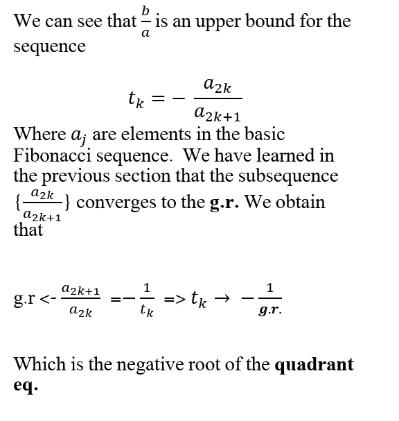

推论是，为了构造斐波那契数列的负商序列，两个早期元素必须满足比率

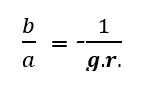

作者

这本身就是一个解决方案

作者

在所有其他情况下，斐波那契数列具有正商，因此收敛于 **g.r.**