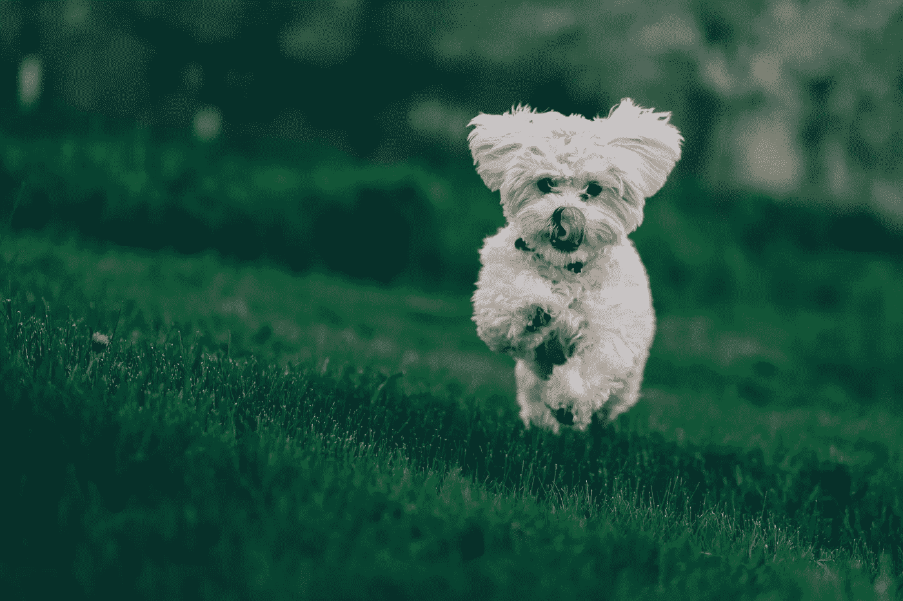
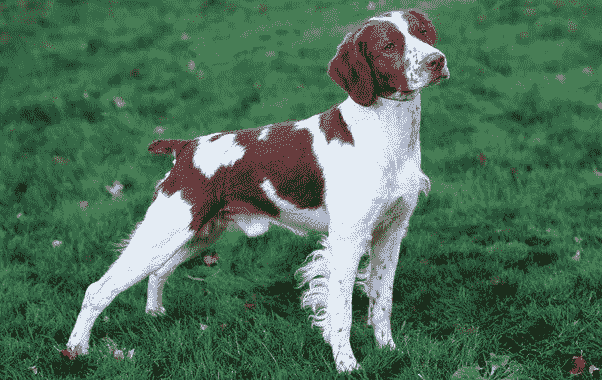
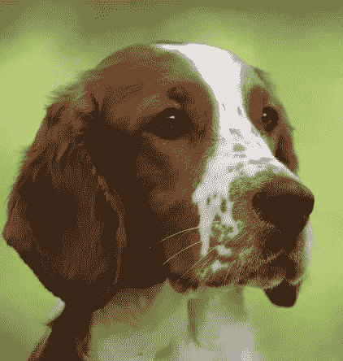
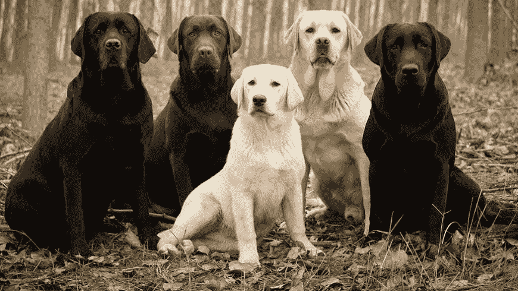
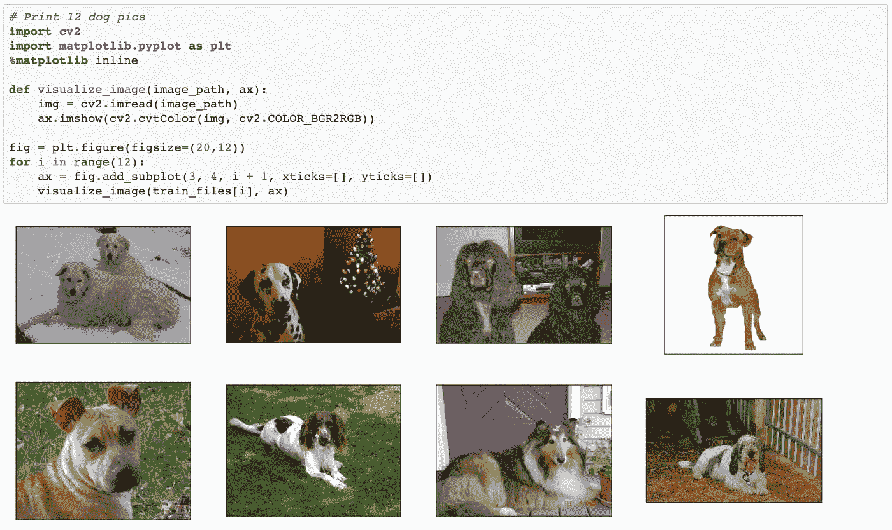
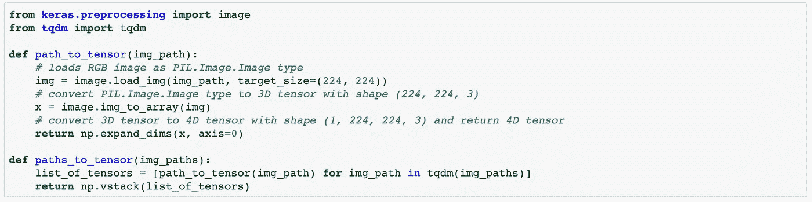
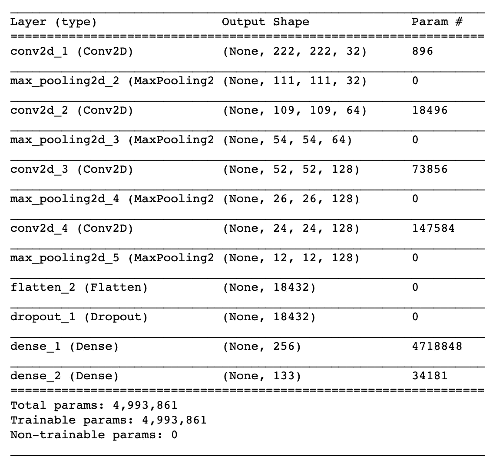
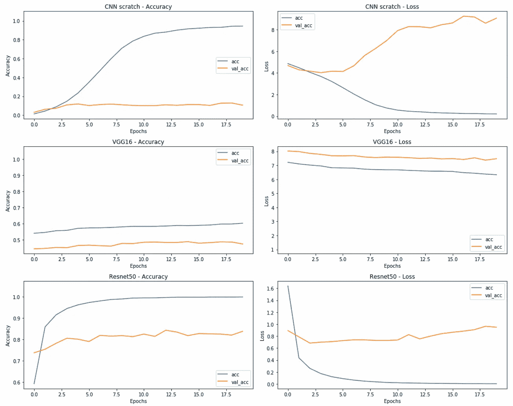
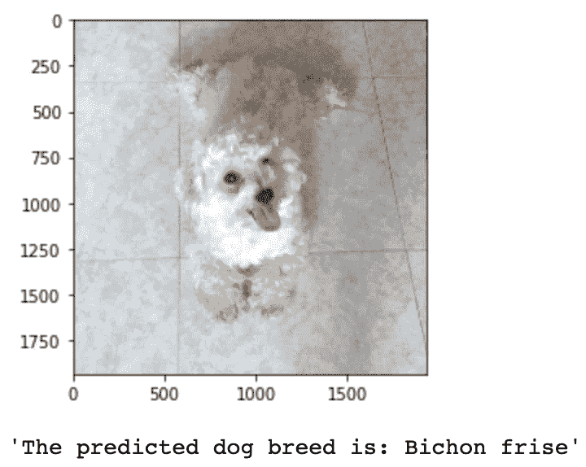

# 我的狗是什么品种？

> 原文：<https://medium.com/nerd-for-tech/what-breed-is-my-dog-91b9376586d8?source=collection_archive---------28----------------------->

## 基于 CNN 和迁移学习的犬种自动检测

照片由 [Unsplash](https://unsplash.com/photos/UcUROHSJfRA) 上的[Gabriel Crismariu](https://unsplash.com/@momentsbygabriel)**拍摄**

我一直认为我的狗是比熊犬，直到上周一些朋友质疑它的品种:虽然大多数比熊犬是白色的，但我的狗是杏色的。颜色是决定品种的关键标志吗？杏色狗就不能还是比熊犬吗？

幸运的是，根据狗的品种对狗进行分类对于深度学习模型来说是一项非常简单的任务。虽然这项练习即使对人类来说仍然具有挑战性(也是许多激烈辩论的焦点)，但在这个项目中，我们证明了具有迁移学习技术的卷积神经网络可以在这项任务中实现大于 80%的测试准确度。

## 首先:我们想要实现什么？问题陈述

这个项目的目标是在给定一张狗图片的情况下准确预测狗的品种。预测狗的品种是一项具有挑战性的任务，对人类来说甚至更困难。涉及的主要困难如下:

1.  **最小的类间差异(不同犬种之间的相似性):**例如，在颜色和大小方面。例如，考虑一只布列塔尼和一只威尔士矮脚猎犬:

类间变异:布列塔尼犬种(左)vs 威尔士史宾格猎犬(右)

**2)类内变异:**例如，考虑不同颜色或大小(黄色、巧克力色、黑色……)的不同种类拉布拉多犬。

类内变异:拉布拉多犬种

## 我们将如何解决这个问题？分析方法

给定一张狗或人的图片，我们首先想要识别该图片对应的是狗还是人。接下来，如果是狗，我们要准确预测它的品种。另一方面，如果它是一个人，我们会有一些乐趣，并向用户展示其类似的狗品种！

如果我们的算法既不能检测到图片上的狗，也不能检测到图片上的人，那么我们会抛出一个错误消息。

为了解决所定义的问题，我们采取以下步骤:

1.  数据探索:加载数据集和了解定型数据集
2.  利用哈尔级联建立人脸检测器
3.  使用预训练的 ResNet50 模型构建狗检测器
4.  了解从头开始创建的 CNN 模型的局限性
5.  使用迁移学习和微调预训练的 ResNet50 模型来预测对狗来说最准确的狗品种和对人类来说最相似的狗品种
6.  构建算法以根据输入图像的内容返回不同的预测

## 韵律学

为了评估分类模型的性能，我们将使用准确性度量，即正确预测在检查的案例总数中所占的比例。虽然在评估不平衡数据集中的性能时，准确性通常不是一个公平的指标，但在我们的情况下，随机机会呈现出一个非常低的标准:随机猜测将提供大约 1/133 的正确答案，这相当于不到 1%的准确性。

## 数据探索和预处理:我们使用什么数据？

为了对犬种进行分类，我们使用了来自 [Udacity](https://www.udacity.com/course/data-scientist-nanodegree--nd025?gclid=CjwKCAjwtJ2FBhAuEiwAIKu19nWOnIOcSVjRjKOGvBpY_x54xB4-CSNLbzG_yR6HyLcWvmbi_7F4IxoC2AYQAvD_BwE&utm_campaign=12906460312_c&utm_keyword=data%20scientist%20udacity_e&utm_medium=ads_r&utm_source=gsem_brand&utm_term=121838873459) 的犬种数据集。在这个数据集中，我们有 133 个不同的狗品种(包括比熊犬弗里斯！)和总共 8351 张狗图像，由一组 6680 张训练图像、835 张验证图像和 836 张测试狗照片组成:

在将数据输入任何模型之前，我们需要对其进行预处理。当使用 TensorFlow 作为后端时，Keras CNNs 需要一个 4D 张量作为输入，因此，我们使用函数 *path_to_tensor* 将数据整形为 4D 张量。我们还将图像调整为正方形图像，以便 CNN 模型可以使用(224 像素 x 224 像素)。因为我们处理的是彩色图像，每张图片都有三个颜色通道，所以给定图像的最终张量的形状是:(1，224，224，3)。

## 为什么选择 CNN 和迁移学习？建模方法

卷积神经网络是广泛用于图像分类的强大的深度学习神经网络。与 MLPs 等其他建模技术相比，**CNN 能够提取多维数据中的复杂模式，并通过在训练过程中应用过滤器来学习空间不变特征**。

在尝试更先进的方法之前，为了预测狗的品种，我们首先使用卷积和最大池层从头开始构建一个小的 CNN，然后是一个平坦层、一个下降层和几个密集层:

一个白手起家的小 CNN

在这个网络中，我们使用 8 层(卷积和最大池)，在后续步骤中增加过滤器大小，以允许模型捕捉更复杂的特征模式(我们从 32 个过滤器开始，然后增加到 128 个)。通过卷积和最大池化图层提取空间要素后，我们展平输出并应用丢弃以防止过度拟合(我们将其设置为 0.5，因此我们随机丢弃一半的图层)。展平后的输出被送入密集层，以捕捉非线性并提高模型的准确性。最后，最后一层的输出大小为 133，因为这是要学习的不同犬种的数量。

虽然这个小网络不够深，而且只是在这个项目可用的小训练数据集(6680 张图像)上进行训练，因此，它达到较低的测试精度(大约 13%)并不奇怪。

为了提高品种分类模型的性能，我们利用迁移学习:**迁移学习的关键思想是导入瓶颈特征**(在我们的例子中，首先从预训练的 VGG16 模型，然后是 ResNet50 模型)**，冻结这些层的权重，只训练最后一个密集层，以根据给定的分类任务对模型进行微调**。按照这些步骤，模型在测试数据集中的准确性提高到 13%到 80%以上(ResNet50 模型)。

**模型评估、验证&论证**

为了理解不同模型的表现，我们来看看 20 个时期的精确度和损失。正如我们在下面看到的，**CNN 从头开始训练过拟合数据:**虽然在训练数据集上精度有所提高，但在验证集上保持平稳。此外，在第 5 个时期之后，验证损失增加，而训练损失减少:这表明该模型不能很好地概括，因此，对于这项任务来说不够稳健。

模型评测:从头构建的 CNN，VGG16，ResNet50

另一方面，VGG16 和 ResNet50 模型在利用迁移学习时，提高了模型的泛化能力:提高了每个时期的验证集的准确性，并在测试数据集上实现了更好的测试准确性(VGG16 模型> 40%，ResNet50 架构> 80%)。

由于 ResNet50 模型在测试数据集上实现了最佳的准确性，因此在本练习中，我们选择此方法来构建犬种分类算法。

## 那又怎样？那我的狗是比熊犬吗？

当然是啦！**但是网络是怎么知道的？是因为颜色吗？眼睛？尺寸？**

现实是**CNN 模型无法解释为什么它预测了一个给定的品种，或者告诉我们任何关于影响给定预测的关键特征的事情**。因此，虽然我们已经确认了这个品种，**我们还没有能够了解到任何关于我们在评估一个狗品种时应该考虑的具体特征**:换句话说，我仍然没有一个逻辑论点来解释为什么我的狗是比熊犬，而不是*“训练数据集中相似的狗被标记为比熊犬”*。

## 结论和警告

*   **深度神经网络**的值是**高效匹配和识别多维数据**中的模式，而不是解释**为什么**一个给定的实例对应一个给定的分类。
*   **迁移学习是强大的:**深度网络是数据饥渴的，当训练数据集不够大时，迁移学习可以显著提高网络的性能。在这个项目中，我们成功地利用了迁移学习，因为我们的数据集与用于预训练 ResNet50 模型的训练集有很大的重叠。在其他情况下，**可能很难找到合适的预培训组合**。
*   **我该如何向他人解释为什么我的狗是比熊犬，有哪些具体和独特的特征来证实这一事实？**在未来的文章中，我将探索**可解释的白盒方法**，这些方法可以清楚地回答不同的特征和信号如何影响给定的预测。

## 什么要多学甚至自己去尝试？

查看这个 Github 库。