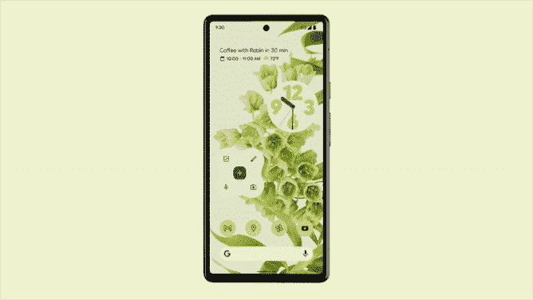
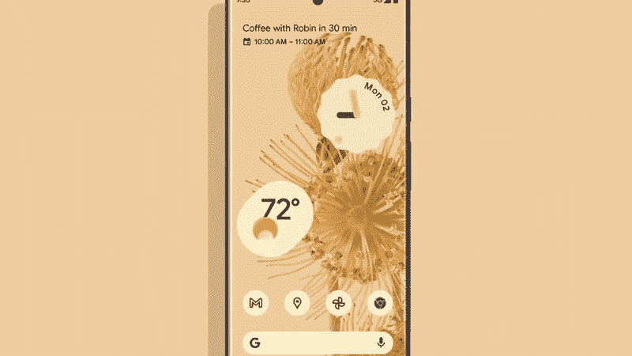

# 我们可以从谷歌的 Pixel 6 系列中期待什么？—张量芯片😲

> 原文：<https://medium.com/nerd-for-tech/what-can-we-expect-from-googles-pixel-6-series-tensor-chip-dda4768392bd?source=collection_archive---------20----------------------->

> “那些疯狂到认为自己可以改变世界的人，才是真正改变世界的人。” *—* ***乔布斯***

难以置信，谷歌终于做到了。在过去的 4 年里，我一直在思考这个问题:为什么谷歌不制造自己的处理器/芯片？听起来时间已经深刻地告诉了我们，但现在我们只需要等待。

谷歌张量芯片— [谷歌](https://storage.googleapis.com/gweb-uniblog-publish-prod/images/Google_Tensor_Image_1UL11rg.max-1000x1000.png)

每当一个新的进入者进入市场，我对科技产品的兴趣就让我兴奋不已，这不仅仅是一个新产品，这是一场革命！如果你考察所有的 Pixel 智能手机，谷歌从来都无法在各条战线上与其他厂商的旗舰智能手机抗衡。然而，像素对相机有影响，尤其是对图像质量和处理。没有人抱怨谷歌的安卓软件，因为它用起来棒极了。但是有几个问题:谷歌真的有最快的处理器吗？你会考虑录像吗？改进型电池？刷新率高吗？你如何评价建筑质量和使用的材料？没有边框的显示器？快速充电。？

谷歌 Pixel 6 系列— [谷歌](https://google.com)

所有这些怀疑者的评论很可能会由谷歌的张量芯片驱动的 Pixel 6 系列来回答。让我们深入挖掘这个张量芯片，看看它是如何改变表格的。

## 1.CPU/处理器/SOC/芯片

Pixel 6 系列最令人兴奋的部分之一是张量芯片，因为我们已经看到了苹果在笔记本电脑上使用他们自己的 M1 硅芯片所取得的成就，所以当然，他们为智能手机构建了自己的 SOC。相比之下，当像谷歌这样的公司建立自己的芯片组时，它对硬件和软件有更多的控制权。今天市场上超过 75 %- 80%的智能手机运行 Android 系统。我们已经看到了来自高通、联发科、三星的 Exynos、华为的麒麟和苹果的仿生 A 系列的处理器。由于这一事实，谷歌做了一个很好的举动，为我们提供了一个完整的一代产品。在构建过程中，当您直接与硬件交互时，合并您的软件是非常灵活的。人工智能、机器学习、深度学习等技术的使用将改变用户体验，如语音到文本、语音助手和谷歌新材料 u 的相机功能。你还可以用它来控制 GPU、传感器和电池。由于谷歌没有太多关于这方面的信息，我对 Pixel 6 系列的发布感到兴奋。

## 2.计算摄影

在对 pixel 2、pixel 3 系列使用更接近的传感器，并对 Pixel 5 系列保持不变之后，谷歌对 Pixel 6 系列的主要相机传感器将发生变化。这对摄影师和手机电影制作人来说是个极好的消息。谷歌正在开发使用人工智能、机器学习和张量芯片的计算摄影，从而更明显地改善模糊图像，通过增加动态范围，软件可以自动调整亮度。有一份来自[mkbhd，tom，david]等科技频道专家的报告称，谷歌的主要广角传感器现在可以让 150%的光线进入。此外，谷歌表示，它正在咨询图像专家，以提高拍摄有色人种图像的准确性。换句话说，调整自动白平衡以防止较暗肤色的过度明亮，并改善对不同头发类型的检测，使其从背景中更加突出。此外，他们指出，与 Pixel 5、iPhone 12 和 Pixel 6 相比，视频拍摄质量也有所提高。该芯片还可以被谷歌用于其 pixel-book、chromebooks 和智能扬声器，以实现其设备硬件生态系统的一致性。移动粉丝有很多值得兴奋的事情，谷歌将会给他们一个神奇的氛围。

## 3.电池和性能

在 Pixel 6 系列阵容中，有两款智能手机，普通版和 pro 版。我不确定专业版的相机，但它可能会在尺寸，刷新率和电池方面有一些改进。由于两者都采用张量芯片供电，所以除了刷新率之外，性能上应该没有什么区别。张量芯片将提供谷歌在智能手机上有史以来最好的性能。如果 Tensor 符合预期，游戏玩家将在 Pixel 上享受新的游戏水平。至于 pixel 6 中的电池，谷歌提高了容量，这对于需要更大电池的用户来说也可以成为加分项。希望张量能和张量一起优化和增强存量 android 的电池效率。

## **4。安全和软件更新**

谷歌正在打造自己的 SoC，从硬件到软件都更容易提高安全性。我们还可以期待谷歌的软件更新和安全更新会持续下去。至少需要 3-4 次 android 更新，才能确保消费者在花费巨资购买智能手机后感到满意。此外，他们必须确保软件升级不会降低设备的性能，这一点至关重要。

## 5.设计和材料

最后，谷歌的 Pixel 6 采用了无边框显示屏，设计非常棒。它配有一个内置指纹识别器和一个玻璃后机身。Pixel 6 系列带来了优雅的色彩，看起来像一个美丽的产品。android 12 中的 material u 将会吸引很多观众使用这个 UI。让我们看看一旦设备发布更多信息。

像素 6 上的材料 U—[谷歌](https://google.com)

> 感谢我所有亲爱的读者，请随时留下反馈或建议&虚拟鼓掌不会让你筋疲力尽😇— [纳伦德拉·贾纳帕提](https://linkedin.com/in/narendraj3)